# Unit 1 - Basic Concepts of Chemistry and Chemical Calculations

We think there is colour, we think there is sweet, we think there is bitter, but in reality there are atoms and a void.
**– Democritus**

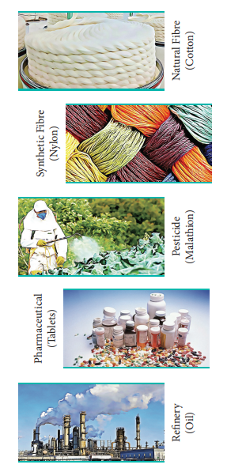
## 1.1 Chemistry - the Centre of Life

'Unna unavu, udukka udai, irukka idam' - in Tamil classical language means food to eat, cloth to wear and place to live. These are the three basic needs of human life. Chemistry plays a major role in providing these needs and also helps us to improve the quality of life. Chemistry has produced many compounds such as fertilizers, insecticides etc. that could enhance the agricultural production. We build better and stronger buildings that sustain different weather conditions with modern cements, concrete mixtures and better quality steel. We also have better quality fabrics.

Chemistry is everywhere in the world around us. Even our body is made up of chemicals. Continuous biochemical reactions occurring in our body are responsible for human activities. Chemistry touches almost every aspect of our lives, culture and environment. The world in which we are living is constantly changing, and the science of chemistry continues to expand and evolve to meet the challenges of our modern world. Chemical industries manufacture a broad range of new and useful materials that are used in every day life.

**Examples:** polymers, dyes, alloys, life saving drugs etc.

When HIV/AIDS epidemic began in early 1980s, patients rarely lived longer than a few years. But now many effective medicines are available to fight the infection, and people with HIV infection have longer and better life.

The understanding of chemical principles enabled us to replace the non eco friendly compounds such as CFCs in refrigerators with appropriate equivalents and increasing number of green processes. There are many researchers working in different fields of chemistry to develop new drugs, environment friendly materials, synthetic polymers etc. for the betterment of the society.

As chemistry plays an important role in our day-to-day life, it becomes essential to understand the basic principles of chemistry in order to address the mounting challenges in our developing country.

---

## 1.2 Classification of Matter

Look around your classroom. What do you see? You might see your bench, table, blackboard, window etc. What are these things made of? They are all made of matter. Matter is defined as anything that has mass and occupies space. All matter is composed of atoms. This knowledge of matter is useful to explain the experiences that we have with our surroundings. In order to understand the properties of matter better, we need to classify them. There are different ways to classify matter. The two most commonly used methods are classification by their physical state and by chemical composition as described in the chart.

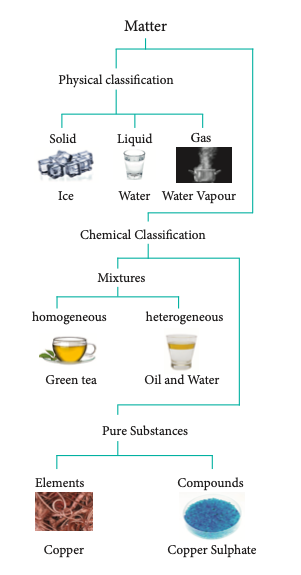

**Fig. 1.1 Classification of Matter**

### 1.2.1 Physical Classification of Matter

Matter can be classified as solids, liquids and gases based on their physical state. The physical state of matter can be converted into one another by modifying the temperature and pressure suitably.

### 1.2.2 Chemical Classification

Matter can be classified into mixtures and pure substances based on chemical compositions. Mixtures consist of more than one chemical entity present without any chemical interactions. They can be further classified as homogeneous or heterogeneous mixtures based on their physical appearance.

Pure substances are composed of simple atoms or molecules. They are further classified as elements and compounds.

#### Element

An element consists of only one type of atom. We know that an atom is the smallest electrically neutral particle, being made up of fundamental particles, namely electrons, protons and neutrons.

Element can exist as monatomic or polyatomic units.

**Example:** Monatomic unit - Gold (Au), Copper (Cu); Polyatomic unit - Hydrogen \( \mathrm{H}_2 \), Phosphorous \( \mathrm{P_4} \) and Sulphur \( \mathrm{S_8} \)

#### Compound

Compounds are made up of molecules which contain two or more atoms of different elements.

**Example:** Carbon dioxide \( \mathrm{CO_2} \), Glucose \( \mathrm{C_6H_{12}O_6} \), Hydrogen Sulphide \( \mathrm{H_2S} \), Sodium Chloride (NaCl)

Properties of compounds are different from those of their constituent elements. For example, sodium is a shiny metal, and chlorine is an irritating gas. But the compound formed from these two elements, sodium chloride, shows different characteristics as it is a crystalline solid, vital for biological functions.

**Evaluate Yourself**

1. By applying the knowledge of chemical classification, classify each of the following into elements, compounds or mixtures.

   (i) Sugar
   (ii) Sea water
   (iii) Distilled water
   (iv) Carbon dioxide
   (v) Copper wire
   (vi) Table salt
   (vii) Silver plate
   (viii) Naphthalene balls

---

## 1.3 Atomic and Molecular Masses

### 1.3.1 Atomic Masses

How much does an individual atom weigh? As atoms are too small with diameter of \( 10^{-10} \ \mathrm{m} \) and weigh approximately \( 10^{-27} \ \mathrm{kg} \), it is not possible to measure their mass directly. Hence it is proposed to have relative scale based on a standard atom.

The C-12 atom is considered as standard by the IUPAC (International Union of Pure and Applied Chemistry), and its mass is fixed as 12 amu (or) u. The amu (or) unified atomic mass unit is defined as one twelfth of the mass of a Carbon-12 atom in its ground state.

i.e. \( 1 \ \text{amu (or)} \ 1u \approx 1.6605 \times 10^{-27} \ \mathrm{kg} \)

In this scale, the relative atomic mass is defined as the ratio of the average atomic mass to the unified atomic mass unit.

$$
\text{Relative atomic mass} (A_r) = \frac{\text{Average mass of the atom}}{\text{Unified atomic mass}}
$$

**For example,**

$$
\text{Relative atomic mass of hydrogen} (A_r)_H = \frac{1.6736 \times 10^{-27} \ \mathrm{kg}}{1.6605 \times 10^{-27} \ \mathrm{kg}} = 1.0078 \approx 1.008 \ \mathrm{u}
$$

Since most of the elements consist of isotopes that differ in mass, we use average atomic mass. Average atomic mass is defined as the average of the atomic masses of all atoms in their naturally occurring isotopes. For example, chlorine consists of two naturally occurring isotopes \( _{17}\mathrm{Cl}^{35} \) and \( _{17}\mathrm{Cl}^{37} \) in the ratio 77 : 23, the average relative atomic mass of chlorine is

$$
= \frac{(35 \times 77) + (37 \times 23)}{100} = 35.46 \ \mathrm{u}
$$

### 1.3.2 Molecular Mass

Similar to relative atomic mass, relative molecular mass is defined as the ratio of the mass of a molecule to the unified atomic mass unit. The relative molecular mass of any compound can be calculated by adding the relative atomic masses of its constituent atoms.

**For example,**

i) Relative molecular mass of hydrogen molecule \( \mathrm{H_2} \)

$$
= 2 \times (\text{relative atomic mass of hydrogen atom}) = 2 \times 1.008 \ \mathrm{u} = 2.016 \ \mathrm{u}
$$

ii) Relative molecular mass of glucose \( \mathrm{C_6H_{12}O_6} \)

$$
= (6 \times 12) + (12 \times 1.008) + (6 \times 16) = 72 + 12.096 + 96 = 180.096 \ \mathrm{u}
$$

**Table 1.1 Relative atomic masses of some elements**

| Element | Relative atomic mass | Element | Relative atomic mass |
|---------|---------------------|---------|---------------------|
| H | 1.008 | Cl | 35.45 |
| C | 12 | K | 39.10 |
| N | 14 | Ca | 40.08 |
| O | 16 | Cr | 51.99 |
| Na | 23 | Mn | 54.94 |
| Mg | 24.3 | Fe | 55.85 |
| S | 32.07 | Cu | 63.55 |

**Evaluate Yourself**

2. Calculate the relative molecular mass of the following.

   (i) Ethanol \( \mathrm{C_2H_5OH} \)
   (ii) Potassium permanganate \( \mathrm{KMnO_4} \)
   (iii) Potassium dichromate \( \mathrm{K_2Cr_2O_7} \)
   (iv) Sucrose \( \mathrm{C_{12}H_{22}O_{11}} \)

---

## 1.4 Mole Concept

Often we use special names to express the quantity of individual items for our convenience. For example, a dozen rose means 12 roses and one quire paper means 24 single sheets. We can extend this analogy to understand the concept of mole that is used for quantifying atoms and molecules in chemistry. Mole is the SI unit to represent a specific amount of a substance.

To understand the mole concept, let us calculate the total number of atoms present in 12 g of carbon-12 isotope or molecules in 158.03 g of potassium permanganate, 294.18 g of potassium dichromate and 180 g of glucose.

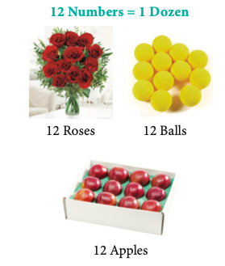
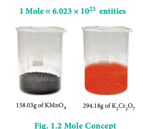

**Table 1.2 Calculation of number of entities in one mole of substance**

| S. No. | Name of substance | Mass of the substance taken (gram) | Mass of single atom or molecule (gram) = Atomic mass or Molar mass / Avogadro Number | No. of atoms or molecules = Mass of substance ÷ Mass of single atom or molecule |
|--------|-------------------|-------------------------------------|-------------------------------------------------------------------------------|-------------------------------------------------------------------------------|
| 1. | Elemental Carbon (C-12) | 12 | \( 1.9926 \times 10^{-23} \) | \( \frac{12}{1.9926 \times 10^{-23}} = 6.022 \times 10^{23} \) |
| 2. | Glucose (C₆H₁₂O₆) | 180 | \( 29.89 \times 10^{-23} \) | \( \frac{180}{29.89 \times 10^{-23}} = 6.022 \times 10^{23} \) |
| 3. | Potassium dichromate (K₂Cr₂O₇) | 294.18 | \( 48.851 \times 10^{-23} \) | \( \frac{294.18}{48.851 \times 10^{-23}} = 6.022 \times 10^{23} \) |
| 4. | Potassium permanganate (KMnO₄) | 158.03 | \( 26.242 \times 10^{-23} \) | \( \frac{158.03}{26.242 \times 10^{-23}} = 6.022 \times 10^{23} \) |

From the calculations we come to know that \( 12 \ \mathrm{g} \) of carbon-12 contains \( 6.022 \times 10^{23} \) carbon atoms and same numbers of molecules are present in 158.03 g of potassium permanganate and \( 294.18 \ \mathrm{g} \) of potassium dichromate. Similar to the way we use the term 'dozen' to represent 12 entities, we can use the term 'mole' to represent \( 6.022 \times 10^{23} \) entities (atoms or molecules or ions).

One mole is the amount of substance of a system, which contains as many elementary particles as there are atoms in \( 12 \ \mathrm{g} \) of carbon-12 isotope. The elementary particles can be molecules, atoms, ions, electrons or any other specified particles.

**Do You Know**

#### Gastric acid and antacids

Antacids are commonly used medicines for treating heartburn and acidity. Do you know the chemistry behind it?

Gastric acid is a digestive fluid formed in the stomach and it contains hydrochloric acid. The typical concentration of the acid in gastric acid is \( 0.082 \ \mathrm{M} \). When the concentration exceeds \( 0.1 \ \mathrm{M} \) it causes the heartburn and acidity.

Antacids used to treat acidity contain mostly magnesium hydroxide or aluminium hydroxide that neutralises the excess acid. The chemical reactions are as follows.

$$
3\mathrm{HCl} + \mathrm{Al(OH)}_3 \rightarrow \mathrm{AlCl}_3 + 3\mathrm{H}_2\mathrm{O}
$$

$$
2\mathrm{HCl} + \mathrm{Mg(OH)}_2 \rightarrow \mathrm{MgCl}_2 + 2\mathrm{H}_2\mathrm{O}
$$

From the above reactions we know that 1 mole of aluminium hydroxide neutralises 3 moles of HCl while 1 mole of magnesium hydroxide neutralises 2 moles of HCl.

Let us calculate the amount of acid neutralised by an antacid that contains 250 mg of aluminium hydroxide and 250 mg of magnesium hydroxide.

| Active Compound | Mass in (mg) | Molecular mass (g mol⁻¹) | No. of moles of active compound | No. of moles of OH⁻ ion |
|----------------|--------------|--------------------------|--------------------------------|-------------------------|
| Al(OH)₃ | 250 | 78 | 0.0032 | 0.0096 |
| Mg(OH)₂ | 250 | 58 | 0.0043 | 0.0086 |
| <td colspan="5">Total no. of moles of OH⁻ ion from one tablet: 0.0182 |

One tablet of above composition will neutralise 0.0182 mole of HCl for a person with gastric acid content of 0.1 mole. One tablet can be used to neutralize the excess acid which will bring the concentration back to normal level. \( (0.1 - 0.018 = 0.082 \ \mathrm{M}) \)

### 1.4.1 Avogadro Number

The total number of entities present in one mole of any substance is equal to \( 6.022 \times 10^{23} \). This number is called Avogadro number which is named after the Italian physicist Amedeo Avogadro who proposed that equal volume of all gases under the same conditions of temperature and pressure contain equal number of molecules. Avogadro number does not have any unit.

In a chemical reaction, atoms or molecules react in a specific ratio. Let us consider the following examples

$$
\text{Reaction 1:} \quad \mathrm{C} + \mathrm{O}_2 \rightarrow \mathrm{CO}_2
$$

$$
\text{Reaction 2:} \quad \mathrm{CH}_4 + 2\mathrm{O}_2 \rightarrow \mathrm{CO}_2 + 2\mathrm{H}_2\mathrm{O}
$$

In the first reaction, one carbon atom reacts with one oxygen molecule to give one carbon dioxide molecule. In the second reaction, one molecule of methane burns with two molecules of oxygen to give one molecule of carbon dioxide and two molecules of water. It is clear that the ratio of reactants is based on the number of molecules. Even though the ratio is based on the number of molecules it is practically difficult to count the number of molecules. Because of this reason it is beneficial to use 'mole' concept rather than the actual number of molecules to quantify the reactants and the products. We can explain the first reaction as one mole of carbon reacts with one mole of oxygen to give one mole of carbon dioxide and the second reaction as one mole of methane burns with two moles of oxygen to give one mole of carbon dioxide and two moles of water. When only atoms are involved, scientists also use the term one gram atom instead of one mole.

Lorenzo Romano  
Amedeo Carlo  
Avogadro (1776-1856)  

He is known for the Avogadro's hypothesis. In honour of his contributions, the number of fundamental particles in a mole of substance was named as Avogadro number. Though Avogadro didn't predict the number of particles in equal volumes of gas, his hypothesis did lead to the eventual determination of the number as \( 6.022 \times 10^{23} \). Rudolf Clausius, with his kinetic theory of gases, provided evidence for Avogadro's law.

### 1.4.2 Molar Mass

Molar mass is defined as the mass of one mole of a substance. The molar mass of a compound is equal to the sum of the relative atomic masses of its constituents expressed in \( \mathrm{g \ mol^{-1}} \).

**Examples:**

- relative atomic mass of one hydrogen atom \( = 1.008 \ \mathrm{u} \)
- molar mass of hydrogen atom \( = 1.008 \ \mathrm{g \ mol^{-1}} \)
- relative molecular mass of glucose \( = 180 \ \mathrm{u} \)
- molar mass of glucose \( = 180 \ \mathrm{g \ mol^{-1}} \)

### 1.4.3 Molar Volume

The volume occupied by one mole of any substance in the gaseous state at a given temperature and pressure is called molar volume.

| Conditions | Volume occupied by one mole of any gaseous substances (in litre) |
|------------|------------------------------------------------------------------|
| 273 K and 1 bar pressure (STP) | 22.71 |
| 273 K and 1 atm pressure | 22.4 |
| 298 K and 1 atm pressure (Room Temperature & pressure (SATP)) | 24.47 |

**Evaluate Yourself**

3a) Calculate the number of moles present in 9 g of ethane.

3b) Calculate the number of molecules of oxygen gas that occupies a volume of \( 224 \ \mathrm{ml} \) at \( 273 \ \mathrm{K} \) and \( 3 \ \mathrm{atm} \) pressure.

---

## 1.5 Gram Equivalent Concept

Similar to mole concept gram equivalent concept is also widely used in chemistry especially in analytical chemistry. In the previous section, we have understood that mole concept is based on molecular mass. Similarly gram equivalent concept is based on equivalent mass.

### Definition

Gram equivalent mass is defined as the mass of an element (compound or ion) that combines or displaces \( 1.008 \ \mathrm{g} \) hydrogen or \( 8 \ \mathrm{g} \) oxygen or \( 35.5 \ \mathrm{g} \) chlorine.

Consider the following reaction:

$$
\mathrm{Zn + H_2SO_4 \rightarrow ZnSO_4 + H_2}
$$

In this reaction 1 mole of zinc (i.e. \( 65.38 \ \mathrm{g} \)) displaces one mole of hydrogen molecule (2.016 g).

Mass of zinc required to displace \( 1.008 \ \mathrm{g} \) hydrogen is

$$
= \frac{65.38}{2.016} \times 1.008 = 32.69
$$

The equivalent mass of zinc \( = 32.69 \)

The gram equivalent mass of zinc \( = 32.69 \ \mathrm{g \ eq^{-1}} \)

Equivalent mass has no unit but gram equivalent mass has the unit \( \mathrm{g \ eq^{-1}} \)

It is not always possible to apply the above mentioned definition which is  based on three references namely hydrogen, oxygen and chlorine, because we can not conceive of reactions involving only with those three references. Therefore, a more useful expression used to calculate gram equivalent mass is given below.

$$\text{Gram equivalent mass} = \frac{\text{Molar mass (g mol}^{-1}\text{)}}{\text{Equivalence factor (eq mol}^{-1}\text{)}}$$

On the basis of the above expression, let us classify chemical entities and find out
the formula for calculating equivalent mass in the table below.

### 1.5.1 Equivalent Mass of Acids, Bases, Salts, Oxidising Agents and Reducing Agents

| Chemical entity | Equivalent factor (n) | Formula for calculating equivalent mass (E) | Example |
|----------------|----------------------|---------------------------------------------|---------|
| Acids | basicity (no. of moles of ionisable H⁺ ions present in 1 mole of the acid) | \( E = \frac{\text{Molar mass}}{\text{basicity}} \) | H₂SO₄ basicity = 2 eq mol⁻¹ Molar mass of H₂SO₄ = 98 g mol⁻¹ Gram equivalent mass of H₂SO₄ = \( \frac{98}{2} = 49 \ \mathrm{g \ eq^{-1}} \) |
| Bases | acidity (no. of moles of ionisable OH⁻ ions present in 1 mole of the base) | \( E = \frac{\text{Molar mass}}{\text{acidity}} \) | KOH acidity = 1 eq mol⁻¹ Molar mass of KOH = 56 g mol⁻¹ Gram equivalent mass of KOH = \( \frac{56}{1} = 56 \ \mathrm{g \ eq^{-1}} \) |
| Oxidising agent (or) Reducing agent | No. of moles of electrons gained (or) lost by one mole of the reagent during redox reaction | \( E = \frac{\text{Molar mass}}{\text{no. of moles of electrons gained or lost}} \) | KMnO₄ is an oxidizing agent. Molar mass of KMnO₄ = 158 g mol⁻¹ In acid medium: \( \mathrm{MnO_4^- + 8H^+ + 5e^- \rightarrow Mn^{2+} + 4H_2O} \) ∴ n = 5 eq mol⁻¹. Gram equivalent mass of KMnO₄ = \( \frac{158}{5} = 31.6 \ \mathrm{g \ eq^{-1}} \). |

Mole concept requires a balanced chemical reaction to find out the amount of reactants involved in the chemical reaction while gram equivalent concept does not require the same. We prefer to use mole concept for non-redox reactions and gram equivalent concept for redox reactions.

**For example,**

If we know the equivalent mass of \( \mathrm{KMnO_4} \) and anhydrous ferrous sulphate, without writing balanced chemical reaction we can straightaway say that \( 31.6 \ \mathrm{g} \) of \( \mathrm{KMnO_4} \) reacts with \( 152 \ \mathrm{g} \) of \( \mathrm{FeSO_4} \) using gram equivalent concept.

The same can also be explained on the basis of mole concept. The balanced chemical equation for the above mentioned reaction is

$$
10\mathrm{FeSO_4} + 2\mathrm{KMnO_4} + 8\mathrm{H_2SO_4} \rightarrow \mathrm{K_2SO_4} + 2\mathrm{MnSO_4} + 5\mathrm{Fe_2(SO_4)_3} + 8\mathrm{H_2O}
$$

i.e. 2 moles \( (2 \times 158 = 316 \ \mathrm{g}) \) of potassium permanganate reacts with 10 moles \( (10 \times 152 = 1520 \ \mathrm{g}) \) of anhydrous ferrous sulphate.

$$
\therefore 31.6 \ \mathrm{g} \ \mathrm{KMnO_4} \text{ reacts with } \frac{1520}{316} \times 31.6 = 152 \ \mathrm{g} \text{ of } \mathrm{FeSO_4}
$$

**Evaluate Yourself**

4a) 0.456 g of a metal gives 0.606 g of its chloride. Calculate the equivalent mass of the metal.

4b) Calculate the equivalent mass of potassium dichromate. The reduction half-reaction in acid medium is,

$$
\mathrm{Cr_2O_7^{2-} + 14H^+ + 6e^- \rightarrow 2Cr^{3+} + 7H_2O}
$$

---

## 1.6 Empirical Formula and Molecular Formula

Elemental analysis of a compound gives the mass percentage of atoms present in the compound. Using the mass percentage, we can determine the empirical formula of the compound. Molecular formula of the compound can be arrived at from the empirical formula using the molar mass of the compound.

**Empirical formula** of a compound is the formula written with the simplest ratio of the number of different atoms present in one molecule of the compound as subscript to the atomic symbol.

**Molecular formula** of a compound is the formula written with the actual number of different atoms present in one molecule as a subscript to the atomic symbol.

Let us understand the empirical formula by considering acetic acid as an example.

The molecular formula of acetic acid is \( \mathrm{C_2H_4O_2} \)

The ratio of \( \mathrm{C : H : O} \) is \( 1 : 2 : 1 \) and hence the empirical formula is \( \mathrm{CH_2O} \).

### 1.6.1 Determination of Empirical Formula from Elemental Analysis Data

**Step 1:** Since the composition is expressed in percentage, we can consider the total mass of the compound as \( 100 \ \mathrm{g} \) and the percentage values of individual elements as mass in grams.

**Step 2:** Divide the mass of each element by its atomic mass. This gives the relative number of moles of various elements in the compound.

**Step 3:** Divide the value of relative number of moles obtained in the step 2 by the smallest number of them to get the simplest ratio.

**Step 4:** (only if necessary) in case the simplest ratios obtained in the step 3 are not whole numbers then they may be converted into whole number by multiplying by a suitable smallest number.

### Example 1

An acid found in Tamarind on analysis shows the following percentage composition: \( 32\% \) Carbon; \( 4\% \) Hydrogen; \( 64\% \) Oxygen. Find the empirical formula of the compound.

| Element | Percentage | Atomic mass | Relative no. of moles | Simplest ratio | Simplest ratio (in whole no.) |
|---------|------------|-------------|----------------------|----------------|-------------------------------|
| C | 32 | 12 | \( 32/12 = 2.66 \) | \( 2.66/2.66 = 1 \) | 1 |
| H | 4 | 1 | \( 4/1 = 4 \) | \( 4/2.66 = 1.5 \) | 1.5 |
| O | 64 | 16 | \( 64/16 = 4 \) | \( 4/2.66 = 1.5 \) | 1.5 |

Multiplying by 2 to get whole numbers: \( \mathrm{C_2H_3O_3} \)

The empirical formula is \( \mathrm{C_2H_3O_3} \)

### Example 2

An organic compound present in vinegar has \( 40\% \) carbon, \( 6.6\% \) hydrogen and \( 53.4\% \) oxygen. Find the empirical formula of the compound.

| Element | Percentage | Atomic mass | Relative no. of moles | Simplest ratio | Simplest ratio (in whole no.) |
|---------|------------|-------------|----------------------|----------------|-------------------------------|
| C | 40 | 12 | \( 40/12 = 3.3 \) | \( 3.3/3.3 = 1 \) | 1 |
| H | 6.6 | 1 | \( 6.6/1 = 6.6 \) | \( 6.6/3.3 = 2 \) | 2 |
| O | 53.4 | 16 | \( 53.4/16 = 3.3 \) | \( 3.3/3.3 = 1 \) | 1 |

The empirical formula is \( \mathrm{CH_2O} \)

**Evaluate Yourself**

5) A Compound on analysis gave the following percentage composition \( \mathrm{C} = 54.55\% \), \( \mathrm{H} = 9.09\% \), \( \mathrm{O} = 36.36\% \). Determine the empirical formula of the compound.

Molecular formula of a compound is a whole number multiple of the empirical formula. The whole number can be calculated from the molar mass of the compound using the following expression

$$
\text{Whole number } (n) = \frac{\text{Molar mass of the compound}}{\text{Calculated empirical formula mass}}
$$

### 1.6.2 Calculation of Molecular Formula from Empirical Formula

**Table 1.3 Molecular formula from empirical formula**

| Compound | Empirical Formula | Molar mass | Empirical Formula mass | Whole number (n) | Molecular formula |
|----------|------------------|------------|------------------------|------------------|--------------------|
| Acetic acid | \( \mathrm{CH_2O} \) | 60 | 30 | \( 60/30 = 2 \) | \( (\mathrm{CH_2O})_2 = \mathrm{C_2H_4O_2} \) |
| Hydrogen peroxide | \( \mathrm{HO} \) | 34 | 17 | \( 34/17 = 2 \) | \( (\mathrm{HO})_2 = \mathrm{H_2O_2} \) |
| Lactic acid | \( \mathrm{CH_2O} \) | 90 | 30 | \( 90/30 = 3 \) | \( (\mathrm{CH_2O})_3 = \mathrm{C_3H_6O_3} \) |
| Tartaric acid | \( \mathrm{CH_2O} \) | 150 | 75 | \( 150/75 = 2 \) | \( (\mathrm{C_2H_3O_3})_2 = \mathrm{C_4H_6O_6} \) |
| Benzene | \( \mathrm{CH} \) | 78 | 13 | \( 78/13 = 6 \) | \( (\mathrm{CH})_6 = \mathrm{C_6H_6} \) |

Let us understand the calculations of molecular formula from the following example.

Two organic compounds, one present in vinegar (molar mass: \( 60 \ \mathrm{g \ mol^{-1}} \)), another one present in sour milk (molar mass: \( 90 \ \mathrm{g \ mol^{-1}} \)) have the following mass percentage composition. \( \mathrm{C} - 40\%, \mathrm{H} - 6.6\%, \mathrm{O} - 53.4\% \). Find their molecular formula.

Since both compounds have same mass percentage composition, their empirical formula are the same as worked out in the example problem no 2. Empirical formula is \( \mathrm{CH_2O} \). Calculated empirical formula mass \( (\mathrm{CH_2O}) = 12 + (2 \times 1) + 16 = 30 \ \mathrm{g \ mol^{-1}} \).

Formula for the compound present in vinegar

$$
n = \frac{\text{Molar mass}}{\text{calculated empirical formula mass}} = \frac{60}{30} = 2
$$

Molecular formula \( = (\mathrm{CH_2O})_2 = \mathrm{C_2H_4O_2} \) (acetic acid)

Calculation of molecular formula for the compound present in sour milk.

$$
n = \frac{\text{Molar mass}}{30} = \frac{90}{30} = 3
$$

$$
\text{Molecular formula} = (\mathrm{CH_2O})_3 = \mathrm{C_3H_6O_3} \text{ (lactic acid)}
$$

**Evaluate Yourself**

6) Experimental analysis of a compound containing the elements x, y, z on analysis gave the following data. \( x = 32\% \), \( y = 24\% \), \( z = 44\% \). The relative number of atoms of x, y and z are 2, 1 and 0.5 respectively. (Molecular mass of the compound is \( 400 \ \mathrm{g} \)) Find out.

   i) The atomic masses of the element x, y, z
   ii) Empirical formula of the compound and
   iii) Molecular formula of the compound.

---

## 1.7 Stoichiometry

Have you ever noticed the preparation of kesari at your home? In one of the popular methods for the preparation of kesari, the required ingredients to prepare six cups of kesari are as follows.

1. Rava - 1 cup
2. Sugar - 2 cups
3. Ghee - \( \frac{1}{2} \) cup
4. Nuts and Dry fruits - \( \frac{1}{4} \) cup

Otherwise, 1 cup rava + 2 cups sugar + \( \frac{1}{2} \) cup ghee + \( \frac{1}{4} \) cup nuts and dry fruits → 6 cups kesari.

From the above information, we will be able to calculate the amount of ingredients that are required for the preparation of 3 cups of kesari as follows

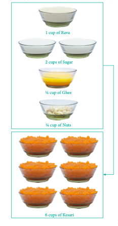

$$
\frac{1 \ \text{cup rava}}{6 \ \text{cups kesari}} \times 3 \ \text{cups kesari} = \frac{1}{2} \ \text{cup rava}
$$

Alternatively, we can calculate the amount of kesari obtained from 3 cups rava as below.

$$
\frac{6 \ \text{cups kesari}}{1 \ \text{cup rava}} \times 3 \ \text{cups rava} = 18 \ \text{cups kesari}
$$

Similarly, we can calculate the required quantity of other ingredients too.

We can extend this concept to perform stoichiometric calculations for a chemical reaction. In Greek, stoicheion means element and metron means measure that is, stoichiometry gives the numerical relationship between chemical quantities in a balanced chemical equation. By applying the concept of stoichiometry, we can calculate the amount of reactants required to prepare a specific amount of a product and vice versa using balanced chemical equation.

Let us consider the following chemical reaction.

$$
\mathrm{C(s) + O_2(g) \rightarrow CO_2(g)}
$$

From this equation, we learnt that 1 mole of carbon reacts with 1 mole of oxygen molecule to form 1 mole of carbon dioxide.

$$
1 \ \text{mole of C} \equiv 1 \ \text{mole of O}_2 \equiv 1 \ \text{mole of CO}_2
$$

The symbol \( \equiv \) means 'stoichiometrically equal to'

### 1.7.1 Stoichiometric Calculations

Stoichiometry is the quantitative relationship between reactants and products in a balanced chemical equation in moles. The quantity of reactants and products can be expressed in moles or in terms of mass unit or as volume. These three units are inter convertible.

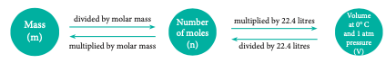

Let us explain these conversions by considering the combustion reaction of methane as an example. The balanced chemical equation is,

$$
\mathrm{CH_4(g) + 2O_2(g) \rightarrow CO_2(g) + 2H_2O(g)}
$$

| Content | Reactants | | Products | |
|---------|-----------|---------|----------|-----------|
| | \( \mathrm{CH_4(g)} \) | \( \mathrm{O_2(g)} \) | \( \mathrm{CO_2(g)} \) | \( \mathrm{H_2O(g)} \) |
| Stoichiometric coefficients | 1 | 2 | 1 | 2 |
| Mole-mole relationship | 1 mole | 2 moles | 1 mole | 2 moles |
| Mass-mass relationship (no. of mole × molar mass) | \( 1 \times 16 = 16 \ \mathrm{g} \) | \( 2 \times 32 = 64 \ \mathrm{g} \) | \( 1 \times 44 = 44 \ \mathrm{g} \) | \( 2 \times 18 = 36 \ \mathrm{g} \) |
| Mass-volume relationship | 16 g | 64 g | 22.4 L | 44.8 L |
| Volume-volume relationship (1 mole of any gas occupy 22.4 L at STP) | 22.4 L | 44.8 L | 22.4 L | 44.8 L |

#### Calculations based on Stoichiometry

### Example 1

How many moles of hydrogen is required to produce 10 moles of ammonia?

The balanced stoichiometric equation for the formation of ammonia is

$$
\mathrm{N_2(g) + 3H_2(g) \rightarrow 2NH_3(g)}
$$

As per the stoichiometric equation, to produce 2 moles of ammonia, 3 moles of hydrogen are required

$$
\frac{3 \ \text{moles of } \mathrm{H_2}}{2 \ \text{moles of } \mathrm{NH_3}} \times 10 \ \text{moles of } \mathrm{NH_3} = 15 \ \text{moles of hydrogen are required}
$$

### Example 2

Calculate the amount of water produced by the combustion of \( 32 \ \mathrm{g} \) of methane.

$$
\mathrm{CH_4(g) + 2O_2(g) \rightarrow CO_2(g) + 2H_2O(g)}
$$

As per the stoichiometric equation, combustion of 1 mole (16 g) \( \mathrm{CH_4} \) produces 2 moles \( (2 \times 18 = 36 \ \mathrm{g}) \) of water.

$$
\mathrm{CH_4} : (12) + (4 \times 1) = 16 \ \mathrm{g \ mol^{-1}}
$$

$$
\mathrm{H_2O} : (2 \times 1) + (1 \times 16) = 18 \ \mathrm{g \ mol^{-1}}
$$

Combustion of \( 32 \ \mathrm{g} \ \mathrm{CH_4} \) produces

$$
\frac{36 \ \mathrm{g} \ \mathrm{H_2O}}{16 \ \mathrm{g} \ \mathrm{CH_4}} \times 32 \ \mathrm{g} \ \mathrm{CH_4} = 72 \ \mathrm{g} \text{ of water}
$$

### Example 3

How much volume of carbon dioxide is produced when \( 50 \ \mathrm{g} \) of calcium carbonate is heated completely under standard conditions?

The balanced chemical equation is,

$$
\mathrm{CaCO_3(s) \xrightarrow{\Delta} CaO(s) + CO_2(g)}
$$

As per the stoichiometric equation, 1 mole \( (100 \ \mathrm{g}) \) \( \mathrm{CaCO_3} \) on heating produces 1 mole \( \mathrm{CO_2} \)

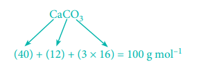

At STP, 1 mole of \( \mathrm{CO_2} \) occupies a volume of 22.7 litres

At STP, \( 50 \ \mathrm{g} \) of \( \mathrm{CaCO_3} \) on heating produces,

$$
\frac{22.7 \ \text{litres of } \mathrm{CO_2}}{100 \ \mathrm{g} \ \mathrm{CaCO_3}} \times 50 \ \mathrm{g} \ \mathrm{CaCO_3} = 11.35 \ \text{litres of } \mathrm{CO_2}
$$

### Example 4

How much volume of chlorine is required to form 11.2 L of HCl at \( 273 \ \mathrm{K} \) and 1 atm pressure?

The balanced equation for the formation of HCl is

$$
\mathrm{H_2(g) + Cl_2(g) \rightarrow 2HCl(g)}
$$

As per the stoichiometric equation, under given conditions, to produce 2 moles of HCl, 1 mole of chlorine gas is required.

To produce 44.8 litres of HCl, 22.4 litres of chlorine gas are required.

To produce 11.2 litres of HCl,

$$
\frac{22.4 \ \mathrm{L} \ \mathrm{Cl_2}}{44.8 \ \mathrm{L} \ \mathrm{HCl}} \times 11.2 \ \mathrm{L} \ \mathrm{HCl} = 5.6 \ \text{litres of chlorine are required}
$$

### Example 5

Calculate the percentage composition of the elements present in magnesium carbonate. How many kilogram of \( \mathrm{CO_2} \) can be obtained by heating \( 1 \ \mathrm{kg} \) of \( 90\% \) pure magnesium carbonate?

The balanced chemical equation is

$$
\mathrm{MgCO_3 \xrightarrow{\Delta} MgO + CO_2}
$$

Molar mass of \( \mathrm{MgCO_3} \) is \( 84 \ \mathrm{g \ mol^{-1}} \)

\( 84 \ \mathrm{g} \ \mathrm{MgCO_3} \) contain \( 24 \ \mathrm{g} \) of Magnesium.

\( 100 \ \mathrm{g} \) of \( \mathrm{MgCO_3} \) contain

$$
\frac{24 \ \mathrm{g} \ \mathrm{Mg}}{84 \ \mathrm{g} \ \mathrm{MgCO_3}} \times 100 \ \mathrm{g} \ \mathrm{MgCO_3} = 28.57 \ \mathrm{g} \ \mathrm{Mg}
$$

i.e. percentage of magnesium \( = 28.57\% \)

\( 84 \ \mathrm{g} \ \mathrm{MgCO_3} \) contain \( 12 \ \mathrm{g} \) of carbon

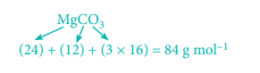

\( 100 \ \mathrm{g} \ \mathrm{MgCO_3} \) contain

$$
\frac{12 \ \mathrm{g} \ \mathrm{C}}{84 \ \mathrm{g} \ \mathrm{MgCO_3}} \times 100 \ \mathrm{g} \ \mathrm{MgCO_3} = 14.29 \ \mathrm{g} \text{ of carbon}
$$

Percentage of carbon \( = 14.29\% \)

\( 84 \ \mathrm{g} \ \mathrm{MgCO_3} \) contain \( 48 \ \mathrm{g} \) of oxygen

\( 100 \ \mathrm{g} \ \mathrm{MgCO_3} \) contains

$$
\frac{48 \ \mathrm{g} \ \mathrm{O}}{84 \ \mathrm{g} \ \mathrm{MgCO_3}} \times 100 \ \mathrm{g} \ \mathrm{MgCO_3} = 57.14 \ \mathrm{g}
$$

Percentage of oxygen \( = 57.14\% \)

As per the stoichiometric equation, \( 84 \ \mathrm{g} \) of \( 100\% \) pure \( \mathrm{MgCO_3} \) on heating gives \( 44 \ \mathrm{g} \) of \( \mathrm{CO_2} \)

\( 1000 \ \mathrm{g} \) of \( 90\% \) pure \( \mathrm{MgCO_3} \) gives

$$
\frac{44 \ \mathrm{g}}{84 \ \mathrm{g} \times 100\%} \times 90\% \times 1000 \ \mathrm{g} = 471.43 \ \mathrm{g} \text{ of } \mathrm{CO_2} = 0.471 \ \mathrm{kg} \text{ of } \mathrm{CO_2}
$$

### 1.7.2 Limiting Reagents

Earlier, we learnt that the stoichiometry concept is useful in predicting the amount of product formed in a given chemical reaction. If the reaction is carried out with stoichiometric quantities of reactants, then all the reactants will be converted into products. On the other hand, when a reaction is carried out using non-stoichiometric quantities of the reactants, the product yield will be determined by the reactant that is completely consumed. It limits the further reaction from taking place and is called as the **limiting reagent**. The other reagents which are in excess are called the **excess reagents**.

Recall the analogy that we used in stoichiometry concept i.e. kesari preparation.

As per the recipe requirement, 2 cups of sugar are needed for every cup of rava. Consider a situation where 8 cups of sugar and 3 cups of rava are available (all other ingredients are in excess), as per the cooking recipe, we require 3 cups of rava and 6 cups of sugar to prepare 18 cups of kesari. Even though we have 2 more cups of sugar left, we cannot make any more quantity of Kesari as there is no rava available and hence rava limits the quantity of Kesari in this case.

Extending this analogy for the chemical reaction in which three moles of sulphur are allowed to react with twelve moles of fluorine to give sulfur hexafluoride.

The balanced equation for this reaction is,

$$
\mathrm{S + 3F_2 \rightarrow SF_6}
$$

As per the stoichiometry, 1 mole of sulphur reacts with 3 moles of fluorine to form 1 mole of sulphur hexafluoride and therefore 3 moles of sulphur reacts with 9 moles of fluorine to form 3 moles of sulphur hexafluoride. In this case, all available sulphur gets consumed and therefore it limits the further reaction. Hence sulphur is the limiting reagent and fluorine is the excess reagent. The remaining three moles of fluorine are in excess and do not react.

**Evaluate Yourself**

7) The balanced equation for a reaction is given below

$$
2x + 3y \rightarrow 4l + m
$$

When 8 moles of x react with 15 moles of y then

   i) Which is the limiting reagent?
   ii) Calculate the amount of products formed.
   iii) Calculate the amount of excess reactant left at the end of the reaction.

Urea, a commonly used nitrogen based fertilizer, is prepared by the reaction between ammonia and carbon dioxide as follows.

$$
2\mathrm{NH_3(g) + CO_2(g) \rightarrow H_2N-CO-NH_2(aq) + H_2O(l)}
$$

In a process, 646 g of ammonia is allowed to react with 1.144 kg of \( \mathrm{CO_2} \) to form urea.

1) If the entire quantity of all the reactants is not consumed in the reaction which is the limiting reagent?
2) Calculate the quantity of urea formed and unreacted quantity of the excess reagent.

The balanced equation is

$$
2 \, \text{NH}_3 + \text{CO}_2 \rightarrow \text{H}_2\text{NCONH}_2 + \text{H}_2\text{O}
$$

**Answer:**

1. The entire quantity of ammonia is consumed in the reaction. So ammonia is the limiting reagent. Some quantity of \( \mathrm{CO_2} \) remains unreacted, so \( \mathrm{CO_2} \) is the excess reagent.

2. Quantity of urea formed = number of moles of urea formed × molar mass of urea = \( 19 \ \text{moles} \times 60 \ \mathrm{g \ mol^{-1}} = 1140 \ \mathrm{g} = 1.14 \ \mathrm{kg} \)

Excess reagent leftover at the end of the reaction is carbon dioxide.

Amount of carbon dioxide leftover = number of moles of \( \mathrm{CO_2} \) left over × molar mass of \( \mathrm{CO_2} \) = \( 7 \ \text{moles} \times 44 \ \mathrm{g \ mol^{-1}} = 308 \ \mathrm{g} \)

---

| | Reactants | | Products | |
|--------|--------|------|--------|------|
| | \( \mathrm{NH_3} \) | \( \mathrm{CO_2} \) | Urea | \( \mathrm{H_2O} \) |
| Stoichiometric coefficients | 2 | 1 | 1 | 1 |
| Number of moles of reactants allowed to react | \( n = \frac{646}{17} = 38 \ \text{moles} \) | \( n = \frac{1144}{44} = 26 \ \text{moles} \) | — | — |
| Actual number of moles consumed during reaction Ratio (2 : 1) | 38 moles | 19 moles | — | — |
| No. of moles of product thus formed | — | — | 19 moles | 19 moles |
| No. of moles of reactant left at the end of the reaction | — | 7 moles | — | — |

## 1.8 Redox Reactions

When an apple is cut, it turns brown after sometime. Do you know the reason behind this colour change? It is because of a chemical reaction called oxidation. We come across oxidation reactions in our daily life. For example

1) burning of LPG gas
2) rusting of iron
3) Oxidation of carbohydrates, lipids, etc. into \( \mathrm{CO_2} \) and \( \mathrm{H_2O} \) to produce energy in the living organisms.

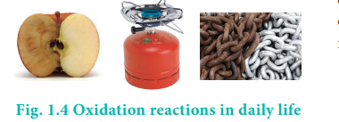
 reduction reactions and vice versa. Such reactions are called redox react
All oxidation reactions are accompanied byions. As per the classical concept, addition of oxygen (or) removal of hydrogen is called oxidation and the reverse is called reduction.

**Do You Know**

#### Haemoglobin and oxygen transport

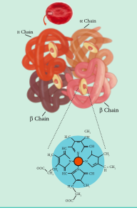

Even a small amount of oxygen present in air leads to the rusting of iron, i.e. iron is oxidised to \( \mathrm{Fe^{3+}} \).

But the \( \mathrm{Fe^{2+}} \) present in haemoglobin which binds oxygen during transport of oxygen from lungs to tissues never gets oxidised. Do you know why?

The answer lies in the structural features of haemoglobin. Haemoglobin contains four sub units each with a porphyrin ring (heme) attached to the protein (globin) molecule. In this structure, the iron \( \mathrm{Fe^{2+}} \) forms a coordination complex with an octahedral geometry. The four positions of the octahedron are occupied by porphyrin rings, fifth position is filled by imidazole ring of a histidine residue and the sixth position is utilized for binding the oxygen molecule. Generally the \( \mathrm{Fe^{2+}} \) in heme is susceptible to oxidation. Since the \( \mathrm{Fe^{2+}} \) ion in haemoglobin is surrounded by the globin protein chain that provides a hydrophobic environment, the oxidation of \( \mathrm{Fe^{2+}} \) becomes difficult. However, \( 3\% \) of haemoglobin is oxidised to methemoglobin (haemoglobin where the iron is present in \( \mathrm{Fe^{3+}} \) state and oxygen does not bind to this) daily. The enzyme methemoglobin reductase reduces it back to haemoglobin.

**Cyanide poisoning:** While oxygen binds reversibly to haemoglobin, cyanide binds irreversibly to haemoglobin and blocks oxygen binding. As a result the transport of oxygen from the lungs to tissues is stopped. It leads to the quick death of the person.

Consider the following two reactions.

$$
\text{Reaction 1:} \quad 4\mathrm{Fe} + 3\mathrm{O_2} \rightarrow 2\mathrm{Fe_2O_3}
$$

$$
\text{Reaction 2:} \quad \mathrm{H_2S + Cl_2 \rightarrow 2HCl + S}
$$

Both these reactions are oxidation reactions as per the classical concept.

In the first reaction which is responsible for the rusting of iron, the oxygen adds on to the metal, iron. In the second reaction, hydrogen is removed from Hydrogen sulphide \( (\mathrm{H_2S}) \). Identify which species gets reduced.

Consider the following two reactions in which the removal of oxygen and addition of hydrogen take place respectively. These reactions are called reduction reactions as per the classical concept.

\( \mathrm{CuO + C \rightarrow Cu + CO} \) (Removal of oxygen from cupric oxide)

\( \mathrm{S + H_2 \rightarrow H_2S} \) (Addition of hydrogen to sulphur)

Oxidation-reduction reactions i.e. redox reactions are not always associated with oxygen or hydrogen. In such cases, the process can be explained on the basis of electrons. The reaction involving loss of electron is termed oxidation and gain of electron is termed reduction.

**For example,**

\( \mathrm{Fe^{2+} \rightarrow Fe^{3+} + e^-} \) (loss of electron - oxidation)

\( \mathrm{Cu^{2+} + 2e^- \rightarrow Cu} \) (gain of electron - reduction)

Redox reactions can be better explained using oxidation numbers.

### 1.8.1 Oxidation Number

It is defined as the imaginary charge left on the atom when all other atoms of the compound have been removed in their usual oxidation states that are assigned according to set of rules. A term that is often used interchangeably with oxidation number is **oxidation state**.

1) The oxidation state of a free element (i.e. in its uncombined state) is zero.

   **Example:** each atom in \( \mathrm{H_2}, \mathrm{Cl_2}, \mathrm{Na}, \mathrm{S_8} \) have the oxidation number of zero.

2) For a monatomic ion, the oxidation state is equal to the net charge on the ion.

   **Example:** The oxidation number of sodium in \( \mathrm{Na^+} \) is \( +1 \)

   The oxidation number of chlorine in \( \mathrm{Cl^-} \) is \( -1 \)

3) The algebraic sum of oxidation states of all atoms in a molecule is equal to zero, while in ions, it is equal to the net charge on the ion.

   **Example:** In \( \mathrm{H_2SO_4} \); \( 2 \times \) (oxidation number of hydrogen) + (oxidation number of S) + \( 4 \times \) (oxidation number of oxygen) \( = 0 \)

   In \( \mathrm{SO_4^{2-}} \); (oxidation number of S) + \( 4 \times \) (oxidation number of oxygen) \( = -2 \)

4) Hydrogen has an oxidation number of \( +1 \) in all its compounds except in metal hydrides where it has \( -1 \) value.

   **Example:** Oxidation number of hydrogen in hydrogen chloride (HCl) is \( +1 \). Oxidation number of hydrogen in sodium hydride (NaH) is \( -1 \).

5) Fluorine has an oxidation state of \( -1 \) in all its compounds.

6) The oxidation state of oxygen in most compounds is \( -2 \). Exceptions are peroxides, super oxides and compounds with fluorine.

   **Example:** Oxidation number of oxygen,

   i) in water \( (\mathrm{H_2O}) \) is \( -2 \)

   ii) in hydrogen peroxide \( (\mathrm{H_2O_2}) \) is \( -1 \)
   
   \( 2(+1) + 2x = 0; \Rightarrow 2x = -2; \Rightarrow x = -1 \)

   iii) in super oxides such as \( \mathrm{KO_2} \) is \( -\frac{1}{2} \)
   
   \( +1 + 2x = 0; \quad 2x = -1; \quad x = -\frac{1}{2} \)

   iv) in oxygen difluoride \( (\mathrm{OF_2}) \) is \( +2 \)
   
   \( x + 2(-1) = 0; \quad x = +2 \)

7) Alkali metals have an oxidation state of \( +1 \) and alkaline earth metals have an oxidation state of \( +2 \) in all their compounds.

**Calculation of oxidation number using the above rules**

| Sl. No. | Oxidation number of the element | In the compound | Calculation |
|---------|-------------------------------|-----------------|-------------|
| 1 | C | \( \mathrm{CO_2} \) | \( x + 2(-2) = 0; x = +4 \) |
| 2 | S | \( \mathrm{H_2SO_4} \) | \( 2(+1) + x + 4(-2) = 0; 2 + x - 8 = 0; x = +6 \) |
| 3 | Cr | \( \mathrm{Cr_2O_7^{2-}} \) | \( 2x + 7(-2) = -2; 2x - 14 = -2; x = +6 \) |
| 4 | C | \( \mathrm{CH_2F_2} \) | \( x + 2(+1) + 2(-1) = 0; x = 0 \) |
| 5 | S | \( \mathrm{SO_2} \) | \( x + 2(-2) = 0; x = +4 \) |

**Redox reactions in terms of oxidation numbers**

During redox reactions, the oxidation number of elements changes. A reaction in which oxidation number of the element increases is called **oxidation**. A reaction in which it decreases is called **reduction**.

Consider the following reaction

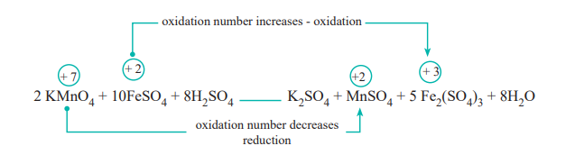

In this reaction, manganese in potassium permanganate \( (\mathrm{KMnO_4}) \) favours the oxidation of ferrous sulphate \( (\mathrm{FeSO_4}) \) into ferric sulphate \( (\mathrm{Fe_2(SO_4)_3}) \) by gaining electrons and thereby gets reduced. Such reagents are called **oxidising agents or oxidants**. Similarly, the reagents which facilitate reduction by releasing electrons and get oxidised are called **reducing agents**.

### 1.8.2 Types of Redox Reactions

Redox reactions are classified into the following types.

#### 1. Combination reactions

Redox reactions in which two substances combine to form a single compound are called combination reaction.

**Example:**

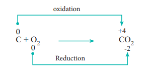

#### 2. Decomposition reactions

Redox reactions in which a compound breaks down into two or more components are called decomposition reactions. These reactions are opposite to combination reactions. In these reactions, the oxidation number of the different elements in the same substance is changed.

**Example**

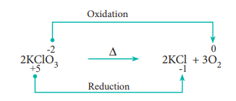

#### 3. Displacement reactions

Redox reactions in which an ion (or an atom) in a compound is replaced by an ion (or atom) of another element are called displacement reactions. They are further classified into (i) metal displacement reactions (ii) non-metal displacement reactions.

##### (i) Metal displacement reactions

Place a zinc metal strip in an aqueous copper sulphate solution taken in a beaker. Observe the solution, the intensity of blue colour of the solution slowly reduced and finally disappeared. The zinc metal strip became coated with brownish metallic copper. This is due to the following metal displacement reaction.
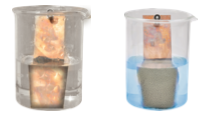

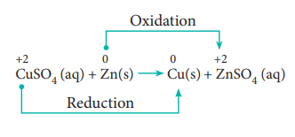

##### (ii) Non-metal displacement

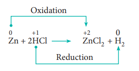

#### 4. Disproportionation reaction (Auto redox reactions)

In some redox reactions, the same compound can undergo both oxidation and reduction. In such reactions, the oxidation state of one and the same element is both increased and decreased. These reactions are called disproportionation reactions.

**Examples:**

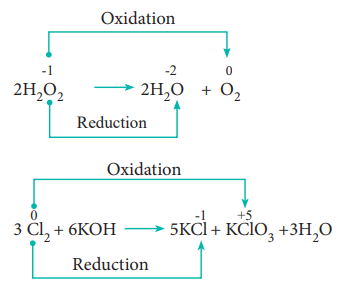

#### 5. Competitive electron transfer reaction

In metal displacement reactions, we learnt that zinc replaces copper from copper sulphate solution. Let us examine whether the reverse reaction takes place or not. As discussed earlier, place a metallic copper strip in zinc sulphate solution. If copper replaces zinc from zinc sulphate solution, \( \mathrm{Cu^{2+}} \) ions would be released into the solution and the colour of the solution would change to blue. But no such change is observed. Therefore, we conclude that among zinc and copper, zinc has more tendency to release electrons and copper to accept the electrons.

Let us extend the reaction to copper metal and silver nitrate solution. Place a strip of metallic copper in silver nitrate solution taken in a beaker. After some time, the solution slowly turns blue. This is due to the formation of \( \mathrm{Cu^{2+}} \) ions, i.e. copper replaces silver from silver nitrate. The reaction is,

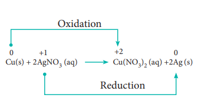

It indicates that between copper and silver, copper has the tendency to release electrons and silver to accept electrons.

From the above experimental observations, we can conclude that among the three metals, namely, zinc, copper and silver, the electron releasing tendency is in the following order.

$$
\mathrm{Zn > Cu > Ag}
$$

This kind of competition for electrons among various metals helps us to design (galvanic) cells. In XII standard we will study the galvanic cell in detail.

### 1.8.3 Balancing the Equation of Redox Reactions

The two methods for balancing the equation of redox reactions are as follows.

i) The oxidation number method
ii) Ion-electron method / half reaction method

Both are based on the same principle: In oxidation-reduction reactions the total number of electrons donated by the reducing agent is equal to the total number of electrons gained by the oxidising agent.

#### Oxidation number method

In this method, the number of electrons lost or gained in the reaction is calculated from the oxidation numbers of elements before and after the reaction. Let us consider the oxidation of ferrous sulphate by potassium permanganate in acid medium. The unbalanced chemical equation is,

$$
\mathrm{FeSO_4 + KMnO_4 + H_2SO_4 \rightarrow Fe_2(SO_4)_3 + MnSO_4 + K_2SO_4 + H_2O}
$$

**Step 1**

Using oxidation number concept, identify the reactants (atom) which undergo oxidation and reduction.

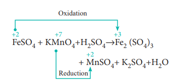

a) The oxidation number of Mn in \( \mathrm{KMnO_4} \) changes from \( +7 \) to \( +2 \) by gaining five electrons.

b) The oxidation number of Fe in \( \mathrm{FeSO_4} \) changes from \( +2 \) to \( +3 \) by losing one electron.

**Step 2**

Since, the total number of electrons lost is equal to the total number of electrons gained, equate the number of electrons, by cross multiplication of the respective formula with suitable integers on reactant side as below. Here, the product \( \mathrm{Fe_2(SO_4)_3} \) contains 2 moles of iron. So, the coefficients \( 1e^- \) & \( 5e^- \) are multiplied by the number '2'

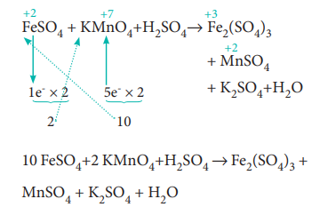

**Step 3**

Balance the reactant / Product - Oxidised / reduced. Now, based on the reactant side, balance the products (i.e. oxidised and reduced). The above equation becomes

10FeSO4+2KMnO4+H2SO4 → 5Fe2(SO4)3
 +2MnSO4 + K2SO4 + H2O

**Step 4**

Balance the other elements except H and O atoms. In this case, we have to balance K and S atoms but K is balanced automatically.

Reactant Side: 10 'S' atoms (10 \( \mathrm{FeSO_4} \))

Product Side: 18 'S' atoms

\( 5\mathrm{Fe_2(SO_4)_3} + 2\mathrm{MnSO_4} + \mathrm{K_2SO_4} \)
\( 15\mathrm{S} + 2\mathrm{S} + 1\mathrm{S} = 18\mathrm{S} \)

Therefore the difference 8 S atoms in reactant side, has to be balanced by multiplying \( \mathrm{H_2SO_4} \) by '8'. The equation now becomes,

$$
10\mathrm{FeSO_4} + 2\mathrm{KMnO_4} + 8\mathrm{H_2SO_4} \rightarrow 5\mathrm{Fe_2(SO_4)_3} + 2\mathrm{MnSO_4} + \mathrm{K_2SO_4} + \mathrm{H_2O}
$$

**Step 5**

Balancing 'H' and 'O' atoms

Reactant side: 16 H atoms \( (8\mathrm{H_2SO_4} \text{ i.e. } 8 \times 2 = 16 \ \mathrm{H}) \)

Product side: 2 H atoms \( (\mathrm{H_2O} \text{ i.e. } 1 \times 2 = 2 \ \mathrm{H}) \)

Therefore, multiply \( \mathrm{H_2O} \) molecules in the product side by '8'

$$
10\mathrm{FeSO_4} + 2\mathrm{KMnO_4} + 8\mathrm{H_2SO_4} \rightarrow 5\mathrm{Fe_2(SO_4)_3} + 2\mathrm{MnSO_4} + \mathrm{K_2SO_4} + 8\mathrm{H_2O}
$$

The oxygen atom is automatically balanced. This is the balanced equation.

#### Ion-Electron method

This method is used for ionic redox reactions.

**Step 1**

Using oxidation number concept, find out the reactants which undergo oxidation and reduction.

**Step 2**

Write two separate half equations for oxidation and reduction reaction,

Let us consider the same example which we have already discussed in oxidation number method.

$$
\mathrm{KMnO_4 + FeSO_4 + H_2SO_4 \rightarrow MnSO_4 + Fe_2(SO_4)_3 + K_2SO_4 + H_2O}
$$

The ionic form of this reaction is,

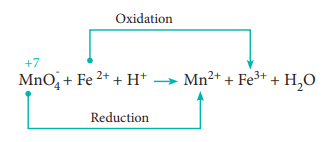

The two half reactions are,

$$
\mathrm{Fe^{2+} \rightarrow Fe^{3+} + e^-} \tag{1}
$$

and

$$
\mathrm{MnO_4^- + 5e^- \rightarrow Mn^{2+}} \tag{2}
$$

Balance the atoms and charges on both sides of the half reactions.

Equation (1) ⇒ No changes i.e.,

$$
\mathrm{Fe^{2+} \rightarrow Fe^{3+} + e^-} \tag{1}
$$

Equation (2) ⇒ 4 'O' on the reactant side, therefore add \( 4\mathrm{H_2O} \) on the product side, to balance H add \( 8\mathrm{H^+} \) in the reactant side

$$
\mathrm{MnO_4^- + 5e^- + 8H^+ \rightarrow Mn^{2+} + 4H_2O} \tag{3}
$$

**Step 3**

Equate both half reactions such that the number of electrons lost is equal to number of electrons gained.

Addition of two half reactions gives the balanced equation represented by equation (6).

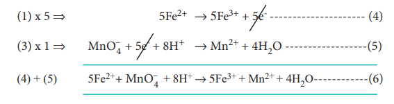

**Evaluate Yourself**

8) Balance the following equation using oxidation number method

$$
\mathrm{As_2S_3 + HNO_3 + H_2O \rightarrow H_3AsO_4 + H_2SO_4 + NO}
$$

---

## Summary

- Chemistry plays a major role in providing needs of human life in our day-to-day life.
- All things that we come across in life are made of matter. Anything that has mass and occupies space is called matter.
- Matter is classified based on the physical state and by chemical composition.
- An element consists of only one type of atom.
- Compounds contain two or more atoms of same or different elements and their properties are different from those of its constituent elements.
- Atoms are too small to measure their masses directly. The IUPAC introduced relative scale of mass based on a standard atom C-12.
- One twelfth of the mass of a Carbon-12 atom in its ground state is called as Unified atomic mass. \( 1 \ \text{amu (or)} \ 1u \approx 1.6605 \times 10^{-27} \ \mathrm{kg} \)
- Relative atomic mass is defined as the ratio of the average atomic mass to the unified atomic mass unit.
- Average atomic mass of an element is the average of the atomic masses of all its naturally occurring isotopes.
- Molecular mass is the ratio of the mass of a molecule to the unified atomic mass unit.
- Relative molecular mass is obtained by adding the relative atomic masses of its constituent atoms.
- Amounts of substances are usually expressed in moles.
- A mole is the amount of substance which contains as many elementary entities as there are in 12 gram of Carbon-12 isotope.
- Avogadro number is the total number of entities present in one mole of any substance and is equal to \( 6.022 \times 10^{23} \).
- Molar mass is the mass of one mole of that substance expressed in \( \mathrm{g \ mol^{-1}} \).
- One mole of an ideal gas occupies a volume of 22.4 litre at \( 273 \ \mathrm{K} \) and 1 atm pressure.
- Similar to the mole concept, the concept of equivalent mass is also used in analytical chemistry.
- Gram equivalent mass is the mass of an element (compound/ion) that combines or displaces 1.008 g hydrogen, 8 g oxygen or 35.5 g chlorine.
- Elemental analysis of a compound gives the mass percentage of atoms from which empirical and molecular formula are calculated.
- Empirical formula is the simplest ratio of the number of different atoms present in one molecule of the compound.
- Molecular formula is the formula written with the actual number of different atoms present in one molecule.
- A quantitative relationship between reactants and products can be understood from stoichiometry.
- Stoichiometry gives the numerical relationship between chemical quantities in a balanced equation.
- When a reaction is carried out using non-stoichiometric quantities of the reactants, the product yield will be determined by the reactant that is completely consumed and is called the limiting reagent. It limits the further reaction to take place. The other reagent which is in excess is called the excess reagent.
- The reaction involving loss of electron is oxidation and gain of electron is reduction. Usually both these reactions take place simultaneously and are called as redox reactions.
- These redox reactions can be explained using oxidation number concept. Oxidation number is the imaginary charge left on the atom when all other atoms of the compound have been removed in their usual oxidation states.
- A reaction in which oxidation number of the element increases is called oxidation and decreases is called reduction.

### Redox reactions in which

- two substances combine to form compound are called combination reaction.
- a compound breaks down into two (or) more components is called decomposition reaction.
- an ion (or atom) in a compound is replaced by an atom (or ion) of another element are called displacement reactions.
- the same compound can undergo both oxidation and reduction and the oxidation state of one and the same element is both increased and decreased called disproportionation reactions.
- competition for electrons occurs between various metals is called competitive electron transfer reactions.

The equation of redox reaction is balanced either by oxidation number method or by ion-electron method.

---
