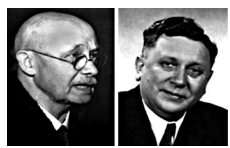
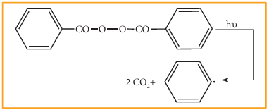

# 12 Basic concepts of organic reactions

**Otto diels and kurt alder**

describes an important
reaction mechanism for
the reaction between a
conjucated diene and a
substituted alkene. For this
work they were awarded
nobel prize in chemistry in
1950 Diels - Alder reaction
isa powerful tool in synthetic
organic chemistry. 

## 12.1 Introduction

A chemical reaction can be treated as a process by which some existing bonds in the reacting molecules are broken and new bonds are formed. i.e., in a chemical reaction, a reactant is converted into a product. This conversion involves one or more steps. In general an organic reaction can be represented as

Substrate + Reagent → [Intermediate state (and/or) Transition State] → Product

Here the substrate is an organic molecule which undergoes chemical change. The reagent which may be an organic, inorganic or any agent like heat, photons etc., that brings about the chemical change.

Many chemical reactions are depicted in one or more simple steps. Each step passes through an energy barrier, leading to the formation of short lived intermediates or transition states. The series of simple steps which collectively represent the chemical change, from substrate to product is called as the mechanism of the reaction. The slowest step in the reaction determines the rate of the reaction.

### 12.1.1 Fundamental concepts in organic reaction mechanism

The mechanism is the theoretical pathway which describes the changes occurring in each step during the course of the chemical change. An organic reaction can be understood by following the direction of flow of electrons and the type of intermediate formed during the course of the reaction. The direction of flow of electron is represented by curved arrow. The movement of a pair of electron is represented by a double headed arrow which starts from the negative and ends with the atom to which the electrons needs to be transferred.

### 12.1.2 Fission of a covalent bond

All organic molecules contain covalent bonds which are formed by the mutual sharing of electrons between atoms. These covalent bonds break in two different ways, namely homolytic cleavage (symmetrical splitting) and heterolytic cleavage (unsymmetrical splitting). The cleavage of a bond in the substrate is influenced by the nature of the reagent (attacking agent).

#### Homolytic Cleavage

Homolytic cleavage is the process in which a covalent bond breaks symmetrically in such way that each of the bonded atoms retains one electron. It is denoted by a half headed arrow (fish hook arrow). This type of cleavage occurs under high temperature or in the presence of UV light in a compound containing non polar covalent bond formed between atoms of similar electronegativity. In such molecules, the cleavage of bonds results into free radicals. They are short lived and are highly reactive. The type of reagents that promote homolytic cleavage in substrate are called as free radical initiators. For example Azobisisobutyronitrile (AIBN) and peroxides such as benzoyl peroxide are used as free radical initiators in polymerisation reactions.

As a free radical with an unpaired electron is neutral and unstable, it has a tendency to gain an electron to attain stability. Organic reactions involve homolytic fission of C-C bonds to form alkyl free radicals. The stability of alkyl free radicals is in the following order

\[
\mathrm{\cdot C(CH_3)_3 > \cdot CH(CH_3)_2 > \cdot CH_2CH_3 > \cdot CH_3}
\]

#### Heterolytic Cleavage

Heterolytic cleavage is the process in which a covalent bond breaks unsymmetrically such that one of the bonded atoms retains the bond pair of electrons. It results in the formation of a cation and an anion. Of the two bonded atoms, the most electronegative atom becomes the anion and the other atom becomes the cation. The cleavage is denoted by a curved arrow pointing towards the more electronegative atom.

For example, in tert-butyl bromide, the C-Br bond is polar as bromine is more electronegative than carbon. The bonding electrons of the C-Br bond are attracted more by bromine than carbon. Hence, the C-Br undergoes heterolytic cleavage to form a tert-butyl cation during hydrolysis.



Let us consider the cleavage in a carbon-hydrogen (C-H) bond of aldehydes or ketones. We know that the carbon is more electronegative than hydrogen and hence the heterolytic cleavage of C-H bonds results in the formation of carbanion (carbon bears a negative charge). For example in aldol condensation the OH⁻ ion abstracts a α-hydrogen from the aldehyde, which leads to the formation of the below mentioned carbanion.



#### Hybridisation of carbon in carbocation:

In a carbocation, the carbon bearing positive charge is \( \mathrm{sp}^2 \) hybridised and hence it has a planar structure. In the reaction involving such a carbocation, the attack of a negatively charged species (nucleophiles) take place on either side of the carbocation as shown below.



**Fig 12.1(a) Shape of Carbocation**

The carbanions are generally pyramidal in shape and the lone pair occupies one of the \( \mathrm{sp}^3 \) hybridised orbitals. An alkyl free radical may be either pyramidal or planar.



**Fig 12.1(b) Shape of Carbanion**



**Fig 12.1(c) Shape of Carbon radical**

The relative stability of the alkyl carbocations and carbanions are given below.

Relative stability of carbocations:

\[
+\mathrm{C(CH_3)_3} > +\mathrm{CH(CH_3)_2} > +\mathrm{CH_2CH_3} > +\mathrm{CH_3}
\]

Relative stability of carbanions:

\[
-\mathrm{C(CH_3)_3} < -\mathrm{CH(CH_3)_2} < -\mathrm{CH_2CH_3} < -\mathrm{CH_3}
\]

The energy required to bring about homolytic splitting is greater than that of heterolytic splitting.

### 12.1.3 Nucleophiles and electrophiles

Nucleophiles are reagents that has high affinity for electro positive centers. They possess an atom which has an unshared pair of electrons, and hence it is in search for an electro positive centre where it can have an opportunity to share its electrons to form a covalent bond, and gets stabilised. They are usually negatively charged ions or electron rich neutral molecules (contains one or more lone pair of electrons). All Lewis bases act as nucleophiles.



Electrophiles are reagents that are attracted towards negative charge or electron rich center. They are either positively charged ions or electron deficient neutral molecules. All Lewis acids act as electrophiles. Neutral molecules like \( \mathrm{SnCl_4} \) can also act as an electrophile, as it has vacant d-orbitals which can accommodate the electrons from others.



**Do You Know**

Human body produces
free radicals when it
is exposed to x-rays,
cigarette smoke,
industrial chemicals
and air pollutants. Free radicals
can disrupt cell membranes,
increase the risk of many forms
of cancer, damage the interior
lining of blood vessels and lead
to a high risk of heart disease and
stroke. Body uses vitamins and
minerals to counter the effects
of free radicals. Fruits contains
antioxidants which decrease the
effects of free radicals.

### 12.1.4 Electron movement in organic reactions

All organic reactions can be understood by following the electron movements, i.e. the electron redistribution during the reaction. The electron movement depends on the nature of the substrate, reagent and the prevailing conditions. The flow of electrons is represented by curved arrows which show how electrons move as shown in the figure. These electron movements result in breaking or formation of a bond (sigma or pi bond). The movement of single electron is indicated by a half-headed curved arrows.

There are three types of electron movement viz.,

- lone pair becomes a bonding pair.
- bonding pair becomes a lone pair
- a bond breaks and becomes another bond.

**Type 1: A lone pair to a bonding pair**



**Type 2: A bonding pair to a lone pair**



**Type 3: A bonding pair to an another bonding pair**



### 12.1.5 Electron displacement effects in covalent bonds

Some of the properties of organic molecules such as stability, reactivity, basicity etc., are affected by the displacement of electrons that takes place in its covalent bonds. This movement can be influenced by either the atoms/groups present in close proximity to the bond or when a reagent approaches a molecule. The displacement effects can either be permanent or temporary. In certain cases, the electron displacement due to an atom or a substituent group present in the molecule cause a permanent polarisation of the bond and it leads to fission of the bond under suitable conditions. The electron displacements are categorised into inductive effect (I), resonance effect (R), electromeric effect (E) and hyper conjugation.

#### Inductive effect (I)

Inductive effect is defined as the change in the polarisation of a covalent bond due to the presence of adjacent bonds, atoms or groups in the molecule. This is a permanent phenomenon.

Let us explain the inductive effect by considering ethane and ethylchloride as examples. The C-C bond in ethane is non polar while the C-C bond in ethyl chloride is polar. We know that chlorine is more electronegative than carbon, and hence it attracts the shared pair of electron between C-Cl in ethyl chloride towards itself. This develops a slight negative charge on chlorine and a slight positive charge on carbon to which chlorine is attached. To compensate it, the \( \mathrm{C_1} \) draws the shared pair of electron between itself and \( \mathrm{C_2} \). This polarisation effect is called inductive effect. This effect is greatest for the adjacent bonds, but they also be felt farther away. However, the magnitude of the charge separation decreases rapidly, as we move away from \( \mathrm{C_1} \) and is observed maximum for 2 carbons and almost insignificant after 4 bonds from the active group.



It is important to note that the inductive effect does not transfer electrons from one atom to another but the displacement effect is permanent. The inductive effect represents the ability of a particular atom or a group to either withdraw or donate electron density to the attached carbon. Based on this ability the substituents are classified as +I groups and -I groups. Their ability to release or withdraw the electron through sigma covalent bond is called +I effect and -I effect respectively.

Highly electronegative atoms and groups with an atom carrying a positive charge are electron withdrawing groups or -I groups.

Example: -F, -Cl, -COOH, -\( \mathrm{NO_2} \), -\( \mathrm{NH_2} \)

Higher the electronegativity of the substituent, greater is the -I effect. The order of the -I effect of some groups are given below.

\[
\mathrm{NH_3} > \mathrm{NO_2} > \mathrm{CN} > \mathrm{SO_3H} > \mathrm{CHO} > \mathrm{CO} > \mathrm{COOH} > \mathrm{COCl} > \mathrm{CONH_2} > \mathrm{F} > \mathrm{Cl} > \mathrm{Br} > \mathrm{I} > \mathrm{OH} > \mathrm{OR} > \mathrm{NH_2} > \mathrm{C_6H_5} > \mathrm{H}
\]

Highly electropositive atoms or groups which carry a negative charge are electron donating or +I groups.

Example: Alkali metals, alkyl groups such as methyl, ethyl, negatively charged groups such as \( \mathrm{CH_3O^-} \), \( \mathrm{C_2H_5O^-} \), \( \mathrm{COO^-} \) etc. Lesser the electronegativity of the elements, greater is the +I effect. The relative order of +I effect of some alkyl groups is given below:

\[
-\mathrm{C(CH_3)_3} > -\mathrm{CH(CH_3)_2} > -\mathrm{CH_2CH_3} > -\mathrm{CH_3}
\]

Let us understand the influence of inductive effect on some properties of organic compounds.

**Reactivity:**

When a highly electronegative atom such as halogen is attached to a carbon then it makes the C-X bond polar. In such cases the -I effect of halogen facilitates the attack of an incoming nucleophile at the polarised carbon, and hence increases the reactivity.



If a -I group is attached nearer to a carbonyl carbon, it decreases the availability of electron density on the carbonyl carbon, and hence increases the rate of the nucleophilic addition reaction.

**Acidity of carboxylic acids:**

When a halogen atom is attached to the carbon which is nearer to the carboxylic acid group, its -I effect withdraws the bonded electrons towards itself and makes the ionisation of \( \mathrm{H^+} \) easy. The acidity of various chloro acetic acid is in the following order. The strength of the acid increases with increase in the -I effect of the group attached to the carboxyl group.

Trichloro acetic acid > Dichloro acetic acid > Chloro acetic acid > Acetic acid



Similarly, the following order of acidity in the carboxylic acids is due to the +I effect of alkyl group.



#### Electromeric effect (E)

Electromeric effect is a temporary effect which operates in unsaturated compounds (containing \( >\mathrm{C}=\mathrm{C}< \), \( >\mathrm{C}=\mathrm{O} \) etc.) in the presence of an attacking reagent.

Let us consider two different compounds (i) compounds containing carbonyl group \( (>\mathrm{C}=\mathrm{O}) \) and (ii) unsaturated compounds such as alkenes \( (>\mathrm{C}=\mathrm{C}<) \).

When a nucleophile approaches the carbonyl compound, the π electrons between C and O is instantaneously shifted to the more electronegative oxygen. This makes the carbon electron deficient and thus facilitating the formation of a new bond between the incoming nucleophile and the carbonyl carbon atom.



On the other hand when an electrophile such as \( \mathrm{H^+} \) approaches an alkene molecule, the π electrons are instantaneously shifted to the electrophile and a new bond is formed between carbon and hydrogen. This makes the other carbon electron deficient and hence it acquires a positive charge.



The electromeric effect is denoted as E effect. Like the inductive effect, the electromeric effect is also classified as +E and -E based on the direction in which the pair of electron is transferred to form a new bond with the attacking agent.

When the π electron is transferred towards the attacking reagent, it is called +E (positive electromeric) effect.



The addition of \( \mathrm{H^+} \) to alkene as shown above is an example of +E effect.

When the π electron is transferred away from the attacking reagent, it is called -E (negative electromeric) effect.



The attack of \( \mathrm{CN^-} \) on a carbonyl carbon, as shown above, is an example of -E effect.

#### Resonance or Mesomeric effect

The resonance is a chemical phenomenon which is observed in certain organic compounds possessing double bonds at a suitable position. Certain organic compounds can be represented by more than one structure and they differ only in the position of bonding and lone pair of electrons. Such structures are called resonance structures (canonical structures) and this phenomenon is called resonance. This phenomenon is also called mesomerism or mesomeric effect.

For example, the structure of aromatic compounds such as benzene and conjugated systems like 1,3-butadiene cannot be represented by a single structure, and their observed properties can be explained on the basis of a resonance hybrid.

In 1,3-butadiene, it is expected that the bond between \( \mathrm{C^1-C^2} \) and \( \mathrm{C^3-C^4} \) should be shorter than that of \( \mathrm{C^2-C^3} \), but the observed bond lengths are same. This property cannot be explained by a simple structure in which two π bonds localised between \( \mathrm{C^1-C^2} \) and \( \mathrm{C^3-C^4} \). Actually the π electrons are delocalised as shown below.



These resonating structures are called canonical forms and the actual structure lies between these three resonating structures, and is called a resonance hybrid. The resonance hybrid is represented as below.



Similar to the other electron displacement effect, mesomeric effect is also classified into positive mesomeric effect (+M or +R) and negative mesomeric effect (-M or -R) based on the nature of the functional group present adjacent to the multiple bond.

**Positive Mesomeric Effect:**

Positive resonance effect occurs, when the electrons move away from substituent attached to the conjugated system. It occurs, if the electron releasing substituents are attached to the conjugated system. In such cases, the attached group has a tendency to release electrons through resonance. These electron releasing groups are usually denoted as +R or +M groups. Examples: -OH, -SH, -OR, -SR, -\( \mathrm{NH_2} \), -\( \mathrm{O^-} \) etc.

**Negative Mesomeric Effect**

Negative resonance effect occurs, when the electrons move towards the substituent attached to the conjugated system. It occurs if the electron withdrawing substituents are attached to the conjugated system. In such cases, the attached group has a tendency to withdraw electrons through resonance. These electron withdrawing groups are usually denoted as -R or -M groups. Examples: \( \mathrm{NO_2} \), >C=O, -COOH, -C≡N etc.

Resonance is useful in explaining certain properties such as acidity of phenol. The phenoxide ion is more stabilised than phenol by resonance effect (+M effect) and hence resonance favours ionisation of phenol to form \( \mathrm{H^+} \) and shows acidity.



The above structures shows that there is a charge separation in the resonance structure of phenol which needs energy, whereas there is no such hybrid structures in the case of phenoxide ion. This increased stability accounts for the acidic character of phenol.

#### Hyper conjugation

Hyper conjugation is the delocalisation of electrons of σ bond. It is a special stabilising effect that results due to the interaction of electrons of a σ-bond (usually C-H or C-C) with the adjacent, empty non-bonding p-orbital or an antibonding \( \sigma^{*} \) or \( \pi^{*} \)-orbitals resulting in an extended molecular orbital. Unlike electromeric effect, hyper conjugation is a permanent effect.

It requires an α-CH group or a lone pair on atom like N, O adjacent to a π bond (\( \mathrm{sp^2} \) hybrid carbon). It occurs by the overlapping of the σ-bonding orbital or the orbital containing a lone pair with the adjacent π-orbital or p-orbital.

**Example 1:**

In propene, the σ-electrons of C-H bond of methyl group can be delocalised into the π-orbital of doubly bonded carbon as represented below.



In the above structure the sigma bond is involved in resonance and breaks in order to supply electrons for delocalisation giving rise to 3 new canonical forms. In the contributing canonical structures: (II), (III) & (IV) of propene, there is no bond between an α-carbon and one of the hydrogen atoms. Hence the hyperconjugation is also known as "no bond resonance" or "Baker-Nathan effect". The structures (II), (III) & (IV) are polar in nature.

**Example 2:**

Hyper conjugation effect is also observed when atoms / groups having lone pair of electrons are attached by a single bond, and in conjugation with a π bond. The lone pair of electrons enters into resonance and displaces π electrons resulting in more than one structure.



**Example 3:**

When electronegative atoms or group of atoms are in conjugation with a π-bond, they pull π-electrons from the multiple bond.



In case of carbocations, greater the number of alkyl groups attached to the carbon bearing positive charge, greater is the number of hyper conjugate structures. Thus the stability of various carbocations decreases in the order

\[
3^{\circ} \text{ Carbocation} > 2^{\circ} \text{ Carbocation} > 1^{\circ} \text{ Carbocation}
\]

## 12.2 Different types of organic reactions

Organic compounds undergo many number of reactions, however in actual sense we can fit all those reactions into the below mentioned six categories.

* Substitution reactions
* Addition reactions
* Elimination reactions
* Oxidation and reduction reactions
* Rearrangement reactions
* Combination of the above

### 12.2.1 Substitution reaction (Displacement reaction)

In this reaction an atom or a group of atoms attached to a carbon atom is replaced by a new atom or a group of atoms. Based on the nature of the attacking reagent, this reactions can be classified as

i) Nucleophilic substitution
ii) Electrophilic substitution
iii) Free radical substitution

#### Nucleophilic substitution:

This reaction can be represented as



Here \( \mathrm{Y^-} \) is the incoming nucleophile or attacking species and \( \mathrm{X^-} \) is the leaving group.

Example: Hydrolysis of alkyl halides



Aliphatic nucleophilic substitution reactions take places either by \( \mathrm{S_N1} \) or \( \mathrm{S_N2} \) mechanism. Detailed study of the mechanisms is given in unit 14.

#### Electrophilic Substitution



Here \( \mathrm{Y^+} \) is an electrophile.

Example: Nitration of Benzene



Mechanism of aromatic electrophilic substitution reactions (EAS) is discussed in detail in unit 13.

#### Free radical substitution

\[
\mathrm{CH_4 + Cl \rightarrow CH_3 + HCl}
\]

Aliphatic electrophilic substitution

A general aliphatic electrophilic substitution is represented as

\[
\mathrm{R-X + E^{\oplus} \rightarrow R-E + X^{\oplus}}
\]

\[
\mathrm{R_2NH + NO^{\oplus} \rightarrow R_2N-NO + H^{\oplus}}
\]

### 12.2.2 Addition reactions

It is a characteristic reaction of an unsaturated compound (compounds containing C-C localised double or triple bond). In this reaction two molecules combine to give a single product. Like substitution this reaction also can be classified as nucleophilic, electrophilic and free radical addition reactions depending the type of reagent which initiates the reaction. During the addition reaction the hybridisation of the substrate changes (from \( \mathrm{sp^2} \rightarrow \mathrm{sp^3} \) in the addition reaction of alkenes or \( \mathrm{sp} \rightarrow \mathrm{sp^2} \) in the addition reaction of alkynes) as only one bond breaks and two new bonds are formed.



#### Electrophilic Addition reaction

A general electrophilic addition reaction can be represented as below.



Bromination of alkene to give bromo alkane is an example for this reaction.



#### Nucleophilic addition reaction



Example: addition of HCN to acetaldehyde



#### Free radical addition Reaction:

A general free radical addition reaction can be represented as below.





In the above reaction, Benzoyl peroxide acts as a radical initiator. The mechanism involves free radicals.

### Elimination reactions:

In this reaction two substituents are eliminated from the molecule, and a new \( \mathrm{C=C} \) double bond is formed between the carbon atoms to which the eliminated atoms/groups are previously attached. Elimination reaction is always accompanied with change in hybridisation.

Example: n-Propyl bromide on reaction with alcoholic KOH gives propene. In this reaction hydrogen and Br are eliminated.



### Oxidation and reduction reactions:

Many oxidation and reduction reactions of organic compounds fall into one of the four types of reaction that we already discussed but others do not. Most of the oxidation reaction of organic compounds involves gain of oxygen or loss of hydrogen. Reduction involves gain of hydrogen and loss of oxygen.

**Examples:**





**Do You Know**

Apples contain an enzyme called polyphenol oxidase (PPO), also known as tyrosinase. Cutting an apple exposes its cells to the atmospheric oxygen and oxidizes the phenolic compounds present in apples. This is called the enzymatic browning that turns a cut apple brown. In addition to apples, enzymatic browning is also evident in bananas, pears, avocados and even potatoes.

## 12.3 Functional Group inter conversion

Organic synthesis involves functional group inter conversions. A particular functional group can be converted into other functional group by reacting it with suitable reagents. For example: The carboxylic acid group (-COOH) presents in organic acids can be transformed to a variety of other functional group such as -\( \mathrm{CH_2OH} \), -\( \mathrm{CONH_2} \), -\( \mathrm{COCl} \) by treating the acid with \( \mathrm{LiAlH_4} \), \( \mathrm{NH_3} \) and \( \mathrm{SOCl_2} \) respectively.

Some of the important functional group interconversions of Organic compounds are summarised in the below mentioned Flow chart.



---
