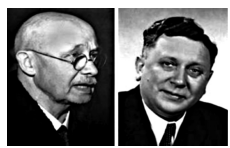

# 12 Basic concepts of organic reactions

**Otto diels and kurt alder**

describes an important
reaction mechanism for
the reaction between a
conjucated diene and a
substituted alkene. For this
work they were awarded
nobel prize in chemistry in
1950 Diels - Alder reaction
isa powerful tool in synthetic
organic chemistry. 

**Learning Objectives**

After learning this unit, students will be able to:

* understand the concept of organic reaction mechanism
* describe homolytic and heterolytic fission of bonds
* identify free radicals, nucleophiles and electrophiles,
* classify organic reactions into substitution, elimination, addition, oxidation and reduction
* describe electron movement in organic reactions
* explain the electronic effects in co-valent bonds

