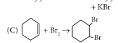
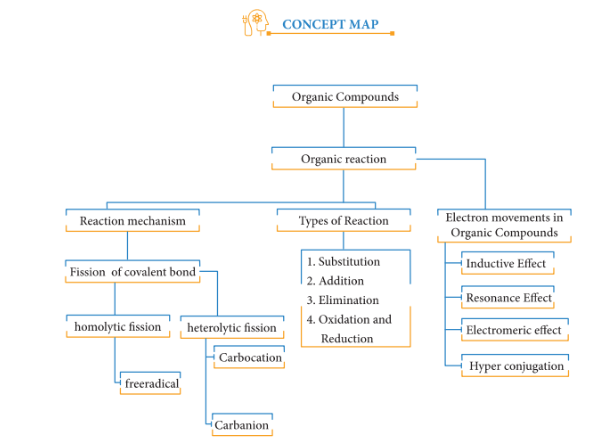

### **Evaluation**

 **I. Choose the best answer.**

1. For the following reactions

(A) $\text{CH}_3\text{CH}_2\text{CH}_2\text{Br} + \text{KOH} \rightarrow \text{CH}_3-\text{CH}=\text{CH}_2 + \text{KBr} + \text{H}_2\text{O}$

(B) $(\text{CH}_3)_3\text{CBr} + \text{KOH} \rightarrow (\text{CH}_3)_3\text{COH} + \text{KBr}$

Which of the following statement is correct?
(a) (A) is elimination, (B) and (C) are substitution

(b) (A) is substitution, (B) and (C) are elimination

(c) (A) and (B) are elimination and (C) is addition reaction

(d) (A) is elimination, B is substitution and (C) is addition reaction.

2. What is the hybridisation state of benzyl carbonium ion?
(a) $\text{sp}^2$

(b) $\text{spd}^2$

(c) $\text{sp}^3$

(d) $\text{sp}^2\text{d}$

3. Decreasing order of nucleophilicity is
(a) $\text{OH}^- > \text{NH}_2^- > \text{}^-\text{OCH}_3 > \text{RNH}_2$

(b) $\text{NH}_2^- > \text{OH}^- > \text{OCH}_3 > \text{RNH}_2$

(c) $\text{NH}_2^- > \text{CH}_3\text{O}^- > \text{OH}^- > \text{RNH}_2$

(d) $\text{CH}_3\text{O}^- > \text{NH}_2^- > \text{OH}^- > \text{RNH}_2$

4. Which of the following species is not electrophilic in nature?

(a) $\text{Cl}^+$

(b) $\text{BH}_3$

(c) $\text{H}_3\text{O}^+$

(d) $\text{}^+\text{NO}_2$

5. Homolytic fission of covalent bond leads to the formation of

(a) electrophile

(b) nucleophile

(c) Carbo cation

(d) free radical

6. Hyper Conjugation is also known as

(a) no bond resonance

(b) Baker - nathan effect

(c) both (a)and (b)

(d) none of these

7. Which of the group has highest $+\text{I}$ effect?

(a) $\text{CH}_3-$

(b) $\text{CH}_3-\text{CH}_2-$

(c) $(\text{CH}_3)_2-\text{CH}-$

(d) $(\text{CH}_3)_3-\text{C}-$

8. Which of the following species does not exert a resonance effect?

(a) $\text{C}_6\text{H}_5\text{OH}$

(b) $\text{C}_6\text{H}_5\text{Cl}$

(c) $\text{C}_6\text{H}_5\text{NH}_2$

(d) $\text{C}_6\text{H}_5\overset{+}{\text{N}}\text{H}_3$

9. $-\text{I}$ effect is shown by

(a) $-\text{Cl}$

(b) $-\text{Br}$

(c) both (a) and (b)

(d) $-\text{CH}_3$

10. Which of the following carbocation will be most stable?

(a) $\text{Ph}_3\text{C}^+$

(b) $\text{CH}_3-\overset{+}{\text{C}}\text{H}_2$

(c) $(\text{CH}_3)_2-\overset{+}{\text{C}}\text{H}$

(d) $\text{CH}_2=\text{CH}-\overset{+}{\text{C}}\text{H}_2$

11. **Assertion:** Tertiary Carbocations are generally formed more easily than primary Carbocations ions.

**Reason:** Hyper conjugation as well as inductive effect due to additional alkyl group stabilize tertiary carbonium ions.

(a) both assertion and reason are true and reason is the correct explanation of assertion.

(b) both assertion and reason are true but reason is not the correct explanation of assertion.

(c) Assertion is true but reason is false

(d) Both assertion and reason are false

12. Heterolytic fission of $\text{C}–\text{C}$ bond results in the formation of

(a) free radical

(b) Carbanion

(c) Carbocation

(d) Carbanion and Carbocation

13. Which of the following represent a set of nucleophiles?

(a) $\text{BF}_3$, $\text{H}_2\text{O}$, $\text{NH}_2^-$

(b) $\text{AlCl}_3$, $\text{BF}_3$, $\text{NH}_3$

(c) $\text{CN}^-$, $\text{RCH}_2^-$, $\text{ROH}$

(d) $\text{H}^+$, $\text{RNH}_3^+$, $:\text{CCl}_2$

14. Which of the following species does not acts as a nucleophile?

(a) $\text{ROH}$

(b) $\text{ROR}$

(c) $\text{PCl}_3$

(d) $\text{BF}_3$

15. The geometrical shape of carbocation is

(a) Linear

(b) tetrahedral

(c) Planar

(d) Pyramidal

**II. Write brief answer to the following questions.**

16. Write short notes on

(a) Resonance

(b) Hyperconjugation

17. What are electrophiles and nucleophiles? Give suitable examples for each.

18. Show the heterolysis of covalent bond by using curved arrow notation and complete the following equations. Identify the nucleophile is each case.

(i) $\text{CH}_3 - \text{Br} + \text{KOH} \rightarrow$

(ii) $\text{CH}_3 - \text{OCH}_3 + \text{HI} \rightarrow$

19. Explain inductive effect with suitable example.

20. Explain electromeric effect.

21. Give examples for the following types of organic reactions

(i) $\beta$ - elimination

(ii) electrophilic substitution.

