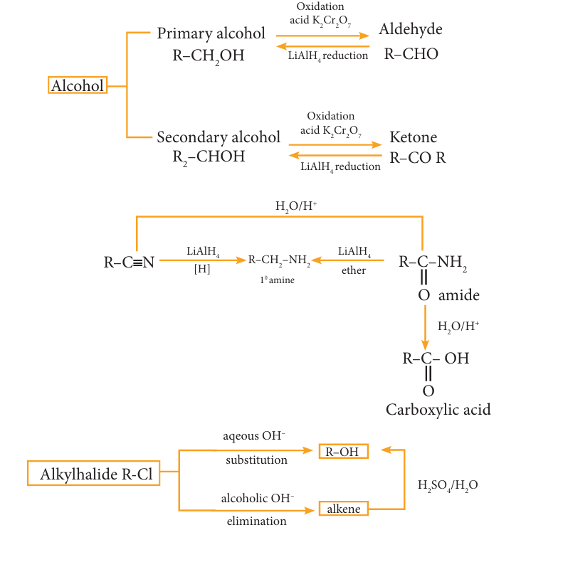

## 12.3 Functional Group inter conversion

Organic synthesis involves functional group inter conversions. A particular functional group can be converted into other functional group by reacting it with suitable reagents. For example: The carboxylic acid group (-COOH) presents in organic acids can be transformed to a variety of other functional group such as -\( \mathrm{CH_2OH} \), -\( \mathrm{CONH_2} \), -\( \mathrm{COCl} \) by treating the acid with \( \mathrm{LiAlH_4} \), \( \mathrm{NH_3} \) and \( \mathrm{SOCl_2} \) respectively.

**Some of the important functional group interconversions of Organic compounds are summarised in the below mentioned Flow chart.**

---
