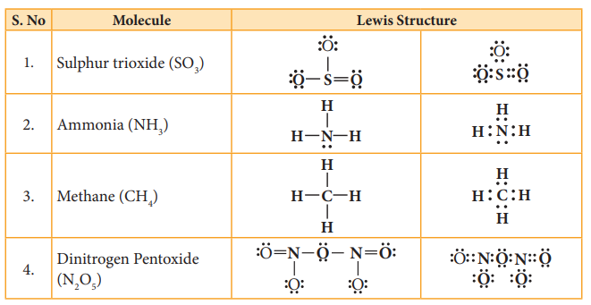
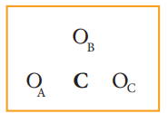
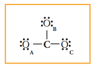
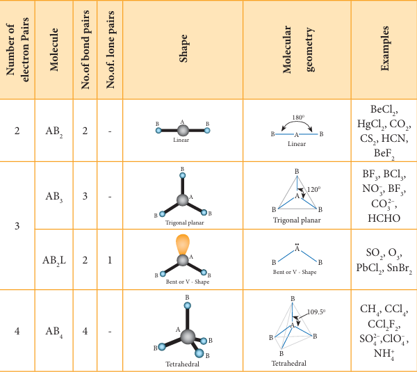
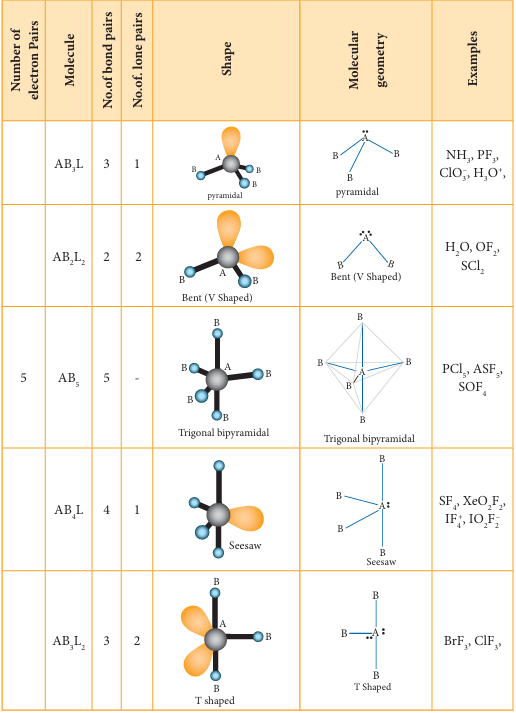
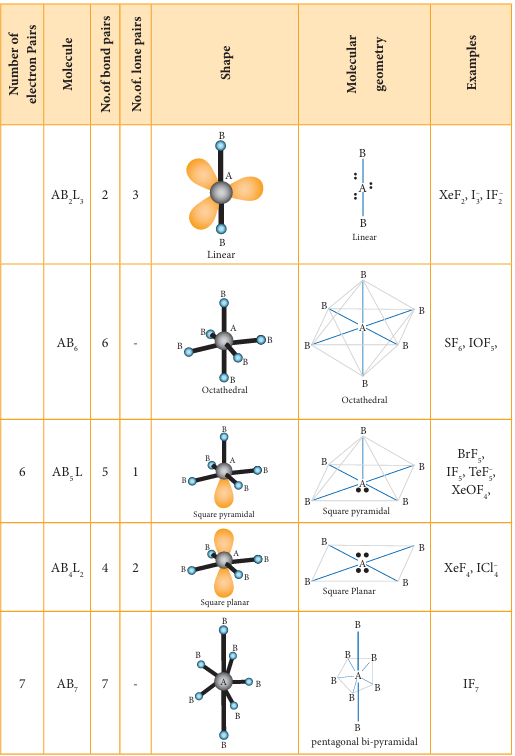

# Unit 10 - Chemical Bonding

<strong>Linus Carl Pauling was an American chemist, biochemist, peace activist, author and educator. In addition to his contribution to chemistry he also worked with many biologists. He received the Nobel Prize in Chemistry in 1954 for his research into the nature of the chemical bond and its application to the elucidation of the structure of complex substances.</strong>

## 10.1 Introduction

Diamond is very hard while its allotrope graphite is very soft. Gases like hydrogen and oxygen are diatomic while the inert gases are monoatomic. Carbon combines with chlorine to form carbon tetrachloride, which is a liquid and insoluble (immiscible) in water. Sodium combines with chlorine atom to form sodium chloride, a hard and brittle compound that readily dissolves in water. The possible reason for these observations lies in the type of interaction that exists between the atoms of these molecules and these interactions are responsible for holding the atoms/ions together. The interatomic attractive forces which hold the constituent atoms/ions together in a molecule are called **chemical bonds**.

Why do atoms combine only in certain combinations to form molecules? For example oxygen combines with hydrogen to give water \( \mathrm{H_2O} \) and with carbon it gives carbon dioxide \( \mathrm{CO_2} \). The structure of water is V-shaped while that of the carbon dioxide is linear. Such questions can be answered using the principles of chemical bonding. In this unit we will analyse the various theories and their principles, which were developed over the years to explain the nature of chemical bonding.

### 10.1.1 Kossel - Lewis Approach to Chemical Bonding

A logical explanation for chemical bonding was provided by Kossel and Lewis in 1916. Their approach to chemical bonding is based on the inertness of the noble gases which have little or no tendency to combine with other atoms. They proposed that the noble gases are stable due to their completely filled outer shell electronic configuration. Elements other than noble gases, try to attain the completely filled electronic configurations by losing, gaining or sharing one or more electrons from their outer shell. For example, sodium loses one electron to form \( \mathrm{Na^+} \) ion and chlorine accepts that electron to give chloride ion \( \mathrm{Cl^-} \), enabling both atoms to attain the nearest noble gas configuration. The resultant ions, \( \mathrm{Na^+} \) and \( \mathrm{Cl^-} \) are held together by electrostatic attractive forces and the attractive force is called a chemical bond, more specifically an **electrovalent bond**.

\[
\mathrm{Na} \rightarrow [\mathrm{Ne}] \, 3s^1
\]

\[
\mathrm{Cl} \rightarrow [\mathrm{Ne}] \, 3s^2 \, 3p^5
\]

\[
\mathrm{Na}^+ + \mathrm{Cl}^- \rightarrow \mathrm{NaCl}
\]

G. N. Lewis proposed that the attainment of stable electronic configuration in molecules such as diatomic nitrogen, oxygen etc. is achieved by mutual sharing of the electrons. He introduced a simple scheme to represent the chemical bond and the electrons present in the outer shell of an atom, called **Lewis dot structure**. In this scheme, the valence electrons (outer shell electrons) of an element are represented as small dots around the symbol of the element. The first four valence electrons are denoted as single dots around the four sides of the atomic symbol and then the fifth onwards, the electrons are denoted as pairs. For example, the electronic configuration of nitrogen is \( 1s^2, 2s^2, 2p^3 \). It has 5 electrons in its outer shell (valence shell). The Lewis structure of nitrogen is as follows.



<strong>Fig 10.1 Lewis Structure of Nitrogen atom</strong>

Similarly, Lewis dot structure of carbon, oxygen can be drawn as shown below.



<strong>Fig 10.2 Lewis Structures of C & O atoms</strong>

Only exception to this is helium which has only two electrons in its valence shell which is represented as a pair of dots (duet).



<strong>Fig 10.3 Lewis Structures of He atom</strong>

#### Octet Rule

The idea of Kossel - Lewis approach to chemical bond lead to the **octet rule**, which states that **"the atoms transfer or share electrons so that all atoms involved in chemical bonding obtain 8 electrons in their outer shell (valence shell)"**.

---

## 10.2 Types of Chemical Bonds

The chemical bonds can be classified based on the nature of the interaction between the bonded atoms. Two major types of chemical bonds are **covalent bonds** and **ionic bonds**. Generally metals react with non-metals to form ionic compounds, and the covalent bonds are present in the compounds formed by nonmetals.

### 10.2.1 Covalent Bonds

Do you know all elements (except noble gases) occur either as compounds or as polyatomic molecules? Let us consider hydrogen gas in which two hydrogen atoms bind to give a dihydrogen molecule. Each hydrogen atom has one electron and it requires one more electron to attain the electronic configuration of the nearest noble gas helium. Lewis suggested that both hydrogen atoms will attain the stable configuration by mutually sharing the electrons available with them. Similarly, in the case of oxygen molecule, both the oxygen atoms share two electron pairs between them and in nitrogen molecule three electron pairs are shared between two nitrogen atoms. This type of mutual sharing of one or more pairs of electrons between two combining atoms results in the formation of a chemical bond called a **covalent bond**. If two atoms share just one pair of electron a **single covalent bond** is formed as in the case of hydrogen molecule. If two or three electron pairs are shared between the two combining atoms, then the covalent bond is called a **double bond** or a **triple bond**, respectively.



<strong>Fig 10.4 Representation of Lewis Structures of covalent bonds</strong>

### 10.2.2 Representing a Covalent Bond - Lewis Structure (Lewis Dot Structure)

Lewis structure (Lewis dot structure) is a pictorial representation of covalent bonding between the combining atoms. In this structure the shared valence electrons are represented as a pair of dots between the combining atoms and the unshared electrons of the atoms are represented as a pair of dots (lone pair) on the respective individual atoms.

The Lewis dot structure for a given compound can be written by following the steps given below. Let us understand these steps by writing the Lewis structure for water.

1. Draw the skeletal structure of the molecule. In general, the less electronegative atom is placed at the centre. Hydrogen and fluorine atoms should be placed at the terminal positions. For water, the skeletal structure is \( \mathrm{H - O - H} \).



2. Calculate the total number of valence electrons of all the atoms in the molecule. In case of polyatomic ions the charge on ion should also be considered during the calculation of the total number of valence electrons. In case of anions the number of negative charges should be added to the number of valence electrons. For positive ions the total number of positive charges should be subtracted from the total number of valence electrons.

   In water, total number of valence electrons \( = [2 \times 1 \text{ (valence electron of hydrogen)}] + [1 \times 6 \text{ (valence electrons of oxygen)}] = 2 + 6 = 8 \)

3. Draw a single bond between the atoms in the skeletal structure of the molecule. Each bond will account for two valence electrons (a bond pair). For water, we can draw two bonds accounting for four valence electrons as follows: \( \mathrm{H - O - H} \).



4. Distribute the remaining valence electrons as pairs (lone pair), giving octet (only duet for hydrogen) to the atoms in the molecule. The distribution of lone pairs starts with the most electronegative atoms followed by other atoms.

   In case of water, the remaining four electrons (two lone pairs) are placed on the most electronegative central oxygen, giving octet.



5. Verify whether all the atoms satisfy the octet rule (for hydrogen duet). If not, use the lone pairs of electrons to form additional bond to satisfy the octet rule.

   In case of water, oxygen has octet and the hydrogens have duets, hence there is no need for shifting the lone pairs. The Lewis structure of water is as follows:



<strong>Fig 10.5 Lewis structure of water</strong>

Let us draw the Lewis structure for nitric acid.

1. Skeletal structure: \( \mathrm{H - O - N - O} \) with an additional \( \mathrm{O} \) attached to N.



2. Total number of valence electrons in \( \mathrm{HNO_3} \)
   \( = [1 \times 1 \text{ (hydrogen)}] + [1 \times 5 \text{ (nitrogen)}] + [3 \times 6 \text{ (oxygen)}] = 1 + 5 + 18 = 24 \)

3. Draw single bonds between atoms. Four bonds can be drawn accounting for eight electrons (4 bond pairs).



4. Distribute the remaining sixteen \( (24 - 8 = 16) \) electrons as eight lone pairs starting from the most electronegative atom, the oxygen. Six lone pairs are distributed to the two terminal oxygens (three each) to satisfy their octet and two pairs are distributed to the oxygen that is connected to hydrogen to satisfy its octet.



5. Verify whether all the atoms have octet configuration. In the above distribution, the nitrogen has one pair short for octet. Therefore, move one of the lone pairs from the terminal oxygen to form another bond with nitrogen.

The Lewis structure of nitric acid is given as



<strong>Fig 10.6 Lewis structure of Nitric acid</strong>

### Table 10.1: The Lewis dot structures for some molecules

**Note:** It is to be noted that nearly in all their compounds, certain elements form a fixed number of bonds. For example, Fluorine forms only one bond. Hydrogen, oxygen, nitrogen and carbon atoms form one, two, three and four bonds, respectively.

### Evaluate Yourself

1. Draw the Lewis structures for

   i) Nitrous acid \( \mathrm{HNO_2} \)

   ii) Phosphoric acid \( \mathrm{H_3PO_4} \)

   iii) Sulphur trioxide \( \mathrm{SO_3} \)

### 10.2.3 Formal Charge

Let us draw the Lewis structure for carbon dioxide.

1. Skeletal structure: \( \mathrm{O - C - O} \)

2. Total number of valence electrons in \( \mathrm{CO_2} \)
   \( = [1 \times 4 \text{ (carbon)}] + [2 \times 6 \text{ (oxygen)}] = 4 + 12 = 16 \)

3. Draw single bonds between atoms. Two bonds can be drawn accounting for four electrons (2 bond pairs): \( \mathrm{O - C - O} \)

4. Distribute the remaining twelve electrons \( (16 - 4 = 12) \) as six lone pairs starting from the most electronegative atom, the oxygen. Six lone pairs are distributed to the two terminal oxygens (three each) to satisfy their octet.



5. Verify whether all the atoms have octet configuration. In the above distribution, the central carbon has two pairs short for octet. Therefore, to satisfy the octet rule two lone pairs from one oxygen or one pair from each oxygen can be moved to form multiple bonds, leading to the formation of two possible structures for carbon dioxide as shown below.



<strong>Fig 10.7 (a) two possible structures for carbon dioxide</strong>

Similarly, the Lewis structure for many molecules drawn using the above steps gives more than one acceptable structure. Let us consider the above mentioned two structures of carbon dioxide.

Which one of the above forms represents the best distribution of electrons in the molecule? To find an answer, we need to know the **formal charge** of each atom in the Lewis structures. Formal charge of an atom in a molecule is the electrical charge difference between the valence electron in an isolated atom and the number of electrons assigned to that atom in the Lewis structure.

\[
\text{Formal charge of an atom} = N_v - \left(N_f + \frac{N_b}{2}\right)
\]

Where,
- \( N_v \) = Number of valence electrons of atom in its isolated state
- \( N_f \) = Number of electrons present as lone pairs around the atom in the Lewis structure
- \( N_b \) = Number of electrons present in bonds around the atom (bond pairs) in the Lewis structure

Now let us calculate the formal charge on all atoms in both structures.

**For Structure 1,**

Formal charge on carbon = \( N_v - \left( N_i + \frac{N_k}{2} \right) \)

\[
= 4 - \left( 0 + \frac{8}{2} \right) = 0
\]

Formal charge on oxygen = \( 6 - \left( 4 + \frac{4}{2} \right) \)

\[
= 0 \quad (\text{for both oxygens})
\]

**For Structure 2**

Formal charge on carbon

\[
= N_v - \left( N_i + \frac{N_k}{2} \right)
\]

\[
= 4 - \left( 0 + \frac{8}{2} \right) = 0
\]

Formal charge on singly bonded oxygen

\[
= 6 - \left( 6 + \frac{2}{2} \right) = -1
\]

Formal charge on triply bonded oxygen

\[
= 6 - \left( 2 + \frac{6}{2} \right) = +1
\]



\[
\text{Fig 10.7 (b) two possible structures for carbon dioxide (with formal charges)}
\]

After calculating the formal charges, the best representation of Lewis structure can be selected by using following guidelines.
1. A structure in which all formal charges are zero preferred over the one with charges.
2. A structure with small formal charges is preferred over the one with higher formal charges.
3. A structure in which negative formal charges are placed on the most electronegative atom is preferred.

In case of \( \mathrm{CO_2} \) structures, the structure with two double bonds is preferred over the structure with one triple bond as it has zero formal charges for all atoms.

### 10.2.4 Lewis Structures for Exceptions to Octet Rule

The octet rule is useful for writing Lewis structures for molecules with second period element as central atoms. In some molecules, the central atoms have less than eight electrons around them while some others have more than eight electrons. Exception to the octet rule can be categorized into the following three types.

1. Molecules with electron deficient central atoms
2. Molecules containing odd electrons
3. Molecules with expanded valence shells

#### Molecules with Electron Deficient Central Atoms

Let us consider boron trifluoride, as an example. The central atom boron has three valence electrons and each fluorine has seven valence electrons. The Lewis structure is



<strong>Fig 10.8 (a) Lewis structure of \( \mathrm{BF_3} \)</strong>

In the above structure, only six electrons around boron atom. Moving a lone pair from one of the fluorine to form additional bond as shown below.



<strong>Fig 10.8 (b) Lewis structure of \( \mathrm{BF_3} \)</strong>

However, the above structure is unfavourable as the most electronegative atom fluorine shows positive formal charge and hence the structure with incomplete octet is the favourable one. Molecules such as \( \mathrm{BCl_3}, \mathrm{BeCl_2} \) etc. also have incomplete octets.

#### Molecules Containing Odd Electrons

Few molecules have a central atom with an odd number of valence electrons. For example, in nitrogen dioxide and nitric oxide all the atoms do not have octet configuration. The Lewis structures of the above molecules are shown in the figure.



<strong>Fig 10.9 Lewis structures of Nitric oxide and Nitrogen dioxide (with formal charges)</strong>

#### Molecules with Expanded Valence Shells

In molecules such as sulphur hexafluoride \( \mathrm{SF_6} \), phosphorus pentachloride \( \mathrm{PCl_5} \), the central atom has more than eight valence electrons around them. Here the central atom can accommodate additional electron pairs by using outer vacant d orbitals. In \( \mathrm{SF_6} \) the central atom sulphur is surrounded by six bonding pairs of electrons or twelve electrons.



<strong>Fig 10.10 Lewis structures for \( \mathrm{SF_6} \) and \( \mathrm{PCl_5} \)</strong>

### Evaluate Yourself

2. Calculate the formal charge on each atom of carbonyl chloride \( \mathrm{COCl_2} \).

---

## 10.3 Ionic or Electrovalent Bond

When the electronegativity difference between the two combining atoms is large, the least electronegative atom completely transfers one or more of its valence electrons to the other combining atom so that both atoms can attain the nearest inert gas electronic configuration. The complete transfer of electron leads to the formation of a cation and an anion. Both these ions are held together by the electrostatic attractive force which is known as **ionic bond**.

Let us consider the formation of potassium chloride. The electronic configurations of potassium and chlorine are

Potassium (K): \( [\mathrm{Ar}] 4s^1 \)

Chlorine (Cl): \( [\mathrm{Ne}] 3s^2, 3p^5 \)

Potassium has one electron in its valence shell and chlorine has seven electrons in its valence shell. By losing one electron potassium attains the inert gas electronic configuration of argon and becomes a unipositive cation \( \mathrm{K^+} \) and chlorine accepts this electron to become uninegative chloride ion \( \mathrm{Cl^-} \) thereby attaining the stable electronic configuration of argon. These two ions combine to form an ionic crystal in which they are held together by electrostatic attractive force. The energy required for the formation of one mole of \( \mathrm{K^+} \) is 418.81 kJ (ionization energy) and the energy released during the formation of one mole of \( \mathrm{Cl^-} \) is -348.56 kJ (electron gain enthalpy). The sum of these two energies is positive (70.25 kJ). However, during the formation of one mole of potassium chloride crystal from its constituent ions, 718 kJ energy is released. This favours the formation of KCl and its stability.

### Evaluate Yourself

3. Explain the ionic bond formation in MgO and \( \mathrm{CaF_2} \).

---

## 10.4 Coordinate Covalent Bond

In the formation of a covalent bond, both the combining atoms contribute one electron each and these electrons are mutually shared among them. However, in certain bond formation, one of the combining atoms donates a pair of electrons i.e., two electrons which are necessary for the covalent bond formation, and these electrons are shared by both the combining atoms. These types of bonds are called **coordinate covalent bond** or **coordinate bond**. The combining atom which donates the pair of electrons is called a **donor atom** and the other atom an **acceptor atom**. This bond is denoted by an arrow starting from the donor atom pointing towards the acceptor atom. (Later in coordination compound, we will refer the donor atom as ligand and the acceptor atom as central-metal atom/ion.)

For example, in ferrocyanide ion \( [\mathrm{Fe(CN)_6}]^{4-} \), each cyanide ion \( \mathrm{CN^-} \) donates a pair of electrons to form a coordinate bond with iron \( \mathrm{Fe^{2+}} \) and these electrons are shared by \( \mathrm{Fe^{2+}} \) and \( \mathrm{CN^-} \).



<strong>Fig 10.11 Structure of Ferrocyanide ion</strong>

In certain cases, molecules having a lone pair of electrons such as ammonia donate its pair to an electron deficient molecule such as \( \mathrm{BF_3} \), to form a coordinate bond.



<strong>Fig 10.12 Structure of \( \mathrm{BF_3 \rightarrow NH_3} \)</strong>

---

## 10.5 Bond Parameters

A covalent bond is characterised by parameters such as bond length, bond angle, bond order etc. A brief description of some of the bond parameters is given below.

### 10.5.1 Bond Length

The distance between the nuclei of the two covalently bonded atoms is called **bond length**. Consider a covalent molecule A-B. The bond length is given by the sum of the radii of the bonded atoms \( (r_A + r_B) \). The length of a bond can be determined by spectroscopic, X-ray diffraction and electron-diffraction techniques. The bond length depends on the size of the atom and the number of bonds (multiplicity) between the combining atoms.



<strong>Fig 10.13 Bond length of covalent molecule A-B</strong>

Greater the size of the atom, greater will be the bond length. For example, carbon-carbon single bond length (1.54 Å) is longer than the carbon-nitrogen single bond length (1.43 Å).

Increase in the number of bonds between the two atoms decreases the bond length. For example, the carbon-carbon single bond is longer than the carbon-carbon double bond (1.33 Å) and the carbon-carbon triple bond (1.20 Å).

### 10.5.2 Bond Order

The number of bonds formed between the two bonded atoms in a molecule is called the **bond order**. In Lewis theory, the bond order is equal to the number of shared pairs of electrons between the two bonded atoms. For example in hydrogen molecules, there is only one shared pair of electrons and hence, the bond order is one. Similarly, in \( \mathrm{H_2O} \), HCl, methane, etc., the central atom forms single bonds with bond order of one.

### Table 10.2 Bond order of some common bonds

| S. No. | Molecule | Bonded atoms | Bond order (No. of shared pairs of electrons between bonded atoms) |
|--------|----------|--------------|------------------------------------------------|
| 1 | \( \mathrm{H_2} \) | H-H | 1 |
| 2 | \( \mathrm{O_2} \) | O=O | 2 |
| 3 | \( \mathrm{N_2} \) | N≡N | 3 |
| 4 | HCN | C≡N | 3 |
| 5 | HCHO | C=O | 2 |
| 6 | \( \mathrm{CH_4} \) | C-H | 1 |
| 7 | \( \mathrm{C_2H_4} \) | C=C | 2 |

### 10.5.3 Bond Angle

Covalent bonds are directional in nature and are oriented in specific directions in space. This directional nature creates a fixed angle between two covalent bonds in a molecule and this angle is termed as **bond angle**. It is usually expressed in degrees. The bond angle can be determined by spectroscopic methods and it can give some idea about the shape of the molecule.

### Table 10.3 Bond angles for some common molecules

| S. No. | Molecule | Atoms defining the angle | Bond angle (°) |
|--------|----------|-------------------------|----------------|
| 1 | \( \mathrm{CH_4} \) | H-C-H | 109° 28' |
| 2 | \( \mathrm{NH_3} \) | H-N-H | 107° 18' |
| 3 | \( \mathrm{H_2O} \) | H-O-H | 104° 35' |

### 10.5.4 Bond Enthalpy

The **bond enthalpy** is defined as the minimum amount of energy required to break one mole of a particular bond in molecules in their gaseous state. The unit of bond enthalpy is \( \mathrm{kJ \ mol^{-1}} \). Larger the bond enthalpy, stronger will be the bond. The bond energy value depends on the size of the atoms and the number of bonds between the bonded atoms. Larger the size of the atom involved in the bond, lesser is the bond enthalpy.

In case of polyatomic molecules with two or more same bond types, the term **average bond enthalpy** is used. For such bonds, the arithmetic mean of the bond energy values of the same type of bonds is considered as average bond enthalpy. For example in water, there are two OH bonds present and the energy needed to break them are not same.

\[
\mathrm{H_2O(g) \rightarrow H(g) + OH(g)} \quad \Delta H_1 = 502 \ \mathrm{kJ \ mol^{-1}}
\]

\[
\mathrm{OH(g) \rightarrow H(g) + O(g)} \quad \Delta H_2 = 427 \ \mathrm{kJ \ mol^{-1}}
\]

The average bond enthalpy of OH bond in water \( = \frac{502 + 427}{2} = 464.5 \ \mathrm{kJ \ mol^{-1}} \)

### Table 10.4 Bond lengths and bond enthalpies of some common bonds

| S. No. | Bond type | Bond Enthalpy \( \mathrm{kJ \ mol^{-1}} \) | Bond Length (Å) |
|--------|-----------|------------------------------------------|-----------------|
| 1 | H-H | 432 | 0.74 |
| 2 | H-F | 565 | 0.92 |
| 3 | H-Cl | 427 | 1.27 |
| 4 | H-Br | 363 | 1.41 |
| 5 | H-I | 295 | 1.61 |
| 6 | C-H | 413 | 1.09 |
| 7 | C-C | 347 | 1.54 |
| 8 | C-Si | 301 | 1.86 |
| 9 | C-N | 305 | 1.47 |
| 10 | C-O | 358 | 1.43 |
| 11 | C-P | 264 | 1.87 |
| 12 | C-S | 259 | 1.81 |
| 13 | C-F | 453 | 1.33 |
| 14 | C-Cl | 339 | 1.77 |
| 15 | C-Br | 276 | 1.94 |
| 16 | C-I | 216 | 2.13 |

### 10.5.5 Resonance

When we write Lewis structures for a molecule, more than one valid Lewis structures are possible in certain cases. For example, let us consider the Lewis structure of carbonate ion \( [\mathrm{CO_3}]^{2-} \).

The skeletal structure of carbonate ion (The oxygen atoms are denoted as \( \mathrm{O_A}, \mathrm{O_B} \& \mathrm{O_C} \))

Total number of valence electrons \( = [1 \times 4 \text{ (carbon)}] + [3 \times 6 \text{ (oxygen)}] + [2 \text{ (charge)}] = 24 \) electrons.

Distribution of these valence electrons gives us the following structure.

Complete the octet for carbon by moving a lone pair from one of the oxygens \( \mathrm{O_A} \) and write the charge of the ion (2-) on the upper right side as shown in the figure.



<strong>Fig 10.14 (a) Lewis Structure of \( \mathrm{CO_3^{2-}} \)</strong>

In this case, we can draw two additional Lewis structures by moving the lone pairs from the other two oxygens \( \mathrm{O_B} \) and \( \mathrm{O_C} \) thus creating three similar structures as shown below in which the relative position of the atoms are same. They only differ in the position of bonding and lone pair of electrons. Such structures are called **resonance structures** (canonical structures) and this phenomenon is called **resonance**.



<strong>Fig 10.14 (b) Resonance structures of \( \mathrm{CO_3^{2-}} \)</strong>

It is evident from the experimental results that all carbon-oxygen bonds in carbonate ion are equivalent. The actual structure of the molecule is said to be the **resonance hybrid**, an average of these three resonance forms. It is important to note that carbonate ion does not change from one structure to another and vice versa. It is not possible to picture the resonance hybrid by drawing a single Lewis structure. However, the following structure gives a qualitative idea about the correct structure.



<strong>Fig 10.14 (c) Resonance Hybrid structure of \( \mathrm{CO_3^{2-}} \)</strong>

It is found that the energy of the resonance hybrid is lower than that of all possible canonical structures. The difference in energy between the most stable canonical structure and the resonance hybrid is called **resonance energy**.

### Evaluate Yourself

4. Write the resonance structures for
   i) Ozone molecule \( \mathrm{O_3} \)
   ii) \( \mathrm{N_2O} \)

### 10.5.6 Polarity of Bonds

#### Partial Ionic Character in Covalent Bond

When a covalent bond is formed between two identical atoms (as in the case of \( \mathrm{H_2}, \mathrm{O_2}, \mathrm{Cl_2} \) etc.), both atoms have equal tendency to attract the shared pair of electrons and hence the shared pair of electrons lies exactly in the middle of the nuclei of two atoms. However, in the case of covalent bond formed between atoms having different electronegativities, the atom with higher electronegativity will have greater tendency to attract the shared pair of electrons more towards itself than the other atom. As a result the cloud of shared electron pair gets distorted.

Let us consider the covalent bond between hydrogen and fluorine in hydrogen fluoride. The electronegativities of hydrogen and fluorine on Pauling's scale are 2.1 and 4 respectively. It means that fluorine attracts the shared pair of electrons approximately twice as much as the hydrogen which leads to partial negative charge on fluorine and partial positive charge on hydrogen. Hence, the H-F bond is said to be **polar covalent bond**.

Here, a very small, equal and opposite charges are separated by a small distance (91 pm) and is referred to as a **dipole**.

#### Dipole Moment

The polarity of a covalent bond can be measured in terms of **dipole moment** which is defined as

\[
\mu = q \times 2d
\]

Where \( \mu \) is the dipole moment, \( q \) is the charge and \( 2d \) is the distance between the two charges. The dipole moment is a vector and the direction of the dipole moment vector points from the negative charge to positive charge.



<strong>Fig 10.15 Representation of Dipole</strong>

The unit for dipole moment is coulomb meter (C m). It is usually expressed in Debye unit (D). The conversion factor is 1 Debye \( = 3.336 \times 10^{-30} \ \mathrm{C \ m} \).

Diatomic molecules such as \( \mathrm{H_2}, \mathrm{O_2}, \mathrm{F_2} \) etc. have zero dipole moment and are called **non-polar molecules** and molecules such as HF, HCl, CO, NO etc. have non-zero dipole moments and are called **polar molecules**.

Molecules having polar bonds will not necessarily have a dipole moment. For example, the linear form of carbon dioxide has zero dipole moment, even though it has two polar bonds. In \( \mathrm{CO_2} \), the dipole moments of two polar bonds (CO) are equal in magnitude but have opposite direction. Hence, the net dipole moment of the \( \mathrm{CO_2} \) is, \( \mu = \mu_1 + \mu_2 = \mu_1 + (-\mu_1) = 0 \).



In case of water, net dipole moment is the vector sum of \( \mu_1 + \mu_2 \) as shown.



<strong>Fig 10.16 Dipole moment in water</strong>

Dipole moment in water is found to be 1.85 D.

### Table 10.5 Dipole moments of common molecules

| S. No. | Molecule | Dipole moment (in D) |
|--------|----------|---------------------|
| 1 | HF | 1.91 |
| 2 | HCl | 1.03 |
| 3 | \( \mathrm{H_2O} \) | 1.85 |
| 4 | \( \mathrm{NH_3} \) | 1.47 |
| 5 | \( \mathrm{CHCl_3} \) | 1.04 |

The extent of ionic character in a covalent bond can be related to the electronegativity difference of the bonded atoms. In a typical polar molecule, \( \mathrm{A^{\delta-} B^{\delta+}} \), the electronegativity difference \( (\chi_A - \chi_B) \) can be used to predict the percentage of ionic character as follows.

If the electronegativity difference \( (\chi_A - \chi_B) \) is equal to 1.7, then the bond A-B has 50% ionic character; if it is greater than 1.7, then the bond A-B has more than 50% ionic character; and if it is lesser than 1.7, then the bond A-B has less than 50% ionic character.

### Evaluate Yourself

5. Of the two molecules OCS and \( \mathrm{CS_2} \), which one has higher dipole moment value? Why?

#### Partial Covalent Character in Ionic Bonds

Like the partial ionic character in covalent compounds, ionic compounds show partial covalent character. For example, the ionic compound lithium chloride shows covalent character and is soluble in organic solvents such as ethanol.

The partial covalent character in ionic compounds can be explained on the basis of a phenomenon called **polarisation**. We know that in an ionic compound, there is an electrostatic attractive force between the cation and anion. The positively charged cation attracts the valence electrons of anion while repelling the nucleus. This causes a distortion in the electron cloud of the anion and its electron density drifts towards the cation, which results in some sharing of the valence electrons between these ions. Thus, a partial covalent character is developed between them. This phenomenon is called polarisation.

The ability of a cation to polarise an anion is called its **polarising ability** and the tendency of an anion to get polarised is called its **polarisability**. The extent of polarisation in an ionic compound is given by the **Fajans rules**.

#### Fajans Rules

(i) To show greater covalent character, both the cation and anion should have high charge on them. Higher the positive charge on the cation, greater will be the attraction on the electron cloud of the anion. Similarly higher the magnitude of negative charge on the anion, greater is its polarisability. Hence, the increase in charge on cation or in anion increases the covalent character.

Let us consider three ionic compounds: aluminium chloride, magnesium chloride and sodium chloride. Since the charge of the cation increases in the order \( \mathrm{Na^+ < Mg^{2+} < Al^{3+}} \), the covalent character also follows the same order \( \mathrm{NaCl < MgCl_2 < AlCl_3} \).

(ii) The smaller cation and larger anion show greater covalent character due to the greater extent of polarisation.

Lithium chloride is more covalent than sodium chloride. The size of \( \mathrm{Li^+} \) is smaller than \( \mathrm{Na^+} \) and hence the polarising power of \( \mathrm{Li^+} \) is more. Lithium iodide is more covalent than lithium chloride as the size of \( \mathrm{I^-} \) is larger than that of \( \mathrm{Cl^-} \). Hence \( \mathrm{I^-} \) will be more polarised than \( \mathrm{Cl^-} \) by the cation \( \mathrm{Li^+} \).

(iii) Cations having \( ns^2 np^6 nd^{10} \) configuration show greater polarising power than the cations with \( ns^2 np^6 \) configuration. Hence, they show greater covalent character.

\( \mathrm{CuCl} \) is more covalent than NaCl. Compared to \( \mathrm{Na^+} \) (1.13 Å), \( \mathrm{Cu^+} \) (0.6 Å) is small and has \( 3s^2 3p^6 3d^{10} \) configuration.

Electronic configuration of \( \mathrm{Cu^+} \): \( [\mathrm{Ar}] 3d^{10} \)

Electronic configuration of \( \mathrm{Na^+} \): \( [\mathrm{He}] 2s^2 2p^6 \)

---

## 10.6 Valence Shell Electron Pair Repulsion (VSEPR) Theory

Lewis concept of structure of molecules deals with the relative position of atoms in the molecules and sharing of electron pairs between them. However, we cannot predict the shape of the molecule using Lewis concept. Lewis theory in combination with VSEPR theory will be useful in predicting the shape of molecules.

### Important Principles of VSEPR Theory

1. The shape of the molecules depends on the number of valence shell electron pairs around the central atom.

2. There are two types of electron pairs namely **bond pairs** and **lone pairs**. The bond pairs of electrons are those shared between two atoms, while the lone pairs are the valence electron pairs that are not involved in bonding.

3. Each pair of valence electrons around the central atom repels each other and hence, they are located as far away as possible in three dimensional space to minimize the repulsion between them.

4. The repulsive interaction between the different types of electron pairs is in the following order:

   \[
   \text{lp - lp > lp - bp > bp - bp}
   \]
   (lp - lone pair; bp - bond pair)

The lone pairs of electrons are localised only on the central atom and interact with only one nucleus whereas the bond pairs are shared between two atoms and they interact with two nuclei. Because of this, the lone pairs occupy more space and have greater repulsive power than the bond pairs in a molecule.

The following Table illustrates the shapes of molecules predicted by VSEPR theory. Consider a molecule \( \mathrm{AB}_x \) where A is the central atom and \( x \) represents the number of atoms of B covalently bonded to the central atom A. The lone pairs present in the atoms are denoted as L.

### Table 10.6 Shapes of molecules predicted by VSEPR theory

### Evaluate Yourself

6. Arrange the following in the decreasing order of Bond angle
   i) \( \mathrm{CH_4, H_2O, NH_3} \)
   ii) \( \mathrm{C_2H_2, BF_3, CCl_4} \)

---

## 10.7 Valence Bond Theory

Heitler and London gave a theoretical treatment to explain the formation of covalent bond in hydrogen molecule on the basis of wave mechanics of electrons. It was further developed by Pauling and Slater. The wave mechanical treatment of VB theory is beyond the scope of this textbook. A simple qualitative treatment of VB theory for the formation of hydrogen molecule is discussed below.

Consider a situation wherein two hydrogen atoms \( (\mathrm{H_a} \text{ and } \mathrm{H_b}) \) are separated by infinite distance. At this stage there is no interaction between these two atoms and the potential energy of this system is arbitrarily taken as zero. As these two atoms approach each other, in addition to the electrostatic attractive force between the nucleus and its own electron, the following new forces begin to operate.



<strong>Fig 10.17 (a) VB theory for the formation of hydrogen molecule</strong>

The new attractive forces arise between
(i) nucleus of \( \mathrm{H_a} \) and valence electron of \( \mathrm{H_b} \)
(ii) nucleus of \( \mathrm{H_b} \) and the valence electron of \( \mathrm{H_a} \)

The new repulsive forces arise between
(i) the nucleus of \( \mathrm{H_a} \) and \( \mathrm{H_b} \)
(ii) valence electrons of \( \mathrm{H_a} \) and \( \mathrm{H_b} \)

The attractive forces tend to bring \( \mathrm{H_a} \) and \( \mathrm{H_b} \) together whereas the repulsive forces tend to push them apart. At the initial stage, as the two hydrogen atoms approach each other, the attractive forces are stronger than the repulsive forces and the potential energy decreases. A stage is reached where the net attractive forces are exactly balanced by repulsive forces and the potential energy of the system acquires a minimum energy.



<strong>Fig 10.17 (b) VB theory for the formation of hydrogen molecule</strong>

At this stage, there is a maximum overlap between the atomic orbitals of \( \mathrm{H_a} \) and \( \mathrm{H_b} \), and the atoms \( \mathrm{H_a} \) and \( \mathrm{H_b} \) are now said to be bonded together by a covalent bond. The internuclear distance at this stage gives the H-H bond length and is equal to \( 74 \ \mathrm{pm} \). The liberated energy is \( 436 \ \mathrm{kJ \ mol^{-1}} \) and is known as bond energy. Since the energy is released during the bond formation, the resultant molecule is more stable. If the distance between the two atoms is decreased further, the repulsive forces dominate the attractive forces and the potential energy of the system sharply increases.

### 10.7.1 Salient Features of VB Theory

(i) When half-filled orbitals of two atoms overlap, a covalent bond will be formed between them.

(ii) The resultant overlapping orbital is occupied by the two electrons with opposite spins. For example, when \( \mathrm{H_2} \) is formed, the two 1s electrons of two hydrogen atoms get paired up and occupy the overlapped orbital.

(iii) The strength of a covalent bond depends upon the extent of overlap of atomic orbitals. Greater the overlap, larger is the energy released and stronger will be the bond formed.

(iv) Each atomic orbital has a specific direction (except s-orbital which is spherical) and hence orbital overlap takes place in the direction that maximizes overlap.

---

## 10.8 Orbital Overlap

When atoms combine to form a covalent molecule, the atomic orbitals of the combining atoms overlap to form a covalent bond. The bond pair of electrons will occupy the overlapped region of the orbitals. Depending upon the nature of overlap we can classify the covalent bonding between the two atoms as **sigma \( (\sigma) \)** and **pi \( (\pi) \)** bonds.

### 10.8.1 Sigma and Pi Bonds

When two atomic orbitals overlap linearly along the axis, the resultant bond is called a **sigma \( (\sigma) \) bond**. This overlap is also called 'head-on overlap' or 'axial overlap'. Overlap involving an s orbital (s-s and s-p overlaps) will always result in a sigma bond as the s orbital is spherical. Overlap between two p orbitals along the molecular axis will also result in sigma bond formation. When we consider x-axis as molecular axis, the \( \mathrm{p_x - p_x} \) overlap will result in \( \sigma \)-bond.

When two atomic orbitals overlap sideways, the resultant covalent bond is called a **pi \( (\pi) \) bond**. When we consider x-axis as molecular axis, the \( \mathrm{p_y - p_y} \) and \( \mathrm{p_z - p_z} \) overlaps will result in the formation of a \( \pi \)-bond.

Following examples will be useful to understand the overlap:

#### Formation of Hydrogen \( \mathrm{H_2} \) Molecule

Electronic configuration of hydrogen atom is \( 1s^1 \)

During the formation of \( \mathrm{H_2} \) molecule, the 1s orbitals of two hydrogen atoms containing one unpaired electron with opposite spin overlap with each other along the internuclear axis. This overlap is called **s-s overlap**. Such axial overlap results in the formation of a \( \sigma \)-covalent bond.



<strong>Fig 10.18 Formation of hydrogen molecule</strong>

#### Formation of \( \mathrm{F_2} \) Molecule

Valence shell electronic configuration of fluorine atom: \( 2s^2 2p_x^2, 2p_y^2, 2p_z^1 \)

When the half-filled \( p_z \) orbitals of two fluorine overlap along the z-axis, a \( \sigma \)-covalent bond is formed between them.



<strong>Fig 10.19 Formation of \( \mathrm{F_2} \) Molecule</strong>

#### Formation of HF Molecule

Electronic configuration of hydrogen atom is \( 1s^1 \)

Valence shell electronic configuration of fluorine atom: \( 2s^2 2p_x^2, 2p_y^2, 2p_z^1 \)

When half-filled 1s orbital of hydrogen linearly overlaps with a half-filled \( 2p_z \) orbital of fluorine, a \( \sigma \)-covalent bond is formed between hydrogen and fluorine.



<strong>Fig 10.20 Formation of HF Molecule</strong>

#### Formation of Oxygen Molecule \( \mathrm{O_2} \)

Valence shell electronic configuration of oxygen atom: \( 2s^2 2p_x^2, 2p_y^1, 2p_z^1 \)



When the half-filled \( p_z \) orbitals of two oxygen overlap along the z-axis (considering molecular axis as z-axis), a \( \sigma \)-covalent bond is formed between them. The other two half-filled \( p_y \) orbitals of the two oxygen atoms overlap laterally (sideways) to form a \( \pi \)-covalent bond between the oxygen atoms. Thus, in oxygen molecule, two oxygen atoms are connected by two covalent bonds (double bond). The other two pairs of electrons present in the 2s and \( 2p_x \) orbitals do not involve in bonding and remain as lone pairs on the respective oxygen.



<strong>Fig 10.21 Formation of \( \pi \) bond in \( \mathrm{O_2} \) Molecule</strong>

### Evaluate Yourself

7. Bond angle in \( \mathrm{PH_4^+} \) is higher than in \( \mathrm{PH_3} \). Why?

---

## 10.9 Hybridisation

Bonding in simple molecules such as hydrogen and fluorine can easily be explained on the basis of overlap of the respective atomic orbitals of the combining atoms. But the observed properties of polyatomic molecules such as methane, ammonia, beryllium chloride etc. cannot be explained on the basis of simple overlap of atomic orbitals. For example, it was experimentally proved that methane has a tetrahedral structure and the four C-H bonds are equivalent. This fact cannot be explained on the basis of overlap of atomic orbitals of hydrogen (1s) and the atomic orbitals of carbon with different energies \( (2s^2 2p_x^2 2p_y^1 2p_z^1) \).

In order to explain these observed facts, Linus Pauling proposed that the valence atomic orbitals in the molecules are different from those in isolated atom and he introduced the concept of **hybridisation**. Hybridisation is the process of mixing of atomic orbitals of the same atom with comparable energy to form equal number of new equivalent orbitals with same energy. The resultant orbitals are called **hybridised orbitals** and they possess maximum symmetry and definite orientation in space so as to minimize the force of repulsion between their electrons.

### 10.9.1 Types of Hybridisation and Geometry of Molecules

#### sp Hybridisation

Consider the bond formation in beryllium chloride. The ground state valence shell electronic configuration of Beryllium atom is \( [\mathrm{He}] 2s^2 2p^0 \).

In BeCl2
 both the Be-Cl bonds are
equivalent and it was observed that the
molecule is linear. VB theory explain this
observed behaviour by sp hybridisation.
One of the paired electrons in the 2s orbital
gets excited to 2p orbital and the electronic
configuration at the excited state is shown

Now, the 2s and 2p orbitals hybridise
and produce two equivalent sp hybridised
orbitals which have 50 % s-character and
50 % p-character. These sp hybridised
orbitals are oriented in opposite direction as
shown in the figure.





**Overlap with orbital of chlorine:**

Each of the sp hybridized orbitals linearly overlaps with \( 3p_z \) orbital of the chlorine to form a covalent bond between Be and Cl as shown in the Figure.



<strong>Fig 10.22 sp Hybridisation: \( \mathrm{BeCl_2} \)</strong>

#### \( sp^2 \) Hybridisation

Consider the bond formation in boron trifluoride. The ground state valence shell electronic configuration of Boron atom is \( [\mathrm{He}] 2s^2 2p^1 \).





In the ground state boron has only one unpaired electron in the valence shell. In order to form three covalent bonds with fluorine atoms, three unpaired electrons are required. To achieve this, one of the paired electrons in the 2s orbital is promoted to the \( 2p_y \) orbital in the excited state.

In boron, the s orbital and two p orbitals \( (p_x \text{ and } p_y) \) in the valence shell hybridize to generate three equivalent \( sp^2 \) orbitals as shown in the Figure. These three orbitals lie in the same xy plane and the angle between any two orbitals is equal to \( 120^\circ \).

**Overlap with \( 2p_z \) orbitals of fluorine:**

The three \( sp^2 \) hybridised orbitals of boron now overlap with the \( 2p_z \) orbitals of fluorine (3 atoms). This overlap takes place along the axis as shown below.



<strong>Fig 10.23 sp² Hybridisation: \( \mathrm{BF_3} \)</strong>

#### \( sp^3 \) Hybridisation

\( sp^3 \) hybridisation can be explained by considering methane as an example. In methane molecule the central carbon atom is bound to four hydrogen atoms. The ground state valence shell electronic configuration of carbon is \( [\mathrm{He}] 2s^2 2p_x^1 2p_y^1 2p_z^0 \).





In order to form four covalent bonds with the four hydrogen atoms, one of the paired electrons in the 2s orbital of carbon is promoted to its \( 2p_z \) orbital in the excited state. The one 2s orbital and the three 2p orbitals of carbon mix to give four equivalent \( sp^3 \) hybridised orbitals. The angle between any two \( sp^3 \) hybridised orbitals is \( 109^\circ 28' \).

**Overlap with 1s orbitals of hydrogen:**

The 1s orbitals of the four hydrogen atoms overlap linearly with the four \( sp^3 \) hybridised orbitals of carbon to form four C-H \( \sigma \)-bonds in the methane molecule, as shown below.



<strong>Fig 10.24 sp³ Hybridisation: \( \mathrm{CH_4} \)</strong>

#### \( sp^3 d \) Hybridisation

In molecules such as \( \mathrm{PCl_5} \) the central atom phosphorus is covalently bound to five chlorine atoms. Here the atomic orbitals of phosphorus undergo \( sp^3 d \) hybridisation which involves its one 3s orbital, three 3p orbitals and one vacant 3d orbital \( (d_{z^2}) \). The ground state electronic configuration of phosphorus is \( [\mathrm{Ne}] 3s^2 3p_x^1 3p_y^1 3p_z^1 \) as shown below.





<strong>Fig 10.25 \( sp^3 d \) Hybridisation: \( \mathrm{PCl_5} \)</strong>

One of the paired electrons in the 3s orbital of phosphorus is promoted to one of its vacant 3d orbital \( (d_{z^2}) \) in the excited state. One 3s orbital, three 3p orbitals and one 3d orbital of phosphorus atom mix to give five equivalent \( sp^3 d \) hybridised orbitals. The orbital geometry of \( sp^3 d \) hybridised orbitals is trigonal bipyramidal as shown in the figure.

**Overlap with \( 3p_z \) orbitals of chlorine:**

The 3p orbitals of the five chlorine atoms linearly overlap along the axis with the five \( sp^3 d \) hybridised orbitals of phosphorus to form the five P-Cl \( \sigma \)-bonds.

#### \( sp^3 d^2 \) Hybridisation

In sulphur hexafluoride \( \mathrm{SF_6} \) the central atom sulphur extends its octet to undergo \( sp^3 d^2 \) hybridisation to generate six \( sp^3 d^2 \) hybridised orbitals which accounts for six equivalent S-F bonds. The ground state electronic configuration of sulphur is \( [\mathrm{Ne}] 3s^2 3p_x^2 3p_y^1 3p_z^1 \).





<strong>Fig 10.26 \( sp^3 d^2 \) Hybridisation: \( \mathrm{SF_6} \)</strong>

One electron each from 3s orbital and 3p orbital of sulphur is promoted to its two vacant 3d orbitals \( (d_{z^2} \text{ and } d_{x^2 - y^2}) \) in the excited state. A total of six valence orbitals from sulphur (one 3s orbital, three 3p orbitals and two 3d orbitals) mix to give six equivalent \( sp^3 d^2 \) hybridised orbitals. The orbital geometry is octahedral as shown in the figure.

**Overlap with \( 2p_z \) orbitals of fluorine:**

The six \( sp^3 d^2 \) hybridised orbitals of sulphur overlap linearly with \( 2p_z \) orbitals of six fluorine atoms to form the six S-F bonds in the sulphur hexafluoride molecule.

#### Bonding in Ethylene

The bonding in ethylene can be explained using hybridisation concept. The molecular formula of ethylene is \( \mathrm{C_2H_4} \). The valency of carbon is 4. The electronic configuration of valence shell of carbon in ground state is \( [\mathrm{He}] 2s^2 2p_x^1 2p_y^1 2p_z^0 \). To satisfy the valency of carbon, promote an electron from 2s orbital to \( 2p_z \) orbital in the excited state.

In ethylene molecule, both the carbon atoms are in \( sp^2 \) hybridised state. The 2s and two 2p orbitals (say \( 2p_x \text{ and } 2p_y \)) mix to form three equivalent \( sp^2 \) hybridised orbitals lying in the xy plane at an angle of \( 120^\circ \) to each other. The unhybridised \( 2p_z \) orbital is perpendicular to the xy plane.

**Formation of sigma bond:**

One of the three \( sp^2 \) hybridised orbitals of each carbon overlaps linearly with each other resulting in the formation of a C-C sigma bond. The other two \( sp^2 \) hybridised orbitals of both carbons linearly overlap with the 1s orbitals of two hydrogen atoms on each carbon leading to the formation of four C-H sigma bonds.





**Formation of Pi \( (\pi) \) bond:**

The unhybridised \( 2p_z \) orbital of both carbon atoms can overlap only sideways as they are not in the molecular axis. This lateral overlap results in the formation of a \( \pi \) bond between the two carbon atoms as shown in the figure.



<strong>Fig 10.27 sp² Hybridisation: \( \mathrm{C_2H_4} \)</strong>

#### Bonding in Acetylene

Similar to ethylene, the bonding in acetylene can also be explained using hybridisation concept. The molecular formula of acetylene is \( \mathrm{C_2H_2} \). The electronic configuration of valence shell of carbon in ground state is \( [\mathrm{He}] 2s^2 2p_x^1 2p_y^1 2p_z^0 \). To satisfy the valency of carbon, promote an electron from 2s orbital to \( 2p_z \) orbital in the excited state.

In acetylene molecule, both the carbon atoms are in \( sp \) hybridised state. The 2s and \( 2p_x \) orbitals mix, resulting in two equivalent \( sp \) hybridised orbitals lying in a straight line along the molecular axis (x-axis). The unhybridised \( 2p_y \) and \( 2p_z \) orbitals lie perpendicular to the molecular axis.

**Formation of sigma bond:**

One of the two \( sp \) hybridised orbitals of each carbon linearly overlaps with each other resulting in the formation of a C-C sigma bond. The other \( sp \) hybridised orbital of both carbons linearly overlaps with the 1s orbitals of two hydrogen atoms leading to the formation of two C-H sigma bonds.

**Formation of pi bond:**

The unhybridised \( 2p_y \) and \( 2p_z \) orbitals of each carbon overlap sideways. This lateral overlap results in the formation of two pi bonds \( (p_y - p_y \text{ and } p_z - p_z) \) between the two carbon atoms as shown in the figure.



<strong>Fig 10.28 sp Hybridisation in acetylene: \( \mathrm{C_2H_2} \)</strong>

### Evaluate Yourself

8. Explain the bond formation in \( \mathrm{SF_4} \) and \( \mathrm{CCl_4} \) using hybridisation concept.

9. The observed bond length of \( \mathrm{N_2^+} \) is larger than \( \mathrm{N_2} \) while the bond length in \( \mathrm{NO^+} \) is less than in NO. Why?

---

## 10.10 Molecular Orbital Theory

Lewis concept and valence bond theory qualitatively explain the chemical bonding and molecular structure. Both approaches are inadequate to describe some of the observed properties of molecules. For example, these theories predict that oxygen is diamagnetic. However, it was observed that oxygen in liquid form was attracted towards the poles of strong magnet, indicating that oxygen is paramagnetic. As both these theories treated the bond formation in terms of electron pairs, they fail to explain the bonding nature of paramagnetic molecules. F. Hund and Robert S. Mulliken developed a bonding theory called **molecular orbital theory** which explains the magnetic behaviour of molecules.

### The Salient Features of Molecular Orbital Theory (MOT)

1. When atoms combine to form molecules, their individual atomic orbitals lose their identity and form new orbitals called **molecular orbitals**.
2. The shapes of molecular orbitals depend upon the shapes of combining atomic orbitals.
3. The number of molecular orbitals formed is the same as the number of combining atomic orbitals. Half the number of molecular orbitals formed will have lower energy than the corresponding atomic orbital, while the remaining molecular orbitals will have higher energy. The molecular orbital with lower energy is called **bonding molecular orbital** and the one with higher energy is called **anti-bonding molecular orbital**. The bonding molecular orbitals are represented as \( \sigma \) (sigma), \( \pi \) (pi), \( \delta \) (delta) and the corresponding antibonding orbitals are denoted as \( \sigma^* \), \( \pi^* \) and \( \delta^* \).
4. The electrons in a molecule are accommodated in the newly formed molecular orbitals. The filling of electrons in these orbitals follows Aufbau's principle, Pauli's exclusion principle and Hund's rule as in the case of filling of electrons in atomic orbitals.
5. Bond order gives the number of covalent bonds between the two combining atoms. The bond order of a molecule can be calculated using the following equation

\[
\text{Bond order} = \frac{N_b - N_a}{2}
\]

Where,
\( N_b = \) Total number of electrons present in the bonding molecular orbitals
\( N_a = \) Total number of electrons present in the antibonding molecular orbitals

A bond order of zero value indicates that the molecule doesn't exist.

### 10.10.1 Linear Combination of Atomic Orbitals

The wave functions for the molecular orbitals can be obtained by solving Schrödinger wave equation for the molecule. Since solving the Schrödinger equation is too complex, approximation methods are used to obtain the wave function for molecular orbitals. The most common method is the **linear combination of atomic orbitals (LCAO)**.

We know that the atomic orbitals are represented by the wave function \( \psi \). Let us consider two atomic orbitals represented by the wave function \( \psi_A \) and \( \psi_B \) with comparable energy combine to form two molecular orbitals. One is bonding molecular orbital \( (\psi_{\text{bonding}}) \) and the other is antibonding molecular orbital \( (\psi_{\text{antibonding}}) \). The wave functions for these two molecular orbitals can be obtained by the linear combination of the atomic orbitals \( \psi_A \) and \( \psi_B \) as below.

\[
\psi_{\text{bonding}} = \psi_A + \psi_B
\]
\[
\psi_{\text{antibonding}} = \psi_A - \psi_B
\]

The formation of bonding molecular orbital can be considered as the result of constructive interference of the atomic orbitals and the formation of antibonding molecular orbital can be the result of the destructive interference of the atomic orbitals. The formation of the two molecular orbitals from two 1s orbitals is shown below.



<strong>Fig 10.29 Linear Combination of atomic orbitals</strong>

### 10.10.2 Bonding in Some Homonuclear Diatomic Molecules

#### Molecular Orbital Diagram of Hydrogen Molecule \( \mathrm{H_2} \)

Electronic configuration of H atom is \( 1s^1 \)

Electronic configuration of \( \mathrm{H_2} \) molecule: \( \sigma_{1s}^2 \)

Bond order \( = \frac{N_b - N_a}{2} = \frac{2 - 0}{2} = 1 \)

Molecule has no unpaired electrons. Hence, it is diamagnetic.



<strong>Fig 10.30 MO Diagram for \( \mathrm{H_2} \) molecule</strong>

#### Molecular Orbital Diagram of Lithium Molecule \( \mathrm{Li_2} \)

Electronic configuration of Li atom is \( 1s^2 2s^1 \)

Electronic configuration of \( \mathrm{Li_2} \) molecule: \( \sigma_{1s}^2, \sigma_{1s}^{*2}, \sigma_{2s}^2 \)

Bond order \( = \frac{N_b - N_a}{2} = \frac{4 - 2}{2} = 1 \)

Molecule has no unpaired electrons. Hence it is diamagnetic.



<strong>Fig 10.31 MO Diagram for \( \mathrm{Li_2} \) molecule</strong>

#### Molecular Orbital Diagram of Boron Molecule \( \mathrm{B_2} \)

Electronic configuration of B atom is \( 1s^2 2s^2 2p^1 \)

Electronic configuration of \( \mathrm{B_2} \) molecule: \( \sigma_{1s}^2, \sigma_{1s}^{*2}, \sigma_{2s}^2, \sigma_{2s}^{*2}, \pi_{2p_y}^1, \pi_{2p_z}^1 \)

Bond order \( = \frac{N_b - N_a}{2} = \frac{6 - 4}{2} = 1 \)

Molecule has two unpaired electrons. Hence it is paramagnetic.



<strong>Fig 10.32 MO Diagram for \( \mathrm{B_2} \) molecule</strong>

#### Molecular Orbital Diagram of Carbon Molecule \( \mathrm{C_2} \)

Electronic configuration of C atom is \( 1s^2 2s^2 2p^2 \)

Electronic configuration of \( \mathrm{C_2} \) molecule: \( \sigma_{1s}^2, \sigma_{1s}^{*2}, \sigma_{2s}^2, \pi_{2p_y}^2, \pi_{2p_z}^2 \)

Bond order \( = \frac{N_b - N_a}{2} = \frac{8 - 4}{2} = 2 \)

Molecule has no unpaired electrons. Hence, it is diamagnetic.



<strong>Fig 10.33 MO Diagram for \( \mathrm{C_2} \) molecule</strong>

#### Molecular Orbital Diagram of Nitrogen Molecule \( \mathrm{N_2} \)

Electronic configuration of N atom is \( 1s^2 2s^2 2p^3 \)

Electronic configuration of \( \mathrm{N_2} \) molecule: \( \sigma_{1s}^2, \sigma_{1s}^{*2}, \sigma_{2s}^2, \sigma_{2s}^{*2}, \pi_{2p_y}^2, \pi_{2p_z}^2, \sigma_{2p_x}^2 \)

Bond order \( = \frac{N_b - N_a}{2} = \frac{10 - 4}{2} = 3 \)

Molecule has no unpaired electrons. Hence, it is diamagnetic.



<strong>Fig 10.34 MO Diagram for \( \mathrm{N_2} \) molecule</strong>

#### Molecular Orbital Diagram of Oxygen Molecule \( \mathrm{O_2} \)

Electronic configuration of O atom is \( 1s^2 2s^2 2p^4 \)

Electronic configuration of \( \mathrm{O_2} \) molecule: \( \sigma_{1s}^2, \sigma_{1s}^{*2}, \sigma_{2s}^2, \sigma_{2s}^{*2}, \sigma_{2p_x}^2, \pi_{2p_y}^2, \pi_{2p_z}^2, \pi_{2p_y}^{*1}, \pi_{2p_z}^{*1} \)

Bond order \( = \frac{N_b - N_a}{2} = \frac{10 - 6}{2} = 2 \)

Molecule has two unpaired electrons. Hence, it is paramagnetic.



<strong>Fig 10.35 MO Diagram for \( \mathrm{O_2} \) molecule</strong>

### 10.10.3 Bonding in Some Heteronuclear Diatomic Molecules

#### Molecular Orbital Diagram of Carbon Monoxide Molecule (CO)

Electronic configuration of C atom is \( 1s^2 2s^2 2p^2 \)

Electronic configuration of O atom is \( 1s^2 2s^2 2p^4 \)

Electronic configuration of CO molecule: \( \sigma_{1s}^2, \sigma_{1s}^{*2}, \sigma_{2s}^2, \sigma_{2s}^{*2}, \pi_{2p_y}^2, \pi_{2p_z}^2, \sigma_{2p_x}^2 \)

Bond order \( = \frac{N_b - N_a}{2} = \frac{10 - 4}{2} = 3 \)

Molecule has no unpaired electrons. Hence, it is diamagnetic.



<strong>Fig 10.36 MO Diagram for CO molecule</strong>

#### Molecular Orbital Diagram of Nitric Oxide Molecule (NO)

Electronic configuration of N atom is \( 1s^2 2s^2 2p^3 \)

Electronic configuration of O atom is \( 1s^2 2s^2 2p^4 \)

Electronic configuration of NO molecule: \( \sigma_{1s}^2, \sigma_{1s}^{*2}, \sigma_{2s}^2, \sigma_{2s}^{*2}, \pi_{2p_y}^2, \pi_{2p_z}^2, \sigma_{2p_x}^2, \pi_{2p_y}^{*1} \)

Bond order \( = \frac{N_b - N_a}{2} = \frac{10 - 5}{2} = 2.5 \)

Molecule has one unpaired electron. Hence, it is paramagnetic.



<strong>Fig 10.37 MO Diagram for NO molecule</strong>

---

## 10.11 Metallic Bonding

Metals have some special properties of lustre, high density, high electrical and thermal conductivity, malleability and ductility, and high melting and boiling points. The forces that keep the atoms of the metal so closely in a metallic crystal constitute what is generally known as the **metallic bond**. The metallic bond is not just an electrovalent bond (ionic bond), as the latter is formed between atoms of different electronegativities. Similarly, the metallic bond is not a covalent bond, as the metal atoms do not have sufficient number of valence electrons for mutual sharing with 8 or 12 neighbouring metal atoms in a crystal. So, we have to search for a new theory to explain metallic bond. The first successful theory is due to Drude and Lorentz, which regards metallic crystal as an assemblage of positive ions immersed in a gas of free electrons. The free electrons are due to ionization of the valence electrons of the atoms of the metal. As the valence electrons of the atoms are freely shared by all the ions in the crystal, the metallic bonding is also referred to as **electronic bonding**. As the free electrons repel each other, they are uniformly distributed around the metal ions. Many physical properties of the metals can be explained by this theory, nevertheless there are exceptions.

The electrostatic attraction between the metal ions and the free electrons yields a three-dimensional close packed crystal with a large number of nearest metal ions. So, metals have high density. As the close packed structure contains many slip planes along which movement can occur during mechanical loading, the metal acquires ductility. Pure metals can undergo 40 to 60% elongation prior to rupturing under mechanical loading. As each metal ion is surrounded by electron cloud in all directions, the metallic bonding has no directional properties.

As the electrons are free to move around the positive ions, the metals exhibit high electrical and thermal conductivity. The metallic lustre is due to reflection of light by the electron cloud. As the metallic bond is strong enough, the metal atoms are reluctant to break apart into a liquid or gas, so the metals have high melting and boiling points.

The bonding in metal is better treated by Molecular orbital theory. As per this theory, the atomic orbitals of large number of atoms in a crystal overlap to form numerous bonding and antibonding molecular orbitals without any band gap. The bonding molecular orbitals are completely filled with an electron pair in each, and the antibonding molecular orbitals are empty. Absence of band gap accounts for high electrical conductivity of metals. High thermal conductivity is due to thermal excitation of many electrons from the valence band to the conductance band. With an increase in temperature, the electrical conductivity decreases due to vigorous thermal motion of lattice ions that disrupts the uniform lattice structure, that is required for free motion of electrons within the crystal. Most metals are black except copper, silver and gold. It is due to absorption of light of all wavelengths. Absorption of light of all wavelengths is due to absence of bandgap in metals.

---

## Summary

In molecules, atoms are held together by attractive forces called chemical bonds. Kossel and Lewis were the first people to provide a logical explanation for chemical bonding. They proposed that atoms try to attain the nearest noble gas electronic configuration by losing, gaining or sharing one or more electrons during bond formation. The noble gases contain eight electrons in their valence shell which is considered to be a stable electronic configuration. The idea of Kossel-Lewis approach to chemical bond led to the **octet rule**, which states that "the atoms transfer or share electrons so that all atoms involved in chemical bonding obtain 8 electrons in their outer shell (valence shell)".

There are different types of chemical bonds. In compounds such as sodium chloride, the sodium atom loses an electron which is accepted by the chlorine atom resulting in the formation of \( \mathrm{Na^+} \) and \( \mathrm{Cl^-} \) ions. These two ions are held together by electrostatic attractive forces. This type of chemical bond is known as **ionic bond** or **electrovalent bond**. In certain compounds, instead of the complete transfer of electrons, the electrons are shared by both the bonding atoms. The two combining atoms are held together by their mutual attraction towards the shared electrons. This type of bond is called **covalent bonding**. In addition, there is another bond type known as **coordinate covalent bond**, where the shared electrons of a covalent bond are provided by only one of the combining atoms. **Metallic bonding** is another type of bonding which is observed in metals.

Lewis theory in combination with VSEPR theory is useful in predicting the shape of molecules. According to this theory, the shape of the molecule depends on the number of valence shell electron pairs (lone pairs and bond pairs) around the central atom. Each pair of valence electrons around the central atom repels each other and hence, they are located as far away as possible in three-dimensional space to minimise the repulsion between them.

Heitler and London gave a theoretical treatment to explain the formation of covalent bond in hydrogen molecule on the basis of wave mechanics of electrons. It was further developed by Pauling and Slater. According to this theory, when half-filled orbitals of two atoms overlap, a covalent bond will be formed between them. Linus Pauling introduced the concept of **hybridisation**. Hybridisation is the process of mixing of atomic orbitals of the same atom with comparable energy to form an equal number of new equivalent orbitals with the same energy. There are different types of hybridisation such as sp, \( sp^2 \), \( sp^3 \), \( sp^3d \), \( sp^3d^2 \) etc.

F. Hund and Robert S. Mulliken developed a bonding theory called **molecular orbital theory**. According to this theory, when atoms combine to form molecules, their individual atomic orbitals lose their identity and form new orbitals called molecular orbitals. The filling of electrons in these orbitals follows Aufbau's principle, Pauli's exclusion principle and Hund's rule as in the case of filling of electrons in atomic orbitals.

---
