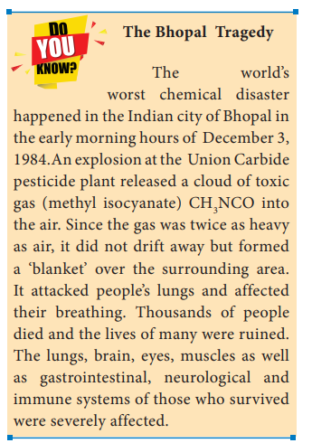

# 15. Environmental Chemistry

The Nobel Prize in chemistry 2005 was awarded jointly to Yves Chauvin, Robert H. Grubbs and Richard R. Schrock for the development of new chemicals based on Green chemistry.

In 1971 Yves Chauvin explained the types of metal compound that act as catalysts in the reactions. Richard Schrock was the first to produce efficient metal compound catalysts for metathesis in 1990. Two years later Robert Grubbs developed better catalysts, stable in air that was highlighted in many applications.

### 15. INTRODUCTION

We are very familiar with the word environment. It includes the air we breathe, the water that covers most of the earth's surface, the plants and animals around us and much more. These days, when we hear people talk about "the environment," they are often referring to the overall condition of our planet, or how healthy it is.
Environmental chemistry is a branch of chemistry which deals with the study of chemicals and chemical processes. occuring in the enviroment by direct human activities. It also deals with sources, causes and methods of controlling air, water and soil pollution.

#### 15.1 Environmental Pollution

Any undesirable change in our environment that has harmful effects on plants, animals and human beings is called environmental pollution.

Environmental pollution is usually caused by the addition of waste products of human activity to the environment. The substances which cause pollution of environment are called pollutants. The pollutants may be solids, liquids or gaseous substances present in significant concentration in the environment. Our environment becomes polluted day by day, by the increased addition of industrial and domestic wastes to it. The air we breathe, the water we drink and the place where we live in, are highly contaminated.

The pollutants are classified as bio-degradable and non-biodegradable pollutants.

**i. Bio-degradable pollutants:**

The pollutants which can be easily decomposed by the natural biological processes are called bio-degradable pollutants. Examples: plant wastes, animal wastes etc.

**ii. Non bio-degradable pollutants:**

The pollutants which cannot be decomposed by the natural biological processes are called non-biodegradable pollutants. Examples: metal wastes (mainly Hg and Pb), D.D.T, plastics, nuclear wastes etc. These pollutants are harmful to living organisms even in low concentration. As they are not degraded naturally, it is difficult to eliminate them from our environment.

### 15.2 Atmospheric Pollution

Earth's atmosphere is a layer of gases retained by the earth's gravity. It contains roughly \(78\%\) nitrogen, \(21\%\) oxygen, \(0.93\%\) argon, \(0.04\%\) carbon dioxide, trace amounts of other gases and little amount of water vapour. This mixture is commonly known as air.

Earth's atmosphere can be divided into different layers with characteristic altitude and temperature. The various regions of atmosphere are given in table 15.1.

**Table 15.1 Regions of atmosphere**

| Region | Altitude from earth's surface | Temperature range | Gases/species present |
|---|---|---|---|
| Troposphere | 0-10 km | \(15^{\circ}\mathrm{C}\) to \(-56^{\circ}\mathrm{C}\) | \( \mathrm{N_2}, \mathrm{O_2}, \mathrm{CO_2}, \mathrm{H_2O} \) (vap) |
| Stratosphere (ozonosphere) | 10-50 km | \(-56^{\circ}\mathrm{C}\) to \(-2^{\circ}\mathrm{C}\) | \( \mathrm{N_2}, \mathrm{O_2}, \mathrm{O_3}, \mathrm{O} \) atoms |
| Mesosphere | 50-85 km | \(-2^{\circ}\mathrm{C}\) to \(-92^{\circ}\mathrm{C}\) | \( \mathrm{N_2}, \mathrm{O_2}, \mathrm{NO^+} \) |
| Thermosphere | 85-500 km | \(-92^{\circ}\mathrm{C}\) to \(1200^{\circ}\mathrm{C}\) | \( \mathrm{O_2}, \mathrm{O^+}, \mathrm{O_2^+}, \mathrm{NO^+} \) |

#### Troposphere

The lowest layer of the atmosphere is called the troposphere and it extends from \(0 - 10\mathrm{km}\) from the earth surface. About \(80\%\) of the mass of the atmosphere is in this layer. This troposphere is further divided as follows.

**i) Hydrosphere:**

Hydrosphere includes all types of water sources like oceans, seas, rivers, lakes, streams, underground water, polar icecaps, clouds etc. It covers about \(75\%\) of the earth's surface. Hence the earth is called as a blue planet.

**ii) Lithosphere:**

Lithosphere includes soil, rocks and mountains which are solid components of earth.

**iii) Biosphere:**

It includes the lithosphere, hydrosphere and atmosphere integrating the living organism present in the lithosphere, hydrosphere and atmosphere.

### 15.3 Types of environmental pollution

Atmospheric pollution is generally studied as tropospheric pollution. Different types of atmospheric pollutions are

(1) Air pollution
(2) Water pollution
(3) Soil pollution.

#### 15.3.1 Air pollution

Any undesirable change in air which adversely affects living organisms is called air pollution. Air pollution is limited to troposphere and stratosphere. Air pollution is mainly due to the excessive discharge of undesirable foreign matter into the atmospheric air.



**Fig 15.1 Air Pollution**

##### Types of air pollutants

Air pollutants may exist in two major forms namely, gases and particulates.

###### 15.3.1.1 Gaseous air pollutants

Oxides of sulphur, oxides of nitrogen, oxides of carbon, and hydrocarbons are the gaseous air pollutants.

**a. Oxides of Sulphur**

Sulphur dioxide and sulphur trioxide are produced by burning sulphur containing fossil fuels and roasting sulphide ores. Sulphur dioxide is a poisonous gas to both animals and plants. Sulphur dioxide causes eye irritation, coughing and respiratory diseases like asthma, bronchitis, etc.

Sulphur dioxide is oxidised into more harmful sulphur trioxide in the presence of particulate matter present in polluted air.

\[
2\mathrm{SO}_{2} + \mathrm{O}_{2} \xrightarrow{\mathrm{Particulate~matter}} 2\mathrm{SO}_{3}
\]

\( \mathrm{SO}_3 \) combines with atmospheric water vapour to form \( \mathrm{H}_2\mathrm{SO}_4 \), which comes down in the form of acid rain.

\[
\mathrm{SO}_3 + \mathrm{H}_2\mathrm{O} \rightarrow \mathrm{H}_2\mathrm{SO}_4
\]

Some harmful effects of acid rain will be discussed in section 15.3

**b. Oxides of nitrogen**

Oxides of nitrogen are produced during high temperature combustion processes, oxidation of nitrogen in air and from the combustion of fuels (coal, diesel, petrol etc.).

\[
\mathrm{N}_2 + \mathrm{O}_2 \xrightarrow{>1210^{\circ}\mathrm{C}} 2\mathrm{NO}
\]

\[
2\mathrm{NO} + \mathrm{O}_2 \xrightarrow{1100^{\circ}\mathrm{C}} 2\mathrm{NO}_2
\]

\[
\mathrm{NO} + \mathrm{O}_3 \rightarrow \mathrm{NO}_2 + \mathrm{O}_2
\]

The oxides of nitrogen are converted into nitric acid which comes down in the form of acid rain. They also form reddish brown haze in heavy traffic. Nitrogen dioxide potentially damages plant leaves and retards photosynthesis. \( \mathrm{NO}_2 \) is a respiratory irritant and it can cause asthma and lung injury. Nitrogen dioxide is also harmful to various textile fibres and metals.

**c. Oxides of carbon**

The major pollutants of oxides of carbon are carbon monoxide and carbon dioxide.

**(i) Carbon Monoxide**

Carbon monoxide is a poisonous gas produced as a result of incomplete combustion of coal or firewood. It is released into the air mainly by automobile exhaust. It binds with haemoglobin and forms carboxy haemoglobin which impairs normal oxygen transport by blood and hence the oxygen carrying capacity of blood is reduced. This oxygen deficiency results in headache, dizziness, tension, loss of consciousness, blurring of eye sight and cardiac arrest.

**(ii) Carbon dioxide**

Carbon dioxide is released into the atmosphere mainly by the process of respiration, burning of fossil fuels, forest fire, decomposition of limestone in cement industry etc.

Green plants can convert \( \mathrm{CO}_2 \) gas in the atmosphere into carbohydrate and oxygen through a process called photosynthesis. The increased \( \mathrm{CO}_2 \) level in the atmosphere is responsible for global warming. It causes headache and nausea.

**(d) Hydrocarbon**

The compounds composed of carbon and hydrogen only are called hydrocarbons. They are mainly produced naturally (marsh gas) and also by incomplete combustion of automobile fuel.

They are potential cancer causing (carcinogenic) agents. For example, polynuclear aromatic hydrocarbons (PAH) are carcinogenic, they cause irritation in eyes and mucous membranes.

###### 15.3.1.2 Greenhouse effect and Global warming

In 1987, Jean Baptiste Fourier a French mathematician and scientist coined the term "Greenhouse Effect" for trapping of heat in the atmosphere by certain gases.



**Fig 15.2 Greenhouse effect**

The earth's atmosphere allows most of the visible light from the Sun to pass through and reach Earth's surface. As Earth's surface is heated by sunlight, it radiates part of this energy back toward space as longer wavelengths (IR).

Some of the heat is trapped by \( \mathrm{CH}_4 \), \( \mathrm{CO}_2 \), CFCs and water vapour present in the atmosphere. They absorb IR radiation and effectively block a large portion of earth's emitted radiation. The radiation thus absorbed is partly reemitted to earth's surface. Therefore, the earth's surface gets heated up by a phenomenon called greenhouse effect.

Thus Greenhouse effect may be defined as the heating up of the earth surface due to trapping of infrared radiations reflected by earth's surface by \( \mathrm{CO}_2 \) layer in the atmosphere. The heating up of earth through the greenhouse effect is called global warming.

Without the heating caused by the greenhouse effect, Earth's average surface temperature would be only about \(-18^{\circ}\mathrm{C}\) \( (0^{\circ}\mathrm{F}) \). Although the greenhouse effect is a naturally occurring phenomenon, it is intensified by the continuous emission of greenhouse gases into the atmosphere.

During the past 100 years, the amount of carbon dioxide in the atmosphere increased by roughly 30 percent and the amount of methane more than doubled. If these trends continue, the average global temperature will increase which can lead to melting of polar ice caps and flooding of low lying areas. This will increase incidence of infectious diseases like dengue, malaria etc.

###### 15.3.1.3 Acid Rain

Rain water normally has a \( \mathrm{pH} \) of 5.6 due to dissolution of atmospheric \( \mathrm{CO}_2 \) into it. Oxides of sulphur and nitrogen in the atmosphere may be absorbed by droplets of water that make up clouds and get chemically converted into sulphuric acid and nitric acid respectively. As a result, \( \mathrm{pH} \) of rain water drops below the level 5.6, hence it is called acid rain.

Acid rain is a by-product of a variety of sulphur and nitrogen oxides in the atmosphere. Burning of fossil fuels (coal and oil) in power stations, furnaces and petrol, diesel in motor engines produce sulphur dioxide and nitrogen oxides. The main contributors of acid rain are \( \mathrm{SO}_2 \) and \( \mathrm{NO}_2 \). They are converted into sulphuric acid and nitric acid respectively by the reaction with oxygen and water.

\[
2\mathrm{SO}_2 + \mathrm{O}_2 + 2\mathrm{H}_2\mathrm{O} \rightarrow 2\mathrm{H}_2\mathrm{SO}_4
\]

\[
4\mathrm{NO}_2 + \mathrm{O}_2 + 2\mathrm{H}_2\mathrm{O} \rightarrow 4\mathrm{HNO}_3
\]

**Harmful effects of acid rain:**

Some harmful effects are discussed below.

(i) Acid rain causes extensive damage to buildings and structural materials of marbles. This attack on marble is termed as Stone leprosy.

\[
\mathrm{CaCO_3 + H_2SO_4 \rightarrow CaSO_4 + H_2O + CO_2 \uparrow}
\]

(ii) Acid rain affects plants and animal life in aquatic ecosystem.

(iii) It is harmful for agriculture, trees and plants as it dissolves and removes the nutrients needed for their growth.

(iv) It corrodes water pipes resulting in the leaching of heavy metals such as iron, lead and copper into drinking water which have toxic effects.

(v) It causes respiratory ailment in humans and animals.



**Fig 15.3. Effect Of Acid Rain On Tajmahal**

#### 15.3.2 Particulate matter (Particulate pollutants)

Particulate pollutants are small solid particles and liquid droplets suspended in air. Many of particulate pollutants are hazardous. Examples: dust, pollen, smoke, soot and liquid droplets (aerosols) etc.

They are blown into the atmosphere by volcanic eruption, blowing of dust, incomplete combustion of fossil fuels induces soot. Combustion of high ash fossil fuels creates fly ash and finishing of metals throws metallic particles into the atmosphere.

##### 15.3.2.1 Types of Particulates

Particulate in the atmosphere may be of two types, viable or non-viable.

**a. Viable particulates**

The viable particulates are the small size living organisms such as bacteria, fungi, moulds, algae, etc. which are dispersed in air. Some of the fungi cause allergy in human beings and diseases in plants.

**b. Non-viable particulates**

The non-viable particulates are small solid particles and liquid droplets suspended in air. They help in the transportation of viable particles. There are four types of nonviable particulates in the atmosphere. They are classified according to their nature and size as follows

**(i) Smoke**

Smoke particulate consists of solid particles (or) mixture of solid and liquid particles formed by combustion of organic matter.

For example, cigarette smoke, oil smoke, smokes from burning of fossil fuel, garbage and dry leaves.

**(ii) Dust:**

Dust composed of fine solid particles produced during crushing and grinding of solid materials.

For example, sand from sand blasting, saw dust from wood works, cement dust from cement factories and fly ash from power generating units.

**(iii) Mists**

They are formed by particles of spray liquids and condensation of vapours in air.

For example, sulphuric acid mist, herbicides and insecticides sprays can form mists.

**(iv) Fumes**

Fumes are obtained by condensation of vapours released during sublimation, distillation, boiling and calcination and by several other chemical reactions.

For example, organic solvents, metals and metallic oxides form fume particles.

##### 15.3.2.2 Health effects of particulate pollutants

i. Dust, mist, fumes, etc., are air borne particles which are dangerous for human health. Particulate pollutants bigger than 5 microns are likely to settle in the nasal passage whereas particles of about 10 micron enters the lungs easily and causes scaring or fibrosis of lung lining. They irritate the lungs and causes cancer and asthma. This disease is also called pneumoconiosis. Coal miners may suffer from black lung disease. Textile workers may suffer from white lung disease.

ii. Lead particulates affect children's brain, interferes maturation of RBCs and even cause cancer.

iii. Particulates in the atmosphere reduce visibility by scattering and absorption of sunlight. It is dangerous for aircraft and motor vehicles.

iv. Particulates provide nuclei for cloud formation and increase fog and rain.

v. Particulates deposit on plant leaves and hinder the intake of \( \mathrm{CO}_2 \) from the air and affect photosynthesis.

##### 15.3.2.3 Techniques to reduce particulate pollutants

The particulates from air can be removed by using electrostatic precipitators, gravity settling chambers, and wet scrubbers or by cyclone collectors. These techniques are based on washing away or settling of the particulates.

#### 15.3.3 Smog

Smog is a combination of smoke and fog which forms droplets that remain suspended in the air.



**Fig 15.4 classical smog**

Smog is a chemical mixture of gases that forms a brownish yellow haze over urban cities. Smog mainly consists of ground level ozone, oxides of nitrogen, volatile organic compounds, \( \mathrm{SO}_2 \), acidic aerosols and gases, and particulate matter.

There are two types of smog. One is Classical smog caused by coal smoke and fog, second one is photochemical smog caused by photochemical oxidants. They are discussed below in detail.

**(i) Classical smog or London smog**

Classical smog was first observed in London in December 1952 and hence it is also known as London smog. It consists of coal smoke and fog.

It occurs in cool humid climate. This atmospheric smog found in many large cities. The chemical composition is the mixture of \( \mathrm{SO}_2 \), \( \mathrm{SO}_3 \) and humidity. It generally occurs in the morning and becomes worse when the sun rises.

This is mainly due to the induced oxidation of \( \mathrm{SO}_2 \) to \( \mathrm{SO}_3 \), which reacts with water yielding sulphuric acid aerosol.

Chemically it is reducing in nature because of high concentration of \( \mathrm{SO}_2 \) and so it is also called as reducing smog.

**Effects of classical smog:**

a. Smog is primarily responsible for acid rain.

b. Smog results in poor visibility and it affects air and road transport.

c. It also causes bronchial irritation.

**Do You Know**

**Great London Smog**

The great smog of London, or great smog of 1952, was a severe air-pollution event that affected the British capital of London in early December 1952. It lasted from Friday, 5 December to Tuesday, 9 December 1952 and then dispersed quickly when the weather changed. It caused major disruption by reducing visibility and even penetrating indoor areas. Government medical reports in the following weeks, however, estimated that until 8 December, 4,000 people had died as a direct result of the smog and 100,000 more were made ill by the smog's effects on the human respiratory tract.

**(ii) Photochemical smog or Los Angel Smog**

Photochemical smog was first observed in Los Angels in 1950. It occurs in warm, dry and sunny climate. This type of smog is formed by the combination of smoke, dust and fog with air pollutants like oxides of nitrogen and hydrocarbons in the presence of sunlight.

It forms when the sun shines and becomes worse in the afternoon. Chemically it is oxidizing in nature because of high concentration of oxidizing agents \( \mathrm{NO}_2 \) and \( \mathrm{O}_3 \), so it is also called as oxidizing smog.

Photochemical smog is formed through sequence of following reactions.

\[
\mathrm{N}_2 + \mathrm{O}_2 \rightarrow 2\mathrm{NO}
\]

\[
2\mathrm{NO} + \mathrm{O}_2 \rightarrow 2\mathrm{NO}_2
\]

\[
\mathrm{NO}_2 \xrightarrow{\mathrm{Sunlight}} \mathrm{NO} + (\mathrm{O})
\]

\[
(\mathrm{O}) + \mathrm{O}_2 \rightarrow \mathrm{O}_3
\]

\[
\mathrm{O}_3 + \mathrm{NO} \rightarrow \mathrm{NO}_2 + \mathrm{O}_2
\]

\[
\mathrm{NO}_2 \xrightarrow{\mathrm{Sunlight}} \mathrm{NO} + (\mathrm{O})
\]

NO and \( \mathrm{O}_3 \) are strong oxidizing agent and can react with unburnt hydrocarbons in polluted air to form formaldehyde, acrolein and peroxy acetyl nitrate (PAN).

**Effects of photochemical smog**

The three main components of photochemical smog are nitrogen oxide, ozone and oxidised hydrocarbon like formaldehyde (HCHO), Acrolein \( \mathrm{(CH_2 = CH - CHO)} \), peroxy acetyl nitrate (PAN).

Photochemical smog causes irritation to eyes, skin and lungs, increase in chances of asthma.

High concentrations of ozone and NO can cause nose and throat irritation, chest pain, uncomfortable in breathing, etc.

PAN is toxic to plants, attacks younger leaves and cause bronzing and glazing of their surfaces.

It causes corrosion of metals, stones, building materials and painted surfaces.

**Control of Photochemical smog**

The formation of photochemical smog can be suppressed by preventing the release of nitrogen oxides and hydrocarbons into the atmosphere from the motor vehicles by using catalytic convertors in engines. Plantation of certain trees like Pinus, Pyrus, Querus Vitus and juniparus can metabolise nitrogen oxide.

### 15.4 Stratospheric pollution

At high altitudes the atmosphere consists of a layer of ozone \( \mathrm{(O_3)} \) which acts as an umbrella or shield for harmful UV radiations. It protects us from harmful effect such as skin cancer. UV radiation can convert molecular oxygen into ozone as shown in the following reaction.

\[
\mathrm{O_2(g) \xrightarrow{uv} O(g) + O(g)}
\]

\[
\mathrm{O(g) + O_2(g) \xrightarrow{uv} O_3(g)}
\]

Ozone gas is thermodynamically unstable and readily decomposes to molecular oxygen.

#### 15.4.1 Depletion of Ozone Layer (Ozone hole)



**Fig 15.5 Ozone Depletion**

In recent years, a gradual depletion of this protective ozone layer has been reported. Nitric oxide and CFC are found to be most responsible for depletion of ozone layer.

Generally substances that cause depletion of ozone or make it thinner are called Ozone Depletion Substances abbreviated as ODS. The loss of ozone molecules in the upper atmosphere is termed as depletion of stratospheric ozone.

**Oxides of Nitrogen:**

Nitrogen oxides introduced directly into the stratosphere by the supersonic jet aircraft engines in the form of exhaust gases.

These oxides are also released by combustion of fossil fuels and nitrogen fertilizers. Inert nitrous oxide in the stratosphere is photochemically converted into more reactive nitric oxide. Oxides of nitrogen catalyse the decomposition of ozone and are themselves regenerated. Ozone gets depleted as shown below.

\[
\mathrm{NO + O_2 \rightarrow NO_2 + O_2}
\]

\[
\mathrm{O_2 \xrightarrow{h\nu} O + O}
\]

\[
\mathrm{NO_2 + O \rightarrow NO + O_2}
\]

Thus NO is regenerated in the chain reaction.

**Chloro Fluoro Carbons (CFC) Freons**

The chloro fluoro derivatives of methane and ethane are referred by trade name Freons. These Chloro Fluoro Carbon compounds are stable, non-toxic, noncorrosive and non-inflammatory, easily liquefiable and are used in refrigerators, air-conditioners and in the production of plastic foams. CFC's are the exhaust of supersonic aircrafts and jumbo jets flying in the upper atmosphere. They slowly pass from troposphere to stratosphere. They stay for very longer period of 50 - 100 years. In the presence of uv radiation, CFC's break up into chlorine free radical

\[
\mathrm{CF_2Cl_2 \xrightarrow{h\nu} CF_2Cl + Cl^\cdot}
\]

\[
\mathrm{CFCl_3 \xrightarrow{h\nu} CFCl_2 + Cl^\cdot}
\]

\[
\mathrm{Cl^\cdot + O_3 \rightarrow ClO^\cdot + O_2}
\]

\[
\mathrm{ClO^\cdot + O \rightarrow Cl^\cdot + O_2}
\]

Chlorine radical is regenerated in the course of reaction. Due to this continuous attack of \( \mathrm{Cl^\cdot} \) thinning of ozone layer takes place which leads to formation of ozone hole.

It is estimated that for every reactive chlorine atom generated in the stratosphere 1,00,000 molecules of ozone are depleted.

**15.4.2 Environmental Impact of Ozone Depletion**

The formation and destruction of ozone is a regular natural process, which never disturbs the equilibrium level of ozone in the stratosphere. Any change in the equilibrium level of the ozone in the atmosphere will adversely affect life in the biosphere in the following ways.

Depletion of ozone layer will allow more UV rays to reach the earth surface and layer would cause skin cancer and also decrease the immunity level in human beings.

UV radiation affects plant proteins which leads to harmful mutation of cells.

UV radiation affects the growth of phytoplankton, as a result ocean food chain is disturbed and even damages the fish productivity.

**15.5 Water Pollution**

Water is essential for life. Without water life would have been impossible. The slogan, 'Save Water, Water will save you' tells us the importance of water. Such slogans tell us to save water. Apart from saving water, maintaining its quality is also equally important.



**Fig 15.6 water pollution**

Now a days water is getting polluted due to human activities and the availability of potable water in nature is becoming rare day by day. Water pollution is defined as "The addition of foreign substances or factors like heat which degrades the quality of water", so that it becomes health hazard or unfit to use."

The water pollutants originate from both natural and human activities. The source of water pollution is classified as Point and Non-point source.

Easily identified source or place of pollution is called as point source. Example: municipal and industrial discharge pipes.

Non-point source cannot be identified easily, example: agricultural runoff, mining wastes, acid rain, storm-water drainage and construction sediments.

**Table 15.2: List of major water pollutants and their sources.**

| No | Pollutant | Sources |
|---|---|---|
| 1 | Microorganisms | Domestic sewage, domestic waste water, dung heap |
| 2 | Organic wastes | Domestic sewage, animal excreta, food processing factory waste, detergents and decayed animals and plants |
| 3 | Plant nutrients | Chemical fertilisers |
| 4 | Heavy metals | Heavy metal producing factories |
| 5 | Sediments | Soil erosion by agriculture and strip-mining |
| 6 | Pesticides | Chemicals used for killing insects, fungi and weeds |
| 7 | Radioactive substances | Mining of uranium containing minerals |
| 8 | Heat | Water used for cooling in industries |

### 15.6 Causes of water pollution

**(i) Microbiological (Pathogens)**

Disease causing microorganisms like bacteria, viruses and protozoa are most serious water pollutants.

They come from domestic sewage and animal excreta. Fish and shellfish can become contaminated and people who eat them can become ill. Some serious diseases like polio and cholera are water borne diseases. Human excreta contain bacteria such as Escherichia coli and Streptococcus faecalis which cause gastrointestinal diseases.

**(ii) Organic wastes:**

Organic matter such as leaves, grass, trash etc can also pollute water. Water pollution is caused by excessive phytoplankton growth within water.

Microorganisms present in water decompose these organic matter and consume dissolved oxygen in water.

**Eutrophication:**

Eutrophication is a process by which water bodies receive excess nutrients that stimulates excessive plant growth (algae, other plant weeds). This enhanced plant growth in water bodies is called as algae bloom.

The growth of algae in extreme abundance covers the water surface and reduces the oxygen concentration in water. Thus, bloom-infested water inhibits the growth of other living organisms in the water body. This process in which the nutrient rich water bodies support a dense plant population, kills animal life by depriving it of oxygen and results in loss of biodiversity is known as eutrophication.

**Biochemical oxygen demand (BOD)**

The total amount of oxygen in milligrams consumed by microorganisms in decomposing the waste in one litre of water at \(20^{\circ}\mathrm{C}\) for a period of 5 days is called biochemical oxygen demand (BOD) and its value is expressed in ppm.

BOD is used as a measure of degree of water pollution. Clean water would have BOD value less than 5 ppm whereas highly polluted water has BOD value of 17 ppm or more.

**Chemical Oxygen Demand (COD)**

BOD measurement takes 5 days so another parameter called the Chemical Oxygen Demand (COD) is measured.

Chemical oxygen demand (COD) is defined as the amount of oxygen required by the organic matter in a sample of water for its oxidation by a strong oxidizing agent like \( \mathrm{K}_2\mathrm{Cr}_2\mathrm{O}_7 \) in acid medium for a period of 2 hrs.

**(iii) Chemical wastes:**

A whole variety of chemicals from industries, such as metals and solvents are poisonous to fish and other aquatic life.

Some toxic pesticides can accumulate in fish and shell fish and poison the people who eat them. Detergents and oils float and spoil the water bodies. Acids from mine drainage and salts from various sources can also contaminate water sources.

**Harmful effects of chemical water pollutants:**

1. Cadmium and mercury can cause kidney damage.
2. Lead poisoning can leads to the severe damage of kidneys, liver, brain etc. It also affects central nervous system.
3. Polychlorinated biphenyls (PCBs) causes skin diseases and are carcinogenic in nature.

### 15.7 Quality of drinking water

Now a days most of us hesitate to use natural water directly for drinking, because biological, physical or chemical impurities from different sources mix with surface water or ground water.

Institutions like WHO (World Health Organisation) at world level and BIS (Bureau of Indian Standards) and ICMR (Indian Council of Medical Research) at national level have prescribed standards for quality of drinking water. Standard characteristics prescribed for deciding the quality of drinking water by BIS, in 1991 are shown in Table.15.3

**Table 15.3 Standard characteristics of drinking water**

| S.No | Characteristics | Desirable limit |
|---|---|---|
| I | **Physico-chemical Characteristics** | |
| i) | pH | 6.5 to 8.5 |
| ii) | Total Dissolved Solids (TDS) | 500 ppm |
| iii) | Total Hardness (as \( \mathrm{CaCO_3} \)) | 300 ppm |
| iv) | Nitrate | 45 ppm |
| v) | Chloride | 250 ppm |
| vi) | Sulphate | 200 ppm |
| vii) | Fluoride | 1 ppm |
| II | **Biological Characteristics** | |
| i) | Escherichia Coli (E.Coli) | Not at all |
| ii) | Coliforms | Not to exceed 10 (In 100 ml water sample) |

**Fluoride:**

Fluoride ion deficiency in drinking water causes tooth decay. Water soluble fluorides are added to increase the fluoride ion concentration upto 1 ppm.

The Fluoride ions make the enamel on teeth much harder by converting hydroxyapatite, \( [3(\mathrm{Ca}_3(\mathrm{PO}_4)_2\mathrm{Ca(OH)}_2)] \), the enamel on the surface of the teeth, into much harder fluorapatite, \( [3(\mathrm{Ca}_3(\mathrm{PO}_4)_2\mathrm{CaF}_2)] \).

However, Fluoride ion concentration above 2 ppm causes brown mottling of teeth. Excess fluoride causes damage to bone and teeth.

**Lead:**

Drinking water containing lead contamination above 50 ppb can cause damage to liver, kidney and reproductive systems.

**Sulphate:**

Moderate level of sulphate is harmless. Excessive concentration (>500 ppm) of sulphates in drinking water causes laxative effect.

**Nitrate:**

Use of drinking water having concentration of nitrate higher than 45 ppm may cause methemoglobinemia (blue baby syndrome) disease in children.

**Total dissolved solids (TDS):**

Most of the salts are soluble in water. It includes cations like calcium, magnesium, sodium, potassium, iron and anions like carbonate, bicarbonate, chloride, sulphate, phosphate and nitrate. Use of drinking water having total dissolved solids concentration higher than 500 ppm causes possibilities of irritation in stomach and intestine.

### 15.8 Soil Pollution



**Fig 15.7 soil pollution**

Soil is a thin layer of organic and inorganic material that covers the earth's rocky surface. Soil constitutes the upper crust of the earth, which supports land, plants and animals.

Soil pollution is defined as the buildup of persistent toxic compounds, radioactive materials, chemical salts and disease causing agents in soils which have harmful effects on plant growth and animal health.

Soil pollution affects the structure and fertility of soil, groundwater quality and food chain in biological ecosystem.

#### 15.8.1 Sources of soil pollution

The major sources which pollute the soil are discussed below

**1) Artificial fertilizers:**

Soil nutrients are useful for growth of plants. Plants obtain carbon, hydrogen and oxygen from air or water, whereas other essential nutrients like nitrogen, phosphorous, potassium, calcium, magnesium, sulphur are being absorbed from soil. To remove the deficiency of nutrients in soil, farmers add artificial fertilizers. Increased use of phosphate fertilizers or excess use of artificial fertilizers like NPK in soil, results in reduced yield in that soil.

**2) Pesticides:**

Pesticides are the chemicals that are used to kill or stop the growth of unwanted organisms. But these pesticides can affect the health of human beings.

These are further classified as

**a. Insecticides:**

Insecticides like DDT, BHC, aldrin etc. can stay in soil for long period of time and are absorbed by soil. They contaminate root crops like carrot, raddish, etc.

**b. Fungicide:**

Organo mercury compounds are used as most common fungicide. They dissociate in soil to produce mercury which is highly toxic.

**c. Herbicides:**

Herbicides are the chemical compounds used to control unwanted plants. They are otherwise known as weed killers. Example sodium chlorate \( \mathrm{(NaClO_3)} \) and sodium arsenite \( \mathrm{(Na_3AsO_3)} \). Most of the herbicides are toxic to mammals.

**3) Industrial wastes**

Industrial activities have been the biggest contributor to the soil pollution especially the mining and manufacturing activities.

Large number of toxic wastes are released from industries. Industrial wastes include cyanides, chromates, acids, alkalis, and metals like mercury, copper, zinc, cadmium and lead etc. These industrial wastes in the soil surface lie for a long time and make it unsuitable for use.

### 15.9 Strategies to control environmental pollution

After studying air, water and soil pollution, as responsible individuals we must take responsibility to protect our environment. Think of steps which you would like to undertake for controlling environmental pollution not only in your locality but also at national and international level. We must realize about our environmental threat, focus strongly on these issues and be an eye opener to save our environment. We can think about following strategies to control environmental pollution.

1. Waste management: Environmental pollution can be controlled by proper disposal of wastes.
2. Recycling: A large amount of disposed waste material can be reused by recycling the waste, thus it reduces the landfill and converts waste into useful forms.
3. Substitution of less toxic solvents for highly toxic ones used in certain industrial processes.
4. Use of fuels with lower sulphur content (e.g., washed coal).
5. Growing more trees.
6. Control measures in vehicle emissions are adequate.

Efforts to control environmental pollution have resulted in development of science for synthesis of chemical favorable to environment and it is called green chemistry.

### 15.10 Green Chemistry

Green chemistry is a chemical philosophy encouraging the design of products and processes that reduce or eliminate the use and generation of hazardous substances.

For this, scientists are trying to develop methods to produce eco-friendly compounds. This can be best understood by considering the following example in which styrene is produced both by traditional and greener routes.

**Traditional route**

This method involves two steps. Carcinogenic benzene reacts with ethylene to form ethyl benzene. Then ethyl benzene on dehydrogenation using \( \mathrm{Fe}_2\mathrm{O}_3 / \mathrm{Al}_2\mathrm{O}_3 \) gives styrene.

**Greener route**

To avoid carcinogenic benzene, greener route is to start with cheaper and environmentally safer xylenes.

#### 15.10.1 Green chemistry in day-to-day life

A few contributions of green chemistry in our day to day life is given below

**(1) Dry cleaning of clothes**

Solvents like tetrachloroethylene used in dry cleaning of clothes, pollute the ground water and are carcinogenic. In the place of tetrachloroethylene, liquefied \( \mathrm{CO}_2 \) with suitable detergent, is an alternate solvent used. Liquified \( \mathrm{CO}_2 \) is not harmful to the ground water. Nowadays \( \mathrm{H}_2\mathrm{O}_2 \) used for bleaching clothes in laundry, gives better results and utilises less water.

**(2) Bleaching of paper**

Conventional method of bleaching was done with chlorine. Nowadays \( \mathrm{H}_2\mathrm{O}_2 \) can be used for bleaching paper in presence of catalyst.

**(3) Synthesis of chemicals**

Acetaldehyde is now commercially prepared by one step oxidation of ethene in the presence of ionic catalyst in aqueous medium with \(90\%\) yield.

\[
\mathrm{CH}_2 = \mathrm{CH}_2 + \mathrm{O} \xrightarrow[\mathrm{Pd(II) / Cu(II)}]{\mathrm{Catalyst}} \mathrm{CH}_3\mathrm{CHO}
\]

(4) Instead of petrol, methanol is used as a fuel in automobiles.

(5) Neem based pesticides have been synthesised, which are safer than the chlorinated hydrocarbons.

Every individual has an important role for preventing pollution and improving our environment. We are responsible for environmental protection. Let us begin to save our environment and provide a clean earth for our future generations.

### SUMMARY

Environmental chemistry plays a vital role in environment. Environmental chemistry means scientific study of chemical and biochemical processes occurring in environment. World Environmental Day is celebrated on fifth of June of every year.

**Environmental Pollution:**

Environmental pollution is the effect of undesirable changes in the surroundings that have harmful effects on living things.

Pollutants are generally classified as rapidly degradable (e.g. discarded vegetables), slowly degradable (e.g. agricultural waste) and non-biodegradable pollutants (e.g. DDT, plastic materials).

**Atmospheric pollution**

Atmospheric pollution includes tropospheric and stratospheric pollution. Troposphere and stratosphere greatly affect the biosphere of the earth due to which the study of pollutants in these regions is most important.

**Tropospheric pollution:**

Troposphere is the lowest region of atmosphere in which man, animals and plants exist. Gaseous pollutants like \( \mathrm{SO}_2, \mathrm{NO}_2, \mathrm{CO}_2, \mathrm{CO}, \mathrm{O}_3 \), hydrocarbons and particulate pollutants like dust, mist, fumes, smog cause pollution in troposphere.

**Acid rain:**

When the pH of rain water becomes lower than 5.6 it is called acid rain. Acid rain is a byproduct of various human activities that emit sulphur oxides and nitrogen oxides in atmosphere. It damages buildings, statues and other monuments.

The acid rain in water reservoirs like rivers, ponds adversely affects microbes, aquatic plants and fishes.

**Greenhouse effect:**

The process of warming up of earth is known as greenhouse effect or global warming. \( \mathrm{CO}_2, \mathrm{CH}_4, \mathrm{O}_3 \), CFC, \( \mathrm{N}_2\mathrm{O} \) and water vapour present in atmosphere act as greenhouse gases. Heat retaining capacity of greenhouse gases is called Global Warming Potential (GWP). The GWP based sequence of greenhouse gases is \( \mathrm{CFC} > \mathrm{N}_2\mathrm{O} > \mathrm{CH}_4 > \mathrm{CO}_2 \).

**Stratospheric pollution:**

Stratosphere extends above troposphere up to \(50\mathrm{km}\) above.

**Depletion of ozone layer:**

Ozone layer present in stratosphere protects the living species against harmful UV rays from space but Ozone Depletion Substances (ODS) used by humans deplete ozone layer. To create awareness in the whole world, United Nations decided to celebrate 16th September of every year as "Ozone Layer Protection Day".

**Water pollution**

Water is the elixir of life, but it is polluted by point and nonpoint sources. Institutions like World Health Organization (WHO), Bureau of Indian Standards (BIS) and Indian Council of Medical Research (ICMR) have prescribed standards for quality of drinking water.

**Soil pollution**

Lithosphere with humus cover is known as soil. The topsoil provides water and all nutrients required by plants for their growth. Industrial waste, artificial fertilisers and pesticides result in soil pollution.

**Waste management**

The strategies for controlling environmental pollution are called waste management. Waste management involves reduction and proper disposal of waste. Wastes are produced in three forms: solid, liquid and gas. Solid waste can be disposed by segregation, dumping, incineration and composting.

**Green chemistry**

Efforts to control environmental pollution resulted in development of science for synthesis of chemicals favorable to environment which is called green chemistry. Green chemistry means science of environmentally favorable chemical synthesis.
