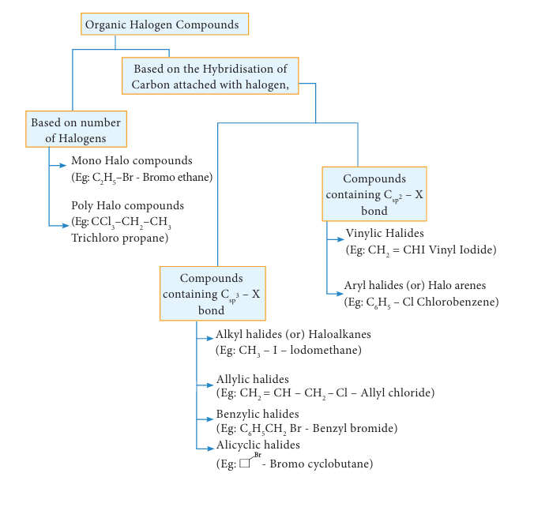
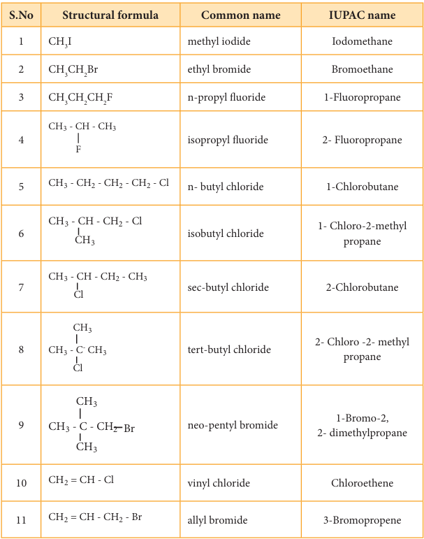
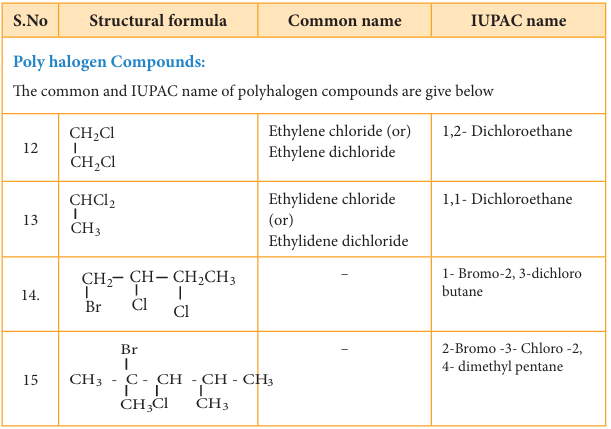

# 14. Haloalkanes and Haloarenes

## 14.1 INTRODUCTION

In the previous unit we learnt about the chemistry of hydrocarbons. In this unit us learn about organic compounds containing halogens. When one or more hydrogen atoms of aliphatic or aromatic hydrocarbons are replaced by the corresponding number of halogens like fluorine, chlorine, bromine or iodine, the resultant compounds are called either haloalkanes or halo arenes. They serve as starting materials for many organic synthesis.

Halogen substituted organic compounds are widely spread in nature and find application in our day to day life as well as in industry. Certain compounds like chloramphenicol produced by soil microbes are used in the treatment of typhoid; chloroquine is used in the treatment of malaria, halothane is used as an anesthetic, and halogenated solvents like trichloroethylene are used for cleaning electronic equipments.

## 14.2 Classification of organic halogen compounds

## 14.3 Haloalkanes

Mono halogen derivatives of alkanes are called haloalkanes. Haloalkanes are represented by general formula \( \mathrm{R - X} \), Where, R is an alkyl group \( \mathrm{(C_{n}H_{2n + 1})} \) and X is a halogen atom \( \mathrm{(X = F, Cl, Br} \) or I). Haloalkanes are further classified into primary, secondary, tertiary haloalkane on the basis of type of carbon atom to which the halogen is attached.

### Primary haloalkane

### Examples:



### Secondary haloalkane



### Tertiary haloalkane



#### 14.3.1 Nomenclature

### Common system

In the common system, haloalkanes are named as alkyl halides. It is derived by naming the alkyl group followed by the halide.

### IUPAC system

Let us write the IUPAC name for the below mentioned haloalkanes by applying the general rules of nomenclature that are already discussed in Unit no : 11

1) Write the IUPAC name of the following

### Evaluate Yourself

2) Write the structure of the following compounds

i) 1-Bromo-4-ethyl cyclohexane
ii) 1,4-Dichlorobut-2-ene
iii) 2-Chloro-3-methyl pentane

#### 14.3.2 Nature of C - X bond in haloalkane

Carbon halogen bond is a polar bond as halogens are more electro negative than carbon. The carbon atom exhibits a partial positive charge \( (\delta^{+}) \) and halogen atom a partial negative charge \( (\delta^{-}) \)



The C - X bond is formed by overlap of \( \mathrm{sp}^3 \) orbital of carbon atom with half filled p-orbital of the halogen atom. The atomic size of halogen increases from fluorine to iodine, which increases the C - X bond length. Larger the size, greater is the bond length, and weaker is the bond formed. The bond strength of C - X decreases from C - F to C - I in \( \mathrm{CH}_3\mathrm{X} \). The changes in the value of bond length, bond enthalpy and bond polarity, as we move from C - F to C - I, is given in the table.

**Table showing carbon - halogen bond length, bond enthalpy and polarity of bond.**

| Bond | Bond length (pm) | Bond enthalpy (kJ/mol) | Polarity of bond in nonpolar (degree) | Dipole moment (Debye) |
|---|---|---|---|---|
| \( \mathrm{CH_3-F} \) | 139 | 452 | 1.847 |
| \( \mathrm{CH_3-Cl} \) | 178 | 351 | 1.860 |
| \( \mathrm{CH_3-Br} \) | 193 | 293 | 1.830 |
| \( \mathrm{CH_3-I} \) | 214 | 234 | 1.636 |

#### 14.3.3 Methods of preparation

Haloalkanes are prepared by the following methods

### 1) From alcohols

Alcohols can be converted into halo alkanes by reacting it with any one of the following reagent 1. hydrogen halide 2. Phosphorous halides 3. Thionyl chloride

#### a) Reaction with hydrogen halide



Mixture of con.HCl and anhydrous \( \mathrm{ZnCl}_2 \) is called Lucas reagent.



The order of reactivity of halo acids with alcohol is in the order \( \mathrm{HI} > \mathrm{HBr} > \mathrm{HCl} \). The order of reactivity of alcohols with halo acid is tertiary \( > \) secondary \( > \) primary.

#### b) Reaction with phosphorous halides

Alcohols react with \( \mathrm{PX}_5 \) or \( \mathrm{PX}_3 \) to form haloalkane. \( \mathrm{PBr}_3 \) and \( \mathrm{PI}_3 \) are usually generated in situ (produced in the reaction mixture) by the reaction of red phosphorus with bromine and iodine, respectively.

### Example



#### c) Reaction with thionyl chloride (Sulphonyl chloride)

### Example



This reaction is known as Darzen's halogenation

### 2) From alkenes

Alkenes react with halogen acids (HCl, HBr, HI) to give haloalkane. The mode of addition follows Markovnikov's rule.

### 3) From alkanes

Alkanes react with halogens \( \mathrm{Cl}_{2} \) or \( \mathrm{Br}_{2} \) in the presence of ultra violet light to form haloalkane. This reaction is a free radical substitution reaction and gives a mixture of mono, di or poly substituted haloalkane.

### Example

Chlorination of methane gives different products which have differences in the boiling points. Hence, these can be separated by fractional distillation.



### 4) Halogen exchange reactions

#### a) Finkelstein reaction

Chloro or bromoalkane on heating with a concentrated solution of sodium iodide in dry acetone gives iodo alkanes. This reaction is called Finkelstein reaction, \( \mathrm{(S_{N}2} \) reaction).



#### b) Swarts reaction

Chloro or bromo alkanes on heating with metallic fluorides like AgF, \( \mathrm{SbF}_{3} \) or \( \mathrm{Hg}_{2}\mathrm{F}_{2} \) gives fluoro alkanes. This reactions is called Swarts reaction.

### Example



### 5) From silver salts of fatty acids (Hunsdicker reaction)

Silver salts of fatty acids when refluxed with bromine in \( \mathrm{CCl}_{4} \) gives bromo alkane



#### 14.3.4 Physical Properties

1. Pure haloalkanes are colourless. Bromo and iodo alkanes are coloured in the presence of light.

2. Haloalkanes having one, two or three carbon atoms are in the gaseous state at normal temperature. Haloalkanes having more than three carbon atoms are liquids or solids.

### 3. Boiling point and Melting point

i) Haloalkanes have higher boiling point and melting point than the parent alkanes having the same number of carbons because the intermolecular forces of attraction (dipole - dipole interaction and vander Waals forces) are stronger in haloalkane.

ii) The boiling point and melting point of haloalkanes decreases with respect to the halogen in the following order.

### Example

\[
\mathrm{CH_3I > CH_3Br > CH_3Cl > CH_3F}
\]

iii) The boiling points of chloro, bromo and iodo alkanes increase with the increase in the number of halogen atoms.

### For Example:



iv) The boiling point and melting point of mono haloalkane increase with the increase in the number of carbon atoms.

### Example



v) Among isomeric alkyl halides the boiling point decreases with the increase in branching in the alkyl group; with increase in branching, the molecule attains spherical shape with less surface area. As a result the inter molecular forces become weak, resulting in lower boiling points.

### Example



### 4. Solubility

Haloalkanes are polar covalent compounds soluble in organic solvents, but insoluble in water because they cannot form hydrogen bonds with water molecules

### 5. Density

The density of liquid alkyl halides are higher than these of hydrocarbons of comparable molecular weight.

### Evaluate Yourself

3) Write all possible chain isomers with molecular formula \( \mathrm{C_5H_{11}Cl} \)

#### 14.3.5 Chemical properties

Haloalkanes are one of the most reactive classes of organic compounds. Their reactivity is due to the presence of polar carbon - halogen bond in their molecules. The reactions of haloalkane may be divided into the following types

i) Nucleophilic substitution reactions
ii) Elimination reactions
iii) Reaction with metals
iv) Reduction

### 1) Nucleophilic substitution reactions

We know that the \( \mathrm{C^{\delta +} - X^{\delta -}} \) present in halo alkane is polar and hence the nucleophilic reagents are attracted by partially positively charged carbon atoms resulting in substitution reactions.

#### Reaction with aqueous alkali or moist silver oxide (Hydrolysis)

Haloalkane reacts with aqueous solution of KOH or moist silver oxide \( \mathrm{(Ag_2O / H_2O)} \) to form alcohols.

### Example



#### i) Reaction with alcoholic ammonia (Ammonolysis)

Haloalkanes react with alcoholic ammonia solution to form alkyl amines.

### Example



However, with excess of halo alkane, secondary and tertiary amines along with quaternary ammonium salts are obtained



### Ambient Nucleophiles

Nucleophiles such as cyanide and nitrite ion which can attack nucleophilic centre from two sides of the nucleophile are called ambient nucleophiles. These nucleophiles can attack with either of the two sides depending upon the reaction conditions and the reagent used.

#### ii) Reaction with alcoholic KCN

Haloalkanes react with alcoholic KCN solution to form alkyl cyanides

### Example



#### iii) Reaction with alcoholic AgCN

Haloalkanes react with alcoholic AgCN solution to form alkyl isocyanide.

### Example



#### iv) Reaction with sodium or potassium nitrite

Haloalkanes react with alcoholic solution of \( \mathrm{NaNO_2} \) or \( \mathrm{KNO_2} \) to form alkyl nitrites.

### Example



#### v) Reaction with silver nitrite

Haloalkanes react with alcoholic solution of \( \mathrm{AgNO_2} \) to form nitro alkanes.

### Example



#### vi) Reaction with sodium or potassium hydrogen sulphide

Haloalkanes react with sodium or potassium hydrogen sulphide to form thio alcohols.

### Example



#### vii) Williamson ether synthesis

Haloalkane, when boiled with sodium alkoxide gives corresponding ethers.

### Example

This method can be used to prepare mixed (unsymmetrical) ethers also.



### Mechanism of Nucleophilic substitution reaction

The mechanism of nucleophilic substitution reaction is classified as

a) Bimolecular Nucleophilic substitution reaction (SN2)

2 - Bromo octane is heated with sodium hydroxide \( (+) \) - 2 - Octanol is formed in which - OH group occupies a position opposite to what bromine had occupied,

b) Unimolecular Nucleophilic substitution reaction \( (\mathrm{SN}_1) \)

### \( \mathbf{S}_{\mathrm{N}}2 \) Mechanism



The rate of \( \mathrm{S}_{\mathrm{N}}2 \) reaction depends upon the concentration of both alkyl halide and the nucleophile.

\[
\text{Rate of reaction} = \mathrm{k}_2 [\text{alkyl halide}][\text{nucleophile}]
\]

It follows second order kinetics and occurs in one step.

This reaction involves the formation of a transition state in which both the reactant molecules are partially bonded to each other. The attack of nucleophile occurs from the back side (i.e opposite to the side in which the halogen is attacked). The carbon at which substitution occurs has inverted configuration during the course of reaction just as an umbrella has tendency to invert in a wind storm. This inversion of configuration is called Walden inversion; after paul walden who first discovered the inversion of configuration of a compound in \( \mathrm{S}_{\mathrm{N}}2 \) reaction.

\( \mathrm{S}_{\mathrm{N}}2 \) reaction of an optically active haloalkane is always accompanied by inversion of configuration at the asymmetric centre. Let us consider the following example

When 2 - Bromooctane is heated with sodium hydroxide, 2 - octanol is formed with inversion of configuration.
– 2 – Bromo octane is heated with sodium hydroxide (+) – 2 – Octanol is formed in which – OH group occupies a position
opposite to what bromine had occupied,



a) \( (-) \) 2 - Bromo octane
(b) Transition State
c) \( (+) \) 2 - Octanol (product)

### \( \mathbf{S}_{\mathrm{N}}1 \) Mechanism

\( \mathrm{S}_{\mathrm{N}}1 \) stands for unimolecular nucleophilic substitution

'S' stands for substitution
'N' stands for nucleophilic
'1' stands for unimolecular (one molecule is involved in the rate determining step)

The rate of the following \( \mathrm{S}_{\mathrm{N}}1 \) reaction depends upon the concentration of alkyl halide (RX) and is independent of the concentration of the nucleophile \( (\mathrm{OH}^{-}) \)

Hence Rate of the reaction \( = \mathrm{k} \) [alkyl halide]

\[
\mathrm{R - Cl + OH^{-} \longrightarrow R - OH + Cl^{-}}
\]

This \( \mathrm{S}_{\mathrm{N}}1 \) reaction follows first order kinetics and occurs in two steps.

We understand \( \mathrm{S}_{\mathrm{N}}1 \) reaction mechanism by taking a reaction between tertiary butyl bromide with aqueous KOH.



This reaction takes place in two steps as shown below

### Step-1 Formation of carbocation

The polar C-Br bond breaks forming a carbocation and bromide ion. This step is slow and hence it is the rate determining step.



The carbocation has 2 equivalent lobes of the vacant 2p orbital, so it can react equally rapidly from either face

### Step-2

The nucleophile immediately reacts with the carbocation. This step is fast and hence does not affect the rate of the reactions.



As shown above, the nucleophilic reagent \( \mathrm{OH}^{-} \) can attack carbocation from both the sides.

In the above example the substrate tert-butyl bromide is not optically active, hence the obtained product is optically inactive. If halo alkane substrate is optically active then, the product obtained will be optically inactive racemic mixture. As nucleophilic reagent \( \mathrm{OH}^{-} \) can attack carbocation from both the sides, to form equal proportion of dextro and levorotatory optically active isomers which results in optically inactive racemic mixture.

### Example

Hydrolysis of optically active 2-bromo butane gives racemic mixture of \( \pm \) butan-2-ol

The order of reactivity of haloalkanes towards \( \mathrm{S}_{\mathrm{N}}1 \) and \( \mathrm{S}_{\mathrm{N}}2 \) reaction is given below.

### 2) Elimination reactions

When a haloalkane containing a hydrogen on \( \beta \) carbon is treated with an ethanolic solution of potassium hydroxide, an alkene is formed. In this reaction a double bond between a and \( \beta \) carbon is formed by releasing a halogen attached to a \( \alpha \) carbon and a hydrogen to a \( \beta \) carbon of halo alkane. This reaction is called \( \beta \) elimination reaction (dehydrohalogenation).



Some haloalkanes yield a mixture of olefins in different amounts. It is explained by Saytzeff's Rule, which states that In a dehydrohalogenation reaction, the preferred product is that alkene which has more number of alkyl groups attached to the doubly bonded carbon (more substituted double bond is formed)

### Example



Elimination reactions may proceed through two different mechanisms namely \( \mathrm{E}_{1} \) and \( \mathrm{E}_{2} \)

### \( \mathbf{E}_{2} \) reaction mechanism

The rate of \( \mathrm{E}_{2} \) reaction depends on the concentration of alkyl halide and base

\[
\text{Rate} = \mathrm{k}[\text{alkyl halide}][\text{base}]
\]

It is therefore, a second order reaction. Generally primary alkyl halide undergoes this reaction in the presence of alcoholic KOH. It is a one step process in which the abstraction of the proton from the \( \beta \) carbon and expulsion of halide from the \( \alpha \) carbon occur simultaneously. The mechanism is shown below.



 \( \mathrm{E}_{1} \) reaction mechanism

Generally, tertiary alkyl halide which undergoes elimination reaction by this mechanism in the presence of alcoholic KOH. It follows first order kinetics. Let us consider the following elimination reaction.



### Step - 1 Heterolytic fission to yield a carbocation



### Step - 2 Elimination of a proton from the \( \beta \)-carbon to produce an alkene



### 3) Reaction with metals

Halohalkane reacts with metals, to form a compound containing carbon - metal bond known as organometallic compounds.

#### a) Grignard reaction

When a solution of halo alkane in ether is treated with magnesium, we get alkyl magnesium halide known as Grignard reagent.

### Example



(Ethyl bromide) (Ethyl magnesium bromide)

#### b) Reaction with active metals like sodium, lead etc

Halohalkane reacts with active metals like sodium, lead etc in the presence of dry ether to form organo metallic compounds.



### 4) Reduction reactions

Halohalkanes are reduced to alkanes by treating with \( \mathrm{H}_{2} \) in the presence of metal catalyst like nickel, palladium etc or with hydroiodic acid in the presence of red phosphorous.



#### 14.3.6 Uses of halohalkane

### Chloroform:

1. is used as a solvent in pharmaceutical industry
2. is used for producing pesticides and drugs
3. is used as an anaesthetic.
4. used as a preservative for anatomical specimens.

### Iodoform:

1. is used as an antiseptic for dressing wounds.

### Carbon tetrachloride:

1. is used as dry cleaning agent
2. is used as a solvent for oils, fats and waxes
3. As the vapour of \( \mathrm{CCl_4} \) is non-combustible, it is used under the name pyrene for extinguishing the fire in oil or petrol.

## 14.4 Organo metallic Compounds

Organo metallic compounds are organic compounds in which there is a direct carbon - metal bond. For Example

\( \mathbf{CH}_3\mathbf{MgI} \) - Methyl magnesium iodide
\( \mathbf{CH}_3\mathbf{CH}_2\mathbf{MgBr} \) - Ethyl magnesium bromide

The Carbon - Magnesium bond in Grignard reagent is covalent but highly polar. The carbon atom is more electro negative than magnesium. Hence, the carbon atom has partial negative charge and the magnesium atom has partial positive charge

\[
\mathrm{R \longrightarrow Mg \longrightarrow X}
\]

#### 14.4.1. Preparation

When a solution of alkyl halide in ether is allowed to stand over pieces of magnesium metal, the metal gradually dissolves and alkyl magnesium halide (Grignard reagent) is formed. All the reagents used should be pure and dry

### Example



### Evaluate Yourself

5) Why Grignard reagent should be prepared in anhydrous condition?

#### 14.4.2. Uses of Grignard reagent

Grignard reagents are synthetically very useful compounds. These reagents are converted to various organic compounds like alcohols, carboxylic acids, aldehydes and ketones. The alkyl group being electron rich acts as a carbanion or a nucleophile. They would attack polarized molecules at a point of low electron density. The following reactions illustrate the synthetic uses of Grignard reagent.

### (1) Preparation of primary alcohol

Formaldehyde reacts with Grignard reagent to give addition products which on hydrolysis yields primary alcohol.



### 2) Preparation of secondary alcohol

Aldehydes other than formaldehyde, react with Grignard reagent to give addition product which on hydrolysis yields secondary alcohol.



### 3) Preparation of Tertiary alcohol

Ketone reacts with Grignard reagent to give an addition product which on hydrolysis yields tertiary alcohols.

### Example



### (4) Preparation of aldehyde

Ethyl formate reacts with Grignard reagent to form aldehyde. However, with excess of Grignard reagent it forms secondary alcohol.

### Example



### (5) Preparation of ketone

Acid chloride reacts with Grignard reagent to form ketones. However, with excess of Grignard reagent it forms tertiary alcohol.

### Example



### (6) Preparation of carboxylic acids

Solid carbon dioxide reacts with Grignard reagent to form addition product which on hydrolysis yields carboxylic acids.

### For Example



### 7) Preparation of esters

Ethylchloroformate reacts with Grignard reagent to form esters.

### Example



### 8) Preparation of higher ethers

Lower halogenated ether reacts with Grignard reagent to form higher ethers.

### Example



### 9) Preparation of alkyl cyanide

Grignard reagent reacts with cyanogen chloride to form alkyl cyanide

### Example



### 10) Preparation of Alkanes

Compounds like water, alcohols and amines which contain active hydrogen atom react with Grignard reagents to form alkanes.

### Example



#### 14.5 Haloarenes

Haloarenes are the compounds in which the halogen is directly attached to the benzene ring.



#### 14.5.1. Nomenclature of haloarenes

In the IUPAC nomenclature, the halo arenes are named by adding prefix halo before the name of the aromatic hydrocarbon. For naming disubstituted arenes, the relative position of the substituent 1,2; 1,3 and 1,4 are indicated by the prefixes ortho, meta and para, respectively.

For poly haloarenes the numbering should be done in such a way that the lowest possible number should be given to the substituents and the name of the halogens are arranged in alphabetic order.

Nomenclature can be well understood from the following examples.



#### 14.5.2 Nature of C-X bond in haloarenes

In halo arenes the carbon atom is sp\(^2\) hybridised. The sp\(^2\) hybridised orbitals are shorter and holds the electron pair of bond more tightly.

Halogen atom contains p-orbital with lone pair of electrons which interacts with \( \pi \)-orbitals of benzene ring to form extended conjugated system of \( \pi \)-orbitals. The delocalisation of these electrons give double bond character to C - X bond. The resonance structure of halobenzene is given as



Due to this double bond character of C-X bond in haloarenes, the C-X bond is short and strong.

### Example



### 14.5.3 Methods of preparation of haloarenes

#### 1) Direct halogenation

Chlorobenzene is prepared by the direct chlorination of benzene in the presence of lewis acid catalyst like \( \mathrm{FeCl}_3 \)



#### 2) From benzene diazonium chloride

Chloro benzene is prepared by Sandmeyer reaction or Gattermann reaction using benzene diazonium chloride.

##### (i) Sandmeyer reaction

When aqueous solution of benzene diazonium chloride is warmed with \( \mathrm{Cu}_2\mathrm{Cl}_2 \) in HCl gives chloro benzene



#### 3) Preparation of iodobenzene

Iodobenzene is prepared by warming benzene diazonium chloride with aqueous KI solution.



#### 4) Preparation of fluorobenzene

Fluoro benzene is prepared by treating benzenediazonium chloride with fluoro boric acid. This reaction produces diazonium fluoroborate which on heating produces fluorobenzene. This reaction is called Balz-Schiemann reaction.



#### 5) Commercial preparation of chloro benzene (Raschig process)

Chloro benzene is commercially prepared by passing a mixture of benzene vapour, air and HCl over heated cupric chloride. This reaction is called Raschig process.



### 14.5.4 Physical properties

#### 1. Melting and boiling points

The boiling points of monohalo benzene which are all liquids follow the order

Iodo \( > \) Bromo \( > \) Chloro

The boiling points of isomeric dihalobenzene are nearly the same

The melting point of para isomer is generally higher than the melting points of ortho and meta isomers. The higher melting point of p-isomer is due to its symmetry which leads to more close packing of its molecules in the crystal lattice and consequently strong intermolecular attractive force which requires more energy for melting

p-Dihalo benzene \( > \) o-Dichloro benzene \( > \) m-Dichloro benzene

#### 2. Solubility

Haloarenes are insoluble in water because they cannot form hydrogen bonds with water, but are soluble in organic solvents

#### 3. Density

Halo arenes are all heavier than water and their densities follow the order.

Iodo benzene \( > \) Bromo benzene \( > \) Chloro benzene

### 14.5.5 Chemical properties

#### A. Reactions involving halogen atom

##### 1. Aromatic nucleophilic substitution reaction

Halo arenes do not undergo nucleophilic substitution reaction readily. This is due to C-X bond in aryl halide is short and strong and also the aromatic ring is a centre of high electron density.

The halogen of haloarenes can be substituted by \( \mathrm{OH}^{-} \), \( \mathrm{NH}_{2}^{-} \) or CN\(^{-} \) with appropriate nucleophilic reagents at high temperature and pressure.

### For Example



This reaction is known as Dow's Process



##### 2. Reaction with metals

#### a) Wurtz Fittig reaction

Halo arenes reacts with halo alkanes when heated with sodium in ether solution to form alkyl benzene. This reaction is called Wurtz Fittig reaction.



#### b) Fittig reaction

Haloarenes react with sodium metal in dry ether, two aryl groups combine to give biaryl products. This reaction is called Fittig reaction



#### B) Reaction involving aromatic ring

##### 3. Electrophilic substitution reaction

Haloarenes undergo aromatic electrophilic substitution reactions. The rate of electrophilic substitution of halobenzene is lower than that of benzene. halogen is deactivating due to -I effect of halogen. The lone pair of electrons on the chlorine involves in resonance with the ring. It increases the electron density at ortho and para position (refer figure no 14.1). The halogen attached to the benzene ring withdraw electron and thereby and hence the halogen which is attached to the benzene directs the incoming electrophile either to ortho or to para position in electrophilic substitution reaction



##### 4) Reduction

Haloarenes on reduction with NiAl alloy in the presence of NaOH gives corresponding arenes.



##### 5) Formation of Grignard reagent

Haloarenes reacts with magnesium to form Grignard reagent in tetra hydrofuran (THF).



#### 14.5.6 Uses of Chloro benzene

i) Chloro benzene is used in the manufacture of pesticides like DDT
ii) It is used as high boiling solvent in organic synthesis.
iii) It is used as fibre - swelling agent in textile processing.

### Evaluate Yourself

6) Haloalkanes undergo nucleophilic substitution reaction whereas haloarenes undergo electrophilic substitution reaction. comment.

## 14.6 Poly halogen compounds

Carbon compounds containing more than one halogen atoms are called poly halogen compounds. Some of the important poly halogen compounds are described below.

They are classified as

#### a) gem-dihalides



#### b) vic-dihalides

### For Example



#### 14.6.1 Preparation

#### a) gem-dihalides

Ethylidene dichloride (1,1-Dichloro ethane) is prepared by

(i) Treating acetaldehyde with \( \mathrm{PCl}_5 \)



(ii) Adding hydrogen chloride to acetylene



#### b) vic-dihalides

Ethylene dichloride (1,2-Dichloro ethane) is prepared by the following methods.

i) Addition of chlorine to ethylene



ii) Action of \( \mathrm{PCl}_5 \) (or HCl) on ethylene glycol



### Properties

#### Physical Properties

i) They are sweet smelling, colourless liquids having relatively high boiling points.

### Chemical Properties

#### 1) Hydrolysis with aqueous NaOH or KOH

Gem-Dihalides, on hydrolysis with aqueous KOH give an aldehyde or a ketone vic-Dihalides, on hydrolysis with aqueous KOH gives glycols.



This reaction can be used to distinguish the gem-Dihalides and vic-Dihalides.

#### 2) Reaction with Zinc (Dehalogenation)

Gem-Dihalides and vic-Dihalides on treatment with zinc dust in methanol give alkenes.



#### 3) Reaction with Alcoholic KOH (Dehydrohalogenation)

gem-Dihalides and vic-Dihalides on treatment with alcoholic KOH give alkynes.



### Methylene chloride (Di chloromethane)

#### Preparation

Methylene chloride is prepared by the following methods

1) Reduction of chloroform

a) Reduction of chloroform in the presence of \( \mathrm{Zn + HCl} \) gives methylene chloride.



b) Reduction of chloroform using \( \mathrm{H_2 / Ni} \)



2) Chlorination of methane

Chlorination of methane gives methylene chloride



### Uses of methylene chloride

Methylene chloride is used as

1) aerosol spray propellant
2) solvent in paint remover
3) process solvent in the manufacture of drugs
4) a metal cleaning solvent

#### 14.6.2 Trihaloalkane

Trihaloalkanes are compounds obtained by replacing three hydrogen atoms of a hydrocarbon by three halogen atoms.

### Example

\( \mathrm{CHCl_3} \) \( \mathrm{CHI_3} \)
Chloroform Iodoform

#### 1) Chloroform

Chloroform is an important trihaloalkane. Dumas named \( \mathrm{CHCl}_3 \) as chloroform as it gives formic acid on hydrolysis.

### Preparation:

Chloroform is prepared in the laboratory by the reaction between ethyl alcohol with bleaching powder followed by the distillation of the product chloroform. Bleaching powder act as a source of chlorine and calcium hydroxide. This reaction is called haloform reaction. The reaction proceeds in three steps as shown below.

### Step-1: Oxidation

\[
\mathrm{CH}_3\mathrm{CH}_2\mathrm{OH} + \mathrm{Cl}_2 \rightarrow \mathrm{CH}_3\mathrm{CHO} + 2\mathrm{HCl}
\]
(Ethyl alcohol) (Acetaldehyde)

### Step-2: Chlorination

\[
\mathrm{CH}_3\mathrm{CHO} + 3\mathrm{Cl}_2 \rightarrow \mathrm{CCl}_3\mathrm{CHO} + 3\mathrm{HCl}
\]
(Acetaldehyde) (Trichloro acetaldehyde)

### Step-3: Hydrolysis

\[
2\mathrm{CCl}_3\mathrm{CHO} + \mathrm{Ca(OH)}_2 \rightarrow 2\mathrm{CHCl}_3 + (\mathrm{HCOO})_2\mathrm{Ca}
\]
(Chloral) (Chloroform) (Calcium formate)

### Physical properties

(i) Chloroform is a colourless liquid with peculiar sickly smell and a burning taste

(ii) The vapours of chloroform when inhaled it causes unconsciousness (depress the central nervous system) and hence it is used as an anaesthetic.

### Chemical properties

#### 1) Oxidation

Chloroform undergoes oxidation in the presence of light and air to form phosgene (carbonyl chloride)



Since phosgene is very poisonous, its presence makes chloroform unfit for use as anaesthetic.

#### 2) Reduction

Chloroform undergoes reduction with zinc and HCl in the presence of ethyl alcohol to form methylene chloride.



#### 3) Nitration

Chloroform reacts with nitric acid to form chloropicrin (Trichloro nitro methane)



It used as an insecticide and soil sterilising agent.

#### 4) Carbylamine reaction

Chloroform reacts with aliphatic or aromatic primary amine and alcoholic caustic potash, to give foul smelling alkyl isocyanide (carbylamines)



This reaction is used to test primary amine.

### Evaluate Yourself

7) Chloroform is kept with a little ethyl alcohol in a dark coloured bottle why?

#### 14.6.3 Tetra haloalkane

Carbon tetrachloride is a good example for tetra haloalkane

### Carbon tetrachloride

### Preparation

#### 1. Chlorination of methane

The reaction of methane with excess of chlorine in the presence of sunlight will give carbon tetrachloride as the major product.

\[
\mathrm{CH}_4 + 4\mathrm{Cl}_2 \xrightarrow{hv} \mathrm{CCl}_4 + 4\mathrm{HCl}
\]
(Methane) (Carbon tetrachloride)

#### 2. Action of carbon disulphide with chlorine gas

Carbon disulphide reacts with chlorine gas in the presence of anhydrous \( \mathrm{AlCl}_3 \) as catalyst giving carbon tetrachloride



### Physical properties

(i) Carbon tetrachloride is a colourless liquid with its specific smell

(ii) It is insoluble in water and soluble in organic solvents

### Chemical properties

#### (i) Hydrolysis

Carbon tetrachloride reacts with hot water or with hot water vapour producing the poisonous gas, phosgene.



#### (ii) Reduction

Carbon tetrachloride is reduced by iron powder in dilute HCl medium to form chloroform



#### 14.6.4 Freons (CFC)

The chloro fluoro derivatives of methane and ethane are called freons.

### Nomenclature

Freon is represented as Freon - cba

Where \( c = \) number of carbon atoms - 1
\( b = \) number of hydrogen atoms + 1
\( a = \) total number of fluorine atoms

### Example



Freon-12 is prepared by the action of hydrogen fluoride on carbon tetrachloride in the presence of catalytic amount of antimony pentachloride. This is called Swarts reaction.



### Physical properties

Freons are highly stable, unreactive, non corrosive, non toxic, easily liquefiable gases.

### Uses:

(i) Freons are used as refrigerants in refrigerators and air conditioners.
(ii) It is used as a propellant for aerosols and foams
(iii) It is used as propellant for foams to spray out deodorants, shaving creams, and insecticides.

#### 14.6.5 DDT (p,p'-dichloro diphenyl trichloro ethane)

DDT, the first chlorinated organic pesticide was prepared in 1873, and in 1939 Paul Muller discovered the effectiveness of DDT as an insecticide. He was awarded Noble prize in medicine and physiology in 1948 for this discovery.

DDT can be prepared by heating a mixture of chlorobenzene with chloral (Trichloro acetaldehyde) in the presence of \( \mathrm{Conc.H_2SO_4} \)



### Evaluate Yourself

8) What is the IUPAC name of the insecticide DDT? Why is their use banned in most of the countries?

### Uses:

i) DDT is used to control certain insects which carries diseases like malaria and yellow fever
ii) It is used in farms to control some agricultural pests
iii) It is used in building construction as pest control
iv) It is used to kill various insects like housefly and mosquitoes due to its high and specific toxicity.

## SUMMARY

The compounds obtained by the substitution of hydrogen atom of alkanes by halogen atom are called haloalkane, while the compounds obtained by the substitution of hydrogen atoms of arenes by halogen atom are called haloarenes.

Modern classification of halo compounds is based on the halogen with carbon possessing \( \mathrm{sp}^3 \) hybridisation. In these compounds the electronegativity of halogen is more than that of carbon, hence \( \mathrm{C^{\delta +} - X^{\delta -}} \) bond becomes polar.

### Haloalkane

Haloalkanes are prepared from alkanes, alkenes or alcohols. The boiling points of haloalkane are higher than that of corresponding hydrocarbons.

Haloalkane undergoes nucleophilic substitution and elimination reactions. Primary alkyl halides undergo \( \mathrm{S}_{\mathrm{N}}2 \) mechanism. If the reactant is chiral, the product formed exhibits inversion of stereo chemical configuration. Tertiary alkyl halide undergoes \( \mathrm{S}_{\mathrm{N}}1 \) mechanism, via carbonium ion formation. If the reactant is chiral, the product formed is optically inactive due to racemisation.

### Organo metallic compound

Haloalkane reacts with metal to form organometallic compounds like Grignard reagent. It is represented as \( \mathrm{R^{\delta -} - Mg^{\delta +}X} \). Grignard reagent reacts with variety of substances to give almost all class of organic compounds like alcohols, aldehydes, ketones, acids etc.

### Haloarenes

Haloarenes are prepared from arenes or by decomposition of benzene diazonium chloride. Haloarenes are more stable than haloalkane. C - X bond in halo arenes is short and strong.

Under normal conditions halo arenes do not undergo nucleophilic substitution but takes part in electrophilic substitution. Electron withdrawing inductive effect of halogen atom deactivates the benzene ring whereas resonating structure control o, p directing nature of halo arenes.

### Poly halogen compounds

Organic compounds having two or more halogen atoms are called poly halogen compounds. These compounds are useful in our day to day life but pose environmental threat.

Chloroform is used as an anesthetic, but because of its toxic nature it has been replaced by less toxic and safer anaesthetic like ethers.

Iodoform is used as an antiseptic, due to the liberation of free iodine. But it has been replaced by other formulation containing iodine, due to its obnoxious smell.

Carbon tetrachloride is used in fire extinguishers. Freons are used as refrigerant. But both these compounds lead to adverse environmental effect.

DDT is used an effective insecticide. Now a days it is banned because of its long term toxic effect.

## Evaluation

### I. Choose the best answer.

1. The IUPAC name of \( \mathrm{CH_3CH=CHCH_2Cl} \) is
   a) 2-Bromo pent-3-ene
   b) 4-Bromo pent-2-ene
   c) 2-Bromo pent-4-ene
   d) 4-Bromo pent-1-ene

2. Of the following compounds, which has the highest boiling point?
   a) n-Butyl chloride
   b) Isobutyl chloride
   c) t-Butyl chloride
   d) n-propyl chloride

3. Arrange the following compounds in increasing order of their density
   A) \( \mathrm{CCl_4} \) B) \( \mathrm{CHCl_3} \) C) \( \mathrm{CH_2Cl_2} \) D) \( \mathrm{CH_3Cl} \)
   a) \( \mathrm{D < C < B < A} \)
   b) \( \mathrm{C > B > A > D} \)
   c) \( \mathrm{A < B < C < D} \)
   d) \( \mathrm{C > A > B > D} \)

4. With respect to the position of -Cl in the compound \( \mathrm{CH_3 - CH = CH - CH_2 - Cl} \) it is classified as
   a) Vinyl
   b) Allyl
   c) Secondary
   d) Aralyl

5. What should be the correct IUPAC name of diethyl chloromethane?
   a) 3-Chloro pentane
   b) 1-Chloropentane
   c) 1-Chloro-1,1,diethyl methane
   d) 1-Chloro-1-ethyl propane

6. C-X bond is strongest in
   a) Chloromethane
   b) Iodomethane
   c) Bromomethane
   d) Fluoromethane

7. In the reaction X is



8. Which of the following compounds will give racemic mixture on nucleophilic substitution by OH\(^{-}\) ion?



9. The treatment of ethyl formate with excess of RMgX gives



10. Benzene reacts with \( \mathrm{Cl}_2 \) in the presence of \( \mathrm{FeCl}_3 \) and in absence of sunlight to form
    a) Chlorobenzene
    b) Benzyl chloride
    c) Benzal chloride
    d) Benzene hexachloride

11. The name of \( \mathrm{C}_2\mathrm{F}_4\mathrm{Cl}_2 \) is
    a) Freon-112
    b) Freon-113
    c) Freon-114
    d) Freon-115

12. Which of the following reagent is helpful to differentiate ethylene dichloride and ethylidene chloride?
    a) Zn / methanol
    b) KOH / ethanol
    c) aqueous KOH
    d) \( \mathrm{ZnCl}_2 \) / Con HCl

13. Match the compounds given in Column I with suitable items given in Column II



14. Assertion: In mono haloarenes, electrophilic substitution occurs at ortho and para positions.
    Reason: Halogen atom is a ring deactivator
    (i) If both assertion and reason are true and reason is the correct explanation of assertion.
    (ii) If both assertion and reason are true but reason is not the correct explanation of assertion.
    (iii) If assertion is true but reason is false.
    (iv) If both assertion and reason are false.

15. Consider the reaction,
    \[
    \mathrm{CH_3CH_2CH_2Br + NaCN \rightarrow CH_3CH_2CH_2CN + NaBr}
    \]
    This reaction will be the fastest in
    a) ethanol
    b) methanol
    c) DMF (N,N'-dimethyl formaldehyde)
    d) water

16. Freon-12 is manufactured from tetrachloro methane by
    a) Wurtz reaction
    b) Swarts reaction
    c) Haloform reaction
    d) Gattermann reaction

17. The most easily hydrolysed molecule under \( \mathrm{SN}^{1} \) condition is
    a) allyl chloride
    b) ethyl chloride
    c) isopropyl chloride
    d) benzyl chloride

18. The carbocation formed in \( \mathrm{SN}^{1} \) reaction of alkyl halide in the slow step is
    a) \( \mathrm{sp}^{3} \) hybridised
    b) \( \mathrm{sp}^{2} \) hybridised
    c) sp hybridised
    d) none of these

19. The major products obtained when chlorobenzene is nitrated with \( \mathrm{HNO}_{3} \) and con \( \mathrm{H}_{2}\mathrm{SO}_{4} \)
    a) 1-chloro-4-nitrobenzene
    b) 1-chloro-2-nitrobenzene
    c) 1-chloro-3-nitrobenzene
    d) 1-chloro-1-nitrobenzene

20. Which one of the following is most reactive towards nucleophilic substitution reaction?



21. Ethylidene chloride on treatment with aqueous KOH gives
    a) acetaldehyde
    b) ethylene glycol
    c) formaldehyde
    d) glyoxal

22. The raw material for Raschig process
    a) chloro benzene
    b) phenol
    c) benzene
    d) anisole

23. Chloroform reacts with nitric acid to produce
    a) nitro toluene
    b) nitro glycerine
    c) chloropicrin
    d) chloropicric acid

24. Acetone \( \xrightarrow{\mathrm{CH_3MgI}} \) X, X is \( \xrightarrow{\mathrm{ii) H_2O/H^+}} \)
    a) 2-propanol
    b) 2-methyl-2-propanol
    c) 1-propanol
    d) acetonol

25. Silver propionate when refluxed with Bromine in carbon tetrachloride gives
    a) propionic acid
    b) chloro ethane
    c) bromo ethane
    d) chloro propane

26. Classify the following compounds in the form of alkyl, allylic, vinyl, benzylic halides


### II. Write brief answer to the following questions.

27. Why chlorination of methane is not possible in dark?

28. How will you prepare n propyl iodide from n-propyl bromide?

29. Which alkyl halide from the following pair is i) chiral ii) undergoes faster \( \mathrm{S}_{\mathrm{N}}2 \) reaction?



30. How does chlorobenzene react with sodium in the presence of ether? What is the name of the reaction?

31. Give reasons for polarity of C-X bond in halo alkane.

32. Why is it necessary to avoid even traces of moisture during the use of Grignard reagent?

33. What happens when acetyl chloride is treated with excess of \( \mathrm{CH}_3\mathrm{MgI} \)?

34. Arrange the following alkyl halide in increasing order of bond enthalpy of RX
    \[
    \mathrm{CH}_3\mathrm{Br}, \mathrm{CH}_3\mathrm{F}, \mathrm{CH}_3\mathrm{Cl}, \mathrm{CH}_3\mathrm{I}
    \]

35. What happens when chloroform reacts with oxygen in the presence of sunlight?

36. Write down the possible isomers of \( \mathrm{C_5H_{11}Br} \) and give their IUPAC and common names.

37. Mention any three methods of preparation of haloalkanes from alcohols.

38. Compare \( \mathrm{S}_{\mathrm{N}}1 \) and \( \mathrm{S}_{\mathrm{N}}2 \) reaction mechanisms.

39. Reagents and the conditions used in the reactions are given below. Complete the table by writing down the product and the name of the reaction.



40. Discuss the aromatic nucleophilic substitutions reaction of chlorobenzene.

41. Account for the following
    (i) t-butyl chloride reacts with aqueous KOH by \( \mathrm{S}_{\mathrm{N}}1 \) mechanism while n-butyl chloride reacts with \( \mathrm{S}_{\mathrm{N}}2 \) mechanism.
    (ii) p-dichloro benzene has higher melting point than those of o- and m-dichloro benzene.

42. In an experiment ethyl iodide in ether is allowed to stand over magnesium pieces. Magnesium dissolves and product is formed
    a) Name the product and write the equation for the reaction.
    b) Why all the reagents used in the reaction should be dry? Explain
    c) How is acetone prepared from the product obtained in the experiment.

43. Write a chemical reaction useful to prepare the following:
    i) Freon-12 from Carbon tetrachloride
    ii) Carbon tetrachloride from carbon disulphide

44. What are Freons? Discuss their uses and environmental effects

45. Predict the products when bromoethane is treated with the following
    i) \( \mathrm{KNO}_2 \)
    ii) \( \mathrm{AgNO}_2 \)

46. Explain the mechanism of \( \mathrm{S}_{\mathrm{N}}1 \) reaction by highlighting the stereochemistry behind it

47. Write short notes on the following
    i) Raschig process
    ii) Dow's Process
    iii) Darzens process

48. Starting from \( \mathrm{CH}_3\mathrm{MgI} \), How will you prepare the following?
    i) Acetic acid
    ii) Acetone
    iii) Ethyl acetate
    iv) Iso propyl alcohol
    v) Methyl cyanide

49. Complete the following reactions



50. Explain the preparation of the following compounds
    i) DDT
    ii) Chloroform

51. An organic compound (A) with molecular formula \( \mathrm{C_2H_5Cl} \) reacts with KOH gives compounds (B) and with alcoholic KOH gives compound (C). Identify (A), (B), and (C)

52. Simplest alkene (A) reacts with HCl to form compound (B). Compound (B) reacts with ammonia to form compound (C) of molecular formula \( \mathrm{C_2H_7N} \). Compound (C) undergoes carbylamine test. Identify (A), (B), and (C).

53. A hydrocarbon \( \mathrm{C_3H_6} \) (A) reacts with HBr to form compound (B). Compound (B) reacts with aqueous potassium hydroxide to give (C) of molecular formula \( \mathrm{C_3H_8O} \). What are (A), (B) and (C). Explain the reactions.

54. Two isomers (A) and (B) have the same molecular formula \( \mathrm{C_2H_4Cl_2} \). Compound (A) reacts with aqueous KOH gives compound (C) of molecular formula \( \mathrm{C_2H_4O} \). Compound (B) reacts with aqueous KOH gives compound (D) of molecular formula \( \mathrm{C_2H_6O_2} \). Identify (A), (B), (C) and (D).

## Flow Chart

Haloalkane