# 13. Hydrocarbons

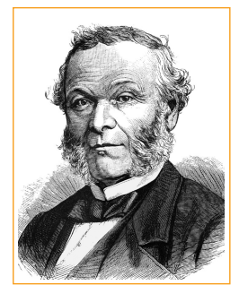

**CHARLES ADOLPHE WURTZ**

He is a French organic Chemist. He discovered phosphoryl chlorides. He showed that alkyl halides react with sodium to produce higher alkanes. This reaction was later named as Wurtz reaction. He is also known for his discoveries of ethylamine glycol and aldol condensation reactions.

## Introduction

he hydrocarbons are compounds composed entirely of Carbon and Hydrogen. They
occur widely in nature. The crude oil consists of complex mixtures of hydrocarbons, mangoes
contain cyclohexane, a cyclic hydrocarbon, cockroaches secretes a hydrocarbon, undecane
which attract opposite gender of its species. Hydrocarbons are primarily used as fuel. For
example, Liquefied mixture of propane and butane is used as Liquefied petrolium gas (LPG).
They also finds many applications in industries such as solvents etc. In this unit we will study
the classification, preparation, properties and uses of aliphatic and aromatic hydrocarbons. 

## 13.1 Introduction and classification of alkanes

Depending upon the characteristic pattern of bonding between the carbon atoms, hydrocarbons are divided into two main classes: aliphatic and aromatic. The word aliphatic was derived from the Greek word 'aleiphar' meaning fat. Important sources of aliphatic hydrocarbons are oils and fats. The word aroma means odour, which is obtained by chemical treatment of pleasant-smelling plant extracts.

Aliphatic hydrocarbons include three major groups: alkanes, alkenes and alkynes. Alkanes are saturated hydrocarbons in which all the bonds between the carbon atoms are single bond, alkenes consist of at least one carbon-carbon double bond, and alkynes have at least one carbon-carbon triple bond. Hydrocarbons having localised carbon-carbon multiple bonds are called unsaturated hydrocarbons.

Aromatic hydrocarbons are cyclic compounds which contain characteristic benzene ring or its derivatives. The classification of hydrocarbons is as shown below.

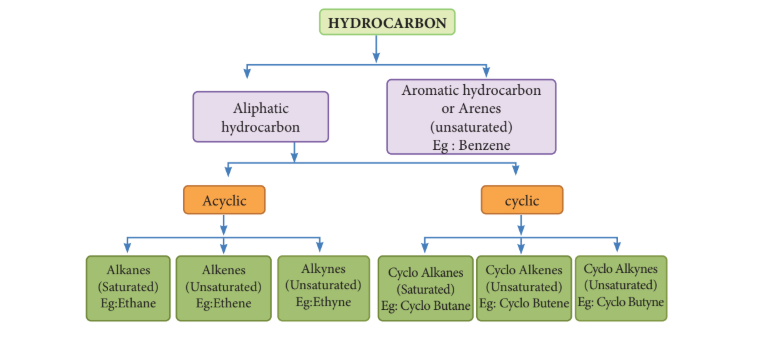
**Fig.13.1. Classification of Hydrocarbons**

## 13.2 Alkanes

Alkanes are saturated hydrocarbons represented by the general formula \( \mathrm{C_{n}H_{2n + 2}} \) where 'n' is the number of carbon atoms in the molecule. Methane \( \mathrm{CH_4} \) is the first member of alkane family. The successive members are ethane \( \mathrm{C_2H_6} \), propane \( \mathrm{C_3H_8} \), butane \( \mathrm{C_4H_{10}} \), pentane \( \mathrm{C_5H_{12}} \) and so on. It is evident that each member differs from its proceeding or succeeding member by a \( \mathrm{-CH_2} \) group.
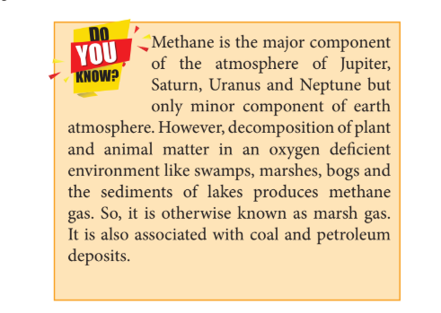

**Do You Know**

### "FLAMMABLE ICE"

This catchy phrase describes a frozen mixture of water and methane gas chemically known as methane clathrates. The methane molecule which is produced by biological process under the deep-ocean, (at \( 4^{\circ}\mathrm{C} \) & 50 atm) doesn't simply reach the surface, instead each molecule is trapped inside clusters of 6 to 18 water molecules forming methane clathrates. Many countries are working on how to tap out these vast resources of natural gas but mining and extracting are very difficult.

### Nomenclature and isomerism

We have already discussed the nomenclature of organic compound in Unit:11. Let us understand the nomenclature and isomerism in few examples. The first three members methane \( \mathrm{CH_4} \), ethane \( \mathrm{C_2H_6} \) and propane \( \mathrm{C_3H_8} \) have only one structure.

| IUPAC Name | Molecular Formula | Condensed Structural formula |
|---|---|---|
| Methane | \( \mathrm{CH_4} \) | \( \mathrm{CH_4} \) |
| Ethane | \( \mathrm{C_2H_6} \) | \( \mathrm{CH_3-CH_3} \) |
| Propane | \( \mathrm{C_3H_8} \) | \( \mathrm{CH_3-CH_2-CH_3} \) |

However, higher members can have more than one structure leading to constitutional isomers (differ in connectivity) or structural isomers. For example, an alkane with molecular formula \( \mathrm{C_4H_{10}} \) can have two structures. They are n-butane and iso-butane. In n-butane, all the four carbon atoms are arranged in a continuous chain. The 'n' in n-butane stands for 'normal' and means that the carbon chain is unbranched. The second isomer iso-butane has a branched carbon chain. The word iso indicates it is an isomer of butane.

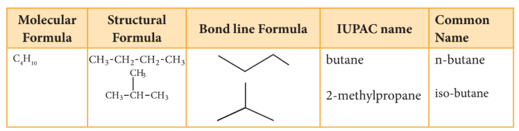

Though both the structures have same molecular formula but their carbon chains differ leading to chain isomerism.

Let us understand the chain isomerism by writing the isomers of pentane \( \mathrm{C_5H_{12}} \).

**Solution:**
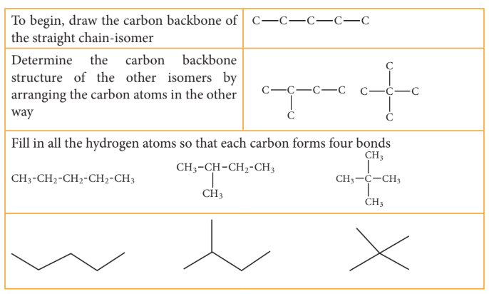

**Evaluate Yourself** 

1) Write the structural formula and carbon skeleton formula for all possible chain
isomers of C6
H14 (Hexane)

#### IUPAC name for some branched alkanes

Let us write the IUPAC name for the below mentioned alkanes by applying the general rules of nomenclature that we already discussed in unit No.11

| S.NO | COMPOUND | IUPAC NAME |
|---|---|---|
| 1 | \( \mathrm{CH_3-CH_2-CH_2-CH-CH_3} \) with \( \mathrm{CH_3} \) group | 2-Methyl pentane |
| 2 | \( \mathrm{CH_3-CH-CH_2-CH-CH_3} \) with \( \mathrm{CH_3} \) groups | 2,4-Dimethyl pentane |
| 3 | \( \mathrm{CH_3-CH_2-C-CH_2-CH_3} \) with \( \mathrm{CH_3} \) groups | 3,3-Dimethyl pentane |
| 4 | \( \mathrm{CH_3-CH-CH-CH_2-CH_3} \) with \( \mathrm{CH_3} \) and \( \mathrm{CH_2CH_3} \) | 3-Ethyl-2-methylpentane |
| 5 | \( \mathrm{CH_3-CH_2-CH-CH-CH-CH_2-CH_3} \) with substituents | 3-Ethyl-4,5-dipropyl octane |
| 6 | \( \mathrm{CH_3-CH-CH-CH_3} \) with \( \mathrm{CH_3} \) and \( \mathrm{CH_2CH_3} \) | 2,3-Dimethylpentane |
| 7 | \( \mathrm{CH_3-CH-CH_2-CH_2-CH-CH_2-CH-CH_3} \) with substituents | 4-Ethyl-2,7-Dimethyloctane |

### Evaluate Yourself

2) Give the IUPAC name for the following alkane.
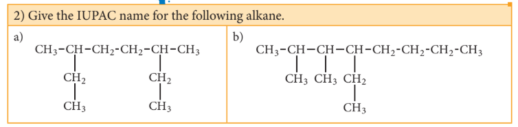

#### How to draw structural formula for given IUPAC name

After you learn the rules for naming alkanes, it is relatively easy to reverse the procedure and translate the name of an alkane into a structural formula. The example below shows how this is done.

Let us draw the structural formula for

a) 3-ethyl-2,3-dimethyl pentane

**Solution:**

Step: 1 The parent hydrocarbon is pentane. Draw the chain of five carbon atoms and number it.
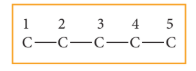
Step: 2 Complete the carbon skeleton by attaching the alkyl group as they are specified in the name. An ethyl group is attached to carbon 3 and two methyl groups are attached to carbon 2 and 3.
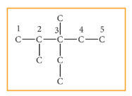
Step: 3 Add hydrogen atoms to the carbon skeleton so that each carbon atoms has four bonds.
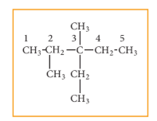
### Evaluate Yourself

3) Draw the structural formula for 4,5-diethyl-3,4,5-trimethyl octane.

#### 13.2.1 Preparation of alkanes

Alkanes are not laboratory curiosities but they are extremely important naturally occurring compounds. Natural gas and petroleum (crude oil) are the most important natural sources. However, it can be prepared by the following methods.

**1. Preparation of alkanes from catalytic reduction of unsaturated hydrocarbons.**

When a mixture of hydrogen gas with alkene or alkyne gas is passed over a catalyst such as platinum or palladium at room temperature, an alkane is produced. This process of addition of \( \mathrm{H_2} \) to unsaturated compounds is known as hydrogenation. The above process can be catalysed by nickel at 298K. This reaction is known as Sabatier-Senderens reaction.

For example:
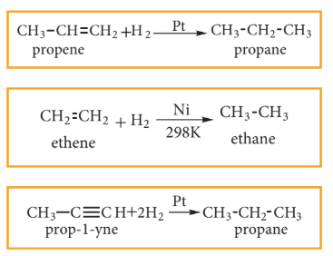

**2. Preparation of alkanes from carboxylic acids:**

**i) Decarboxylation of sodium salt of carboxylic acid**

When a mixture of sodium salt of carboxylic acid and soda lime (sodium hydroxide + calcium oxide) is heated, alkane is formed. The alkane formed has one carbon atom less than carboxylic acid. This process of eliminating carboxylic group is known as decarboxylation.

For example:

\[
\mathrm{CH_3COONa + NaOH \xrightarrow{CaO} CH_4 + Na_2CO_3} \quad \text{(Sodium acetate → Methane)}
\]

**ii) Kolbe's Electrolytic method**

When sodium or potassium salt of carboxylic acid is electrolyzed, a higher alkane is formed. The decarboxylative dimerization of two carboxylic acid occurs. This method is suitable for preparing symmetrical alkanes (R-R).
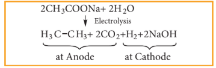

**3. Preparation of alkanes using alkyl halides (or) halo alkanes**

**i) By reduction with nascent hydrogen**

Except alkyl fluorides, other alkyl halides can be converted to alkanes by reduction with nascent hydrogen. The hydrogen for reduction may be obtained by using any of the following reducing agents: Zn+HCl, Zn+CH₃COOH, Zn-Cu couple in ethanol, LiAlH₄ etc.

For example:

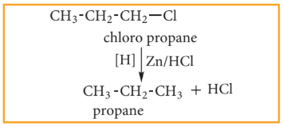

**ii) Wurtz reaction**

When a solution of halo alkanes in dry ether is treated with sodium metal, higher alkanes are produced. This reaction is used to prepare higher alkanes with even number of carbon atoms.

For example:

\[
\mathrm{CH_3-Br + 2Na + Br-CH_3 \xrightarrow{dry \ ether} CH_3-CH_3 + 2NaBr}
\]

**iii) Corey-House Mechanism**

An alkyl halide and lithium di alkyl copper are reacted to give higher alkane.

For example:

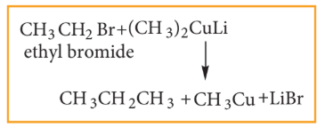

**4) Preparation of Alkanes from Grignard reagents**

Halo alkanes reacts with magnesium in the presence of dry ethers to give alkyl magnesium halide which is known as Grignard reagents. Here the alkyl group is directly attached to the magnesium metal making it to behave as carbanion. So, any compound with easily replaceable hydrogen reacts with Grignard reagent to give corresponding alkanes.

For example:

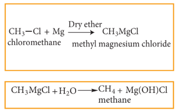

### Evaluate Yourself

4) Water destroys Grignard reagents why?

5) Is it possible to prepare methane by Kolbe's Electrolytic method?

#### 13.2.2 Physical Properties

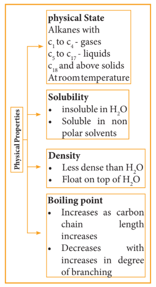

**1) Boiling Point and Physical state**

The boiling point of continuous chain alkanes increases with increase in length of carbon chain roughly about \( 30^{\circ}\mathrm{C} \) for every added carbon atom to the chain. Being non polar, alkanes have weak Van der Waals force which depends upon molecular surface area and hence increases with increase molecular size. We observe that with same number of carbon atoms, straight chain isomers have higher boiling point.

**2) Solubility and density**

Water molecules are polar and alkanes are non-polar. The insolubility of alkanes in water makes them good water repellent for metals which protects the metal surface from corrosion. Because of their lower density than water, they form two layers and occupy top layer. The density difference between alkanes and water explains why oil spills in aqueous environment spread so quickly.
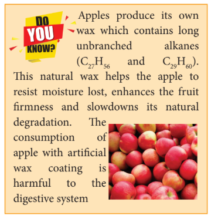

#### 13.2.3 Conformations of alkane

Each carbon in alkanes is \( \mathrm{sp}^3 \) hybridized and the four groups or atoms around the carbon are tetrahedrally bonded. In alkanes having two or more carbons, there exists free rotation about C-C single bond. Such rotation leaves all the groups or atoms bonded to each carbon into an infinite number of readily interconvertible three dimensional arrangements. Such readily interconvertible three dimensional arrangement of a molecule is called conformations.

**(i) Conformations of ethane:**

The two tetrahedral methyl groups can rotate about the carbon-carbon bond axis yielding several arrangements called conformers. The extreme conformations are staggered and eclipsed conformation. There can be number of other arrangements between staggered and eclipsed forms and their arrangements are known as skew forms.

**Eclipsed conformation:**

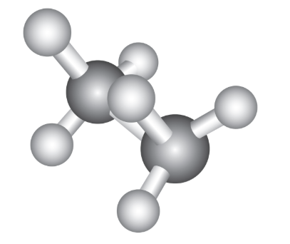
In this conformation, the hydrogens of one carbon are directly behind those of the other. The repulsion between the atoms is maximum and it is the least stable conformer.

**Staggered conformation:**
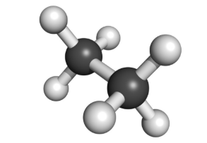
In this conformation, the hydrogens of both the carbon atoms are far apart from each other. The repulsion between the atoms is minimum and it is the most stable conformer.

**Skew Conformation:**

The infinite numbers of possible intermediate conformations between the two extreme conformations are referred as skew conformations.

The stabilities of various conformations of ethane are:

Staggered > Skew > Eclipsed

The potential energy difference between the staggered and eclipsed conformation of ethane is around 12.5 kJ/mol. The various conformations can be represented by Newman projection formula.
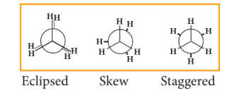
**Conformations of n-Butane:**

n-Butane may be considered as a derivative of ethane, as one hydrogen on each carbon is replaced by a methyl group.

**Eclipsed conformation:**

In this conformation, the distance between the two methyl groups is minimum. So there is maximum repulsion between them and it is the least stable conformer.

**Anti or staggered form**

In this conformation, the distance between the two methyl groups is maximum and so there is minimum repulsion between them. And it is the most stable conformer.

The following potential energy diagram shows the relative stabilities of various conformers of n-butane.
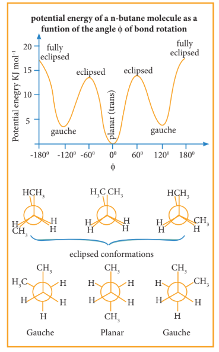
#### 13.2.4 Chemical properties

Alkanes are quite unreactive towards most reagents. However under favorable conditions, alkanes undergo the following type of reaction.

Paraffin is the older name for the alkane group family of compounds. This name comes from the Latin meaning 'little activity'.

**1) Combustion:**

A combustion reaction is a chemical reaction between a substance and oxygen with evolution of heat and light (usually as a flame). In the presence of sufficient oxygen, alkanes undergo combustion when ignited and produces carbon dioxide and water.

For example:

\[
\mathrm{CH_4 + 2O_2 \rightarrow CO_2 + 2H_2O} \quad \Delta H^\circ = -890.4 \ \mathrm{kJ}
\]

When alkanes burn in insufficient supply of oxygen, they form carbon monoxide and carbon black.

\[
2\mathrm{CH_4 + 3O_2 \xrightarrow{Ni} 2CO + 4H_2O}
\]

\[
\mathrm{CH_4 + O_2 \xrightarrow{Ni} C + 2H_2O}
\]

### Evaluate Yourself

6) Write down the combustion reaction of propane whose \( \Delta H^{\circ} = -2220 \ \mathrm{kJ} \).

**2) Halogenation:**

Halogenation reaction is the chemical reaction between an alkane and halogen in which one or more hydrogen atoms are substituted by the halogens.

Chlorination and Bromination are two widely used halogenation reactions. Fluorination is too quick and iodination is too slow. Methane reacts with chlorine in the presence of light or when heated as follows.

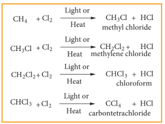

**Mechanism:**

The reaction proceeds through the free radical chain mechanism. This mechanism is characterized by three steps: initiation, propagation and termination.

**i) CHAIN INITIATION:** The chain is initiated by UV light leading to homolytic fission of chlorine molecules into free radicals (chlorine atoms).

Here we choose Cl-Cl bond for fission because C-C and C-H bonds are stronger than Cl-Cl.

**ii) PROPAGATION:** It proceeds as follows,

(a) Chlorine free radical attacks the methane molecule and breaks the C-H bond resulting in the generation of methyl free radical.

\[
\mathrm{CH_4 + Cl^\bullet \rightarrow CH_3^\bullet + HCl}
\]

(b) The methyl free radical thus obtained attacks the second molecule of chlorine to give chloromethane \( \mathrm{(CH_3Cl)} \) and a chlorine free radical as follows.

(c) This chlorine free radical then cycles back to step (a) and both step (a) and (b) are repeated many times and thus chain of reaction is set up.

**iii) Chain termination:**

After some time, the reaction stops due to consumption of reactant and the chain is terminated by the combination of free radicals.

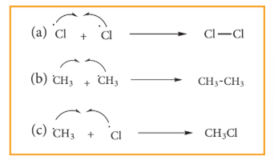

### Evaluate Yourself

7) Why is ethane produced in chlorination of methane?

**3) Aromatisation**

Alkanes with six to ten carbon atoms are converted into homologues of benzene at high temperature and in the presence of catalyst. This process is known as aromatization. It occurs by simultaneous cyclisation followed by dehydrogenation of alkanes.

n-Hexane passed over \( \mathrm{Cr_2O_3} \) supported on alumina at 873K gives benzene.

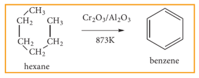

### Evaluate Yourself

8) How can toluene be prepared by this method?

**4) Reaction With Steam:**

Methane reacts with steam at 1273K in the presence of Nickel and decomposes to form carbon monoxide and hydrogen gas.

\[
\mathrm{CH_4 + H_2O \xrightarrow{Ni \ 1273K} CO + 3H_2}
\]

Production of \( \mathrm{H_2} \) gas from methane is known as steam reforming process and it is a well-established industrial process for the production of \( \mathrm{H_2} \) gas from hydrocarbons.

**5) Pyrolysis**

Pyrolysis is defined as the thermal decomposition of organic compound into smaller fragments in the absence of air through the application of heat. Pyro means 'fire' and 'lysis' means 'separating'. Pyrolysis of alkanes is also named as cracking.

In the absence of air, when alkane vapours are passed through red-hot metal it breaks down into simpler hydrocarbons.

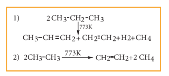

The products depends upon the nature of alkane, temperature, pressure and presence or absence of catalyst. The ease of cracking in alkanes increases with increase in molecular weight and branching in alkanes. Cracking plays an important role in petroleum industry.

**6) Isomerisation:**

Isomerisation is a chemical process by which a compound is transformed into any of its isomeric forms. Normal alkanes can be converted into branched alkanes in the presence of \( \mathrm{AlCl_3} \) and HCl at 298K.

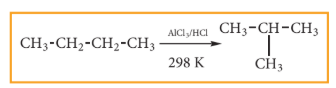

This process is of great industrial importance. The quality of gasoline is improved by isomerising its components.

#### Uses

The exothermic nature of alkane combustion reaction explains the extensive use of alkanes as fuels. Methane present in natural gas is used in home heating. Mixture of propane and butane are known as LPG gas which is used for domestic cooking purpose. GASOLINE is a complex mixture of many hydrocarbons used as a fuel for internal-combustion engines.

Carbon black is used in the manufacture of ink, printer ink and black pigments. It is also used as fillers.

| No of Carbon Atoms | State at room temperature | Major uses |
|---|---|---|
| 1-4 | Gas | Heating fuel, Cooking fuel |
| 5-7 | Low boiling liquid | Solvents, Gasoline |
| 6-12 | Liquid | Gasoline |
| 12-24 | Liquid | Jet fuel, portable stove fuel |
| 18-50 | High boiling liquid | Diesel fuel, lubricant, heating oil |
| 50+ | Solid | Petroleum jelly and paraffin wax |

## 13.3 Alkenes

Alkenes are unsaturated hydrocarbons that contain carbon-carbon double bond. They are represented by the general formula \( \mathrm{C_nH_{2n}} \) where 'n' stands for number of carbon atoms in the molecule. Alkenes are also known as olefins (in Latin - oil maker) because the first member ethene combines with chlorine gas to form an oily liquid as a product.

### (I) Nomenclature of Alkenes

Let us write the IUPAC name for the below mentioned alkenes by applying the general rules of nomenclature that we already discussed in unit No.11

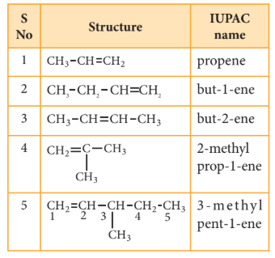

### Evaluate Yourself

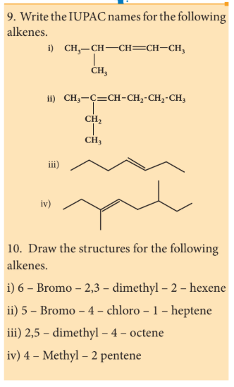

### (ii) Isomerism

Presence of double bond in Alkene provides the possibility of both structural and geometrical isomerism.

**Structural Isomerism:**

The first two members ethene \( \mathrm{C_2H_4} \) and propene \( \mathrm{C_3H_6} \) do not have isomers because the carbon atoms in the molecules can be arranged only one distinct way. However from the third member of alkene family butene \( \mathrm{C_4H_8} \), structural isomerism exists.

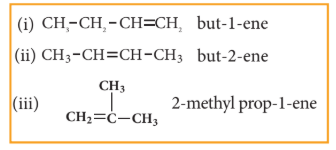

Structures (i) & (ii) are position isomers. Structures (i) & (iii), (ii) & (iii) are chain isomers.

### Evaluate Yourself

11) Draw the structure and write down the IUPAC name for the isomerism exhibited by the molecular formulae:

(i) \( \mathrm{C_5H_{10}} \) - Pentene (3 isomers)
(ii) \( \mathrm{C_6H_{12}} \) - Hexene (5 isomers)

**Geometrical isomerism:**

It is a type of stereoisomerism and it is also called cis-trans isomerism. Such type of isomerism results due to the restricted rotation of doubly bonded carbon atoms.

If the similar groups lie on the same side, then the geometrical isomers are called Cis-isomers. When the similar groups lie on the opposite side, it is called a Trans isomer.

For example: the geometrical isomers of 2-Butene is expressed as follows

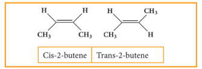
**Cis-2-Butene** and **Trans-2-Butene**

### Evaluate Yourself

12) Determine whether each of the following alkenes can exist in cis-trans isomers?

(a) 1-Chloro propene
(b) 2-Chloro propene

13) Draw cis-trans isomers for the following compounds

(a) 2-chloro-2-butene
(b) \( \mathrm{CH_3-CH=CH-CH_2-CH_3} \)

#### 13.3.1 General methods of preparation of alkenes

**(1) Preparation of alkene by dehydration of alcohol:**

When an alcohol is heated at 430-440 K with excess of concentrated sulphuric acid, a molecule of water from alcohol is removed and an alkene is formed. This reaction is called elimination reaction.

\[
\mathrm{C_2H_5OH \xrightarrow{Conc. \ H_2SO_4 \ 430-440K} CH_2=CH_2} \quad \text{(ethanol → ethene)}
\]

Ethene can also be prepared in laboratory by catalytic dehydration of alcohol.

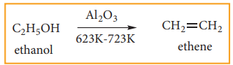

**(2) Preparation of alkenes from alkynes:**

Alkynes can be reduced to cis-alkenes using Lindlar's catalyst (\( \mathrm{CaCO_3} \) supported in palladium partially deactivated with sulphur or gasoline). This reaction is stereospecific giving only the cis-alkene.
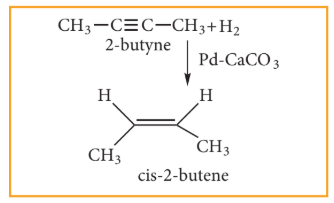
Alkynes can also be reduced to trans-alkenes using sodium in liquid ammonia. This reaction is stereospecific giving only the trans-alkene.
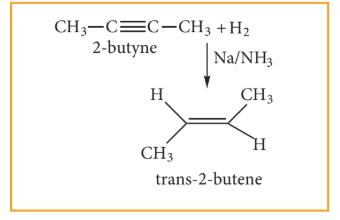
**(3) Preparation of alkenes by dehydrohalogenation of halo alkanes:**

Halo alkanes react with alcoholic KOH and eliminate hydrohalide resulting in the formation of alkene.
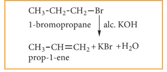
**(4) Preparation of alkenes from vicinal dihalogen derivative of alkanes or vicinal dihalides**

The compound in which two halogen atoms are attached to adjacent carbon atoms are called as vicinal dihalides. When vicinal dihalides are warmed with granulated zinc in methanol, they lose a molecule of \( \mathrm{ZnX_2} \) to form an alkene.
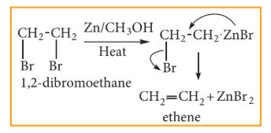
### Evaluate Yourself

14) How is propene prepared from 1,2-dichloro propane?

**(5) Preparation of ethene by Kolbe's electrolytic method:**

When an aqueous solution of potassium succinate is electrolyzed between two platinum electrodes, ethene is produced at the anode.
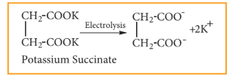
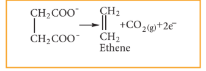

#### 13.3.2 Physical properties of alkenes

The first three members (Ethene, Propene and Butene) are gases, next fourteen members are liquids and the higher alkenes are waxy solids. They are all colourless and odourless except ethene which has a sweet smell.

1. The melting and boiling point of alkenes increases along the homologous series. Like alkanes, straight chain alkenes have high boiling point compared to its isomeric branched alkenes.
2. Alkenes are slightly soluble in water but readily soluble in organic solvents.

#### 13.3.3 Chemical properties of alkenes

Alkenes are more reactive than alkanes due to the presence of a double bond. The \( \sigma \) bond is strong but the \( \pi \) bond is weak. The typical reactions of alkenes involve addition of an electrophile across the double bonds proceeding through ionic mechanism. However addition reactions proceed through free-radical mechanism also. Ozonolysis and polymerization are some of the characteristic reactions of alkenes.

### (i) Addition Reactions

**(i) Addition of hydrogen: (Hydrogenation of alkenes)**

Hydrogen adds on to alkenes in the presence of a metal catalyst (Ni, Pd or Pt) to yield corresponding alkanes. This is known as catalytic hydrogenation. This process is of great importance in the manufacture of vanaspathi from vegetable oil. This helps to prevent rancidity of vegetable oils.

**(ii) Addition of halogens: (Halogenation of alkenes)**

When alkene is treated with halogens like chlorine or bromine, addition takes place rapidly and forms 1,2-dihalo alkane (or) vicinal dihalide.

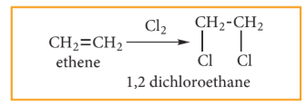

Iodine reacts very slowly to form 1,2-diiodo alkane which are unstable and regenerate the original alkene by elimination of iodine.

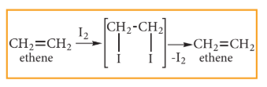

**TEST FOR ALKENE:**
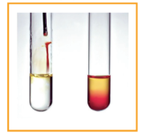
Bromine in water is reddish brown colour. When small amount of bromine water is added to an alkene, the solution is decolorised as it forms dibromo compound. So, this is the characteristic test for unsaturated compounds.

**Markownikoff's rule:**

"When an unsymmetrical alkene reacts with hydrogen halide, the hydrogen adds to the carbon that has more number of hydrogens and the halogen adds to the carbon having fewer hydrogens". This rule can also be stated as in the addition reaction of alkene/alkyne, the most electronegative part of the reagent adds to the least hydrogen attached doubly bonded carbon.

**(iii) Addition of water: (Hydration of alkenes)**

Normally, water does not react with alkenes. In the presence of concentrated sulphuric acid, alkene reacts with water to form alcohols. This reaction follows carbocation mechanism and Markownikoff's rule.
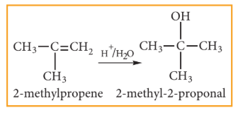

**(iv) Addition of hydrohalides: (Hydrohalogenation of Alkenes)**

Hydrogen halides (HCl, HBr and HI) add to alkene to yield alkyl halides. The order of reactivity of different hydrogen halides is \( \mathrm{HI > HBr > HCl} \). It is an example for electrophilic addition.

**(a) Addition of HBr to symmetrical alkenes:**

Addition of HBr to symmetrical alkene (similar groups are attached to double bond) yields alkyl halides (haloalkanes)
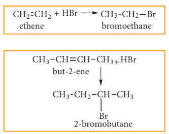

**(b) Addition of HBr to unsymmetrical alkene:**

In the addition of hydrogen halide to an unsymmetrical alkene, two products are obtained.

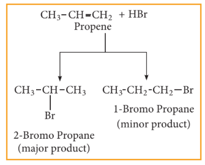
**Mechanism:**

Consider addition of HBr to propene

**Step 1: Formation of electrophile:**

In H-Br, Br is more electronegative than H. When bonded electron moves toward Br, polarity is developed and creates an electrophile \( \mathrm{H^+} \) which attacks the double bond to form carbocation, as shown below.
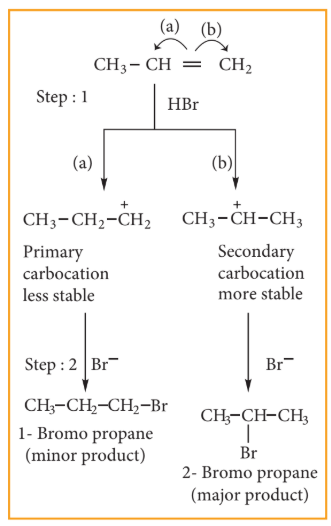
**Step 2:** Secondary carbocation is more stable than primary carbocation and it predominates over the primary carbocation.

**Step 3:** The \( \mathrm{Br^-} \) ion attacks the \( 2^\circ \) carbocation to form 2-Bromo propane, as the major product.

\[
\mathrm{CH_3-\overset{+}{C}H-CH_3 + Br^- \rightarrow CH_3-CHBr-CH_3}
\]

Consider addition of HBr to 3-methyl-1-butene. Here the expected product according to Markovnikov's rule is 2-bromo-3-methyl butane but the actual major product is 2-bromo-2-methyl butane. This is because the secondary carbocation formed during the reaction rearranges to a more stable tertiary carbocation. Attack of \( \mathrm{Br^-} \) on this tertiary carbocation gives the major product 2-bromo-2-methyl butane.
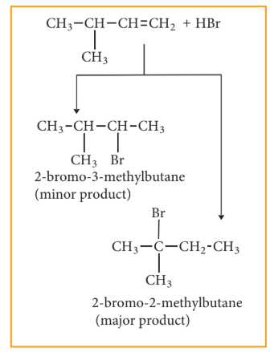

**Carbocation rearrangement**

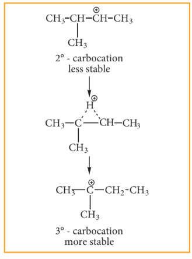

**Anti-Markovnikoff ’s Rule (Or) Peroxide Effect (Or) KharaschAddition**

The addition of HBr to an alkene in the presence of organic peroxide gives the anti Markovnikov's product. This effect is called peroxide effect.

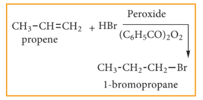
### Mechanism:

The reaction proceeds via free radical mechanism.

#### Step 1:

The weak O-O single bond linkages of peroxides undergo homolytic cleavage to generate free radical.

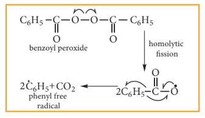

#### Step 2:

The radical abstracts a hydrogen from HBr thus generating bromine radical.

\[
\mathrm{C_6H_5CH=CHCH_3 + HBr \rightarrow C_6H_5CH_2CH_2CH_2Br}
\]

#### Step 3:

The bromine radical adds to the double bond in the way to form more stable allyl free radical.
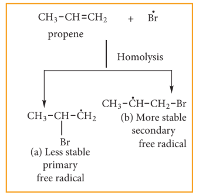
#### Step 4:
Addition of HBr to secondary free
radical
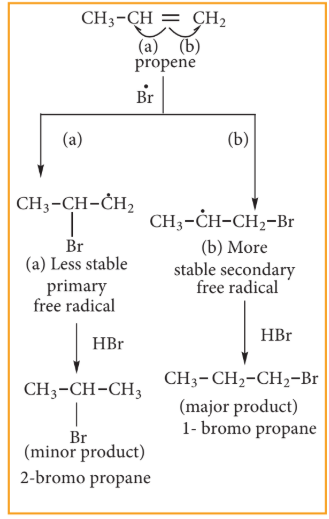
The H-Cl bond is stronger (430.5 kJ/mol) than H-Br bond (363.7 kJ/mol), thus H-Cl is not cleaved by the free radical. The H-I bond is weaker (296.8 kJ/mol) than H-Cl bond. Thus H-I bond breaks easily but iodine free radicals combine to form iodine molecules instead of adding to the double bond and hence peroxide effect is not observed in HCl and HI.

**Kharasch Addition**

Metal catalysed free radical addition of \( \mathrm{CXCl_3} \) compounds to alkene is called Kharasch addition reaction.

**(v) Addition of sulphuric acid to alkenes**

Alkenes react with cold and concentrated sulphuric acid to form alkyl hydrogen sulphate in accordance with Markovnikov's rule. Further hydrolysis yields alcohol.
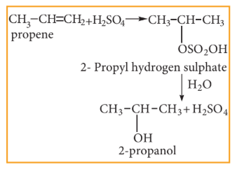
### (2) Oxidation

**(i) With cold dilute alkaline \( \mathrm{KMnO_4} \) solution (Baeyer's Reagent)**

Alkenes react with Baeyer's reagent to form vicinal diols. The purple solution \( (\mathrm{Mn^{7+}}) \) becomes dark green \( (\mathrm{Mn^{6+}}) \), and then produces a dark brown precipitate \( (\mathrm{Mn^{4+}}) \).

**(ii) With acidified \( \mathrm{KMnO_4} \) Solution:**

Alkenes react with acidified \( \mathrm{KMnO_4} \) solution and are oxidised to ketones or carboxylic acids depending on the substituent at the olefinic carbon atom. The purple solution becomes colourless. This is one of the tests for unsaturation.

**(iii) Ozonolysis:**

Ozonolysis is a method of oxidative cleavage of alkenes or alkynes using ozone and forms two carbonyl compounds. Alkenes react with ozone to form ozonide and it is cleaved by \( \mathrm{Zn/H_2O} \) to form smaller molecules. This reaction is often used to identify the structure of unknown alkene or alkyne by detecting the position of double or triple bond.

### Evaluate Yourself

15) How does ozone react with 2-methyl propene?

16) An organic compound (A) on ozonolysis gives only acetaldehyde. (A) reacts with \( \mathrm{Br_2/CCl_4} \) to give compound (B). Identify the compound (A) and (B). Write the IUPAC name of (A) and (B). Give the geometrical isomers of (A).

17) An organic compound (A) \( \mathrm{C_2H_4} \) decolourises bromine water. (A) on reaction with chlorine gives (B). A reacts with HBr to give (C). Identify (A), (B), (C). Explain the reactions.

### (iv) Polymerisation

A polymer is a large molecule formed by the combination of large number of small molecules. The process is known as polymerisation. Alkenes undergo polymerisation at high temperature and pressure, in the presence of a catalyst.

For example:

**Recycling plastics**

Extensive use of polymers clogs up landfills and pollutes the environment. Because of diversity of polymers in consumer products, recycling requires sorting the polymers into various sub-types, labels with codes and symbols, which are then recycled separately.

**Table shows the codes and symbols used in recycling of ethene-based addition polymers.**

 (Lower the number, greater the ease of recycling the material)

#### 13.3.4 Uses of Alkenes

1) Alkenes find many diverse applications in industry. They are used as starting materials in the synthesis of alcohols, plastics, liquors, detergents and fuels.

2) Ethene is the most important organic feedstock in the polymer industry. E.g. PVC, Sarans and polyethylene. These polymers are used in the manufacture of floor tiles, shoe soles, synthetic fibres, raincoats, pipes etc.

## 13.4 Alkynes

Alkynes are unsaturated hydrocarbons that contain carbon-carbon triple bonds in their molecules. Their general formula is \( \mathrm{C_nH_{2n-2}} \). The first member of alkyne series is Ethyne popularly known as acetylene. Oxyacetylene torch is used in welding.

### Nomenclature of alkynes

Let us write the IUPAC name for the below mentioned alkynes by applying the general rules of nomenclature that we already discussed in unit No.11

#### 13.4.1 General Methods Of Preparation Of Alkynes

**1. Preparation of alkynes from alkenes:**

This process involves two steps:

(i) Halogenation of alkenes to form vicinal dihalides
(ii) Dehalogenation of vicinal dihalides to form alkynes.

**2. Preparation of alkynes from gem dihalides:**

A compound containing two halogen atoms on the same carbon atom is called gem dihalide (Latin word 'Gemini' means twins). On heating with alcoholic KOH, gem dihalides give alkynes.

**3. Preparation of alkynes from electrolysis of salts of unsaturated dicarboxylic acids (Kolbe's electrolytic method)**

Electrolysis of sodium or potassium salt of maleic or fumaric acid yields alkynes.

**4. Industrial preparation of ethyne:**

Ethyne can be manufactured in large scale by action of calcium carbide with water.

Calcium carbide required for this reaction is prepared by heating quick lime and coke in an electric furnace at 3273 K.

\[
\mathrm{CaO + 3C \xrightarrow{3273K} CaC_2 + CO}
\]

### Evaluate Yourself

18) Prepare propyne from its corresponding alkene.

19) Write the products A & B for the following reaction.

#### 13.4.2 Physical properties of alkynes

1. The first three members are gases, next eight are liquids and the higher alkynes are solids. They are all colourless and odourless except acetylene which has a garlic odour.
2. They are slightly soluble in water but dissolve readily in organic solvents like benzene, acetone and ethyl alcohol.

#### 13.4.3 Chemical properties of alkynes

Terminal Alkynes are acidic in nature. They undergo polymerization and addition reaction.

**1. Acidic nature of alkynes:**

An alkyne shows acidic nature only if it contains terminal hydrogen. This can be explained by considering sp hybrid orbitals of carbon atom in alkynes. The percentage of s-character of sp hybrid orbital (50%) is more than \( \mathrm{sp}^2 \) hybrid orbital of alkene (33%) and \( \mathrm{sp}^3 \) hybrid orbital of alkane (25%). Because of this, carbon becomes more electronegative facilitating donation of \( \mathrm{H^+} \) ions to bases. So hydrogen attached to triply bonded carbon atoms is acidic.

**2. Addition reactions of alkynes**

**i) Addition of hydrogen**

**ii) Addition Of Halogens:**

When \( \mathrm{Br_2} \) in \( \mathrm{CCl_4} \) (reddish brown) is added to an alkyne, the bromine solution is decolourised. This is the test for unsaturation.

**iii) Addition Of Hydrogen Halides:**

Reaction of hydrogen halides to symmetrical alkynes is electrophilic addition reaction. This reaction also follows Markovnikov's rule.

Addition of HBr to unsymmetrical alkene follows Markownikoff ’s rule.

**iv) Addition of Water:**

Alkynes undergo hydration on warming with mercuric sulphate and dilute \( \mathrm{H_2SO_4} \) at 333K to form carbonyl compounds.

**3. Ozonolysis:**

Ozone adds to carbon-carbon triple bond of alkynes to form ozonides. The ozonides are hydrolyzed by water to form carbonyl compounds. The hydrogen peroxide \( \mathrm{(H_2O_2)} \) formed in the reaction may oxidise the carbonyl compound to carboxylic acid.

**4. Polymerisation:**

Alkyne undergoes two types of polymerisation reaction

**(i) Linear Polymerisation:**

Ethyne forms linear polymer, when passed into a solution of cuprous chloride and ammonium chloride.

**(ii) Cyclic Polymerisation:**

Ethyne undergoes cyclic polymerization on passing through red hot iron tube. Three molecules of ethyne polymerise to benzene.

#### 13.4.4 Uses of Alkynes

1) Acetylene is used in oxyacetylene torch used for welding and cutting metals.
2) It is used for manufacture of PVC, polyvinyl acetate, polyvinyl ether, orlon and neoprene rubbers.

## 13.5 Aromatic Hydrocarbons

Take a moment and think of substances that have a strong fragrance. What kind of things come to your mind? Perfume, Vanilla or cinnamon? They smell differently, they have something in common. These substances are made of aromatic compounds [Greek: Aroma - Pleasant smelling]. However, some compounds are chemically aromatic but do not have distinct smell. The aromatic hydrocarbons are classified depending upon number of rings present in it.

(i) Monocyclic aromatic hydrocarbon (MAH)

Examples: Benzene \( \mathrm{(C_6H_6)} \) and Toluene \( \mathrm{(C_7H_8)} \)

(ii) Polycyclic aromatic hydrocarbon (PAH)

Examples: Naphthalene \( \mathrm{(C_{10}H_8)} \) and Anthracene \( \mathrm{(C_{14}H_{10})} \)

### Evaluate Yourself

21) Calculate the number of rings present in \( \mathrm{C_{18}H_{12}} \).

#### 13.5.1 Nomenclature and Isomerism

We have already discussed about nomenclature of aromatic hydrocarbons in Unit:11. The first member of aromatic hydrocarbon is benzene \( \mathrm{(C_6H_6)} \) represented by a regular hexagon with a circle inscribed in it.

Since all the six hydrogen atoms in benzene are equivalent, it can give only one monosubstituted compound (e.g.) methyl benzene \( \mathrm{C_6H_5-CH_3} \) which is named as toluene.

When disubstitution occurs either by a similar monovalent atom or two different atoms or groups in benzene, then three different position isomers are possible. Their relative positions are indicated as ortho (1,2), meta (1,3) and para (1,4). For example, consider dimethyl benzene which is named as xylene.

### Evaluate Yourself

22) Write all possible isomers for an aromatic benzenoid compound having the molecular formula \( \mathrm{C_8H_{10}} \).

23) Write all possible isomers for a monosubstituted aromatic benzenoid compound having the molecular formula \( \mathrm{C_9H_{12}} \).

#### 13.5.2 Aromaticity

Hückel proposed that aromaticity is a function of electronic structure. A compound may be aromatic, if it obeys the following rules:

(i) The molecule must be co-planar
(ii) Complete delocalization of \( \pi \) electrons in the ring
(iii) Presence of \( (4n + 2) \pi \) electrons in the ring where n is an integer \( (n = 0, 1, 2 \ldots) \)

This is known as Hückel's rule.

| Compound | Aromaticity Check |
|---|---|
| 1. Benzene | (i) Benzene is a planar molecule (ii) It has six delocalised \( \pi \) electrons (iii) \( 4n + 2 = 6 \) \( 4n = 6 - 2 \) \( n = 1 \) It obeys Hückel's \( (4n+2) \pi \) electron rule with n = 1. Hence, benzene is aromatic. |
| 2. Cyclopentadienyl anion | (i) Cyclopentadienyl anion has a planar ring structure (ii) It has 6 delocalised electrons (iii) \( 4n + 2 = 6 \) \( n = 1 \) It obeys Hückel's \( (4n+2) \pi \) electron rule with n = 1. Hence, it is aromatic. |
| 3. Furan | (i) Furan has a planar ring structure (ii) It has 6 delocalised electrons (iii) \( 4n+2 = 6 \) \( n=1 \) It obeys Hückel's \( (4n+2) \pi \) electron rule with n = 1. Hence, it is aromatic. |
| 4. Cyclopentadiene | (i) It has planar structure (ii) It has four \( \pi \) electrons but the \( \pi \) electrons are not delocalised and hence it is not an aromatic compound |
| 5. Cyclooctatetraene | Molecule is non-planar and hence it is not an aromatic compound |
| 6. Cyclopropenyl cation | (i) Cyclopropenyl cation has planar structure (ii) It has 2 delocalised \( \pi \) electrons (iii) \( 4n + 2 = 2 \) \( 4n = 0 \) \( n = 0 \) (an integer) and hence it is an aromatic compound |

#### 13.5.3 Structure of benzene

**1. Molecular formula**

Elemental Analysis and molecular weight determination have proved that the molecular formula of benzene is \( \mathrm{C_6H_6} \). This indicates that benzene is a highly unsaturated compound.

**2. Straight chain structure not possible:**

Benzene could be constructed as a straight chain or ring compound but it is not feasible since it does not show the properties of alkenes or alkynes. For example, it did not decolourise bromine in carbon tetrachloride or acidified \( \mathrm{KMnO_4} \). It did not react with water in the presence of acid.

**3. Evidence of cyclic structure:**

**I) Substitution of benzene:**

Benzene reacts with bromine in the presence of \( \mathrm{AlCl_3} \) to form monobromo benzene.

Formation of only one monobromo compound indicates that all the six hydrogen atoms in benzene are identical. This is possible only if it has a cyclic structure of six carbons each containing one hydrogen.

**II) Addition of hydrogen:**

Benzene can add on to three moles of hydrogen in the presence of nickel catalyst to give cyclohexane.

This confirms cyclic structure of benzene and the presence of three carbon-carbon double bonds.

**4. Kekulé's structure of benzene:**

In 1865, August Kekulé suggested that benzene consists of a cyclic planar structure of six carbon atoms with alternate single and double bonds.

There were two objections:

(i) Benzene forms only one ortho disubstituted product whereas Kekulé's structure predicts two ortho disubstituted products as shown below.

(ii) Kekulé's structure failed to explain why benzene with three double bonds did not give addition reactions like other alkenes. To overcome this objection, Kekulé suggested that benzene was a mixture of two forms (1 and 2) which are in rapid equilibrium.

**5. Resonance description of benzene:**

The phenomenon in which two or more structures can be written for a substance which has identical position of atoms is called resonance. The actual structure of the molecule is said to be a resonance hybrid of various possible alternative structures. In benzene, Kekulé's structures I and II represent the resonance structures, and structure III is the resonance hybrid of structures I and II.

**The structures 1 and 2 exist only in theory. The actual structure of benzene is the hybrid of two hypothetical resonance structures.**

**6. Spectroscopic measurements:**

Spectroscopic measurements show that benzene is planar and all of its carbon-carbon bonds are of equal length \( 1.40 \ \mathrm{Å} \). This value lies between carbon-carbon single bond length \( 1.54 \ \mathrm{Å} \) and carbon-carbon double bond length \( 1.34 \ \mathrm{Å} \).

**7. Molecular orbital structure:**

The structure of benzene is best described in terms of the molecular orbital theory. All the six carbon atoms of benzene are \( \mathrm{sp}^2 \) hybridized. Six \( \mathrm{sp}^2 \) hybrid orbitals of carbon linearly overlap with six 1s orbitals of hydrogen atoms to form six C-H sigma bonds. Overlap between the remaining \( \mathrm{sp}^2 \) hybrid orbitals of carbon forms six C-C sigma bonds.

**Figure 13.6. Formation of Sigma bond in benzene**

All the \( \sigma \) bonds in benzene lie in one plane with bond angle \( 120^{\circ} \). Each carbon atom in benzene possesses an unhybridized p-orbital containing one electron. The lateral overlap of their p-orbitals produces \( 3\pi \)-bonds. The six electrons of the p-orbitals cover all the six carbon atoms and are said to be delocalised. Due to delocalization, a strong \( \pi \)-bond is formed which makes the molecule stable. Hence unlike alkenes and alkynes, benzene undergoes substitution reactions rather than addition reactions under normal conditions.

**Figure 13.7. All carbon atoms have p orbitals. The delocalized \( \pi \) MO is formed by the overlap of six p-orbitals.**

**8. Representation of benzene:**

Hence, there are three ways in which benzene can be represented.

#### Benzene and its homologous series

Benzene and its homologous series are colourless liquids with pleasant odour. They are lighter than water and insoluble in it. Their vapours are highly flammable, volatile and toxic in nature.

#### 13.5.4 Sources of aromatic compounds

Benzene and other aromatic compounds are obtained from coal tar and petroleum. They can also be prepared in laboratory using some simple aliphatic compounds.

**1. Preparation of benzene**

**(i) Industrial preparation of benzene from coal tar:**

Coal tar is a viscous liquid obtained by the pyrolysis of coal. During fractional distillation, coal tar is heated and distills away its volatile compounds namely benzene, toluene, xylene in the temperature range of 350 to 443 K. These vapours are collected at the upper part of the fractionating column.

**TABLE 13.5 COMPONENTS OF DISTILLATION OF COAL TAR**

| NAME OF THE FRACTION | TEMPERATURE RANGE | NAME OF THE COMPONENTS |
|---|---|---|
| 1. Crude light oil | 350 - 443 K | Benzene, Toluene, Xylenes |
| 2. Middle oil | 443 - 503 K | Phenol, Naphthalene |
| 3. Heavy oil | 503 - 543 K | Naphthalene, Cresol |
| 4. Green oil | 543 - 633 K | Anthracene |
| 5. Pitch | Above 633 K | Residue |

**(ii) From acetylene:**

Acetylene on passing through a red-hot tube trimerises to give benzene. We have already studied this concept in polymerization of alkynes.

**(iii) Laboratory Methods Of Preparing Benzene And Toluene**

**(a) Decarboxylation Of Aromatic Acid:**

When sodium benzoate is heated with soda lime, benzene vapours distil over.

\[
\mathrm{C_6H_5COONa + NaOH \xrightarrow{CaO \ \Delta} C_6H_6 + Na_2CO_3}
\]

**(b) Preparation Of Benzene From Phenol:**

When phenol vapours are passed over zinc dust, it is reduced to benzene.

\[
\mathrm{C_6H_5OH + Zn \xrightarrow{\Delta} C_6H_6 + ZnO}
\]

**(c) Wurtz-Fittig Reaction:**

When a solution of bromobenzene and iodomethane in dry ether is treated with metallic sodium, toluene is formed.

\[
\mathrm{C_6H_5Br + CH_3I + 2Na \xrightarrow{dry \ ether} C_6H_5CH_3 + NaBr + NaI}
\]

**(d) Friedel Craft's Reaction:**

When benzene is treated with methyl chloride in the presence of anhydrous aluminium chloride, toluene is formed.

\[
\mathrm{C_6H_6 + CH_3Cl \xrightarrow{anhydrous \ AlCl_3} C_6H_5CH_3 + HCl}
\]

### Evaluate Yourself

24) How can benzene be prepared by Grignard Reagent?

#### 13.5.5 Physical Properties

Benzene is a colourless liquid, insoluble in water but soluble in alcohol, ether and chloroform. It burns with luminous sooty flame in contrast to alkanes and alkenes which usually burn with bluish flame. Its vapours are highly toxic which on inhalation produce loss of consciousness.

#### 13.5.6 Chemical Properties

1. Benzene contains delocalized \( \pi \)-electrons which make the ring act as an electron rich centre. So electrophilic substitution reaction occurs in benzene.
2. Benzene ring is stabilized by delocalized \( \pi \) electrons. Though it is highly stable, it undergoes addition and oxidation reactions under specific conditions.

### 1. Electrophilic Substitution Reaction

**(a) Nitration:**

When benzene is heated at 330K with a nitrating mixture (conc. \( \mathrm{HNO_3} \) + conc. \( \mathrm{H_2SO_4} \)), nitrobenzene is formed by replacing one hydrogen atom by nitronium ion \( \mathrm{NO_2^+} \) (electrophile).

Concentrated \( \mathrm{H_2SO_4} \) is added to produce nitronium ion \( \mathrm{NO_2^+} \).

**(b) Halogenation:**

Benzene reacts with halogens (\( \mathrm{X_2 = Cl_2, Br_2} \)) in the presence of Lewis acids such as \( \mathrm{FeCl_3} \), \( \mathrm{FeBr_3} \) or \( \mathrm{AlCl_3} \) and gives corresponding halobenzene. In the absence of catalyst, fluorine reacts vigorously with benzene even in the absence of catalyst. However iodine is very inactive even in the presence of catalyst.

**(c) Sulphonation:**

Benzene reacts with fuming sulphuric acid (conc. \( \mathrm{H_2SO_4} + \mathrm{SO_3} \)) and gives benzene sulphonic acid. The electrophile \( \mathrm{SO_3} \) is a molecule. Although it does not have positive charge, it is a strong electrophile. This is because the octet of electrons around the sulphur atom is not reached. The reaction is reversible and desulphonation occurs readily in aqueous medium.

**(d) Friedel Craft's Alkylation: (Methylation)**

When benzene is treated with an alkyl halide in the presence of anhydrous \( \mathrm{AlCl_3} \), alkyl benzene is formed.

**(e) Friedel Craft's Acylation: (Acetylation)**

When benzene is treated with acetyl chloride in the presence of \( \mathrm{AlCl_3} \), acyl benzene (acetophenone) is formed.

**(f) Electrophilic Substitution Reactions: Mechanism**

Benzene undergoes electrophilic substitution reaction because it is an electron-rich system due to delocalised \( \pi \) electrons. So it is easily attacked by electrophiles and gives substituted products.

**Mechanism:**

**Step 1:** Formation of the electrophile

**Step 2:** The electrophile attacks the aromatic ring to form a carbocation intermediate which is stabilized by resonance.

**Step 3:** Loss of proton gives the substitution product.

### Evaluate Yourself

25) Why does benzene undergo electrophilic substitution reaction whereas alkenes undergo addition reaction?

### (ii) Addition Reaction

**(a) Hydrogenation of benzene:**

Benzene reacts with hydrogen in the presence of Platinum or Palladium to yield Cyclohexane. This is known as hydrogenation.

**(b) Chlorination of Benzene:**

Benzene reacts with three molecules of \( \mathrm{Cl_2} \) in the presence of sunlight or UV light to yield Benzene Hexachloride (BHC) \( \mathrm{C_6H_6Cl_6} \). This is known as gammaxane or Lindane which is a powerful insecticide.

### (iii) Oxidation

**(a) Vapour-phase oxidation:**

Although benzene is very stable to strong oxidizing agents, it quickly undergoes vapour phase oxidation by passing its vapour mixed with oxygen over \( \mathrm{V_2O_5} \) at 773K. The ring breaks to give maleic anhydride.

**(b) Birch reduction:**

Benzene can be reduced to 1,4-cyclohexadiene by treatment with Na or Li in a mixture of liquid ammonia and alcohol. It is a convenient method to prepare cyclic dienes.

### Evaluate Yourself

26) Convert Ethyne to Benzene and name the process.

#### 13.5.7 Directive influence of a functional group in monosubstituted benzene

When monosubstituted benzene undergoes an electrophilic substitution reaction, the rate of the reaction and the site of attack of the incoming electrophile depends on the functional group already attached to it. Some groups increase the reactivity of benzene ring and are known as activating groups, while others which decrease the reactivity are known as deactivating groups. We further divide these groups into two categories depending on the way they influence the orientation of attack by the incoming groups. Those which increase electron density at 'ortho' and 'para' positions are known as ortho-para directors while those which increase electron density at 'meta' position is known as meta-directors. Some examples of directive influence of functional groups in monosubstituted benzene are explained below.

**Ortho and para directing groups**

All the activating groups are 'ortho-para' directors. Examples: -OH, -\( \mathrm{NH_2} \), -NHR, -\( \mathrm{NHCOCH_3} \), -\( \mathrm{OCH_3} \), -\( \mathrm{CH_3} \), -\( \mathrm{C_2H_5} \) etc. Let us consider the directive influences of phenolic (-OH) group. Phenol is the resonance hybrid of following structures.

In these resonance structures, the negative charge resides on ortho and para positions of the ring structure. It is quite evident that the lone pair of electrons on the atom which is attached to the ring involves in resonance and makes the ring more electron rich than benzene. The electron density at ortho and para positions increases as compared to the meta position. Therefore phenolic group activates the benzene ring for electrophilic attack at 'ortho' and 'para' positions and hence -OH group is an ortho-para director and activator.

In aryl halides, the strong -I effect of the halogens (electron withdrawing tendency) decreases the electron density of benzene ring, thereby deactivating it for electrophilic attack. However the presence of lone pair on halogens involved in the resonance with pi electrons of benzene ring increases electron density at ortho and para positions. Hence the halogen group is an ortho-para director and deactivator.

**META DIRECTING GROUPS**

Generally all deactivating groups are meta-directors. For example -\( \mathrm{NO_2} \), -CN, -CHO, -COR, -COOH, -COOR, -\( \mathrm{SO_3H} \) etc. Let us consider the directive influence of aldehyde (-CHO) group. Benzaldehyde is the resonance hybrid of following structures.

In these resonance structures, the positive charge resides on the ring structure. It is quite evident that resonance delocalizes the positive charge on the atoms of the ring, making the ring less electron rich than benzene. Here overall density of benzene ring decreases due to -I effect of -CHO group thereby deactivating the benzene for electrophilic attack. However resonating structure shows that electron density is more at meta position compared to ortho and para positions. Hence -CHO group is a meta-director and deactivator.

### Evaluate Yourself

27) Toluene undergoes nitration more easily than benzene. Why?

#### 13.5.8 Carcinogenicity and toxicity

Benzene and polycyclic aromatic hydrocarbons (PAH) are ubiquitous environmental pollutants generated during incomplete combustion of coal, oil, petrol and wood. Some PAH originate from open burning, natural seepage of petroleum and coal deposits and volcanic activities. They are toxic, mutagenic and carcinogenic. They have hematological, immunological and neurological effects on humans. They are radiomimetic and prolonged exposure leads to genetic damage. Some of the examples of PAH are:

"L" shaped polynuclear hydrocarbons are much more toxic and carcinogenic.

Found in cigarette smoke. Found in tobacco and cigarette and charcoal boiled food.

Found in gasoline exhaust and barbecued food.

---
Flowchart and reaction summary of hydrocarbon

