# 3. Periodic Classification of Elements

"An awareness of the periodic table is essential to anyone who wishes to disentangle the world and see how it is built up from the fundamental building blocks of the chemistry, the chemical elements" **- Glenn T. Seaborg**

Glenn T. Seaborg 

Glenn Theodore Seaborg received Nobel Prize in 1951 in chemistry for the discoveries of trans-uranium elements. He was the co-discoverer of plutonium and other trans-uranium elements. He along with his colleagues has discovered over a hundred isotopes of other elements. He demonstrated that actinide elements are analogues to rare earth series of lanthanide elements.

## Introduction

There are millions of chemical compounds existing in nature with different compositions and properties, formed from less than 100 naturally occurring elements.

The discovery of elements is linked with human civilization. In stone age, man has used some metals to suit his needs without knowing that they are elements. Soon he learnt to extract elements from ores and fashion them into his daily life. Over the years, more and more elements were discovered. In 1789, Lavoisier from France, published the first list of chemical elements containing 23 elements after several experimental investigations.

Antoine Lavoisier classified the substances into four groups of elements namely acid-making elements, gas-like elements, metallic elements and earthy elements

**Table 3.1 Lavoisier table**

| Acid-making elements | Gas-like elements |
|---|---|
| sulphur | light |
| phosphorus | caloric (heat) |
| charcoal (carbon) | oxygen |
| azote (nitrogen) | hydrogen |

| Metallic elements | Earthy elements |
|---|---|
| cobalt, mercury, tin | lime (calcium oxide) |
| copper, nickel, iron | magnesia (magnesium oxide) |
| gold, lead, silver, zinc | barytes (barium sulphate) |
| manganese, tungsten | argilla (aluminium oxide) |
| platina (platinum) | silex (silicon dioxide) |

### 3.1 Classification of Elements

During the \( 19^{\mathrm{th}} \) century, scientists have isolated several elements and the list of known elements increased. Currently, we have 118 known elements. Out of 118 elements, 92 elements with atomic numbers 1 to 92 are found in nature. Scientists have found out there are some similarities in properties among certain elements. This observation has led to the idea of classification of elements based on their properties. In fact, classification will be beneficial for the effective utilization of these elements. Several attempts were made to classify the elements. However, classification based on the atomic weights led to the construction of a proper form of periodic table.

In 1817, J. W. Dobereiner classified some elements such as chlorine, bromine and iodine with similar chemical properties into the group of three elements called as triads. In triads, the atomic weight of the middle element nearly equal to the arithmetic mean of the atomic weights of the remaining two elements. However, only a limited number of elements can be grouped as triads.

**Table 3.2 Döbereiner Triads**

| S. No. | Elements in the Triad | Atomic weight of middle element | Average atomic weight of the remaining elements |
|---|---|---|---|
| 1 | Li, Na, K | 23 | \( \frac{7+39}{2} = 23 \) |
| 2 | Cl, Br, I | 80 | \( \frac{35.5+127}{2} = 81.25 \) |
| 3 | Ca, Sr, Ba | 88 | \( \frac{40+137}{2} = 88.5 \) |

This concept can not be extended to some triads which have nearly same atomic masses such as [Fe, Co, Ni], [Ru, Rh, Pd] and [Os, Ir, Pt].

In 1862, A. E. B. de Chancourtois reported a correlation between the properties of the elements and their atomic weights. He said 'the properties of bodies are the properties of numbers'. He intended the term numbers to mean the value of atomic weights. He designed a helix by tracing at an angle \( 45^{\circ} \) to the vertical axis of a cylinder with circumference of 16 units. He arranged the elements in the increasing atomic weights along the helix on the surface of this cylinder. One complete turn of a helix corresponds to an atomic weight increase of 16. Elements which lie on the 16 equidistant vertical lines drawn on the surface of cylinder shows similar properties. This was the first reasonable attempt towards the creation of periodic table. However, it did not attract much attention.

In 1864, J. Newland made an attempt to classify the elements and proposed the law of octaves. On arranging the elements in the increasing order of atomic weights, he observed that the properties of every eighth element are similar to the properties of the first element. This law holds good for lighter elements up to calcium.

**Table 3.3 Newlands' Octaves**

| 7 Li | 9 Be | 11 B | 12 C | 14 N | 16 O | 19 F | 23 Na | 24 Mg | 27 Al | 29 Si | 31 P | 32 S | 35.5 Cl | 39 K | 40 Ca |
|---|---|---|---|---|---|---|---|---|---|---|---|---|---|---|---|

#### 3.1.1 Mendeleev's Classification

In 1868, Lothar Meyer had developed a table of the elements that closely resembles the modern periodic table. He plotted the physical properties such as atomic volume, melting point and boiling point against atomic weight and observed a periodical pattern.

During same period Dmitri Mendeleev independently proposed that "the properties of the elements are the periodic functions of their atomic weights" and this is called periodic law. Mendeleev listed 70 elements, which were known till his time in several vertical columns in order of increasing atomic weights. Thus, Mendeleev constructed the first periodic table based on the periodic law.

**3.4 Mendeleev's periodic table**

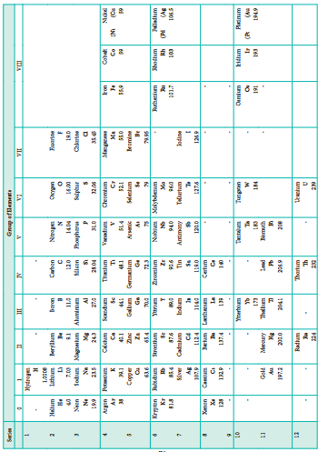

As shown in the periodic table, he left some blank spaces since there were no known elements with the appropriate properties at that time. He and others predicted the physical and chemical properties of the missing elements. Eventually these missing elements were discovered and found to have the predicted properties. For example, Gallium (Ga) of group III and germanium (Ge) of group IV were unknown at that time. But Mendeleev predicted their existence and properties. He referred the predicted elements as eka-aluminium and eka-silicon. After discovery of the actual elements, their properties were found to match closely to those predicted by Mendeleev (Table 3.4).

**Table 3.5 Properties predicted for Eka-aluminium and Eka-silicon**

| S.No. | Property | Eka-aluminium (Predicted) | Gallium (Observed) | Eka-silicon (Predicted) | Germanium (Observed) |
|---|---|---|---|---|---|
| 1. | Atomic weight | 68 | 70 | 72 | 72.59 |
| 2. | Density (g/cm³) | 5.9 | 5.94 | 5.5 | 5.36 |
| 3. | Melting point | low | 29.78°C | high | 947°C |
| 4. | Formula of oxide | \( E_2O_3 \) | \( Ga_2O_3 \) | \( EO_2 \) | \( GeO_2 \) |
| 5. | Formula of chloride | \( ECl_3 \) | \( GaCl_3 \) | \( ECl_4 \) | \( GeCl_4 \) |

#### 3.1.2 Anomalies of Mendeleev's Periodic Table

Some elements with similar properties were placed in different groups and those with dissimilar properties were placed in same group. Similarly elements with higher atomic weights were placed before lower atomic weights based on their properties in contradiction to his periodic law. Example \( ^{59}\mathrm{Co}_{27} \) was placed before \( ^{58.7}\mathrm{Ni}_{28} \); Tellurium (127.6) was placed in VI group but Iodine (127.0) was placed in VII group.

### 3.2 Moseley's Work and Modern Periodic Law

In 1913, Henry Moseley studied the characteristic X-rays spectra of several elements by bombarding them with high energy electrons and observed a linear correlation between atomic number and the frequency of X-rays emitted which is given by the following expression.

\[
\sqrt{\mathrm{v}} = \mathrm{a}(\mathrm{Z} - \mathrm{b})
\]

Where, \( \mathrm{v} \) is the frequency of the X-rays emitted by the element with atomic number 'Z'; a and b are constants and have same values for all the elements.

The plot of \( \sqrt{\mathrm{v}} \) against Z gives a straight line. Using this relationship, we can determine the atomic number of an unknown (new) element from the frequency of X-ray emitted.

Based on his work, the modern periodic law was developed which states that, "the physical and chemical properties of the elements are periodic functions of their atomic numbers." Based on this law, the elements were arranged in order of their increasing atomic numbers. This mode of arrangement reveals an important truth that the elements with similar properties recur after regular intervals. The repetition of physical and chemical properties at regular intervals is called periodicity.

#### 3.2.1 Modern Periodic Table

The physical and chemical properties of the elements are correlated to the arrangement of electrons in their outermost shell (valence shell). Different elements having similar outer shell electronic configuration possess similar properties. For example, elements having one electron in their valence shell s-orbital possess similar physical and chemical properties. These elements are grouped together in the modern periodic table as first group elements.

**Table 3.6 Electronic configuration of alkali metals (ns)**

| Elements in Group 1 | Atomic number | Number of electrons in various shells in the order K, L, M, N, P | Valence shell configuration |
|---|---|---|---|
| Li | 3 | 2, 1 | \( 2s^1 \) |
| Na | 11 | 2, 8, 1 | \( 3s^1 \) |
| K | 19 | 2, 8, 8, 1 | \( 4s^1 \) |
| Rb | 37 | 2, 8, 18, 8, 1 | \( 5s^1 \) |
| Cs | 55 | 2, 8, 18, 18, 8, 1 | \( 6s^1 \) |
| Fr | 87 | 2, 8, 18, 32, 18, 8, 1 | \( 7s^1 \) |

Similarly, all the elements are arranged in the modern periodic table which contains 18 vertical columns and 7 horizontal rows. The vertical columns are called groups and the horizontal rows are called periods. Groups are numbered 1 to 18 in accordance with the IUPAC recommendation which replaces the old numbering scheme IA to VIIA, IB to VIIB and VIII.

Each period starts with the element having general outer electronic configuration \( \mathrm{ns}^1 \) and ends with \( \mathrm{ns}^2\mathrm{np}^6 \). Here 'n' corresponds to the period number (principal quantum number). The aufbau principle and the electronic configuration of atoms provide a theoretical foundation for the modern periodic table.

## Evaluate Yourself

1. What is the basic difference in approach between Mendeleev's periodic table and modern periodic table?

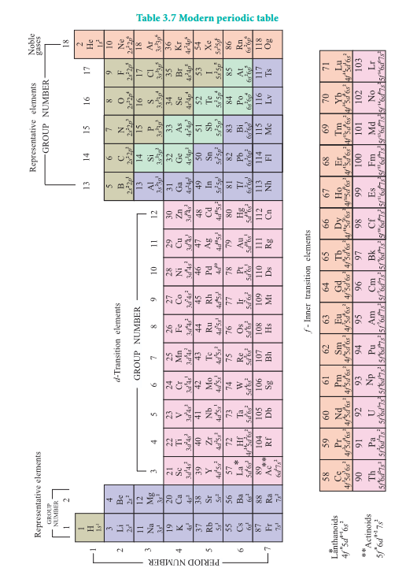

### 3.3 Nomenclature of Elements with Atomic Number Greater than 100

Usually, when a new element is discovered, the discoverer suggests a name following IUPAC guidelines which will be approved after a public opinion. In the meantime, the new element will be called by a temporary name coined using the following IUPAC rules, until the IUPAC recognises the new name.

1. The name was derived directly from the atomic number of the new element using the following numerical roots.

**Table 3.8 Notation for IUPAC Nomenclature of elements**

| Digit | 0 | 1 | 2 | 3 | 4 | 5 | 6 | 7 | 8 | 9 |
|---|---|---|---|---|---|---|---|---|---|---|
| Root | nil | un | bi | tri | quad | pent | hex | sept | oct | enn |
| Abbreviation | n | u | b | t | q | p | h | s | o | e |

2. The numerical roots corresponding to the atomic number are put together and 'ium' is added as suffix

3. The final 'n' of 'enn' is omitted when it is written before 'nil' (enn + nil = enil) similarly the final 'i' of 'bi' and 'tri' is omitted when it written before 'ium' (bi + ium = bium; tri + ium = trium)

4. The symbol of the new element is derived from the first letter of the numerical roots.

The following table illustrates these facts.

**Table 3.9 Name of elements with atomic number above 100**

| Atomic number | Temporary Name | Temporary Symbol | Name of the element | Symbol |
|---|---|---|---|---|
| 101 | Unnilunium | Unu | Mendelevium | Md |
| 102 | Unnilbium | Unb | Nobelium | No |
| 103 | Unnitrium | Unt | Lawrencium | Lr |
| 104 | Unnilquadium | Unq | Rutherfordium | Rf |
| 105 | Unnilpentium | Unp | Dubnium | Db |
| 106 | Unnilhexium | Unh | Seaborgium | Sg |
| 107 | Unnilseptium | Uns | Bohrium | Bh |
| 108 | Unniloctium | Uno | Hassium | Hs |
| 109 | Unnilennium | Une | Meitnerium | Mt |
| 110 | Ununnilium | Uun | Darmstadtium | Ds |
| 111 | Unununium | Uuu | Roentgenium | Rg |
| 112 | Ununbium | Uub | Copernicium | Cn |
| 113 | Ununtrium | Uut | Nihonium | Nh |
| 114 | Ununquadium | Uuq | Flerovium | Fl |
| 115 | Ununpentium | Uup | Moscovium | Mc |
| 116 | Ununhexium | Uuh | Livermorium | Lv |
| 117 | Ununseptium | Uus | Tennessine | Ts |
| 118 | Ununoctium | Uuo | Oganesson | Og |

## Evaluate Yourself

2. The element with atomic number 120 has not been discovered so far. What would be the IUPAC name and the symbol for this element? Predict the possible electronic configuration of this element.

### 3.4 Grouping of Elements based on Electronic Configurations

In the modern periodic table, the elements are organised in 7 periods and 18 groups based on the modern periodic law. The placement of element in the periodic table is closely related to its outer shell electronic configuration. Let us analyse the change in the electronic configuration of elements along the periods and down the groups.

#### 3.4.1 Variation of Electronic Configuration along the periods

We have already learnt that each period starts with the element having general outer electronic configuration \( \mathrm{ns}^1 \) and ends with \( \mathrm{ns}^2 \mathrm{np}^6 \) where \( \mathrm{n} \) is the period number. The first period starts with the filling of valence electrons in 1s orbital, which can accommodate only two electrons. Hence, the first period has two elements, namely hydrogen and helium. The second period starts with the filling of valence electrons in 2s orbital followed by three 2p orbitals with eight elements from lithium to neon. The third period starts with filling of valence electrons in the 3s orbital followed by 3p orbitals. The fourth period starts with filling of valence electrons from 4s orbital followed by 3d and 4p orbitals in accordance with Aufbau principle. Similarly, we can explain the electronic configuration of elements in the subsequent periods (Table 3.10).

**Table 3.10 Electronic configuration of elements in a period**

| Period number (n) | Filling of electrons in orbitals | Number of elements | Outer shell Electronic configuration |
|---|---|---|---|
| | | | Starts from | Ends with |
| | | | First element | Last element |
| 1 | 1s | 2 | H - \( 1s^1 \) | He - \( 1s^2 \) |
| 2 | 2s 2p | 8 | Li - \( 2s^1 \) | Ne - \( 2s^2 2p^6 \) |
| 3 | 3s 3p | 8 | Na - \( 3s^1 \) | Ar - \( 3s^2 3p^6 \) |
| 4 | 4s 3d 4p | 18 | K - \( 4s^1 \) | Kr - \( 4s^2 4p^6 \) |
| 5 | 5s 4d 5p | 18 | Rb - \( 5s^1 \) | Xe - \( 5s^2 5p^6 \) |
| 6 | 6s 4f 5d 6p | 32 | Cs - \( 6s^1 \) | Rn - \( 6s^2 6p^6 \) |
| 7 | 7s 5f 6d 7p | 32 | Fr - \( 7s^1 \) | Og - \( 7s^2 7p^6 \) |

In the fourth period the filling of 3d orbitals starts with scandium and ends with zinc. These 10 elements are called first transition series. Similarly 4d, 5d and 6d orbitals are filled in successive periods and the corresponding series of elements are called second, third and fourth transition series respectively.

In the sixth period the filling of valence electrons starts with 6s orbital followed by 4f, 5d and 6p orbitals. The filling up of 4f orbitals begins with Cerium ( \( Z = 58 \) ) and ends at Lutetium ( \( Z = 71 \) ). These 14 elements constitute the first inner-transition series called Lanthanides. Similarly, in the seventh period 5f orbitals are filled, and its 14 elements constitute the second inner-transition series called Actinides. These two series are placed separately at the bottom of the modern periodic table.

#### 3.4.2 Variation of Electronic Configuration in the Groups

Elements of a group have similar electronic configuration in the outer shell. The general outer electronic configurations for the 18 groups are listed in the Table 3.11. The groups can be combined as s, p, d and f block elements on the basis of the orbital in which the last valence electron enters.

The elements of group 1 and group 2 are called s-block elements, since the last valence electron enters the ns orbital. The group 1 elements are called alkali metals while the group 2 elements are called alkaline earth metals. These are soft metals and possess low melting and boiling points with low ionisation enthalpies. They are highly reactive and form ionic compounds. They are highly electropositive in nature and most of the elements imparts colour to the flame. We will study the properties of these group elements in detail in subsequent chapters.

The elements of groups 13 to 18 are called p-block elements or representative elements and have a general electronic configuration \( \mathrm{ns}^2 \mathrm{np}^{1-6} \). The elements of the group 16 and 17 are called chalcogens and halogens respectively. The elements of \( 18^{\mathrm{th}} \) group contain completely filled valence shell electronic configuration \( (\mathrm{ns}^2,\mathrm{np}^6) \) and are called inert gases or nobles gases. The elements of p-block have high negative electron gain enthalpies. The ionisation energies are higher than that of s-block elements. They form mostly covalent compounds and shows more than one oxidation states in their compounds.

The elements of the groups 3 to 12 are called d-block elements or transition elements with general valence shell electronic configuration \( \mathrm{ns}^{1-2} (\mathrm{n-1})\mathrm{d}^{1-10} \). These elements also show more than one oxidation state and form ionic, covalent and co-ordination compounds. They can form interstitial compounds and alloys which can also act as catalysts. These elements have high melting points and are good conductors of heat and electricity.

The lanthanides \( (4\mathrm{f}^{1-14},5\mathrm{d}^{0-1},6\mathrm{s}^{2}) \) and the actinides \( (5\mathrm{f}^{0-14},6\mathrm{d}^{0-2},7\mathrm{s}^{2}) \) are called f-block elements. These elements are metallic in nature and have high melting points. Their compounds are mostly coloured. These elements also show variable oxidation states.

**Table 3.11 General outer electronic configuration of elements in groups**

| 1 | 2 | 3 | 4 | 5 | 6 | 7 | 8 | 9 | 10 | 11 | 12 | 13 | 14 | 15 | 16 | 17 | 18 |
|---|---|---|---|---|---|---|---|---|---|---|---|---|---|---|---|---|---|
| \( ns^1 \) | \( ns^2 \) | \( ns^2 (n-1)d^1 \) | \( ns^2 (n-1)d^2 \) | \( ns^2 (n-1)d^3 \) | \( ns^2 (n-1)d^4 \) | \( ns^2 (n-1)d^5 \) | \( ns^2 (n-1)d^6 \) | \( ns^2 (n-1)d^7 \) | \( ns^2 (n-1)d^8 \) | \( ns^2 (n-1)d^9 \) | \( ns^2 (n-1)d^{10} \) | \( ns^2 np^1 \) | \( ns^2 np^2 \) | \( ns^2 np^3 \) | \( ns^2 np^4 \) | \( ns^2 np^5 \) | \( ns^2 np^6 \) |

| s-block elements | d-block elements | p-block elements |
|---|---|---|
| | | f-block elements |
| | | Lanthanides \( 4f^{1-14} 5d^{0-1} 6s^2 \) |
| | | Actinides \( 5f^{0-14} 6d^{0-2} 7s^2 \) |

## Evaluate Yourself

3. Predict the position of the element in periodic table satisfying the electronic configuration (n-1)d², ns where n=5

### 3.5 Periodic Trends in Properties

As discussed earlier, the electronic configuration of the elements shows a periodic variation with increase in atomic numbers. Similarly a periodic trend is observed in physical and chemical behaviour of elements. In this section, we will study the periodic trends in the following properties of elements.

1. Atomic radius
2. Ionic radius
3. Ionisation enthalpy (energy)
4. Electron gain enthalpy (electron affinity)
5. Electronegativity

#### 3.5.1 Atomic radius

Atomic radius of an atom is defined as the distance between the centre of its nucleus and the outermost shell containing the valence electron.

It is not possible to measure the radius of an isolated atom directly. Except for noble gases, usually atomic radius is referred to as covalent radius or metallic radius depending upon the nature of bonding between the concerned atoms.

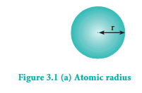

##### Covalent radius

It is one-half of the internuclear distance between two identical atoms linked together by a single covalent bond. Inter nuclear distance can be determined using x-ray diffraction studies.

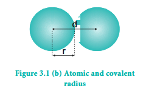

**Example:**

The experimental internuclear distance in \( \mathrm{Cl}_2 \) molecule is \( 1.98\mathrm{\AA} \). The covalent radius of chlorine is calculated as below.

\[
\mathrm{d}_{\mathrm{Cl - Cl}} = \mathrm{r}_{\mathrm{Cl}} + \mathrm{r}_{\mathrm{Cl}}
\]
\[
\Rightarrow \mathrm{d}_{\mathrm{Cl - Cl}} = \mathrm{2r}_{\mathrm{Cl}}
\]
\[
\Rightarrow \mathrm{r}_{\mathrm{Cl}} = \frac{\mathrm{d}_{\mathrm{Cl - Cl}}}{2}
\]
\[
\Rightarrow \mathrm{r}_{\mathrm{Cl}} = \frac{1.98}{2} = 0.99\mathrm{\AA}
\]

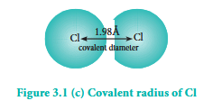

The formation of covalent bond involves the overlapping of atomic orbitals and it reduces the expected internuclear distance. Therefore covalent radius is always shorter than the actual atomic radius.

In case of hetero nuclear diatomic molecules, the covalent radius of individual atom can also be calculated using the internuclear distance \( (\mathrm{d}_{\mathrm{A - B}}) \) between two different atoms A and B. The simplest method proposed by Schomaker and Stevenson is as follows.

\[
\mathrm{d}_{\mathrm{A - B}} = \mathrm{r}_{\mathrm{A}} + \mathrm{r}_{\mathrm{B}} - 0.09(\chi_{\mathrm{A}} - \chi_{\mathrm{B}})
\]

where \( \chi_{\mathrm{A}} \) and \( \chi_{\mathrm{B}} \) are the electronegativities of A and B respectively in Pauling units. Here \( \chi_{\mathrm{A}} > \chi_{\mathrm{B}} \) and radius is in Å.

Let us calculate the covalent radius of hydrogen using the experimental \( \mathrm{d}_{\mathrm{H - Cl}} \) value is \( 1.28\mathrm{\AA} \) and the covalent radius of chlorine is \( 0.99\mathrm{\AA} \). In pauling scale the electronegativity of chlorine and hydrogen are 3 and 2.1 respectively.

\[
\mathrm{d}_{\mathrm{H - Cl}} = \mathrm{r}_{\mathrm{H}} + \mathrm{r}_{\mathrm{Cl}} - 0.09(\chi_{\mathrm{Cl}} - \chi_{\mathrm{H}})
\]
\[
1.28 = \mathrm{r}_{\mathrm{H}} + 0.99 - 0.09(3 - 2.1)
\]
\[
1.28 = \mathrm{r}_{\mathrm{H}} + 0.99 - \mathrm{0.09}(0.9)
\]
\[
1.28 = \mathrm{r}_{\mathrm{H}} + 0.99 - 0.081
\]
\[
1.28 = \mathrm{r}_{\mathrm{H}} + 0.909
\]
\[
\therefore \mathrm{r}_{\mathrm{H}} = 1.28 - 0.909 = 0.371\mathrm{\AA}
\]

##### Metallic radius

It is defined as one-half of the distance between two adjacent metal atoms in the closely packed metallic crystal lattice.

For example, the distance between the adjacent copper atoms in solid copper is \( 2.56\mathrm{\AA} \) and therefore the metallic radius of copper is \( 1.28\mathrm{\AA} \).

The metallic radius can be calculated using the unit cell length of the metallic crystal. You will study the detailed calculation procedure in XII standard solid state unit.

##### Periodic Trends in Atomic Radius

###### Variation in Periods

Atomic radius tends to decrease in a period. As we move from left to right along a period, the valence electrons are added to the same shell. The simultaneous addition of protons to the nucleus, increases the nuclear charge, as well as the electrostatic attractive force between the valence electrons and the nucleus. Therefore atomic radius decreases along a period.

###### Effective nuclear charge

In addition to the electrostatic forces of attraction between the nucleus and the electrons, there exists repulsive forces among the electrons. The repulsive force between the inner shell electrons and the valence electrons leads to a decrease in the electrostatic attractive forces acting on the valence electrons by the nucleus. Thus, the inner shell electrons act as a shield between the nucleus and the valence electrons. This effect is called shielding effect.

The net nuclear charge experienced by valence electrons in the outermost shell is called the effective nuclear charge. It is approximated by the below mentioned equation.

\[
Z_{\mathrm{eff}} = Z - S
\]

Where Z is the atomic number and 'S' is the screening constant which can be calculated using Slater's rules as described below.

**Step 1:**

Write the electronic configuration of the atom and rearrange it by grouping ns and np orbitals together and others separately in the following form.

(1s) (2s, 2p) (3s, 3p) (3d) (4s, 4p) (4d) (4f) (5s, 5p)...

**Step 2:**

Identify the group in which the electron of interest is present. The electron present right to this group does not contribute to the shielding effect.

Each of the electrons within the identified group (denoted by 'n') shields to an extent of 0.35 unit of nuclear charge. However, it is 0.30 unit for 1s electron.

**Step 3:**

Shielding of inner shell electrons.

If the electron of interest belongs to either s or p orbital,

i) each electron within the (n-1) group shields to an extent of 0.85 unit of nuclear charge, and

ii) each electron within the (n-2) group (or) even lesser group (n-3), (n-4) etc... completely shields i.e. to an extent of 1.00 unit of nuclear charge.

If the electron of interest belongs to d or f orbital, then each of electron left of the group of electron of interest shields to an extent of 1.00 unit of nuclear charge.

**Step 4:**

Summation of the shielding effect of all the electrons gives the shielding constant 'S'

**Example:** Let us explain the calculation of effective nuclear charge on 4s electron and 3d electron in scandium. The electronic configuration of scandium is \( 1\mathrm{s}^2 2\mathrm{s}^2 2\mathrm{p}^6 3\mathrm{s}^2 3\mathrm{p}^6 4\mathrm{s}^2 3\mathrm{d}^1 \). we can rearrange as below.

(1s²) (2s²2p⁶) (3s²3p⁶) (3d¹) (4s²)

| Group | number of electrons in the electron group | contribution to S value | contribution of a particular group to S value |
|---|---|---|---|
| (n) | 1 | 0.35 | 0.35 |
| (n-1) | 9 | 0.85 | 7.65 |
| (n-2) & others | 10 | 1.00 | 10.00 |
| | | S value | 18.00 |

\[
Z_{\mathrm{eff}} = Z - S \quad \text{i.e.} = 21 - 18 \quad \therefore Z_{\mathrm{eff}} = 3
\]

Calculation of effective nuclear charge on 3d electron

(1s²) (2s²2p⁶) (3s²3p⁶) (3d¹) (4s²)

| Group | number of electrons in the electron group | contribution to S value | contribution of a particular group to S value |
|---|---|---|---|
| n | 0 | 0.35 | 0 |
| (n-1) & others | 18 | 1.00 | 18 |
| | | S Value | 18 |

\[
\therefore Z_{\mathrm{eff}} = Z - S \quad \text{i.e.} = 21 - 18 \quad \therefore Z_{\mathrm{eff}} = 3
\]

**Table 3.12 Shielding effect from inner shell electrons (Slater's rules)**

| Electron Group | Electron of interest either s or p | Electron of interest either d or f |
|---|---|---|
| n | 0.35 (0.30 for 1s electron) | 0.35 |
| (n-1) | 0.85 | 1.00 |
| (n-2) and others | 1.00 | 1.00 |

**Table 3.13 Atomic radius (covalent radius) of second period elements**

| Elements | Effective nuclear charge | Covalent radius (pm) |
|---|---|---|
| 3 Li | 1.30 | 152 |
| 4 Be | 1.95 | 111 |
| 5 B | 2.60 | 88 |
| 6 C | 3.25 | 77 |
| 7 N | 3.90 | 74 |
| 8 O | 4.55 | 66 |
| 9 F | 5.20 | 64 |
| 10 Ne | 5.85 | * |

\* Van der Waals radius

## Evaluate Yourself

4. Using Slater's rule calculate the effective nuclear charge on a 3p electron in aluminium and chlorine. Explain how these results relate to the atomic radii of the two atoms.

###### Variation in Group

In the periodic table, the atomic radius of elements increases down the group. As we move down a group, new shells are opened to accommodate the newly added valence electrons. As a result, the distance between the centre of the nucleus and the outermost shell containing the valence electron increases. Hence, the atomic radius increases. The trend in the variation of the atomic radius of the alkali metals down the group is shown below.

**Table 3.14 Variation of covalent radius of group 1 elements**

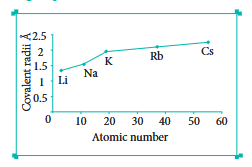

| Element | Outermost shell containing valence electron | Covalent radius (Å) |
|---|---|---|
| Li | L (n=2) | 1.34 |
| Na | M (n=3) | 1.54 |
| K | N (n=4) | 1.96 |
| Rb | O (n=5) | 2.11 |
| Cs | P (n=6) | 2.25 |

## Activity 3.1

Covalent radii (in Å) for some elements of different groups and periods are listed below. Plot these values against atomic number. From the plot, explain the variation along a period and a group.

\( 2^{\mathrm{nd}} \) group elements : Be (0.89), Mg (1.36), Ca (1.74), Sr (1.91), Ba (1.98)

\( 17^{\mathrm{th}} \) group elements : F (0.72), Cl (0.99), Br (1.14), I (1.33)

\( 3^{\mathrm{rd}} \) Period elements : Na (1.57), Mg (1.36), Al (1.25), Si (1.17), P (1.10), S (1.04), Cl (0.99)

\( 4^{\mathrm{th}} \) period elements : K (2.03), Ca (1.74), Sc (1.44), Ti (1.32), V (1.22), Cr (1.17), Mn (1.17), Fe (1.17), Co (1.16), Ni (1.15), Cu (1.17), Zn (1.25), Ga (1.25), Ge (1.22), As (1.21), Se (1.14), Br (1.14)

#### 3.5.2 Ionic radius

It is defined as the distance from the centre of the nucleus of the ion up to which it exerts its influence on the electron cloud of the ion. Ionic radius of uni-univalent crystal can be calculated using Pauling's method from the inter ionic distance between the nuclei of the cation and anion. Pauling assumed that ions present in a crystal lattice are perfect spheres, and they are in contact with each other. Therefore,

\[
\mathrm{d} = \mathrm{r}_{\mathrm{C}^{+}} + \mathrm{r}_{\mathrm{A}^{-}} \quad (1)
\]

Where d is the distance between the centre of the nucleus of cation \( \mathrm{C}^{+} \) and anion \( \mathrm{A}^{-} \) and \( \mathrm{r}_{\mathrm{C}^{+}} \), \( \mathrm{r}_{\mathrm{A}^{-}} \) are the radius of the cation and anion respectively.

Pauling also assumed that the radius of the ion having noble gas electronic configuration \( (\mathrm{Na}^{+} \) and \( \mathrm{Cl}^{-} \) having \( 1\mathrm{s}^2 2\mathrm{s}^2 2\mathrm{p}^6 \) configuration) is inversely proportional to the effective nuclear charge felt at the periphery of the ion.

\[
\text{i.e. } \mathrm{r}_{\mathrm{C}^{+}} \propto \frac{1}{(\mathrm{Z}_{\mathrm{eff}})_{\mathrm{C}^{+}}} \quad (2)
\]
\[
\mathrm{r}_{\mathrm{A}^{-}} \propto \frac{1}{(\mathrm{Z}_{\mathrm{eff}})_{\mathrm{A}^{-}}} \quad (3)
\]

Where \( Z_{\mathrm{eff}} \) is the effective nuclear charge and \( Z_{\mathrm{eff}} = Z - S \)

Dividing the equation 2 by 3\[
\frac{\mathrm{r}_{\mathrm{C}^{+}}}{\mathrm{r}_{\mathrm{A}^{-}}} = \frac{(\mathrm{Z}_{\mathrm{eff}})_{\mathrm{A}^{-}}}{(\mathrm{Z}_{\mathrm{eff}})_{\mathrm{C}^{+}}} \quad (4)
\]

On solving equation (1) and (4) the values of \( \mathrm{r}_{\mathrm{C}^{+}} \) and \( \mathrm{r}_{\mathrm{A}^{-}} \) can be obtained.

Let us explain this method by calculating the ionic radii of \( \mathrm{Na}^{+} \) and \( \mathrm{F}^{-} \) in NaF crystal whose interionic distance is equal to 231 pm.

$$
d = r_{\text{Na}^+} + r_{\text{F}^-}
$$

ie. \( r_{\text{Na}^+} + r_{\text{F}^-} = 231 \, \text{pm} \)

We know that

$$
\frac{r_{\text{Na}^+}}{r_{\text{F}^-}} = \frac{(Z_{\text{eff}})_{r_{\text{F}^-}}}{(Z_{\text{eff}})_{r_{\text{Na}^+}}} = \frac{Z - S}{9 - 4.15} = 4.85
$$

$$
(Z_{\text{eff}})_{r_{\text{F}^-}} = 11 - 4.15 = 6.85
$$

$$
\therefore \frac{r_{\text{Na}^+}}{r_{\text{F}^-}} = \frac{4.85}{6.85} = 0.71
$$

$$
\Rightarrow r_{\text{Na}^+} = 0.71 \times r_{\text{F}^-}
$$

Substituting \( r_{\text{Na}^+} \) in equation

$$
0.71 \, r_{\text{F}^-} + r_{\text{F}^-} = 231 \, \text{pm}
$$

$$
1.71 \, r_{\text{F}^-} = 231 \, \text{pm}
$$

$$
r_{\text{F}^-} = \frac{231}{1.71} = 135.1 \, \text{pm}
$$

Substituting the value of \( r_{\text{F}^-} \) in equation

$$
r_{\text{Na}^+} + 135.1 = 231
$$

$$
r_{\text{Na}^+} = 95.9 \, \text{pm}
$$

### Evaluate Yourself

**5.** A student reported the ionic radii of isoelectronic species \( X^{3+} \), \( Y^{2+} \) and \( Z^{-} \) as 136 pm, 64 pm and 49 pm respectively. Is that order correct? Comment.

## 3.5.3 Ionisation Energy

It is defined as the minimum amount of energy required to remove the most loosely bound electron from the valence shell of the isolated neutral gaseous atom in its ground state. It is expressed in kJ mol\(^{-1}\) or in electron volts (eV).

$$
M_{\text{(g)}} + IE_1 \rightarrow M^{+}_{\text{(g)}} + 1 \, \text{e}^{-}
$$

Where \( IE_1 \) represents the first ionisation energy.

### Successive Ionisation energies

The minimum amount of energy required to remove an electron from a unipositive cation is called second ionisation energy. It is represented by the following equation.

$$
M^{+}_{\text{(g)}} + IE_2 \rightarrow M^{2+}_{\text{(g)}} + 1 \, \text{e}^{-}
$$

In this way we can define the successive ionisation energies such as third, fourth etc.

The total number of electrons are less in the cation than the neutral atom while the nuclear charge remains the same. Therefore the effective nuclear charge of the cation is higher than the corresponding neutral atom. Thus the successive ionisation energies, always increase in the following order

$$
IE_1 < IE_2 < IE_3 < \ldots
$$

### Periodic Trends in Ionisation Energy

The ionisation energy usually increases along a period with few exceptions. As discussed earlier, when we move from left to right along a period, the valence electrons are added to the same shell, at the same time protons are added to the nucleus. This successive increase of nuclear charge increases the electrostatic attractive force on the valence electron and more energy is required to remove the valence electron resulting in high ionisation energy.

Let us consider the variation in ionisation energy of second period.
The plot of atomic number vs ionisation energy is given below.

In the following graph, there are two deviations in the trends of ionisation energy. It is expected that boron has higher ionisation energy than beryllium since it has higher nuclear charge. However, the actual ionisation energies of beryllium and boron are 899 and \( 800 \ \mathrm{kJ \ mol^{-1}} \) respectively contrary to the expectation. It is due to the fact that beryllium with completely filled 2s orbital, is more stable than partially filled valence shell electronic configuration of boron \( (2\mathrm{s}^2 2\mathrm{p}^1) \).

**Figure 3.2 Variation of Ionisation energy along the II period**
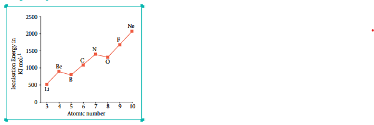
The electronic configuration of beryllium \( (Z = 4) \) in its ground state is \( 1\mathrm{s}^2 2\mathrm{s}^2 \) and that of boron is \( (Z = 5) \ 1\mathrm{s}^2 2\mathrm{s}^2 2\mathrm{p}^1 \).

Similarly, nitrogen with \( 1\mathrm{s}^2 2\mathrm{s}^2 2\mathrm{p}^3 \) electronic configuration has higher ionisation energy \( (1402 \ \mathrm{kJ \ mol^{-1}}) \) than oxygen \( (1314 \ \mathrm{kJ \ mol^{-1}}) \). Since the half filled electronic configuration is more stable, it requires higher energy to remove an electron from \( 2\mathrm{p} \) orbital of nitrogen. Whereas the removal of one \( 2\mathrm{p} \) electron from oxygen leads to a stable half filled configuration. This makes comparatively easier to remove \( 2\mathrm{p} \) electron from oxygen.

##### Periodic variation in group

The ionisation energy decreases down a group. As we move down a group, the valence electron occupies new shells, the distance between the nucleus and the valence electron increases. So, the nuclear forces of attraction on valence electron decreases and hence ionisation energy also decreases down a group.

##### Ionisation energy and shielding effect

As we move down a group, the number of inner shell electrons increases which in turn increases the repulsive force exerted by them on the valence electrons, i.e. the increased shielding effect caused by the inner electrons decreases the attractive force acting on the valence electron by the nucleus. Therefore the ionisation energy decreases.

Let us understand this trend by considering the ionisation energy of alkali metals.

**Figure 3.3 Variation of Ionisation energy down the I Group**
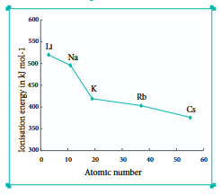

6. The first ionisation energy \( \mathrm{IE}_{1} \) and second ionisation energy \( \mathrm{IE}_{2} \) of elements X, Y and Z are given below.

| Element | IE\(_1\) (kJ mol\(^{-1}\)) | IE\(_2\) (kJ mol\(^{-1}\)) |
|---|---|---|
| X | 2370 | 5250 |
| Y | 522 | 7298 |
| Z | 1680 | 3381 |

Which one of the above elements is the most reactive metal, the least reactive metal and a noble gas?

#### 3.5.4 Electron Affinity

It is defined as the amount of energy released (required in the case noble gases) when an electron is added to the valence shell of an isolated neutral gaseous atom in its ground state to form its anion. It is expressed in kJ mol\(^{-1}\).

\[
A + e^{-} \rightarrow A^{-} + EA
\]

##### Variation of Electron Affinity in a period

The variation of electron affinity is not as systematic as in the case of ionisation energy. As we move from alkali metals to halogens in a period, generally electron affinity increases, i.e. the amount of energy released will be more. This is due to an increase in the nuclear charge and decrease in size of the atoms. However, in case of elements such as beryllium \( (1\mathrm{s}^2 2s^2) \), nitrogen \( (1\mathrm{s}^2 2s^2 2\mathrm{p}^3) \) the addition of extra electron will disturb their stable electronic configuration and they have almost zero electron affinity.

**Figure 3.4 Variation of electron affinity (electron gain energy) along II period**
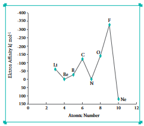

Noble gases have stable \( \mathrm{ns}^2 \mathrm{np}^6 \) configuration, and the addition of further electron is unfavourable and requires energy. Halogens having the general electronic configuration of \( \mathrm{ns}^2 \mathrm{np}^5 \) readily accept an electron to get the stable noble gas electronic configuration \( (\mathrm{ns}^2 \mathrm{np}^6) \) and therefore in each period the halogen has high electron affinity (high negative values).

##### Variation of Electron affinity in a group

As we move down a group, generally the electron affinity decreases. It is due to increase in atomic size and the shielding effect of inner shell electrons. However, oxygen and fluorine have lower affinity than sulphur and chlorine respectively. The sizes of oxygen and fluorine atoms are comparatively small and they have high electron density. Moreover, the extra electron added to oxygen and fluorine has to be accommodated in the 2p orbital which is relatively compact compared to the 3p orbital of sulphur and chlorine, so oxygen and fluorine have lower electron affinity than their respective group elements sulphur and chlorine.

**Figure 3.5 Variation of Electron Affinity (electron gain energy) along \( 17^{\mathrm{th}} \) group**
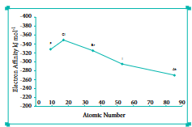

## Evaluate Yourself

7. The electron gain enthalpy of chlorine is \( 348 \ \mathrm{kJ \ mol^{-1}} \). How much energy in kJ is released when 17.5 g of chlorine is completely converted into Cl\(^{-}\) ions in the gaseous state?

#### 3.5.5 Electronegativity

It is defined as the relative tendency of an element present in a covalently bonded molecule, to attract the shared pair of electrons towards itself.

Electronegativity is not a measurable quantity. However, a number of scales are available to calculate its value. One such method was developed by Pauling, he assigned arbitrary value of electronegativities for hydrogen and fluorine as 2.1 and 4.0 respectively. Based on this the electronegativity values for other elements can be calculated using the following expression

\[
(\chi_{\mathrm{A}} - \chi_{\mathrm{B}}) = 0.182 \sqrt{\mathrm{E}_{\mathrm{AB}} - (\mathrm{E}_{\mathrm{AA}} \times \mathrm{E}_{\mathrm{BB}})^{1/2}}
\]

Where \( \mathrm{E_{AB}} \), \( \mathrm{E_{AA}} \) and \( \mathrm{E_{BB}} \) are the bond dissociation energies (kcal) of AB, \( \mathrm{A}_{2} \) and \( \mathrm{B}_{2} \) molecules respectively.

The electronegativity of any given element is not a constant and its value depends on the element to which it is covalently bound. The electronegativity values play an important role in predicting the nature of the bond.

##### Variation of Electronegativity in a period

The electronegativity generally increases across a period from left to right. As discussed earlier, the atomic radius decreases in a period, as the attraction between the valence electron and the nucleus increases. Hence the tendency to attract shared pair of electrons increases. Therefore, electronegativity also increases in a period.

**Figure 3.6 Variation of Electronegativity along II period**
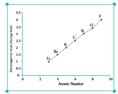

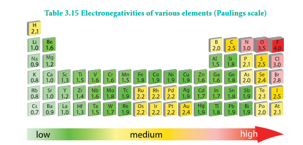

##### Variation of Electronegativity in a group

The electronegativity generally decreases down a group. As we move down a group the atomic radius increases and the nuclear attractive force on the valence electron decreases. Hence, the electronegativity decreases.

Noble gases are assigned zero electronegativity. The electronegativity values of the elements of s-block show the expected decreasing order in a group. Except \( 13^{\mathrm{th}} \) and \( 14^{\mathrm{th}} \) group all other p-block elements follow the expected decreasing trend in electronegativity.

**Figure 3.7 Variation of electronegativity along I group**
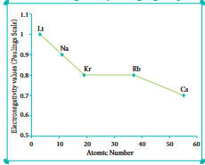

### 3.6 Periodic Trends in Chemical Properties

So far, we have studied the periodicity of the physical properties such as atomic radius, ionisation enthalpy, electron gain enthalpy and electronegativity. In addition, the chemical properties such as reactivity, valence, oxidation state etc. also show periodicity to certain extent.

In this section, we will discuss briefly about the periodicity in valence (oxidation state) and anomalous behaviour of second period elements (diagonal relationship).

#### Valence or Oxidation States

The valence of an atom is the combining capacity relative to hydrogen atom. It is usually equal to the total number of electrons in the valence shell or equal to eight minus the number of valence electrons. It is more convenient to use oxidation state in the place of valence.

##### Periodicity of Valence or Oxidation States

The valence of an atom primarily depends on the number of electrons in the valence shell. As the number of valence electrons remains same for the elements in same group, the maximum valence also remains the same. However, in a period the number of valence electrons increases, hence the valence also increases.

**Table 3.16 Variation of valence in groups**

| | Alkali Metals (Group 1) | | Group 15 | |
|---|---|---|---|---|
| Element | No. of electrons in valence shell | Valence | Element | No. of electrons in valence shell | Valence |
| Li | 1 | 1 | N | 5 | 3, 5 |
| Na | 1 | 1 | P | 5 | 3, 5 |
| K | 1 | 1 | As | 5 | 3, 5 |
| Rb | 1 | 1 | Sb | 5 | 3, 5 |
| Cs | 1 | 1 | Bi | 5 | 3, 5 |
| Fr | 1 | 1 | | | |

**Table 3.17 Variation of valence in period (2nd period)**

| Element | Li | Be | B | C | N | O | F | Ne |
|---|---|---|---|---|---|---|---|---|
| No. of electrons in valence shell | 1 | 2 | 3 | 4 | 5 | 6 | 7 | 8 |
| Valence (Combining capacity) | 1 | 2 | 3 | 4 | 5, 3 | 6, 2 | 7, 1 | 8, 0 |

In addition to that some elements have variable valence. For example, most of the elements of group 15 which have 5 valence electrons show two valences 3 and 5. Similarly transition metals and inner transition metals also show variable oxidation states.

#### 3.6.1 Anomalous properties of second period elements

As we know, the elements of the same group show similar physical and chemical properties. However, the first element of each group differs from other members of the group in certain properties. For example, lithium and beryllium form more covalent compounds, unlike the alkali and alkaline earth metals which predominantly form ionic compounds. The elements of the second period have only four orbitals (2s & 2p) in the valence shell and have a maximum co-valence of 4, whereas the other members of the subsequent periods have more orbitals in their valence shell and shows higher valences. For example, boron forms \( \mathrm{BF}_4^{-} \) and aluminium forms \( \mathrm{AlF}_6^{3-} \).

#### Diagonal Relationship

On moving diagonally across the periodic table, the second and third period elements show certain similarities. Even though the similarity is not same as we see in a group, it is quite pronounced in the following pair of elements.

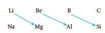

The similarity in properties existing between the diagonally placed elements is called diagonal relationship.

#### 3.6.2 Periodic Trends and Chemical Reactivity

The physical and chemical properties of elements depend on the valence shell electronic configuration as discussed earlier. The elements on the left side of the periodic table have less ionisation energy and readily lose their valence electrons. On the other hand, the elements on right side of the periodic table have high electron affinity and readily accept electrons. As a consequence of this, elements of these extreme ends show high reactivity when compared to the elements present in the middle. The noble gases having completely filled electronic configuration neither accept nor lose their electron readily and hence they are chemically inert in nature.

The ionisation energy is directly related to the metallic character and the elements located in the lower left portion of the periodic table have less ionisation energy and therefore show metallic character. On the other hand the elements located in the top right portion have very high ionisation energy and are nonmetallic in nature.

Let us analyse the nature of the compounds formed by elements from both sides of the periodic table. Consider the reaction of alkali metals and halogens with oxygen to give the corresponding oxides.

\[
4\mathrm{Na} + \mathrm{O}_2 \rightarrow 2\mathrm{Na}_2\mathrm{O}
\]
\[
2\mathrm{Cl}_2 + 7\mathrm{O}_2 \rightarrow 2\mathrm{Cl}_2\mathrm{O}_7
\]

Since sodium oxide reacts with water to give strong base sodium hydroxide, it is a basic oxide. Conversely \( \mathrm{Cl}_2\mathrm{O}_7 \) gives strong acid called perchloric acid upon reaction with water. So, it is an acidic oxide.

\[
\mathrm{Na}_2\mathrm{O} + \mathrm{H}_2\mathrm{O} \rightarrow 2\mathrm{NaOH}
\]
\[
\mathrm{Cl}_2\mathrm{O}_7 + \mathrm{H}_2\mathrm{O} \rightarrow 2\mathrm{HClO}_4
\]

Thus, the elements from the two extreme ends of the periodic table behave differently as expected.

As we move down the group, the ionisation energy decreases and the electropositive character of elements increases. Hence, the hydroxides of these elements become more basic. For example, let us consider the nature of the second group hydroxides:

\( \mathrm{Be(OH)}_2 \) amphoteric; \( \mathrm{Mg(OH)}_2 \) weakly basic; \( \mathrm{Ba(OH)}_2 \) strongly basic

Beryllium hydroxide reacts with both acid and base as it is amphoteric in nature.

\[
\mathrm{Be(OH)_2 + 2HCl \rightarrow BeCl_2 + 2H_2O}
\]
\[
\mathrm{Be(OH)_2 + 2NaOH \rightarrow Na_2BeO_2 + 2H_2O}
\]

## Activity 3.2

The electronegativity for some elements on pauling scale of different groups and periods are listed below. Plot these values against atomic number. From the pattern, explain the variation along a period and a group.

\( 2^{\mathrm{nd}} \) group elements : Be (1.6), Mg (1.2), Ca (1.0), Sr (1.0), Ba (0.9)

\( 17^{\mathrm{th}} \) group elements : F (4.0), Cl (3.0), Br (2.8), I (2.5)

\( 3^{\mathrm{rd}} \) Period elements : Na (0.9), Mg (1.2), Al (1.5), Si (1.8), P (2.1), S (2.5), Cl (3.0)

\( 4^{\mathrm{th}} \) period elements : K (0.8), Ca (1.0), Sc (1.3), Ti (1.5), V (1.6), Cr (1.6), Mn (1.5), Fe (1.8), Co (1.9), Ni (1.9), Cu (1.9), Zn (1.6), Ga (1.6), Ge (1.8), As (2.0), Se (2.4), Br (2.8)

## Summary

The periodic table was developed to systematically arrange the different elements. Lavoisier made the first attempt to arrange the known elements in a particular order based on properties. This followed by Johann Dobereiner, A. E. B. de Chancourtois and Newlands. First meaningful periodic table was constructed by Mendeleev based on atomic mass. This was later modified based on the modern periodic law which states that the properties of elements are the periodic functions of their atomic numbers. The modern periodic table is made up of 18 groups and 7 periods.

The elements in the same groups have similar properties because their valence shell electronic configurations are similar. The properties of the elements of the same period differ because they have different valence shell electronic configurations. On the basis of electronic configuration the elements are also classified as s-block, p-block, d-block and f-block elements. The elements belonging to s, p, d and f blocks have unique characteristic properties. In this table, more than 78% of all known elements are metals. They appear on the left side of the periodic table. Nonmetals are located at the top right hand side of the periodic table. Some elements show properties that are characteristic of both metals and non-metals and are called semimetals or metalloids.

The periodic properties such as atomic radius, ionic radius, ionization enthalpy, electron gain enthalpy, electronegativity are possessing periodic trends. The variations of these properties are described in the following scheme.

The elements at the extreme left exhibit strong reducing property whereas the elements at extreme right strong oxidizing property. The reactivity of elements at the centre of the periodic table is low compared to elements at the extreme right and left. The similarity in chemical properties observed between the elements of second and third period which are diagonally related.
