# 7. Thermodynamics

Classical thermodynamics... is the only physical theory of universal physical theory of universal content which I am convinced... will never be overthrown.

Albert Einstein

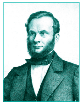

Rudolf Clausius (1822-1888)

## 7.1 Introduction

The term 'Thermodynamics' means flow of heat and is derived from the Greek 'Thermos' (heat) and 'dynamics' (flow). In our daily life, we come across many useful reactions such as burning of fuel to produce heat energy, flow of electrons through circuit to produce electrical energy, metabolic reactions to produce the necessary energy for biological functions and so on. Thermodynamics, the study of the transformation of energy, explains all such processes quantitatively and allows us to make useful predictions.

In the \( 19^{\mathrm{th}} \) century, scientists tried to understand the underlying principles of steam engine which were already in operation, in order to improve their efficiency. The basic problem of the investigation was the transformation of heat into mechanical work. However, over time, the laws of thermodynamics were developed and helped to understand the process of steam engine. These laws have been used to deduce powerful mathematical relationships applicable to a broad range of processes.

Thermodynamics evaluates the macroscopic properties (heat, work) and their inter relationships. It deals with properties of systems in equilibrium and is independent of any theories or properties of the individual molecules which constitute the system.

The principles of thermodynamics are based on three laws of thermodynamics. The first two laws (First and second law) summarise the actual experience of inter conversion of different forms of energy. The third law deals with the calculation of entropy and the unattainability of absolute zero Kelvin. Thermodynamics carries high practical values but bears certain limitations. It is independent of atomic and molecular structure and reaction mechanism. The laws can be used to predict whether a particular reaction is feasible or not under a given set of conditions, but they cannot give the rate at which the reaction takes place. In other words, thermodynamics deals with equilibrium conditions quantitatively, but does not take into account the kinetic approach to the equilibrium state.

### 7.2 System and Surrounding

Before studying the laws of thermodynamics and their applications, it is important to understand the meaning of a few terms used frequently in thermodynamics.

#### System

The universe is divided into two parts, the system and its surroundings. The system is the part of universe which is under thermodynamic consideration. It is separated from the rest of the universe by real or imaginary boundaries.

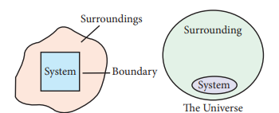

Figure 7.1 System, surrounding & boundary Homogeneous and heterogeneous systems

**Example:** The system may be water in a beaker, a balloon filled with air, an aqueous solution of glucose etc.

On the basis of physical and chemical properties, systems can be divided into two types.

A system is called **homogeneous** if the physical state of all its constituents are the same. Example: a mixture of gases, completely miscible mixture of liquids etc.

A system is called **heterogeneous**, if physical state of all its constituents is not the same. Example: mixture of oil and water.

#### Surrounding

Everything in the universe that is not the part of the system is called surroundings.

#### Boundary

Anything which separates the system from its surrounding is called boundary.

#### 7.2.1 Types of systems

There are three types of thermodynamic systems depending on the nature of the boundary.

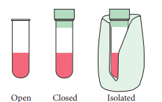

Figure 7.2 Types of Systems

##### Isolated system

A system which can exchange neither matter nor energy with its surroundings is called an isolated system. Here boundary is sealed and insulated. Hot water contained in a thermos flask, is an example for an isolated system. In this isolated system both energy (heat) and matter (water vapour) neither enter nor leave the system.

##### Closed system

A system which can exchange only energy but not matter with its surroundings is called a closed system. Here the boundary is sealed but not insulated. Hot water contained in a closed beaker is an example for a closed system. In this system energy (heat) is transferred to the surroundings but no matter (water vapour) can escape from this system. A gas contained in a cylinder fitted with a piston constitutes a closed system.

##### Open system

A System which can exchange both matter and energy with its surrounding is called an open system. Hot water contained in an open beaker is an example for open system. In this system both matter (water vapour) and energy (heat) is transferred to the surrounding.

All living things and chemical reactions are open systems because they exchange matter and energy with the surroundings.

#### 7.2.2 Properties of the system

##### Intensive and extensive properties

Some of the properties of a system depend on its mass or size whereas other properties do not depend on its mass or size. Based on this, the properties of a system are grouped as extensive property and intensive property.

**Extensive properties:** The property that depends on the mass or the size of the system is called an extensive property.

Examples: Volume, Number of moles, Mass, Internal energy, etc.

**Intensive properties:** The property that is independent of the mass or the size of the system is called an intensive property.

Examples: Refractive index, Surface tension, density, temperature, Boiling point, Freezing point, molar volume, etc.

**Table 7.1 Typical List of Extensive and Intensive properties**

| Extensive properties | Intensive properties |
|---|---|
| volume, mass, amount of substance (mole), energy, enthalpy, entropy, free energy, heat capacity | molar volume, density, molar mass, molarity, mole fraction, molality, specific heat capacity |

#### 7.2.3 Thermodynamic processes

The method of operation which can bring about a change in the system is called thermodynamic process. Heating, cooling, expansion, compression, fusion, vaporization etc., are some examples of a thermodynamic process.

##### Types of processes

A thermodynamic process can be carried out in different ways and under different conditions. The processes can be classified as follows:

**Reversible process:** The process in which the system and surrounding can be restored to the initial state from the final state without producing any changes in the thermodynamic properties of the universe is called a reversible process. There are two important conditions for the reversible process to occur. Firstly, the process should occur infinitesimally slowly and secondly throughout the process, the system and surroundings must be in equilibrium with each other.

**Irreversible Process:** The process in which the system and surrounding cannot be restored to the initial state from the final state is called an irreversible process. All the processes occurring in nature are irreversible processes. During the irreversible process the system and surroundings are not in equilibrium with each other.

**Adiabatic process:** An adiabatic process is defined as one in which there is no exchange of heat (q) between the system and surrounding during the process. Those processes in which no heat can flow into or out of the system are called adiabatic processes. This condition is attained by thermally insulating the system. In an adiabatic process if work is done by the system its temperature decreases, if work is done on the system its temperature increases, because, the system cannot exchange heat with its surroundings.

For an adiabatic process \( \mathbf{q} = 0 \)

**Isothermal process:** An isothermal process is defined as one in which the temperature of the system remains constant, during the change from its initial to final state. The system exchanges heat with its surrounding and the temperature of the system remains constant. For this purpose the experiment is often performed in a thermostat.

For an isothermal process \( dT = 0 \)

**Isobaric process:** An isobaric process is defined as one in which the pressure of the system remains constant during its change from the initial to final state.

For an isobaric process \( dP = 0 \)

**Isochoric process:** An isochoric process is defined as the one in which the volume of system remains constant during its change from initial to final state. Combustion of a fuel in a bomb calorimeter is an example of an isochoric process.

For an isochoric process, \( \mathrm{d}V = 0 \)

**Cyclic process:** When a system returns to its original state after completing a series of changes, then it is said that a cycle is completed. This process is known as a cyclic process.

For a cyclic process \( \mathrm{d}U = 0 \), \( \mathrm{d}H = 0 \), \( \mathrm{d}P = 0 \), \( \mathrm{d}V = 0 \), \( \mathrm{d}T = 0 \)

**Table 7.2 Overview of the process and its condition**

| Process | Condition |
|---|---|
| Adiabatic | \( q = 0 \) |
| Isothermal | \( dT = 0 \) |
| Isobaric | \( dP = 0 \) |
| Isochoric | \( dV = 0 \) |
| Cyclic | \( dE = 0, dH = 0, dP = 0, dV = 0, dT = 0 \) |

#### State functions, path functions

**State function:** A thermodynamic system can be defined by using the variables P, V, T and 'n'. A state function is a thermodynamic property of a system, which has a specific value for a given state and does not depend on the path (or manner) by which the particular state is reached.

Example: Pressure (P), Volume (V), Temperature(T), Internal energy (U), Enthalpy (H), free energy (G) etc.

**Path functions:** A path function is a thermodynamic property of the system whose value depends on the path by which the system changes from its initial to final states.

Example: Work (w), Heat (q).

Work (w) will have different values if the process is carried out reversibly or irreversibly.

#### Internal Energy (U)

The internal energy is a characteristic property of a system which is denoted by the symbol U. The internal energy of a system is equal to the energy possessed by all its constituents namely atoms, ions and molecules. The total energy of all molecules in a system is equal to the sum of their translational energy (\( U_t \)), vibrational energy (\( U_v \)), rotational energy (\( U_r \)), bond energy (\( U_b \)), electronic energy (\( U_e \)) and energy due to molecular interactions (\( U_i \)).

Thus:
\[
U = U_t + U_v + U_r + U_b + U_e + U_i
\]

The total energy of all the molecules of the system is called internal energy. In thermodynamics one is concerned only with the change in internal energy (\( \Delta U \)) rather than the absolute value of energy.

**Importance of Internal energy**

The internal energy possessed by a substance differentiates its physical structure. For example, the allotropes of carbon, namely, graphite (\( C_{\text{graphite}} \)) and diamond (\( C_{\text{diamond}} \)), differ from each other because they possess different internal energies and have different structures.

**Characteristics of internal energy (U):**
- The internal energy of a system is an extensive property. It depends on the amount of the substances present in the system. If the amount is doubled, the internal energy is also doubled.
- The internal energy of a system is a state function. It depends only upon the state variables (T, P, V, n) of the system. The change in internal energy does not depend on the path by which the final state is reached.
- The change in internal energy of a system is expressed as \( \Delta U = U_f - U_i \)
- In a cyclic process, there is no internal energy change. \( \Delta U_{\text{(cyclic)}} = 0 \)
- If the internal energy of the system in the final state (\( U_f \)) is less than the internal energy of the system in its initial state (\( U_i \)), then \( \Delta U \) would be negative.
  \( \Delta U = U_f - U_i = -\text{ve} \ (U_f < U_i) \)
- If the internal energy of the system in the final state (\( U_f \)) is greater than the internal energy of the system in its initial state (\( U_i \)), then \( \Delta U \) would be positive.
  \( \Delta U = U_f - U_i = +\text{ve} \ (U_f > U_i) \)

#### Heat (q)

The heat (q) is regarded as an energy in transit across the boundary separating a system from its surrounding. Heat changes lead to temperature differences between system and surrounding. Heat is a path function.

**Units of heat:** The SI unit of heat is joule (J). Heat quantities are generally measured in calories (cal). A calorie is defined as the quantity of heat required to raise the temperature of 1 gram of water by \( 1^{\circ}C \) in the vicinity of \( 15^{\circ}C \).

**Sign convention of heat:** The symbol of heat is \( q \).

If heat flows into the system from the surrounding, energy of a system increases. Hence it is taken to be positive \( (+q) \).

If heat flows out of the system into the surrounding, energy of the system decreases. Hence, it is taken to be negative \( (-q) \).

#### Work (w)

Work is defined as the force (F) multiplied by the displacement \( (x) \).

\[
-w = F \cdot x \qquad (7.1)
\]

The negative sign \( (-) \) is introduced to indicate that the work has been done by the system by spending a part of its internal energy.

The work,

(i) is a path function.

(ii) appears only at the boundary of the system.

(iii) appears during the change in the state of the system.

(iv) In thermodynamics, surroundings is so large that macroscopic changes to surroundings do not happen.

**Units of work:** The SI unit of work is joule (J), which is defined as the work done by a force of one Newton through a displacement of one meter (\( J = \mathrm{Nm} \)). We often use kilojoule (\( kJ \)) for large quantities of work. \( 1 \mathrm{kJ} = 1000 \mathrm{J} \).

**Sign convention of work:** The symbol of work is 'w'.

If work is done by the system, the energy of the system decreases, hence by convention, work is taken to be negative \( (-w) \).

If work is done on the system, the energy of the system increases, hence by convention, the work is taken to be positive \( (+w) \).

#### Pressure-volume work

In elementary thermodynamics the only type of work generally considered is the work done in expansion (or compression) of a gas. This is known as pressure-volume work, PV work or expansion work.

##### Work involved in expansion and compression processes

In most thermodynamic calculations we are dealing with the evaluation of work involved in the expansion or compression of gases. The essential condition for expansion or compression of a system is that there should be difference between external pressure \( \mathrm{(P_{ext})} \) and internal pressure \( \mathrm{(P_{int})} \).

For understanding pressure-volume work, let us consider a cylinder which contains 'n' moles of an ideal gas fitted with a frictionless piston of cross sectional area A. The total volume of the gas inside is \( \mathrm{V}_i \) and pressure of the gas inside is \( \mathrm{P_{int}} \).

If the external pressure \( \mathrm{P_{ext}} \) is greater than \( \mathrm{P_{int}} \), the piston moves inward till the pressure inside becomes equal to \( \mathrm{P_{ext}} \). Let this change be achieved in a single step and the final volume be \( \mathrm{V}_{\mathrm{f}} \).

In this case, the work is done on the system \( (+w) \). It can be calculated as follows

\[
\mathrm{w} = -\mathrm{F} \cdot \Delta \mathrm{x}
\]

where dx is the distance moved by the piston during the compression and F is the force acting on the gas.

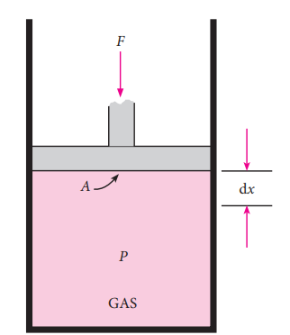

Figure 7.3 showing work involved in compression processes

\[
F = \mathrm{P_{ext}}A \qquad (7.3)
\]

Substituting 7.3 in 7.2

\[
\mathrm{w} = -\mathrm{P_{ext}} \cdot A \cdot \Delta x
\]

\[
A \cdot \Delta x = \text{change in volume} = V_{\mathrm{f}} - V_{\mathrm{i}}
\]

\[
\mathrm{w} = -\mathrm{P_{ext}} \cdot (V_{\mathrm{f}} - V_{\mathrm{i}}) \qquad (7.4)
\]

\[
\mathrm{w} = -\mathrm{P_{ext}} \cdot (-\Delta V) \qquad (7.5)
\]

\[
\mathrm{w} = -\mathrm{P_{ext}} \cdot \Delta V
\]

Since work is done on the system, it is a positive quantity.

If the pressure is not constant, but changes during the process such that it is always infinitesimally greater than the pressure of the gas, then, at each stage of compression, the volume decreases by an infinitesimal amount, dV. In such a case we can calculate the work done on the gas by the relation

\[
w_{\mathrm{rev}} = -\int_{V_i}^{V_f} P_{\mathrm{ext}} dV
\]

In a compression process, \( \mathrm{P}_{\mathrm{ext}} \) the external pressure is always greater than the pressure of the system.

i.e. \( \mathrm{P_{ext} = (P_{int} + dP)} \).

In an expansion process, the external pressure is always less than the pressure of the system

i.e. \( \mathrm{P_{ext} = (P_{int} - dP)} \).

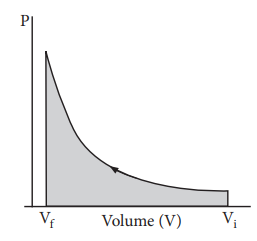

Figure 7.4

When pressure is not constant and changes in infinitesimally small steps (reversible conditions) during compression from \( \mathrm{V}_{\mathrm{i}} \) to \( \mathrm{V}_{\mathrm{f}} \), the P-V plot looks like in fig 7.4. Work done on the gas is represented by the shaded area.

In general case we can write,

\[
\mathrm{P_{ext} = (P_{int} \pm dP)}.
\]

are called reversible processes. For a compression process work can be related to internal pressure of the system under reversible conditions by writing equation

\[
w_{\mathrm{rev}} = -\int_{V_i}^{V_f} \mathrm{P}_{\mathrm{int}} \mathrm{d}V
\]

For a given system with an ideal gas

\[
\begin{aligned}
& \mathrm{P}_{\mathrm{int}} \mathrm{V} = \mathrm{nRT} \\
& \mathrm{P}_{\mathrm{int}} = \frac{\mathrm{nRT}}{\mathrm{V}} \\
& w_{\mathrm{rev}} = -\int_{\mathrm{V}_i}^{\mathrm{V}_f} \frac{\mathrm{nRT}}{\mathrm{V}} \mathrm{d}V \\
& w_{\mathrm{rev}} = -\mathrm{nRT} \int_{\mathrm{V}_i}^{\mathrm{V}_f} \left( \frac{\mathrm{d}V}{\mathrm{V}} \right) \\
& w_{\mathrm{rev}} = -\mathrm{nRT} \ln \left( \frac{V_f}{V_i} \right) \\
& w_{\mathrm{rev}} = -2.303 \ \mathrm{nRT} \log \left( \frac{V_f}{V_i} \right) \qquad (7.6)
\end{aligned}
\]

If \( \mathrm{V}_{\mathrm{f}} > \mathrm{V}_{\mathrm{i}} \) (expansion), the sign of work done by the process is negative.

If \( \mathrm{V}_{\mathrm{f}} < \mathrm{V}_{\mathrm{i}} \) (compression) the sign of work done on the process is positive.

**Table 7.3 Summary of sign conventions**

| | |
|---|---|
| 1. If heat is absorbed by the system: | \( +q \) |
| 2. If heat is evolved by the system: | \( -q \) |
| 3. work is done by the system: | \( -w \) |
| 4. work is done on the system: | \( +w \) |

### 7.3 Zeroth law of thermodynamics

The zeroth law of thermodynamics, also known as the law of thermal equilibrium, was put forward much after the establishment of the first and second laws of thermodynamics. It is placed before the first and second laws as it provides a logical basis for the concept of temperature of the system.

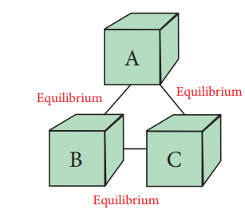

Figure 7.5 Zeroth law of thermodynamics

The law states that 'If two systems are separately in thermal equilibrium with a third one, then they tend to be in thermal equilibrium with themselves'.

According to this law, if systems B and C separately are in thermal equilibrium with another system A, then systems B and C will also be in thermal equilibrium with each other. This is also the principle by which thermometers are used.

### 7.4 First Law of Thermodynamics

The first law of thermodynamics, known as the law of conservation of energy, states that the total energy of an isolated system remains constant though it may change from one form to another.

When a system moves from state 1 to state 2, its internal energy changes from \( \mathrm{U}_{1} \) to \( \mathrm{U}_{2} \). Then change in internal energy

This internal energy change is brought about by the either absorption or evolution of heat and/or by work being done by/on the system.

Because the total energy of the system must remain constant, we can write the mathematical statement of the First Law as:

\[
\Delta \mathrm{U} = \mathrm{q} + \mathrm{w} \qquad (7.7)
\]

Where \( \mathrm{q} \) - the amount of heat supplied to the system; w - work done on the system

**Other statements of first law of thermodynamics**

(1) Whenever an energy of a particular type disappears, an equivalent amount of another type must be produced.

(2) The total energy of a system and surrounding remains constant (or conserved)

(3) "Energy can neither be created nor destroyed, but may be converted from one form to another".

(4) "The change in the internal energy of a closed system is equal to the energy that passes through its boundary as heat or work".

(5) "Heat and work are two ways of changing a system's internal energy".

#### 7.4.1 Mathematical statement of the first law

The mathematical statement of the first law of thermodynamics is

\[
\Delta \mathbf{U} = \mathbf{q} + \mathbf{w} \qquad (7.7)
\]

**Case 1:** For a cyclic process involving isothermal expansion of an ideal gas,

\[
\Delta \mathbf{U} = 0.
\]

\[
\text{eq}(7.7) \Rightarrow \therefore \mathrm{q} = -\mathrm{w}
\]

In other words, during a cyclic process, the amount of heat absorbed by the system is equal to work done by the system.

**Case 2:** For an isochoric process (no change in volume) there is no work of expansion. i.e. \( \Delta V = 0 \)

\[
\Delta \mathbf{U} = \mathbf{q} + \mathbf{w}
\]
\[
= \mathbf{q} - \mathbf{P} \Delta \mathbf{V}
\]
\[
\Delta \mathbf{V} = \mathbf{0}
\]
\[
\Delta \mathbf{U} = \mathbf{q}_{\mathbf{v}}
\]

In other words, during an isochoric process, the amount of heat supplied to the system is converted to its internal energy.

**Case 3:** For an adiabatic process there is no change in heat. i.e. \( \mathrm{q} = 0 \). Hence

\[
\mathrm{q} = 0
\]
\[
\text{eq}(7.7) \Rightarrow \Delta \mathbf{U} = \mathbf{w}
\]

In other words, in an adiabatic process, the decrease in internal energy is exactly equal to the work done by the system on its surroundings.

**Case 4:** For an isobaric process. There is no change in the pressure. P remains constant. Hence

\[
\Delta \mathbf{U} = \mathbf{q} + \mathbf{w}
\]
\[
\Delta \mathbf{U} = \mathbf{q} - \mathbf{P} \Delta \mathbf{V}
\]

In other words, in an isobaric process a part of heat absorbed by the system is used for P-V expansion work and the remaining is added to the internal energy of the system.

**Problem 7.1**

A gas contained in a cylinder fitted with a frictionless piston expands against a constant external pressure of 1 atm from a volume of 5 litres to a volume of 10 litres. In doing so it absorbs 400 J of thermal energy from its surroundings. Determine the change in internal energy of system.

**Solution:**

Given data \( \mathrm{q} = 400 \ \mathrm{J} \), \( V_1 = 5 \ \mathrm{L} \), \( V_2 = 10 \ \mathrm{L} \)

\[
\Delta \mathrm{U} = \mathrm{q} - \mathrm{w} \ \text{(heat is given to the system } (+q) \text{ work is done by the system } (-w))
\]

\[
\Delta \mathrm{U} = \mathrm{q} - \mathrm{P} dV
\]
\[
= 400 \ \mathrm{J} - 1 \ \mathrm{atm} \ (10 - 5) \ \mathrm{L}
\]
\[
= 400 \ \mathrm{J} - 5 \ \mathrm{atm} \ \mathrm{L}
\]
\[
[\because 1 \ \mathrm{L} \ \mathrm{atm} = 101.33 \ \mathrm{J}]
\]
\[
= 400 \ \mathrm{J} - 5 \times 101.33 \ \mathrm{J}
\]
\[
= 400 \ \mathrm{J} - 506.65 \ \mathrm{J}
\]
\[
= -106.65 \ \mathrm{J}
\]

### 7.5 Enthalpy (H)

The enthalpy (H), is a thermodynamic property of a system, is defined as the sum of the internal energy \( (U) \) of a system and the product of pressure and volume of the system. That is,

\[
{\mathrm{H}} = {\mathrm{U}} + {\mathrm{PV}} \qquad (7.8)
\]

It reflects the capacity to do mechanical work and the capacity to release heat by the system. When a process occurs at constant pressure, the heat involved (either released or absorbed) is equal to the change in enthalpy.

Enthalpy is a state function which depends entirely on the state functions T, P and U. Enthalpy is usually expressed as the change in enthalpy \( (\Delta H) \) for a process between initial and final states at constant pressure.

\[
\Delta H = \Delta U + P \Delta V \qquad (7.9)
\]

The change in enthalpy \( (\Delta H) \) is equal to the heat supplied at the constant pressure to a system (as long as the system does no additional work).

\[
\Delta H = q_{\mathrm{p}}
\]

In an endothermic reaction heat is absorbed by the system from the surroundings that is \( q > 0 \) (positive). Therefore, \( \Delta H \) is also positive. In an exothermic reaction heat is evolved by the system to the surroundings that is, \( q < 0 \) (negative). If \( q \) is negative, then \( \Delta H \) will also be negative.

#### 7.5.1 Relation between enthalpy \( \mathrm{H} \) and internal energy \( \mathrm{U} \)

When the system at constant pressure undergoes changes from an initial state with \( \mathrm{H}_{1} \), \( \mathrm{U}_{1} \) and \( \mathrm{V}_{1} \) to a final state with \( \mathrm{H}_{2} \), \( \mathrm{U}_{2} \) and \( \mathrm{V}_{2} \) the change in enthalpy \( \Delta H \), can be calculated as follows:

\[
\mathrm{H} = \mathrm{U} + \mathrm{PV}
\]

In the initial state

\[
\mathrm{H}_{1} = \mathrm{U}_{1} + \mathrm{PV}_{1} \qquad (7.10)
\]

In the final state

\[
\mathrm{H}_{2} = \mathrm{U}_{2} + \mathrm{PV}_{2} \qquad (7.11)
\]

Change in enthalpy is (7.11) - (7.10)

\[
(\mathrm{H}_{2} - \mathrm{H}_{1}) = (\mathrm{U}_{2} - \mathrm{U}_{1}) + \mathrm{P}(\mathrm{V}_{2} - \mathrm{V}_{1})
\]

\[
\Delta \mathrm{H} = \Delta \mathrm{U} + \mathrm{P} \Delta \mathrm{V} \qquad (7.12)
\]

As per first law of thermodynamics,

\[
\Delta \mathrm{U} = \mathrm{q} + \mathrm{w}
\]

Equation 7.12 becomes

\[
\Delta \mathrm{H} = \mathrm{q} + \mathrm{w} + \mathrm{P} \Delta \mathrm{V}
\]

\[
w = -P \Delta V
\]

\[
\Delta \mathrm{H} = \mathrm{q}_{\mathrm{p}} - \mathrm{P} \Delta \mathrm{V} + \mathrm{P} \Delta \mathrm{V}
\]

\[
\Delta \mathrm{H} = \mathrm{q}_{\mathrm{p}} \qquad (7.13)
\]

\( \mathrm{q}_{\mathrm{p}} \) is the heat absorbed at constant pressure and is considered as heat content.

Consider a closed system of gases which are chemically reacting to form gaseous products at constant temperature and pressure with \( \mathrm{V}_i \) and \( \mathrm{V}_f \) as the total volumes of the reactant and product gases respectively, and \( \mathrm{n}_i \) and \( \mathrm{n}_f \) as the number of moles of gaseous reactants and products, then,

For reactants (initial state):

\[
\mathrm{PV_i = n_i RT} \qquad (7.14)
\]

For products (final state):

\[
\mathrm{PV_f = n_f RT} \qquad (7.15)
\]

(7.15) - (7.14)

\[
\mathrm{P(V_f - V_i) = (n_f - n_i)RT}
\]

\[
\mathrm{P \Delta V = \Delta n_{(g)} RT} \qquad (7.16)
\]

Substituting 7.16 in 7.12

\[
\Delta \mathrm{H} = \Delta \mathrm{U} + \Delta \mathrm{n}_{(\mathrm{g})} \mathrm{RT} \qquad (7.17)
\]

#### 7.5.2 Enthalpy Changes for Different Types of Reactions and Phase Transitions

The heat or enthalpy changes accompanying chemical reactions is expressed in different ways depending on the nature of the reaction. These are discussed below.

##### Standard heat of formation

The standard heat of formation of a compound is defined as "the change in enthalpy that takes place when one mole of a compound is formed from its elements, present in their standard states (298 K and 1 bar pressure)". By convention the standard heat of formation of all elements is assigned a value of zero.

\[
\mathrm{Fe(s) + S(s) \rightarrow FeS(s)}
\]
\[
\Delta \mathrm{H}_\mathrm{f}^0 = -100.42 \ \mathrm{kJ \ mol^{-1}}
\]

\[
2\mathrm{C(s) + H_2(g) \rightarrow C_2H_2(g)}
\]
\[
\Delta \mathrm{H}_\mathrm{f}^0 = +222.33 \ \mathrm{kJ \ mol^{-1}}
\]

\[
\frac{1}{2}\mathrm{Cl_2(g) + \frac{1}{2}H_2(g) \rightarrow HCl(g)}
\]
\[
\Delta \mathrm{H}_\mathrm{f}^0 = -92.4 \ \mathrm{kJ \ mol^{-1}}
\]

The standard heats of formation of some compounds are given in Table 7.4.

**Table 7.4 standard heat of formation of some compounds**

| Substance | \( \Delta H_f \) (kJ mol\(^{-1}\)) | Substance | \( \Delta H_f \) (kJ mol\(^{-1}\)) |
|---|---|---|---|
| \( H_2O(l) \) | -242 | \( CH_4(g) \) | -74.85 |
| \( HCl(g) \) | -92.4 | \( C_2H_6(g) \) | -84.6 |
| \( HBr(g) \) | -36.4 | \( C_6H_6(g) \) | +49.6 |
| \( NH_3(g) \) | -46.1 | \( C_2H_2(g) \) | +222.33 |
| \( CO_2(g) \) | -393.5 | \( CH_3OH(l) \) | -239.2 |

### 7.6 Thermochemical Equations

A thermochemical equation is a balanced stoichiometric chemical equation that includes the enthalpy change \( (\Delta \mathrm{H}) \). The following conventions are adopted in thermochemical equations:

(i) The coefficients in a balanced thermochemical equation refer to number of moles of reactants and products involved in the reaction.

(ii) The enthalpy change of the reaction \( \Delta \mathrm{H}_{\mathrm{r}} \) has to be specified with appropriate sign and unit.

(iii) When the chemical reaction is reversed, the value of \( \Delta \mathrm{H} \) is reversed in sign with the same magnitude.

(iv) The physical states (gas, liquid, aqueous, solid in brackets) of all species are important and must be specified in a thermochemical reaction, since \( \Delta \mathrm{H} \) depends on the physical state of reactants and products.

(v) If the thermochemical equation is multiplied throughout by a number, the enthalpy change is also multiplied by the same number.

(vi) The negative sign of \( \Delta \mathrm{H}_{\mathrm{r}} \) indicates that the reaction is exothermic and the positive sign of \( \Delta \mathrm{H}_{\mathrm{r}} \) indicates an endothermic reaction.

For example, consider the following reaction,

\[
2\mathrm{H}_{2}(\mathrm{g}) + \mathrm{O}_{2}(\mathrm{g}) \rightarrow 2\mathrm{H}_{2}\mathrm{O}(\mathrm{g})
\]
\[
\Delta \mathrm{H}_{\mathrm{r}}^{0} = -967.4 \ \mathrm{kJ}
\]

\[
2\mathrm{H}_{2}\mathrm{O}(\mathrm{g}) \rightarrow 2\mathrm{H}_{2}(\mathrm{g}) + \mathrm{O}_{2}(\mathrm{g})
\]
\[
\Delta \mathrm{H}_{\mathrm{r}}^{0} = +967.4 \ \mathrm{kJ}
\]

#### Standard enthalpy of reaction \( (\Delta \mathrm{H}_{\mathrm{r}}^{0}) \) from standard enthalpy of formation \( (\Delta \mathrm{H}_{f}^{0}) \)

The standard enthalpy of a reaction is the enthalpy change for a reaction when all the reactants and products are present in their standard states. Standard conditions are denoted by adding the superscript 0 to the symbol \( (\Delta \mathrm{H}^{0}) \).

We can calculate the enthalpy of a reaction under standard conditions from the values of standard enthalpies of formation of various reactants and products. The standard enthalpy of reaction is equal to the difference between standard enthalpy of formation of products and the standard enthalpies of formation of reactants.

\[
\Delta \mathrm{H}_{\mathrm{r}}^{0} = \Sigma \Delta \mathrm{H}_{\mathrm{f}}^{0} \text{(products)} - \Sigma \Delta \mathrm{H}_{\mathrm{f}}^{0} \text{(reactants)}
\]

For a general reaction

\[
\mathrm{aA + bB \rightarrow cC + dD}
\]

\[
\Delta \mathrm{H}_{\mathrm{r}}^{0} = \Sigma \Delta \mathrm{H}_{\mathrm{f}}^{0} \text{(products)} - \Sigma \Delta \mathrm{H}_{\mathrm{f}}^{0} \text{(reactants)}
\]

\[
\Delta \mathrm{H}_{\mathrm{r}}^{0} = \{ \mathrm{c} \Delta \mathrm{H}_{\mathrm{f}}^{0}(\mathrm{C}) + \mathrm{d} \Delta \mathrm{H}_{\mathrm{f}}^{0}(D) \} - \{ \mathrm{a} \Delta \mathrm{H}_{\mathrm{f}}^{0}(\mathrm{A}) + \mathrm{b} \Delta \mathrm{H}_{\mathrm{f}}^{0}(\mathrm{B}) \}
\]

**Problem 7.2**

The standard enthalpies of formation of \( \mathrm{C}_{2}\mathrm{H}_{5}\mathrm{OH(l)} \), \( \mathrm{CO}_{2}(\mathrm{g}) \) and \( \mathrm{H}_{2}\mathrm{O(l)} \) are -277, -393.5 and -285.5 kJ mol\(^{-1}\) respectively. Calculate the standard enthalpy change for the reaction

\[
\mathrm{C}_{2}\mathrm{H}_{5}\mathrm{OH(l)} + 3\mathrm{O}_{2}(\mathrm{g}) \rightarrow 2\mathrm{CO}_{2}(\mathrm{g}) + 3\mathrm{H}_{2}\mathrm{O(l)}
\]

The enthalpy of formation of \( \mathrm{O}_{2}(\mathrm{g}) \) in the standard state is Zero, by definition.

**Solution:**

For example, the standard enthalpy change for the combustion of ethanol can be calculated from the standard enthalpies of formation of \( \mathrm{C}_{2}\mathrm{H}_{5}\mathrm{OH(l)} \), \( \mathrm{CO}_{2}(\mathrm{g}) \) and \( \mathrm{H}_{2}\mathrm{O(l)} \). The enthalpies of formation are -277, -393.5 and -285.5 kJ mol\(^{-1}\) respectively.

\[
\mathrm{C}_{2}\mathrm{H}_{5}\mathrm{OH(l)} + 3\mathrm{O}_{2}(\mathrm{g}) \rightarrow 2\mathrm{CO}_{2}(\mathrm{g}) + 3\mathrm{H}_{2}\mathrm{O(l)}
\]

\[
\Delta \mathrm{H}_{\mathrm{r}}^0 = \left\{ (\Delta \mathrm{H}_{\mathrm{f}}^0)_{\text{products}} - (\Delta \mathrm{H}_{\mathrm{f}}^0)_{\text{reactants}} \right\}
\]

\[
\Delta \mathrm{H}_{\mathrm{r}}^0 = \left[ 2(\Delta \mathrm{H}_{\mathrm{f}}^0)_{\mathrm{CO}_2} + 3(\Delta \mathrm{H}_{\mathrm{f}}^0)_{\mathrm{H}_2\mathrm{O}} \right] - \left[ 1(\Delta \mathrm{H}_{\mathrm{f}}^0)_{\mathrm{C}_2\mathrm{H}_5\mathrm{OH}} + 3(\Delta \mathrm{H}_{\mathrm{f}}^0)_{\mathrm{O}_2} \right]
\]

\[
\Delta \mathrm{H}_{\mathrm{r}}^0 = \left[ \begin{array}{l} 2 \ \text{mol} (-393.5) \ \text{kJ mol}^{-1} \\ + 3 \ \text{mol} (-285.5) \ \text{kJ mol}^{-1} \end{array} \right] - \left[ \begin{array}{l} 1 \ \text{mol} (-277) \ \text{kJ mol}^{-1} \\ + 3 \ \text{mol} (0) \ \text{kJ mol}^{-1} \end{array} \right]
\]

\[
= [-787 - 856.5] - [-277]
\]
\[
= -1643.5 + 277
\]
\[
\Delta \mathrm{H}_{\mathrm{r}}^0 = -1366.5 \ \mathrm{kJ}
\]

## Evaluate Yourself - 1

Calculate \( \Delta \mathrm{H}_{\mathrm{r}}^0 \) for the reaction

\[
\mathrm{CO}_2(\mathrm{g}) + \mathrm{H}_2(\mathrm{g}) \rightarrow \mathrm{CO}(\mathrm{g}) + \mathrm{H}_2\mathrm{O}(\mathrm{g})
\]

given that \( \Delta \mathrm{H}_{\mathrm{f}}^0 \) for \( \mathrm{CO}_2(\mathrm{g}) \), CO(g) and \( \mathrm{H}_2\mathrm{O}(\mathrm{g}) \) are -393.5, -111.31 and -242 kJ mol\(^{-1}\) respectively.

#### Heat of combustion

The heat of combustion of a substance is defined as "The change in enthalpy of a system when one mole of the substance is completely burnt in excess of air or oxygen". It is denoted by \( \Delta \mathrm{H}_C \). For example, the heat of combustion of methane is -87.78 kJ mol\(^{-1}\)

\[
\mathrm{CH}_4(\mathrm{g}) + 2\mathrm{O}_2(\mathrm{g}) \rightarrow \mathrm{CO}_2(\mathrm{g}) + 2\mathrm{H}_2\mathrm{O}(\mathrm{l})
\]
\[
\Delta \mathrm{H}_C = -87.78 \ \mathrm{kJ \ mol^{-1}}
\]

For the combustion of carbon,

\[
\mathrm{C(s)} + \mathrm{O}_2(\mathrm{g}) \rightarrow \mathrm{CO}_2(\mathrm{g})
\]
\[
\Delta \mathrm{H}_C = -394.55 \ \mathrm{kJ \ mol^{-1}}
\]

Combustion reactions are always exothermic. Hence the enthalpy change is always negative.

#### Molar heat capacities

When heat (q) is supplied to a system, the molecules in the system absorb the heat and hence their kinetic energy increases, which in turn raises the temperature of the system from \( \mathrm{T}_1 \) to \( \mathrm{T}_2 \). This increase \( (\mathrm{T}_2 - \mathrm{T}_1) \) in temperature is directly proportional to the amount of heat absorbed and inversely proportional to mass of the substance. In other words,

\[
\mathrm{q} \propto \mathrm{m} \Delta \mathrm{T}
\]
\[
\mathrm{q} = \mathrm{c} \mathrm{m} \Delta \mathrm{T}
\]
\[
\mathrm{c} = \mathrm{q} / \mathrm{m} \Delta \mathrm{T}
\]

The constant \( \mathrm{c} \) is called heat capacity.

\[
\mathrm{c} = \left( \frac{\mathrm{q}}{\mathrm{m}(\mathrm{T}_2 - \mathrm{T}_1)} \right) \qquad (7.18)
\]

when \( \mathrm{m} = 1 \ \mathrm{kg} \) and \( (\mathrm{T}_2 - \mathrm{T}_1) = 1 \ \mathrm{K} \) then the heat capacity is referred as specific heat capacity. The equation 7.18 becomes

\[
\mathrm{c} = \mathrm{q}
\]

Thus specific heat capacity of a system is defined as "The heat absorbed by one kilogram of a substance to raise its temperature by one Kelvin at a specified temperature".

The heat capacity for 1 mole of substance, is called molar heat capacity \( (c_m) \). It is defined as "The amount of heat absorbed by one mole of the substance to raise its temperature by 1 kelvin".

**Units of Heat Capacity:** The SI unit of molar heat capacity is \( \mathrm{J \ K^{-1} \ mol^{-1}} \)

The molar heat capacities can be expressed either at constant volume \( (C_{\mathrm{v}}) \) or at constant pressure \( (C_{\mathrm{p}}) \).

According to the first law of thermodynamics

\[
\mathrm{U} = \mathrm{q} + \mathrm{w} \quad \text{or} \quad \mathrm{U} = \mathrm{q} - \mathrm{P} dV
\]
\[
\mathrm{q} = \mathrm{U} + \mathrm{P} dV \qquad (7.19)
\]

Differentiate (7.19) with respect to temperature at constant volume i.e \( \mathrm{d}V = 0 \)

\[
\left( \frac{\partial \mathrm{q}}{\partial \mathrm{T}} \right)_{\mathrm{v}} = \left( \frac{\partial \mathrm{U}}{\partial \mathrm{T}} \right)_{\mathrm{v}}
\]

\[
C_{\mathrm{v}} = \left( \frac{\partial \mathrm{U}}{\partial \mathrm{T}} \right)_{\mathrm{v}} \qquad (7.20)
\]

Thus the heat capacity at constant volume \( (C_{\mathrm{v}}) \) is defined as the rate of change of internal energy with respect to temperature at constant volume.

Similarly the molar heat capacity at constant pressure \( (C_{\mathrm{p}}) \) can be defined as the rate of change of enthalpy with respect to temperature at constant pressure.

\[
c_{\mathrm{p}} = \left( \frac{\partial \mathrm{H}}{\partial \mathrm{T}} \right)_{\mathrm{p}} \qquad (7.21)
\]

##### Relation between \( C_p \) and \( C_v \) for an ideal gas

From the definition of enthalpy

\[
\mathrm{H} = \mathrm{U} + \mathrm{PV} \qquad (7.8)
\]

for 1 mole of an ideal gas

\[
\mathrm{PV} = \mathrm{nRT} \qquad (7.22)
\]

By substituting (7.22) in (7.8)

\[
\mathrm{H} = \mathrm{U} + \mathrm{nRT} \qquad (7.23)
\]

Differentiating the above equation with respect to T,

\[
\frac{\partial \mathrm{H}}{\partial \mathrm{T}} = \frac{\partial \mathrm{U}}{\partial \mathrm{T}} + \mathrm{nR} \frac{\partial \mathrm{T}}{\partial \mathrm{T}}
\]

At constant pressure processes, a system has to do work against the surroundings. Hence, the system would require more heat to effect a given temperature rise than at constant volume, so \( C_{\mathrm{p}} \) is always greater than \( C_{\mathrm{v}} \).

##### Calculation of \( \Delta \mathrm{U} \) and \( \Delta \mathrm{H} \)

For one mole of an ideal gas, we have

\[
C_{\mathrm{v}} = \frac{dU}{dT}
\]

\[
dU = C_{\mathrm{v}} dT
\]

For a finite change, we have

\[
\Delta U = C_{V} \Delta T
\]

\[
\Delta U = C_{V} (T_{2} - T_{1})
\]

and for n moles of an ideal gas we get

\[
\Delta U = \mathrm{n} C_{v} (T_{2} - T_{1}) \qquad (7.25)
\]

Similarly for \( n \) moles of an ideal gas we get

\[
\Delta H = \mathrm{n} C_{p} (T_{2} - T_{1}) \qquad (7.26)
\]

**Problem 7.3**

Calculate the value of \( \Delta \mathrm{U} \) and \( \Delta \mathrm{H} \) on heating \( 128.0 \ \mathrm{g} \) of oxygen from \( 0^{\circ} \mathrm{C} \) to \( 100^{\circ} \mathrm{C} \). \( C_{\mathrm{v}} \) and \( C_{\mathrm{p}} \) on an average are 21 and \( 29 \ \mathrm{J \ mol^{-1} \ K^{-1}} \). (The difference is \( 8 \ \mathrm{J \ mol^{-1} \ K^{-1}} \) which is approximately equal to R)

**Solution:**

We know

\[
\Delta \mathrm{U} = \mathrm{n} C_{\mathrm{v}} (T_{2} - T_{1})
\]
\[
\Delta \mathrm{H} = \mathrm{n} C_{\mathrm{p}} (T_{2} - T_{1})
\]

Here \( \mathrm{n} = \frac{128}{32} = 4 \) moles;

\[
T_{2} = 100^{\circ} \mathrm{C} = 373 \ \mathrm{K}; \quad T_{1} = 0^{\circ} \mathrm{C} = 273 \ \mathrm{K}
\]

\[
\Delta \mathrm{U} = \mathrm{n} C_{\mathrm{v}} (T_{2} - T_{1})
\]
\[
\Delta \mathrm{U} = 4 \times 21 \times (373 - 273)
\]
\[
\Delta \mathrm{U} = 8400 \ \mathrm{J}
\]
\[
\Delta \mathrm{U} = 8.4 \ \mathrm{kJ}
\]

\[
\Delta \mathrm{H} = \mathrm{n} C_{\mathrm{p}} (T_{2} - T_{1})
\]
\[
\Delta \mathrm{H} = 4 \times 29 \times (373 - 273)
\]
\[
\Delta \mathrm{H} = 11600 \ \mathrm{J}
\]
\[
\Delta \mathrm{H} = 11.6 \ \mathrm{kJ}
\]

## Evaluate Yourself-2

Calculate the amount of heat necessary to raise \( 180 \ \mathrm{g} \) of water from \( 25^{\circ} \mathrm{C} \) to \( 100^{\circ} \mathrm{C} \). Molar heat capacity of water is \( 75.3 \ \mathrm{J \ mol^{-1} \ K^{-1}} \).

### 7.7 Measurement of \( \Delta \mathrm{U} \) and \( \Delta \mathrm{H} \) using Calorimetry

Calorimeter is used for measuring the amount of heat change in a chemical or physical change. In calorimetry, the temperature change in the process is measured which is inversely proportional to the heat change. By using the expression \( \mathrm{C} = \mathrm{q} / \mathrm{m} \Delta \mathrm{T} \), we can calculate the amount of heat change in the process. Calorimetric measurements are made under two different conditions

(i) At constant volume \( (q_{V}) \)
(ii) At constant pressure \( (q_{p}) \)

#### (A) \( \Delta \mathrm{U} \) Measurements

For chemical reactions, heat evolved at constant volume, is measured in a bomb calorimeter.

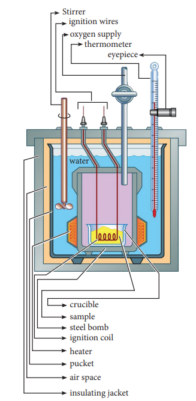

Figure 7.6 Bomb calorimeter

A weighed amount of the substance is taken in a platinum cup connected with electrical wires for striking an arc instantly to kindle combustion. The bomb is then tightly closed and pressurized with excess oxygen. The bomb is immersed in water, in the inner volume of the calorimeter. A stirrer is placed in the space between the wall of the calorimeter and the bomb, so that water can be stirred, uniformly. The reaction is started by striking the substance through electrical heating.

A known amount of combustible substance is burnt in oxygen in the bomb. Heat evolved during the reaction is absorbed by the calorimeter as well as the water in which the bomb is immersed. The change in temperature is measured using a Beckman thermometer. Since the bomb is sealed its volume does not change and hence the heat measurements is equal to the heat of combustion at a constant volume \( (\Delta \mathrm{U}_{\mathrm{c}}^{0}) \).

The amount of heat produced in the reaction \( (\Delta \mathrm{U}_{\mathrm{c}}^{0}) \) is equal to the sum of the heat absorbed by the calorimeter and water.

Heat absorbed by the calorimeter

\[
\mathrm{q}_1 = \mathrm{k} \cdot \Delta \mathrm{T}
\]

where \( \mathrm{k} \) is a calorimeter constant equal to \( \mathrm{m}_{\mathrm{c}} \mathrm{C}_{\mathrm{c}} \) ( \( \mathrm{m}_{\mathrm{c}} \) is mass of the calorimeter and \( \mathrm{C}_{\mathrm{c}} \) is heat capacity of calorimeter)

Heat absorbed by the water

\[
\mathrm{q}_2 = \mathrm{m}_{\mathrm{w}} \mathrm{C}_{\mathrm{w}} \Delta \mathrm{T}
\]

where \( \mathrm{m}_{\mathrm{w}} \) is mass of water, \( \mathrm{C}_{\mathrm{w}} \) is molar heat capacity of water (75.29 J K\(^{-1}\) mol\(^{-1}\))

Therefore \( \Delta \mathrm{U}_{\mathrm{c}} = \mathrm{q}_{1} + \mathrm{q}_{2} \)

\[
= \mathrm{k} \cdot \Delta \mathrm{T} + \mathrm{m}_{\mathrm{w}} \mathrm{C}_{\mathrm{w}} \Delta \mathrm{T}
\]
\[
= (\mathrm{k} + \mathrm{m}_{\mathrm{w}} \mathrm{C}_{\mathrm{w}}) \Delta \mathrm{T}
\]

Calorimeter constant can be determined by burning a known mass of standard sample (benzoic acid) for which the heat of combustion is known (-3227 kJ mol\(^{-1}\))

The enthalpy of combustion at constant pressure of the substance is calculated from the equation (7.17)

\[
\Delta \mathrm{H}_{\mathrm{C}}^{0}(\text{pressure}) = \Delta \mathrm{U}_{\mathrm{C}}^{0}(\text{Vol}) + \Delta \mathrm{n}_{\mathrm{g}} \mathrm{RT}
\]

**Applications of bomb calorimeter:**

1. Bomb calorimeter is used to determine the amount of heat released in combustion reaction.
2. It is used to determine the calorific value of food.
3. Bomb calorimeter is used in many industries such as metabolic study, food processing, explosive testing etc.

#### (B) \( \Delta \mathrm{H} \) Measurements

Heat change at constant pressure (at atmospheric pressure) can be measured using a coffee cup calorimeter. A schematic representation of a coffee cup calorimeter is given in Figure 7.7. Instead of bomb, a styrofoam cup is used in this calorimeter. It acts as good adiabatic wall and doesn't allow transfer of heat produced during the reaction to its surrounding. This entire heat energy is absorbed by the water inside the cup. This method can be used for the reactions where there is no appreciable change in volume. The change in the temperature of water is measured and used to calculate the amount of heat that has been absorbed or evolved in the reaction using the following expression.

\[
q = \mathrm{m}_{\mathrm{w}} \mathrm{C}_{\mathrm{w}} \Delta \mathrm{T}
\]

where \( \mathrm{m}_{\mathrm{w}} \) is the mass of water and \( \mathrm{C}_{\mathrm{w}} \) is the specific heat capacity of water (4.184 J g\(^{-1}\) K\(^{-1}\))

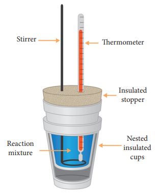

Figure 7.7 Coffee cup Calorimeter

**Problem 7.4**

Calculate the enthalpy of combustion of ethylene at \( 300 \ \mathrm{K} \) at constant pressure, if its heat of combustion at constant volume \( (\Delta \mathrm{U}) \) is \( -1406 \ \mathrm{kJ} \).

The complete ethylene combustion reaction can be written as,

\[
\mathrm{C_2H_4(g) + 3O_2(g) \rightarrow 2CO_2(g) + 2H_2O(l)}
\]

\[
\Delta \mathrm{U} = -1406 \ \mathrm{kJ}
\]

\[
\Delta \mathrm{n} = \mathrm{n}_{\mathrm{p}(\mathrm{g})} - \mathrm{n}_{\mathrm{r}(\mathrm{g})}
\]

\[
\Delta \mathrm{n} = 2 - 4 = -2
\]

\[
\Delta \mathrm{H} = \Delta \mathrm{U} + \mathrm{RT} \Delta \mathrm{n}_{\mathrm{g}}
\]

\[
\Delta \mathrm{H} = -1406 + (8.314 \times 10^{-3} \times 300 \times (-2))
\]

\[
\Delta \mathrm{H} = -1410.9 \ \mathrm{kJ}
\]

## Evaluate Yourself-3

From the following data at constant volume for combustion of benzene, calculate the heat of this reaction at constant pressure condition.

\[
\mathrm{C}_6\mathrm{H}_6(l) + \frac{15}{2} \mathrm{O}_2(g) \rightarrow 6\mathrm{CO}_2(g) + 3\mathrm{H}_2\mathrm{O}(l)
\]
\[
\Delta \mathrm{U} \text{ at } 25^{\circ} \mathrm{C} = -3268.12 \ \mathrm{kJ}
\]

#### Applications of the heat of combustion

**(1) Calculation of heat of formation:** Since the heat of combustion of organic compounds can be determined with considerable ease, they are employed to calculate the heat of formation of other compounds.

For example let us calculate the standard enthalpy of formation \( \Delta \mathrm{H}_f^0 \) of \( \mathrm{CH}_4 \) from the values of enthalpy of combustion for \( \mathrm{H}_2, \mathrm{C}(\text{graphite}) \) and \( \mathrm{CH}_4 \) which are -285.8, -393.5, and -890.4 kJ mol\(^{-1}\) respectively.

Let us interpret the information about enthalpy of formation by writing out the equations. It is important to note that the standard enthalpy of formation of pure elemental gases and elements is assumed to be zero under standard conditions. Thermochemical equation for the formation of methane from its constituent elements is,

\[
\mathrm{C}_{(\text{graphite})} + 2\mathrm{H}_{2}(g) \rightarrow \mathrm{CH}_{4}(g)
\]
\[
\Delta \mathrm{H}_{f}^{0} = \mathrm{X} \ \mathrm{kJ \ mol^{-1}} \qquad \text{(i)}
\]

Thermo chemical equations for the combustion of given substances are,

\[
\mathrm{H}_{2}(g) + \frac{1}{2}\mathrm{O}_{2} \rightarrow \mathrm{H}_{2}\mathrm{O}(l)
\]
\[
\Delta \mathrm{H}^{0} = -285.8 \ \mathrm{kJ \ mol^{-1}} \qquad \text{(ii)}
\]

\[
\mathrm{C}_{(\text{graphite})} + \mathrm{O}_{2} \rightarrow \mathrm{CO}_{2}
\]
\[
\Delta \mathrm{H}^{0} = -393.5 \ \mathrm{kJ \ mol^{-1}} \qquad \text{(iii)}
\]

\[
\mathrm{CH}_4(g) + 2\mathrm{O}_2 \rightarrow \mathrm{CO}_2(g) + 2\mathrm{H}_2\mathrm{O}(l)
\]
\[
\Delta \mathrm{H}^{0} = -890.4 \ \mathrm{kJ \ mol^{-1}} \qquad \text{(iv)}
\]

Since methane is in the product side of the required equation (i), we have to reverse the equation (iv)

\[
\mathrm{CO}_{2}(g) + 2\mathrm{H}_{2}\mathrm{O}(l) \rightarrow \mathrm{CH}_{4}(g) + 2\mathrm{O}_{2}
\]
\[
\Delta \mathrm{H}^{0} = +890.4 \ \mathrm{kJ \ mol^{-1}} \qquad \text{(v)}
\]

In order to get equation (i) from the remaining,

\[
\text{(i)} = [\text{(ii)} \times 2] + \text{(iii)} + \text{(v)}
\]

\[
\mathrm{X} = [(-285.8) \times 2] + [-393.5] + [+890.4]
\]
\[
= -74.7 \ \mathrm{kJ}
\]

**(2) Calculation of calorific value of food and fuels:** The calorific value is defined as the amount of heat produced in calories (or joules) when one gram of the substance is completely burnt. The SI unit of calorific value is J kg\(^{-1}\). However, it is usually expressed in cal g\(^{-1}\).

#### Heat of solution

Heat changes are usually observed when a substance is dissolved in a solvent. The heat of solution is defined as the change in enthalpy when one mole of a substance is dissolved in a specified quantity of solvent at a given temperature.

#### Heat of neutralisation

The heat of neutralisation is defined as "The change in enthalpy when one gram equivalent of an acid is completely neutralised by one gram equivalent of a base or vice versa in dilute solution".

\[
\mathrm{HCl(aq) + NaOH(aq) \rightarrow NaCl(aq) + H_2O(l)}
\]
\[
\Delta \mathrm{H} = -57.32 \ \mathrm{kJ}
\]

\[
\mathrm{H}^{+}(\mathrm{aq}) + \mathrm{OH}^{-}(\mathrm{aq}) \rightarrow \mathrm{H}_{2}\mathrm{O}(\mathrm{l})
\]
\[
\Delta \mathrm{H} = -57.32 \ \mathrm{kJ}
\]

The heat of neutralisation of a strong acid and strong base is around -57.32 kJ, irrespective of nature of acid or base used which is evident from the below mentioned examples.

\[
\mathrm{HCl(aq) + KOH(aq) \rightarrow KCl(aq) + H_2O(l)}
\]
\[
\Delta \mathrm{H} = -57.32 \ \mathrm{kJ}
\]

\[
\mathrm{HNO_3(aq) + KOH(aq) \rightarrow KNO_3(aq) + H_2O(l)}
\]
\[
\Delta \mathrm{H} = -57.32 \ \mathrm{kJ}
\]

\[
\mathrm{H_2SO_4(aq) + 2KOH(aq) \rightarrow K_2SO_4(aq) + 2H_2O(l)}
\]
\[
\Delta \mathrm{H} = -57.32 \ \mathrm{kJ} \times 2
\]

The reason for this can be explained on the basis of Arrhenius theory of acids and bases which states that strong acids and strong bases completely ionise in aqueous solution to produce \( \mathrm{H}^{+} \) and \( \mathrm{OH}^{-} \) ions respectively. Therefore in all the above mentioned reactions the neutralisation can be expressed as follows.

\[
\mathrm{H}^{+}(\mathrm{aq}) + \mathrm{OH}^{-}(\mathrm{aq}) \rightarrow \mathrm{H}_{2}\mathrm{O}(\mathrm{l})
\]
\[
\Delta \mathrm{H} = -57.32 \ \mathrm{kJ}
\]

#### Molar heat of fusion

The molar heat of fusion is defined as "the change in enthalpy when one mole of a solid substance is converted into the liquid state at its melting point".

For example, the heat of fusion of ice can be represented as

\[
\mathrm{H_2O(s)} \xrightarrow{273 \ \mathrm{K}} \mathrm{H_2O(l)} \quad \Delta \mathrm{H}_{\text{fusion}} = +5.98 \ \mathrm{kJ}
\]

#### Molar heat of vapourisation

The molar heat of vapourisation is defined as "the change in enthalpy when one mole of liquid is converted into vapour state at its boiling point".

For example, heat of vaporisation of water can be represented as

\[
\mathrm{H}_2\mathrm{O(l)} \xrightarrow{373 \ \mathrm{K}} \mathrm{H}_2\mathrm{O(v)} \quad \Delta \mathrm{H}_{\text{vap}} = +40.626 \ \mathrm{kJ}
\]

#### Molar heat of sublimation

Sublimation is a process when a solid changes directly into its vapour state without changing into liquid state. Molar heat of sublimation is defined as "the change in enthalpy when one mole of a solid is directly converted into the vapour state at its sublimation temperature". For example, the heat of sublimation of iodine is represented as

\[
\mathrm{I}_2(\mathrm{s}) \xrightarrow{373 \ \mathrm{K}} \mathrm{I}_2(\mathrm{v}) \quad \Delta \mathrm{H}_{\text{sub}} = +62.42 \ \mathrm{kJ}
\]

Another example of sublimation process is solid \( \mathrm{CO}_2 \) to gas at atmospheric pressure at very low temperatures.

#### Heat of transition

The heat of transition is defined as "The change in enthalpy when one mole of an element changes from one of its allotropic form to another. For example, the transition of diamond into graphite may be represented as

\[
\mathrm{C}_{(\text{diamond})} \longrightarrow \mathrm{C}_{(\text{graphite})} \qquad \Delta \mathrm{H}_{\text{trans}} = +13.81 \ \mathrm{kJ}
\]

Similarly the allotropic transitions in sulphur and phosphorous can be represented as follows,

\[
\mathrm{S}_{(\text{monoclinic})} \longrightarrow \mathrm{S}_{(\text{rhombic})}
\]
\[
\Delta \mathrm{H}_{\text{trans}} = -0.067 \ \mathrm{kJ}
\]

\[
\mathrm{P}_{(\text{white})} \longrightarrow \mathrm{P}_{(\text{red})} \qquad \Delta \mathrm{H}_{\text{trans}} = -4.301 \ \mathrm{kJ}
\]

### 7.8 Hess's law of constant heat summation

We have already seen that the heat changes in chemical reactions are equal to the difference in internal energy \( (\Delta \mathrm{U}) \) or heat content \( (\Delta \mathrm{H}) \) of the products and reactants, depending upon whether the reaction is studied at constant volume or constant pressure. Since \( \Delta \mathrm{U} \) and \( \Delta \mathrm{H} \) are functions of the state of the system, the heat evolved or absorbed in a given reaction depends only on the initial state and final state of the system and not on the path or the steps by which the change takes place.

This generalisation is known as Hess's law and stated as:

The enthalpy change of a reaction either at constant volume or constant pressure is the same whether it takes place in a single or multiple steps provided the initial and final states are same.

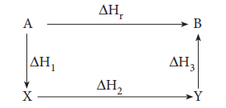
\[
\Delta \mathrm{H}_{\mathrm{r}} = \Delta \mathrm{H}_{1} + \Delta \mathrm{H}_{2} + \Delta \mathrm{H}_{3}
\]

**Application of Hess's Law:** Hess's law can be applied to calculate enthalpies of reactions that are difficult to measure. For example, it is very difficult to measure the heat of combustion of graphite to give pure CO.

However, enthalpy for the oxidation of graphite to \( \mathrm{CO}_{2} \) and \( \mathrm{CO} \) to \( \mathrm{CO}_{2} \) can easily be measured. For these conversions, the heat of combustion values are \( -393.5 \ \mathrm{kJ} \) and \( -283.5 \ \mathrm{kJ} \) respectively.

From these data the enthalpy of combustion of graphite to \( \mathrm{CO} \) can be calculated by applying Hess's law.

The reactions involved in this process can
be expressed as follows 
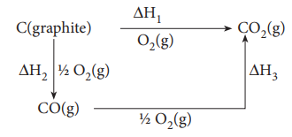
According to Hess law,

\[
\Delta H_{1} = \Delta H_{2} + \Delta H_{3}
\]
\[
-393.5 \ \mathrm{kJ} = \mathrm{X} - 283.5 \ \mathrm{kJ}
\]
\[
\mathrm{X} = -110.5 \ \mathrm{kJ}
\]

### 7.9 Lattice energy \( (\Delta H_{\text{lattice}}) \)

Lattice energy is defined as the amount of energy required to completely remove the constituent ions from its crystal lattice to an infinite distance from one mole of crystal. It is also referred as lattice enthalpy.

\[
\mathrm{NaCl(s)} \rightarrow \mathrm{Na}^{+}(g) + \mathrm{Cl}^{-}(g)
\]
\[
\Delta H_{\text{lattice}} = +788 \ \mathrm{kJ \ mol^{-1}}
\]

From the above equation it is clear that \( 788 \ \mathrm{kJ} \) of energy is required to separate \( \mathrm{Na}^{+} \) and \( \mathrm{Cl}^{-} \) ions from 1 mole of \( \mathrm{NaCl} \).

#### Born-Haber cycle

The Born-Haber cycle is an approach to analyse reaction energies. It was named after two German scientists Max Born and Fritz Haber who developed this cycle. The cycle is concerned with the formation of an ionic compound from the reaction of a metal with a halogen or other non-metallic element such as oxygen.

Born-Haber cycle is primarily used in calculating lattice energy, which cannot be measured directly. The Born-Haber cycle applies Hess's law to calculate the lattice enthalpy. For example consider the formation of a simple ionic solid such as an alkali metal halide \( \mathrm{MX} \), the following steps are considered.

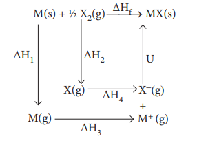
\( \Delta H_{1} \) - enthalpy change for the sublimation \( \mathrm{M(s)} \) to \( \mathrm{M(g)} \)

\( \Delta H_{2} \) - enthalpy change \( \frac{1}{2} \mathrm{X}_{2}(g) \) to \( \mathrm{X}(g) \) for the dissociation

\( \Delta H_{3} \) - Ionisation energy for \( \mathrm{M(g)} \) to \( \mathrm{M}^{+}(g) \)

\( \Delta H_{4} \) - electron affinity for the conversion of \( \mathrm{X}(g) \) to \( \mathrm{X}^{-}(g) \)

U - the lattice enthalpy for the formation of solid \( \mathrm{MX} \)

\( \Delta H_{\mathrm{f}} \) - enthalpy change for the formation of solid \( \mathrm{MX} \) directly from elements

According to Hess's law of heat summation

\[
\Delta \mathrm{H}_{f} = \Delta \mathrm{H}_{1} + \Delta \mathrm{H}_{2} + \Delta \mathrm{H}_{3} + \Delta \mathrm{H}_{4} + \mathrm{U}
\]

Let us use the Born-Haber cycle for determining the lattice enthalpy of NaCl as follows:

Since the reaction is carried out with reactants in elemental forms and products in their standard states, at 1 bar, the overall enthalpy change of the reaction is also the enthalpy of formation for NaCl. Also, the formation of NaCl can be considered in 5 steps. The sum of the enthalpy changes of these steps is equal to the enthalpy change for the overall reaction from which the lattice enthalpy of NaCl is calculated.

Let us calculate the lattice energy of sodium chloride using Born-Haber cycle

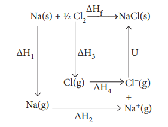

\( \Delta \mathrm{H}_{\mathrm{f}} = \) heat of formation of sodium chloride \( = -411.3 \ \mathrm{kJ \ mol^{-1}} \)

\( \Delta \mathrm{H}_{1} = \) heat of sublimation of \( \mathrm{Na(s)} = 108.7 \ \mathrm{kJ \ mol^{-1}} \)

\( \Delta \mathrm{H}_{2} = \) ionisation energy of \( \mathrm{Na(g)} = 495.0 \ \mathrm{kJ \ mol^{-1}} \)

\( \Delta \mathrm{H}_{3} = \) dissociation energy of \( \mathrm{Cl}_{2}(g) = 244 \ \mathrm{kJ \ mol^{-1}} \)

\( \Delta \mathrm{H}_{4} = \) Electron affinity of \( \mathrm{Cl(g)} = -349.0 \ \mathrm{kJ \ mol^{-1}} \)

\( \mathrm{U} = \) lattice energy of \( \mathrm{NaCl} \)

\[
\Delta \mathrm{H}_{f} = \Delta \mathrm{H}_{1} + \Delta \mathrm{H}_{2} + \frac{1}{2} \Delta \mathrm{H}_{3} + \Delta \mathrm{H}_{4} + \mathrm{U}
\]

\[
\therefore \mathrm{U} = \left( \Delta \mathrm{H}_{f} \right) - \left( \Delta \mathrm{H}_{1} + \Delta \mathrm{H}_{2} + \frac{1}{2} \Delta \mathrm{H}_{3} + \Delta \mathrm{H}_{4} \right)
\]

\[
\Rightarrow \mathrm{U} = (-411.3) - (108.7 + 495.0 + 122 - 349)
\]

\[
\mathrm{U} = (-411.3) - (376.7)
\]

\[
\therefore \mathrm{U} = -788 \ \mathrm{kJ \ mol^{-1}}
\]

This negative sign in lattice energy indicates that the energy is released when sodium chloride is formed from its constituent gaseous ions \( \mathrm{Na}^{+} \) and \( \mathrm{Cl}^{-} \).

## Evaluate Yourself-4

When a mole of magnesium bromide is prepared from 1 mole of magnesium and 1 mole of liquid bromine, 524 kJ of energy is released. The heat of sublimation of Mg metal is \( 148 \ \mathrm{kJ \ mol^{-1}} \). The heat of dissociation of bromine gas into atoms is \( 193 \ \mathrm{kJ \ mol^{-1}} \). The heat of vapourisation of liquid bromine is \( 31 \ \mathrm{kJ \ mol^{-1}} \). The first and second ionisation energies of magnesium are \( \mathrm{IE}_{1} = 737.5 \ \mathrm{kJ \ mol^{-1}} \) and \( \mathrm{IE}_{2} = 1450.5 \ \mathrm{kJ \ mol^{-1}} \) and the electron affinity of bromine is -324.5 kJ mol\(^{-1}\). Calculate the lattice energy of magnesium bromide.

### 7.10 Second Law of Thermodynamics

#### Need for the second law of thermodynamics

We know from the first law of thermodynamics, the energy of the universe is conserved. Let us consider the following processes:

1. A glass of hot water over time loses heat energy to the surrounding and becomes cold.
2. When you mix hydrochloric acid with sodium hydroxide, it forms sodium chloride and water with evolution of heat.

In both these processes, the total energy is conserved and are consistent with the first law of thermodynamics. However, the reverse process i.e. cold water becoming hot water by absorbing heat from surrounding on its own does not occur spontaneously even though the energy change involved in this process is also consistent with the first law. However, if the heat energy is supplied to cold water, then it will become hot. i.e. the change that does not occur spontaneously can be driven by supplying energy.

Similarly, a solution of sodium chloride does not absorb heat energy on its own, to form hydrochloric acid and sodium hydroxide. But, this process cannot be driven even by supplying energy. From these kinds of our natural experiences, we have come to know that certain processes are spontaneous while the others are not, and some processes have a preferred direction. In order to explain the feasibility of a process, we need the second law of thermodynamics.

#### 7.10.1 Various statements of the second law of thermodynamics

##### Entropy

The second law of thermodynamics introduces another state function called entropy. Entropy is a measure of the molecular disorder (randomness) of a system. But thermodynamic definition of entropy is concerned with the change in entropy that occurs as a result of a process.

It is defined as, \( dS = \frac{dq_{\text{rev}}}{T} \)

##### Entropy statement

The second law of thermodynamics can be expressed in terms of entropy. i.e "the entropy of an isolated system increases during a spontaneous process".

For an irreversible process such as spontaneous expansion of a gas,

\[
\Delta S_{\text{total}} > 0
\]
\[
\Delta S_{\text{total}} = \Delta S_{\text{system}} + \Delta S_{\text{surrounding}}
\]

For a reversible process such as melting of ice,

\[
\Delta S_{\text{system}} = -\Delta S_{\text{surrounding}}
\]
\[
\Delta S_{\text{total}} = 0
\]

##### Kelvin-Planck statement

It is impossible to construct a machine that absorbs heat from a hot source and converts it completely into work by a cyclic process without transferring a part of heat to a cold sink. The second law of thermodynamics explains why even an ideal, frictionless engine cannot convert \( 100\% \) of its input heat into work. Carnot on his analysis of heat engines, found that the maximum efficiency of a heat engine which operates reversibly, depends only on the two temperatures between which it is operated.

Efficiency = work performed / heat absorbed

\[
\eta = \frac{|q_{\mathrm{h}}| - |q_{\mathrm{c}}|}{|q_{\mathrm{h}}|}
\]

\( q_{\mathrm{h}} \) - heat absorbed from the hot reservoir

\( q_{\mathrm{c}} \) - heat transferred to cold reservoir

\[
\eta = 1 - \frac{|q_{\mathrm{c}}|}{|q_{\mathrm{h}}|} \qquad (7.27)
\]

For a reversible cyclic process

\[
\Delta S_{\text{total}} = \Delta S_{\text{system}} + \Delta S_{\text{surroundings}} = 0
\]
\[
\Delta S_{\text{system}} = -\Delta S_{\text{surroundings}}
\]
\[
\frac{q_{\mathrm{h}}}{T_{\mathrm{h}}} = \frac{-q_{\mathrm{c}}}{T_{\mathrm{c}}}
\]
\[
\frac{T_{\mathrm{c}}}{T_{\mathrm{h}}} = \frac{-q_{\mathrm{c}}}{q_{\mathrm{h}}}
\]
\[
\frac{T_{\mathrm{c}}}{T_{\mathrm{h}}} = \frac{|q_{\mathrm{c}}|}{|q_{\mathrm{h}}|} \qquad (7.28)
\]

Substituting 7.28 in 7.27

\[
\Rightarrow \eta = 1 - \frac{T_{\mathrm{c}}}{T_{\mathrm{h}}} \qquad (7.29)
\]

\( T_{\mathrm{h}} > > T_{\mathrm{c}} \)

Hence, \( \eta < 1 \)

Efficiency in percentage can be expressed as

\[
\text{Efficiency in percentage} = \left[1 - \frac{T_{\mathrm{c}}}{T_{\mathrm{h}}}\right] \times 100
\]

##### Clausius statement

It is impossible to transfer heat from a cold reservoir to a hot reservoir without doing some work.

**Problem 7.10**

If an automobile engine burns petrol at a temperature of \( 816^{\circ}C \) and if the surrounding temperature is \( 21^{\circ}C \) calculate its maximum possible efficiency.

**Solution:**

\[
\% \ \text{Efficiency} = \left[\frac{T_{\mathrm{h}} - T_{\mathrm{c}}}{T_{\mathrm{h}}}\right] \times 100
\]

Here

\[
T_{\mathrm{h}} = 816 + 273 = 1089 \ \mathrm{K};
\]
\[
T_{\mathrm{c}} = 21 + 273 = 294 \ \mathrm{K}
\]

\[
\% \ \text{Efficiency} = \left(\frac{1089 - 294}{1089}\right) \times 100
\]
\[
\% \ \text{Efficiency} = 73\%
\]

## Evaluate Yourself-5

An engine operating between \( 127^{\circ}C \) and \( 47^{\circ}C \) takes some specified amount of heat from a high temperature reservoir. Assuming that there are no frictional losses, calculate the percentage efficiency of an engine.

#### Unit of entropy

The entropy (S) is equal to heat energy exchanged (q) divided by the temperature (T) at which the exchange takes place. Therefore, The SI unit of entropy is J K\(^{-1}\).

#### Spontaneity and Randomness

Careful examination shows that in each of the processes viz., melting of ice and evaporation of water, there is an increase in randomness or disorder of the system. The water molecules in ice are arranged in a highly organised crystal pattern which permits little movement. As the ice melts, the water molecules become disorganised and can move more freely. The movement of molecules becomes freer in the liquid phase and even more free in the vapour phase. In other words, we can say that the randomness of the water molecules increases, as ice melts into water or water evaporates. Both are spontaneous processes which result in an increase in randomness (entropy).

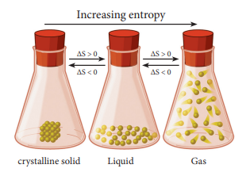

Figure 7.8 Illustration showing an increase in disorder.

#### Standard Entropy Change \( (\Delta S^0) \)

It is possible to calculate the actual entropy of a substance at any temperature above \( 0 \ \mathrm{K} \). The absolute entropy of a substance at 298 K and one bar pressure is called the standard entropy \( S^0 \). The third law of thermodynamics states, according to Nernst, that the absolute entropy of elements is zero only at \( 0 \ \mathrm{K} \) in a perfect crystal, and standard entropies of all substances at any temperature above \( 0 \ \mathrm{K} \) always have positive values. Once we know the entropies of different substances, we can calculate the standard entropy change \( (\Delta S_r^0) \) for chemical reactions.

\[
\Delta S_r^0 = \Sigma S_{\text{products}}^0 - \Sigma S_{\text{reactants}}^0 \qquad (7.30)
\]

#### Standard Entropy of Formation

Standard entropy of formation is defined as "the entropy of formation of 1 mole of a compound from the elements under standard conditions". It is denoted as \( \Delta S_f^0 \). We can calculate the value of entropy of a given compound from the values of \( S^0 \) of elements.

**Problem 7.6**

Calculate the standard entropy change for the following reaction \( (\Delta S_r^0) \) given the standard entropies of \( \mathrm{CO}_2(g) \), \( \mathrm{C(s)} \), \( \mathrm{O}_2(g) \) as 213.6, 5.740 and \( 205 \ \mathrm{J \ K^{-1} \ mol^{-1}} \) respectively.

\[
\mathrm{C(s) + O_2(g) \longrightarrow CO_2(g)}
\]

\[
\Delta S_r^0 = \Sigma S_{\text{products}}^0 - \Sigma S_{\text{reactants}}^0
\]

\[
\Delta S_r^0 = \{ S_{\mathrm{CO}_2}^0 \} - \{ S_{\mathrm{C}}^0 + S_{\mathrm{O}_2}^0 \}
\]

\[
\Delta S_r^0 = 213.6 - [5.74 + 205]
\]

\[
\Delta S_r^0 = 213.6 - [210.74]
\]

\[
\Delta S_r^0 = 2.86 \ \mathrm{J \ K^{-1}}
\]

## Evaluate Yourself-6

Urea on hydrolysis produces ammonia and carbon dioxide. The standard entropies of urea, \( \mathrm{H}_2\mathrm{O} \), \( \mathrm{CO}_2 \), \( \mathrm{NH}_3 \) are 173.8, 70, 213.5 and 192.5 J mole\(^{-1}\) K\(^{-1}\) respectively. Calculate the entropy change for this reaction.

#### Entropy change accompanying change of phase

When there is a change of state from solid to liquid (melting), liquid to vapour (evaporation) or solid to vapour
(sublimation) there is a change in entropy. This change may be carried out at constant temperature reversibly as two phases are in equilibrium during the change. 

$$
\Delta S = \frac{q_{\text{evap}}}{T} = \frac{\Delta H_{\text{evap}}}{T} \tag{7.31}
$$

### Entropy of fusion:

The heat absorbed, when one mole of a solid melts at its melting point reversibly, is called molar heat of fusion. The entropy change for this process is given by

$$
\Delta S_{\text{re}} = \frac{dq_{\text{evap}}}{T}
$$

$$
\Delta S_{\text{fusion}} = \frac{\Delta H_{\text{fusion}}}{T_{\text{f}}} \tag{7.32}
$$

where \( \Delta H_{\text{fusion}} \) is Molar heat of fusion. \( T_{\text{f}} \) is the melting point.

### Entropy of vapourisation:

The heat absorbed, when one mole of liquid is boiled at its boiling point reversibly, is called molar heat of vapourisation. The entropy change is given by

$$
\Delta S_{\text{v}} = \frac{\Delta H_{\text{v}}}{T_{\text{b}}} \tag{7.33}
$$

where \( \Delta H_{\text{v}} \) is Molar heat of vapourisation. \( T_{\text{b}} \) is the boiling point.

### Entropy of transition:

The heat change, when one mole of a solid changes reversibly from one allotropic form to another at its transition temperature is called enthalpy of transition. The entropy change is given

$$
\Delta S_{\text{t}} = \frac{\Delta H_{\text{t}}}{T_{\text{t}}} \tag{7.34}
$$

where \( \Delta H_{\text{t}} \) is the molar heat of transition, \( T_{\text{t}} \) is the transition temperature.

### Problem: 7.7

Calculate the entropy change during the melting of one mole of ice into water at 0°C and 1 atm pressure. Enthalpy of fusion of ice is 6008 J mol\(^{-1}\)

### Given:

$$
\Delta H_{\text{fusion}} = 6008 \, \text{J mol}^{-1}
$$

$$
T_{\text{f}} = 0^\circ \, \text{C} = 273 \, \text{K}
$$

$$
H_2O(\text{s}) \xrightarrow{273 \, \text{K}} H_2O(\text{l})
$$

$$
\Delta S_{\text{fusion}} = \frac{\Delta H_{\text{fusion}}}{T_{\text{f}}}
$$

$$
\Delta S_{\text{fusion}} = \frac{6008}{273}
$$

$$
\Delta S_{\text{fusion}} = 22.007 \, \text{J K}^{-1} \, \text{mol}^{-1}
$$

### Evaluate Yourself - 7

Calculate the entropy change when 1 mole of ethanol is evaporated at 351 K. The molar heat of vaporisation of ethanol is 39.84 kJ mol\(^{-1}\)

## 7.11 Gibbs free energy (G)

One of the important applications of the second law of thermodynamics is to predict the spontaneity of a reaction under a specific set of conditions. A reaction that occurs under the given set of conditions without any external driving force is called a spontaneous reaction. Otherwise, it is said to be non-spontaneous. In our day today life, we observe many spontaneous physical and chemical processes, which includes the following examples.

1. A waterfall runs downhill, but never uphill, spontaneously.

2. A lump of sugar dissolves spontaneously in a cup of coffee, but never reappears in its original form spontaneously.

3. Heat flows from hotter object to a colder one, but never flows from colder to hotter object spontaneously.

4. The expansion of a gas into an evacuated bulb is a spontaneous process, the reverse process that is gathering of all molecules into one bulb is not spontaneous.

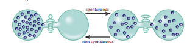
**Figure 7.9 Spontaneous process illustration**

These examples show that the processes that occur spontaneously in one direction, cannot take place in opposite direction spontaneously.

Similarly a large number of exothermic reactions are spontaneous. An example is combustion of methane.

$$
\text{CH}_4 + 2\text{O}_2 \rightarrow \text{CO}_2 + 2\text{H}_2\text{O}
$$

$$
\Delta H^\circ = -890.4 \, \text{kJ mol}^{-1}
$$

Another example is acid-base neutralization reaction:

$$
\text{H}^+ + \text{OH}^- \rightarrow \text{H}_2\text{O}
$$

$$
\Delta H^\circ = -57.32 \, \text{kJ mol}^{-1}
$$

However, some endothermic processes are also spontaneous. For example ammonium nitrate dissolves in water spontaneously though this dissolution is endothermic.

$$
\text{NH}_4\text{NO}_3 \xrightarrow{\text{H}_2\text{O}} \text{NH}_4^+ + \text{NO}_3^-
$$

$$
\Delta H^\circ = +25 \, \text{kJ mol}^{-1}
$$

From the above examples we can come to the conclusion that exothermicity favors the spontaneity but does not guarantee it. We cannot decide whether or not a chemical reaction will occur spontaneously solely on the basis of energy changes in the system. We know from second law of thermodynamics that in a spontaneous process, the entropy increases. But not all the processes which are accompanied by an increase in entropy are spontaneous. In order to predict the spontaneity of a reaction, we need some other thermodynamic function.

The second law of thermodynamics introduces another thermodynamic function called Gibbs free energy which finds useful in predicting the spontaneity of a reaction. The Gibbs free energy (G) was developed in the 1870's by Josiah Willard Gibbs. He originally termed this energy as the "available energy" to do work in a system. This quantity is the energy associated with a chemical reaction that can be used to do work.

Gibbs free energy is defined as below

$$
G = H - TS
$$

Gibbs free energy (G) is an extensive property and it is a single valued state function.

Let us consider a system which undergoes a change of state from state (1) to state (2) at constant temperature.

\[
\mathrm{G}_2 - \mathrm{G}_1 = (\mathrm{H}_2 - \mathrm{H}_1) - \mathrm{T}(\mathrm{S}_2 - \mathrm{S}_1)
\]
\[
\Delta \mathrm{G} = \Delta \mathrm{H} - \mathrm{T} \Delta \mathrm{S} \qquad (7.36)
\]

Now let us consider how \( \Delta \mathrm{G} \) is related to reaction spontaneity.

We know that

\[
\Delta S_{\text{total}} = \Delta S_{\text{sys}} + \Delta S_{\text{surr}}
\]

For a reversible process (equilibrium), the change in entropy of universe is zero. \( \Delta S_{\text{total}} = 0 \) [ \( \therefore \Delta S_{\text{sys}} = - \Delta S_{\text{surr}} \) ]

Similarly, for an equilibrium process \( \Delta G = 0 \)

For spontaneous process, \( \Delta S_{\text{total}} > 0 \)

\[
\Delta S_{\text{sys}} + \Delta S_{\text{surr}} > 0
\]

\[
\Delta S_{\text{sys}} + \frac{dq_{\text{surr}}}{T} > 0
\]

\[
\Delta S_{\text{sys}} - \frac{\Delta H_{\text{sys}}}{T} > 0
\]

\[
\mathrm{T} \Delta S_{\text{sys}} - \Delta H_{\text{sys}} > 0
\]

\[
-(\Delta H_{\text{sys}} - \mathrm{T} \Delta S_{\text{sys}}) > 0
\]

\[
-\Delta G > 0
\]

Hence for a spontaneous process,

\[
\Delta G < 0
\]

i.e. \( \Delta \mathrm{H} - \mathrm{T} \Delta \mathrm{S} < 0 \qquad (7.37) \)

\( \Delta H_{\text{sys}} \) is the enthalpy change of a reaction, \( \mathrm{T} \Delta S_{\text{sys}} \) is the energy which is not available to do useful work. So \( \Delta G \) is the net energy available to do useful work and is thus a measure of the 'free energy'. For this reason, it is also known as the free energy of the reaction. For non spontaneous process, \( \Delta G > 0 \)

#### Gibbs free energy and the net work done by the system

For any system at constant pressure and temperature

\[
\Delta G = \Delta \mathrm{H} - \mathrm{T} \Delta S \qquad (7.36)
\]

We know that,

\[
\Delta \mathrm{H} = \Delta \mathrm{U} + \mathrm{P} \Delta \mathrm{V}
\]

\[
\therefore \Delta G = \Delta \mathrm{U} + \mathrm{P} \Delta \mathrm{V} - \mathrm{T} \Delta \mathrm{S}
\]

from first law of thermodynamics if work is done by the system

\[
\Delta \mathrm{U} = \mathrm{q} - \mathrm{w}
\]

from second law of thermodynamics

\[
\Delta S = \frac{q}{T}
\]

\[
\Delta G = q - w + P \Delta V - T \left( \frac{q}{T} \right)
\]

\[
\Delta G = -w + P \Delta V
\]

\[
-\Delta G = w - \mathrm{P} \Delta V \qquad (7.38)
\]

Here, \( - \mathrm{P} \Delta V \) represents the work done due to expansion against a constant external pressure. Therefore, it is clear that the decrease in free energy \( (- \Delta G) \) accompanying a process taking place at constant temperature and pressure is equal to the maximum work obtainable from the system other than the work of expansion.

#### 7.11.1 Criteria for spontaneity of a process

The spontaneity of any process depends on three different factors.

If the enthalpy change of a process is negative, then the process is exothermic and may be spontaneous. (\( \Delta \mathrm{H} \) is negative) If the entropy change of a process is positive, then the process may occur spontaneously. (\( \Delta S \) is positive)

The gibbs free energy which is the combination of the above two (\( \Delta H - T \Delta S \)) should be negative for a reaction to occur spontaneously, i.e. the necessary condition for a reaction to be spontaneous is \( \Delta H - T \Delta S < 0 \)

**Table 7.5 Effect of Temperature on Spontaneity of Reactions**

| \( \Delta H_r \) | \( \Delta S_r \) | \( \Delta G_r = \Delta H_r - T \Delta S_r \) | Description | Example |
|---|---|---|---|---|
| \( - \) | \( + \) | \( - \) (at all T) | Spontaneous at all temperature | \( 2O_3(g) \rightarrow 3O_2(g) \) |
| \( - \) | \( - \) | \( - \) (at low T) | spontaneous at low temperature | Adsorption of gases |
| | | \( + \) (at high T) | non-spontaneous at high temperature | |
| \( + \) | \( + \) | \( + \) (at low T) | non-spontaneous at low temperature | Melting of a solid |
| | | \( - \) (at high T) | spontaneous at high temperature | |
| \( + \) | \( - \) | \( + \) (at all T) | non spontaneous at all temperatures | \( 2H_2O(g) + O_2(g) \rightarrow 2H_2O_2(l) \) |

The Table assumes \( \Delta H \) and \( \Delta S \) will remain the way indicated for all temperatures. It may not be necessary that way. The spontaneity of a chemical reaction is only the potential for the reaction to proceed as written. The rate of such processes is determined by kinetic factors, outside of thermodynamical prediction.

**Problem 7.8**

Show that the reaction \( \mathrm{CO} + \frac{1}{2} \mathrm{O}_2 \rightarrow \mathrm{CO}_2 \) at 300K is spontaneous. The standard Gibbs free energies of formation of \( \mathrm{CO}_2 \) and \( \mathrm{CO} \) are -394.4 and -137.2 kJ mole\(^{-1}\) respectively.

\[
\mathrm{CO} + \frac{1}{2} \mathrm{O}_2 \rightarrow \mathrm{CO}_2
\]

\[
\Delta G_{\text{reaction}}^0 = \sum (\Delta G_f^0)_{\text{products}} - \sum (\Delta G_f^0)_{\text{reactants}}
\]

\[
\Delta G_{\text{reaction}}^0 = [ (\Delta G_f^0)_{\mathrm{CO}_2} ] - [ (\Delta G_f^0)_{\mathrm{CO}} + \frac{1}{2} (\Delta G_f^0)_{\mathrm{O}_2} ]
\]

\[
\Delta G_{\text{reaction}}^0 = [-394.4] - [ -137.2 + 0 ]
\]

\[
\Delta G_{\text{reaction}}^0 = -257.2 \ \mathrm{kJ \ mol^{-1}}
\]

\( \Delta G_{\text{reaction}} \) of a reaction at a given temperature is negative hence the reaction is spontaneous.

## Evaluate Yourself - 8

For a chemical reaction the values of \( \Delta H \) and \( \Delta S \) at 300K are -10 kJ mole\(^{-1}\) and -20 J deg\(^{-1}\) mole\(^{-1}\) respectively. What is the value of \( \Delta G \) of the reaction? Calculate the \( \Delta G \) of a reaction at 600 K assuming \( \Delta H \) and \( \Delta S \) values are constant. Predict the nature of the reaction.

#### 7.11.2 Relationship between standard free energy change \( (\Delta G^0) \) and equilibrium constant \( (K_{eq}) \)

In a reversible process, the system is in perfect equilibrium with its surroundings at all times. A reversible chemical reaction can proceed in either direction simultaneously, so that a dynamic equilibrium is set up. This means that the reactions in both the directions should proceed with decrease in free energy, which is impossible. It is possible only if at equilibrium, the free energy of a system is minimum. Let's consider a general equilibrium reaction

\[
\mathrm{A + B \rightleftharpoons C + D}
\]

The free energy change of the above reaction in any state \( (\Delta G) \) is related to the standard free energy change of the reaction \( (\Delta G^0) \) according to the following equation.

\[
\Delta G = \Delta G^0 + \mathrm{RT} \ln Q \qquad (7.39)
\]

where \( Q \) is reaction quotient and is defined as the ratio of concentration of the products to the concentrations of the reactants under non equilibrium condition.

When equilibrium is attained, there is no further free energy change i.e. \( \Delta G = 0 \) and \( Q \) becomes equal to equilibrium constant. Hence the above equation becomes.

\[
\Delta G^0 = -\mathrm{RT} \ln \mathrm{K}_{\mathrm{eq}}
\]

This equation is known as Van't Hoff equation.

\[
\Delta G^0 = -2.303 \ \mathrm{RT} \log \mathrm{K}_{\mathrm{eq}} \qquad (7.40)
\]

We also know that

\[
\Delta G^0 = \Delta H^0 - \mathrm{T} \Delta S^0 = -\mathrm{RT} \ln \mathrm{K}_{\mathrm{eq}}
\]

**Problem 7.9**

Calculate \( \Delta G^0 \) for conversion of oxygen to ozone \( \frac{3}{2} \mathrm{O}_2 \rightleftharpoons \mathrm{O}_{3(g)} \) at 298 K, if \( \mathrm{K}_{\mathrm{p}} \) for this conversion is \( 2.47 \times 10^{-29} \) in standard pressure units.

**Solution:**

\[
\Delta G^0 = -2.303 \ \mathrm{RT} \log \mathrm{K}_{\mathrm{p}}
\]

Where

\[
\mathrm{R} = 8.314 \ \mathrm{J \ K^{-1} \ mol^{-1}}
\]
\[
\mathrm{K}_{\mathrm{p}} = 2.47 \times 10^{-29}
\]
\[
\mathrm{T} = 298 \ \mathrm{K}
\]

\[
\Delta G^0 = -2.303 (8.314)(298) \log (2.47 \times 10^{-29})
\]

\[
\Delta G^0 = 163229 \ \mathrm{J \ mol^{-1}}
\]

\[
\Delta G^0 = 163.229 \ \mathrm{KJ \ mol^{-1}}
\]

### 7.12 Third law of Thermodynamics

The entropy of a substance varies directly with temperature. Lower the temperature, lower is the entropy. For example, water above \( 100^{\circ} \mathrm{C} \) at one atmosphere exists as a gas and has higher entropy (higher disorder). The water molecules are free to roam about in the entire container. When the system is cooled, the water vapour condenses to form a liquid. The water molecules in liquid phase still can move about somewhat freely. Thus the entropy of the system has decreased. On further cooling, water freezes to form ice crystal. The water molecules in the ice crystal are highly ordered and entropy of the system is very low.

If we cool the solid crystal still further, the vibration of molecules held in the crystal lattice gets slower and they have very little freedom of movement (very little disorder) and hence very small entropy.

At absolute zero \( \{ 0 \ \mathrm{K} \ (\text{or}) -273^{\circ}\mathrm{C} \} \) theoretically all modes of motion stop.

Thus the third law of thermodynamics states that the entropy of pure crystalline substance at absolute zero is zero. Otherwise it can be stated as it is impossible to lower the temperature of an object to absolute zero in a finite number of steps. Mathematically,

\( \lim_{T \to 0} S = 0 \) for a perfectly ordered crystalline state.

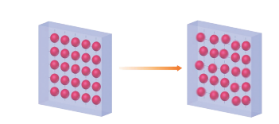

Figure 7.10 Third law of Thermodynamics

Crystals with defects (imperfection) at absolute zero, have entropy greater than zero. Absolute entropy of a substance can never be negative.

## Summary

The branch of science which deals the relation between energy, heat and work is called Thermodynamics. The main aim of the study of chemical thermodynamics is to learn (i) transformation of energy from one form into another form (ii) Utilization of various forms of energies.

**System:** A system is defined as any part of universe under consideration. There are three types of thermodynamic systems. They are (i) isolated system (ii) closed system and (iii) open system.

**Surrounding:** Everything in the universe that is not the part of the system is called surrounding.

**Boundary:** Anything which separates the system from its surrounding is called boundary.

**Thermodynamic Properties:** Any quantity that depends only on the state of system is called thermodynamic property of a system. There are two kinds of thermodynamic properties called (1) intensive - independent of the quantity of material and (2) extensive - directly proportional to the quantity of material. There are five basic thermodynamic properties. (U, H, S and G)

### Thermodynamic Processes

- **Adiabatic process** in which no heat transfer takes place \( (q = 0) \)
- **Isothermal process** in which temperature remains constant \( (dT = 0) \)
- **Isobaric process** in which pressure remains constant \( (dP = 0) \)
- **Isochoric process** in which volume remains constant \( (dV = 0) \)
- **Cyclic process** in which the system returns to its original state after completing a series of changes.

**Internal energy (U):** Internal energy of a system is equal to the energy possessed by all its constituents namely atoms, ions and molecules. The energy of a system of molecules is equal to the sum of its translational energy, vibrational energy, rotational energy, bond energy, electronic energy and energy due to molecular interactions.

**Heat:** Heat is regarded as the energy in transit across the boundary separating a system from its surrounding. Heat is a path function. The SI unit of heat is joule (J).

**Work:** Work is defined as the force (F) multiplied by the displacement - \( w = F \cdot x \), work is measured in Joules, i.e. the SI unit of work is Joule. During expansion or compression of a gas the work done is calculated by the relation \( \mathrm{w} = \mathrm{- P} \Delta \mathrm{V} \)

**The sign conventions for heat and work are as follows:**

If heat is absorbed by the system: \( +q \)
If heat is evolved by the system: \( -q \)
If work is done by the system: \( -w \)
If work is done on the system: \( +w \)

### Laws of Thermodynamics

**Zeroth law:** When two systems are separately in equilibrium with a third system, they are in equilibrium with each other.

**First law:** "Energy can neither be created nor destroyed, but may be converted from one form to another".

\[
\Delta \mathbf{U} = \mathbf{q} + \mathbf{w}.
\]

**Enthalpy** is a thermodynamic property of a system. Enthalpy H is defined as the sum of the internal energy and pressure volume work.

\( \mathrm{H = U + PV} \). Enthalpy change, \( \Delta \mathrm{H} = \Delta \mathrm{U} + \Delta_{\mathrm{n}} \mathrm{RT} \)

**Hess's law:** It states that "the enthalpy change of a reaction either at constant volume or constant pressure is the same whether it takes place in a single or multiple steps". Hess's law can be applied to calculate enthalpies of reactions that are difficult to measure.

### Heat capacities [\( C_{\mathrm{p}} \) and \( C_{\mathrm{v}} \)]

Heat capacity is defined as the amount of energy required to increase the temperature of one unit quantity of material by one degree, under specific conditions. It can be measured under two different conditions, namely,

(a) constant pressure \( C_{\mathrm{p}} = (dH / dT)_{\mathrm{p}} \)
(b) constant volume \( C_{\mathrm{v}} = (dU / dT)_{\mathrm{v}} \)

### Second law of thermodynamics

The second law of thermodynamics helps us to predict whether the reaction is feasible or not and also tells the direction of the flow of heat.

To predict spontaneity of a process, a new thermodynamic quantity namely entropy (S) was introduced. Entropy is a measure of the randomness or disorderliness of the system.

**Entropy statement:** "whenever a spontaneous process takes place, it is accompanied by an increase in the total entropy of the universe".

**Kelvin-Planck statement:** It is impossible to take heat from a hotter reservoir and convert it completely into work by a cyclic process without transferring a part of that heat to a colder reservoir.

**Clausius statement:** This statement recognises that heat flows spontaneously from hot objects to cold objects and to get it flow in the opposite direction, we have to spend some work.

### Gibbs Free Energy (G)

G is expressed as \( \mathrm{G = H - TS} \), free energy change of a process is given by the relation \( \Delta \mathrm{G} = \Delta \mathrm{H} - \mathrm{T} \Delta \mathrm{S} \)

Standard free energy change and equilibrium constants are related by the equation \( \Delta \mathrm{G}^0 = - \mathrm{RT} \ln \mathrm{K}_{\mathrm{eq}} \)

### Third law

The entropy of a perfectly crystalline material at absolute zero is zero.
