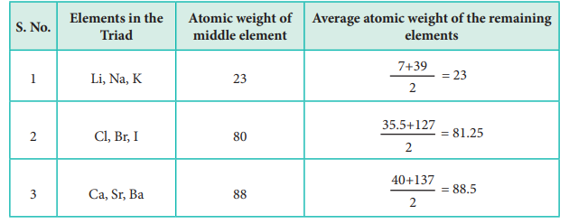
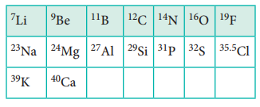
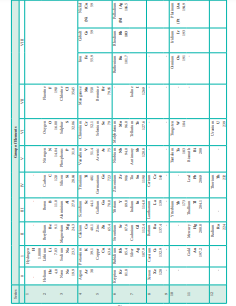

**3.1 Classification of Elements**

During the 19th century, scientists have isolated several elements and the list of known elements increased. Currently, we have 118 known elements. Out of 118 elements, 92 elements with atomic numbers 1 to 92 are found in nature. Scientists have found out there are some similarities in properties among certain elements. This observation has led to the idea of classification of elements based on their properties. In fact, classification will be beneficial for the effective utilization of these elements. Several attempts were made to classify the elements. However, classification based on the atomic weights led to the construction of a proper form of periodic table.

In 1817, J. W. Döbereiner classified some elements such as chlorine, bromine and iodine with similar chemical properties into the group of three elements called as triads. In triads, the atomic weight of the middle element nearly equal to the arithmetic mean of the atomic weights of the remaining two elements. However, only a limited number of elements can be grouped as triads.

This concept can not be extended to some triads which have nearly same atomic masses such as \[Fe, Co, Ni\], \[Ru, Rh, Pd\] and \[Os, Ir, Pt\].

In 1862, A. E. B. de Chancourtois reported a correlation between the properties of the elements and their atomic weights. He said ‘the properties of bodies are the properties of numbers’. He intended the term numbers to mean the value of atomic weights. He designed a helix by tracing at an angle 45˚ to the vertical axis of a cylinder with circumference of 16 units. He arranged the elements in the increasing atomic weights along the helix on the surface of this cylinder. One complete turn of a helix corresponds to an atomic weight increase of 16. Elements which lie on the 16 equidistant vertical lines drawn on the surface of cylinder shows similar properties. This was the first reasonable attempt towards the creation of periodic table. However, it did not attract much attention.

In 1864, J. Newland made an attempt to classify the elements and proposed the law of octaves. On arranging the elements in the increasing order of atomic weights, he observed that the properties of every eighth element are similar to the properties of the first element. This law holds good for lighter elements up to calcium.

**3.1.1 Mendeleev's Classification**

In 1868, Lothar Meyer had developed a table of the elements that closely resembles the modern periodic table. He plotted the physical properties such as atomic volume, melting point and boiling point against atomic weight and observed a periodical pattern.

During same period Dmitri Mendeleev independently proposed that “the properties of the elements are the periodic functions of their atomic weights” and this is called periodic law. Mendeleev listed 70 elements, which were known till histime in several vertical columns in order of increasing atomic weights. Thus, Mendeleev constructed the first periodic table based on the periodic law.

  

As shown in the periodic table, he left s elements with the appropriate properties at th and chemical properties of the missing eleme discovered and found to have the predicted pro III and germanium (Ge) of group IV were unk their existence and properties. He referred th eka-silicon. After discovery of the actual elem closely to those predicted by Mendeleev  (Table 3.4 ).

Table 3.5 Properties predicted for Eka-aluminium and Eka-silion

| S.No. |Property |Eka-aluminium(Predicted) |Gallium(Observed) |Eka-silicon(Predicted) |Germanium(Observed) |
|------|------|------|------|------|------|
| 1. |Atomic weight |68 |70 |72 |72.59 |
| 2. |Density (g/cm )3 |5.9 |5.94 |5.5 |5.36 |
| 3. |Melting point |low |29.78°C |High |947°C |
| 4. |Formula of oxide |E2 O3|Ga O2 3 |EO2 |GeO2 |
| 5. |Formula ofchloride |ECl3 |GaCl3 |ECl4 |GeCl4 |

**3.1.2 Anomalies of Mendeleev’s Periodic Table**

Some elements with similar properties with dissimilar properties were placed in sa atomic weights were placed before lower at contradiction to his periodic law. Example 59Co27 was placed before 58.7Ni28; Tellurium 
(127.6) was placed in VI group but Iodine (127.0) was placed in VII group.