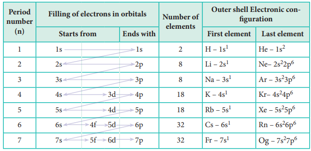
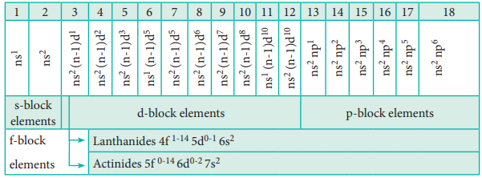

In the modern periodic table, the eleme based on the modern periodic law. The pla closely related to its outer shell electronic con electronic configuration of elements along th

# Variation of Electronic Configuration along the periods

We have already learnt that each period electronic configuration ns1 and ends with ns2

period starts with the filling of valence elect only two electrons. Hence, the first period helium. The second period starts with the filli by three 2p orbitals with eight elements from l filling of valence electrons in the 3s orbital starts with filling of valence electrons from 4 accordance with Aufbau principle. Similarly, of elements in the subsequent periods (Table 3.10)

In the fourth period the filling of 3d o zinc. These 10 elements are called first transi are filled in successive periods and the corresp third and fourth transition series respectively

In the sixth period the filling of valenc 4f, 5d and 6p orbitals. The filling up of 4f or at Lutetium (Z=71). These 14 elements cons Lanthanides. Similarly, in the seventh period constitute the second inner-transition series c separately at the bottom of the modern Periodic table.

# Variation of Electronic Configuration in the Groups: 

Elements of a group have similar elect general outer electronic configurations for th groups can be combined as s, p, d and f block the last valence electron enters.

The elements of group 1 and group 2 valence electron enters the ns orbital. The gro the group 2 elements are called alkaline eart low melting and boiling points with low ion and form ionic compounds. They are highly elements imparts colour to the flame. We will in detail in subsequent chapters.  

The elements of groups 13 to 18 are elements and have a general electronic con group 16 and 17 are called chalcogens and h group contain completely filled valence shell called inert gases or nobles gases. The eleme gain enthalpies. The ionisation energies are form mostly covalent compounds and show compounds.

The elements of the groups 3 to 12 elements with general valence shell electro elements also show more than one oxida co-ordination compounds. They can form in also act as catalysts. These elements have high heat and electricity.

The lanthanides (4f1-14, 5d0-1, 6s2) and f-block elements. These elements are metallic in nature and have high melting points. Their compounds are mostly coloured. These elements also show variable oxidation states

  
**Evaluate Yourself**

**3\.** Predict the position of the element in periodic table satisfying the 
electronic configuration (n-1)d2, ns2 where n=5
