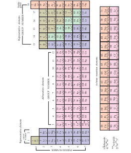

  

In 1913, Henry Moseley studied the characteristic X-rays spectra of several elements 
by bombarding them with high energy electrons and observed a linear correlation between 
atomic number and the frequency of X-rays emitted which is given by the following 
expression. 
υ =a Z( ) − b
Where, υ is the frequency of the X-rays emitted by the element with atomic number ‘Z’; 
a and b are constants and have same values for all the elements.

**Modern Periodic Law**

racteristic X-rays spectra of several elements ns and observed a linear correlation between s emitted which is given by the following


\sqrt{v}=a(Z-b)


itted by the element with atomic number ‘Z’; r all the elements.

The plot of υ against Z gives a straight line. Using this relationship, we can determine the atomic number of an unknown (new) element from the frequency of X-ray emitted.

Based on his work, the modern periodic law was developed which states that, “the physical and chemical properties of the elements are periodic functions of their atomic numbers.” Based on this law, the elements were arranged in order of their increasing atomic numbers. This mode of arrangement reveals an important truth that the elements with similar properties recur after regular intervals. The repetition of physical and chemical properties at regular intervals is called periodicity.

# Modern Periodic Table

The physical and chemical properties of the elements are correlated to the arrangement of electrons in their outermost shell (valence shell). Different elements having similar outer shell electronic configuration possess similar properties. For example, elements having one electron in their valence shell s-orbital possess similar physical and chemical properties. These elements are grouped together in the modern periodic table as first group elements.

**Evaluate Yourself**

**1\.** What is the basic difference in approac and modern periodic table ?  

**Table 3.6 Electronic configuration of alkali metals )ns1)**

Similarly, all the elements are arranged in the modern periodic table which contains 18 vertical columns and 7 horizontal rows. The vertical columns are called groups and the horizontal rows are called periods. Groups are numbered 1 to 18 in accordance with the IUPAC recommendation which replaces the old numbering scheme IA to VIIA, IB to VIIB and VIII.

Each period starts with the element having general outer electronic configuration ns1 and ends with ns2 np6. Here ‘n’ corresponds to the period number (principal quantum number). The aufbau principle and the electronic configuration of atoms provide a theoretical foundation for the modern periodic table.

? h between Mendeleev's periodic table

| Elements in  Group 1 |Atomic number |Number of electrons in various shells in the order K, L, M, N, P |Valence shellconguration |
|------|------|------|------|
| Li |3 |2, 1 |2s1 |
| Na |11 |2, 8, 1 |3s1 |
| K |19 |2, 8, 8, 1 |4s1 |
| Rb |37 |2,8,18,8,1 |5s1 |
| Cs |55 |2, 8, 18, 18, 8, 1 |6s1 |
| Fr |87 |2, 8, 18, 32, 18, 8, 1 |7s1 |
  

 

