As discussed earlier, the electronic configuration of the elements shows a periodic variation with increase in atomic numbers. Similarly a periodic trend is observed in physical and chemical behaviour of elements. In this section, we will study the periodic trends in the following properties of elements.

1\. Atomic radius

2\. Ionic radius

3\. Ionisation enthalpy (energy)

4\. Electron gain enthalpy (electron affinity)

5\. Electronegativity

# Atomic radius

Atomic radius of an atom is defined as the distance between the centre of its nucleus and the outermost shell containing the valence electron.

It is not possible to measure the radius of an isolated atom directly. Except for noble gases, usually atomic radius is referred to as covalent radius or metallic radius depending upon the nature of bonding between the concerned atoms.

 
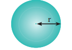

**Covalent radius**

It is one-half of the internuclear distance between two identical atoms linked together by a single covalent bond. Inter nuclear distance can be determined using x-ray diffraction studies.

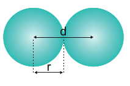

**Example:** The experimental internuclear distance in Cl2 molecule is 1.98 Å. The covalent radius of chlorine is calculated as below.

dCl-Cl = rCl + rCl

⇒ dCl-Cl = 2rCl

⇒ rCl =

⇒ rCl 1.98 2= = 0.99Å

Cl Cl1.98Å covalent diameter

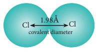

The formation of covalent bond involves the overlapping of atomic orbitals and it reduces the expected internuclear distance. Therefore covalent radius is always shorter than the actual atomic radius.

dCl-Cl 2

  

In case of hetero nuclear diatomic molecules, the covalent radius of individual atom can also be calculated using the internuclear distance (dA-B) between two different atoms A and B. The simplest method proposed by Schomaker and Stevenson is as follows.


d_(A-B)=r_A+r_B-0.09(χ_a-χ_b)


where χA and χB are the electronegativities of A and B respectively in Pauling units. Here χA > χB and radius is in Å.

Let us calculate the covalent radius of hydrogen using the experimental dH-Cl value is 1.28 Å and the covalent radius of chlorine is 0.99 Å. In pauling scale the electronegativity of chlorine and hydrogen are 3 and 2.1 respectively.


d_H-Cl = r_H + r_Cl - 0.09 ( χ_Cl - χ_H)



1.28 = r_H + 0.99 - 0.09 (3 - 2.1)



1.28 = r_H + 0.99 - 0.09 (0.9)



1.28 = r_H + 0.99 - 0.081



1.28 = r_H + 0.909



∴ r_H = 1.28 - 0.909 = 0.371 Å


**Metallic radius**

It is defined as one-half of the distance between two adjacent metal atoms in the closely packed metallic crystal lattice.

For example, the distance between the adjacent copper atoms in solid copper is 2.56 Å and therefore the metallic radius of copper is

2.56 2

\= 1.28 Å  

The metallic radius can be calculated using the unit cell length of the metallic crystal. You will study the detailed calculation procedure in XII

standard solid state unit.

**Periodic Trends in Atomic Radius**

**Variation in Periods**

Atomic radius tends to decrease in a period. As we move from left to right along a period, the valence electrons are added to the same shell. The simultaneous addition of protons to the nucleus, increases the nuclear charge, as well as the electrostatic attractive force between the valence electrons and the nucleus. Therefore atomic radius decreases along a period.

**Effective nuclear charge**

In addition to the electrostatic forces of attraction between the nucleus and the electrons, there exists repulsive forces among the electrons. The repulsive force between the inner shell electrons and the valence electrons leads to a decrease in the electrostatic attractive forces acting on the valence electrons by the nucleus. Thus, the inner shell electrons act as a shield between the nucleus and the valence electrons. This effect is called shielding effect.

The net nuclear charge experienced by valence electrons in the outermost shell is called the effective nuclear charge. It is approximated by the below mentioned equation.


Z_(eff) = Z - S


  

Where Z is the atomic number and 'S' is the screening constant which can be calculated using Slater's rules as described below. **Step 1** : Write the electronic configuration of the atom and rearrange it by grouping ns and np orbitals together and others separately in the following form. (1s) (2s, 2p) (3s, 3p) (3d) (4s, 4p) (4d) (4f) (5s, 5p)... **Step 2 :** Identify the group in which the electron of interest is present. The electron present right to this group does not contribute to the shielding effect. Each of the electrons within the identified group (denoted by 'n') shields to an extent of 0.35 unit of nuclear charge. However, it is 0.30 unit for 1s electron. **Step 3** : Shielding of inner shell electrons. If the electron of interest belongs to either s or p orbital, i) each electron within the (n-1) group

shields to an extent of 0.85 unit of nuclear charge, and

ii) each electron within the (n-2) group (or) even lesser group (n-3), (n-4) etc... completely shields i.e. to an extent of 1.00 unit of nuclear charge.

If the electron of interest belongs to d or f orbital, then each of electron left of the group of electron of interest shields to an extent of 1.00 unit of nuclear charge. 
**Step 4** : Summation of the shielding effect of all the electrons gives the shielding constant 'S'  

**Example:** Let us explain the calculation of effective nuclear charge on 4s electron and 3d electron in scandium. The electronic configuration of scandium is 1s2, 2s2, 2p6, 3s2, 3p6, 4s2, 3d1. we can rearrange as below.

(2s,2p)8

(n-2)

(4s)2

n

(3s,3p)8 (3d)1

(n-1)

(1s)2

(n-3)

group|number of electron in group|contribution of each electron to 'S' value|contribution of a particular group to electrons to 'S' value
|------|------|------|------|
| (n) |1 |0.35 |0.35 |
| (n-1) |9 |0.85 |7.65 |
| (n-2) & others |10 |1 |10.00 |
| S value |18.00 |

group|number of electron in group|contribution of each electron to 'S' value|contribution of a particular group to electrons to 'S' value
|------|------|------|------|
| n |0 |0.35 |0 |
| (n-1) &others |18 |1 |18 |
| S Value |18 |
  

**Table 3.12 Shielding effect from inner shell electrons (Slater's rules)**

| ElectronGroup |Electron of interest either S or P |Electron of interest either d or f |
|------|------|------|
| n |0.35 (0.30 for (S electron) |0.35 |
| (n-1) |0.85 |1.00 |
| (n-2) and others |1.00 |1.00 |

**Table 3.13 Atomic radius (covalent radius) of second period elements.**

| Elements |Eective nuclear charge |C ovalent radius )pm) |
|------|------|------|
| Li3 |1.30 |152 |
| Be4 |1.95 |111 |
| B5 |2.60 |89 |
| C6 |3.25 |77 |
| N7 |3.90 |74 |
| O8 |4.55 |66 |
| F9 |5.20 |64 |
| Ne10 |5.85 |

**Evaluate Yourself**

**4\.** Using Slater's rule calculate the effective nuclear charge on a 3p electron in aluminium and chlorine. Explain how these results relate to the atomic radii of the two atoms.  

**Variation in Group**

In the periodic table, the atomic radius of elements increases down the group. As we move down a group, new shells are opened to accommodate the newly added valence electrons. As a result, the distance between the centre of the nucleus and the outermost shell containing the valence electron increases. Hence, the atomic radius increases. The trend in the variation of the atomic radius of the alkali metals down the group os shown below.

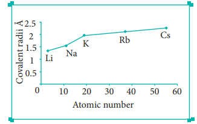

| Element |Outermost shell containing valence ele ctron |C ovalent radius )Å) |
|------|------|------|
| Li |L (n=2) |1.34 |
| Na |M (n=3) |1.54 |
| K |N (n=4) |1.96 |
| Rb |O (n=5) |2.11 |
| Cs |P (n=6) |2.25 |
  

**Activity 3.1**

Covalent radii (in Å) for some elements of different groups and periods are listed below. Plot these values against atomic number. From the plot, explain the variation along a period and a group.

2nd group elements : Be (0.89), Mg (1.36), Ca (1.74), Sr (1.91) Ba(1.98)

17th group elements : F (0.72), Cl (0.99), Br (1.14), I (1.33)

3rd Period elements : Na(1.57), Mg(1.36), Al (1.25), Si(1.17), P(1.10), S(1.04), Cl(0.99)

4th period elements : K(2.03), Ca(1.74), Sc(1.44), Ti(1.32), V(1.22), Cr(1.17), Mn(1.17), Fe(1.17), Co(1.16), Ni(1.15), Cu(1.17), Zn(1.25), Ga(1.25), Ge(1.22), As(1.21), Se(1.14), Br(1.14)

**3.5.2 Ionic radius**

It is defined as the distance from the centre of the nucleus of the ion up to which it exerts its influence on the electron cloud of the ion. Ionic radius of uni-univalent crystal can be calculated using Pauling's method from the inter ionic distance between the nuclei of the cation and anion. Pauling assumed  

that ions present in a crystal lattice are perfect spheres, and they are in contact with each other. Therefore,


d = r_C+ + r_A- ------- (1)


Where d is the distance between the centre of the nucleus of cation C+ and anion A- and rC+, rA- are the radius of the cation and anion respectively.

Pauling also assumed that the radius of the ion having noble gas electronic configuration (Na+ and Cl-

having 1s2 2s2, 2p⁶ configuration) is inversely proportional to the effective nuclear charge felt at the periphery of the ion.


r_{C}+ α {1/(Z_{eff})_{c^+}}



r_{A}+ α {1/(Z_{eff})_{A^-}}


and Where Zeff is the effective nuclear charge and Zeff = Z - S Dividing the equation 2 by 3

r r

Z

Z

On solving equation and

C

A

A

eff C

eff+

−

−

+

\= ( ) ( )

− − − −

( )

( )

4

1

( )4 the values of r and r can be obtained

C A+ −

Let us explain this method by calculating the ionic radii of Na+ and F- in NaF crystal whose interionic distance is equal to 231 pm .

?**Evaluate Yourself**

**5\.** A student reported the ionic radii of isoelectronic species X3+, Y2+ and Z- as 136 pm, 64 pm and 49 pm respectively. Is that order correct? Comment.
# Ionisation energy

It is defined as the minimum amount of energy required to remove the most loosely bound electron from the valence shell of the isolated neutral gaseous atom in its ground state. It is expressed in kJ mol-1 or in electron volts (eV).  

M(g) + IE1 → M+ (g) + 1 e-

Where IE1 represents the first ionisation energy.

**Successive Ionisation energies**

The minimum amount of energy required to remove an electron from a unipositive cation is called second ionisation energy. It is represented by the following equation.

M+ (g) + IE2 → M2+

(g)+ 1 e-

In this way we can define the successive ionisation energies such as third, fourth etc.

The total number of electrons are less in the cation than the neutral atom while the nuclear charge remains the same. Therefore the effective nuclear charge of the cation is higher than the corresponding neutral atom. Thus the successive ionisation energies, always increase in the following order

IE1 < IE2 < IE3 < .....

**Periodic Trends in Ionisation Energy**

The ionisation energy usually increases along a period with few exceptions. As discussed earlier, when we move from left to right along a period, the valence electrons are added to the same shell, at the same time protons are added to the nucleus. This successive increase of nuclear charge increases the electrostatic attractive force on the valence electron and more energy is required to remove the valence electron resulting in high ionisation energy.

Let us consider the variation in ionisation energy of second period

  

elements. The plot of atomic number vs ionisation energy is given below.

In the following graph, there are two deviation in the trends of ionisiation energy. It is expected that boron has higher ionisation energy than beryllium since it has higher nuclear charge. However, the actual ionisation energies of beryllium and boron are 899 and 800 kJ mol-1 respectively contrary to the expectation. It is due to the fact that beryllium with completely filled 2s orbital, is more stable than partially filled valence shell electronic configuration of boron. (2s2

,2p1)

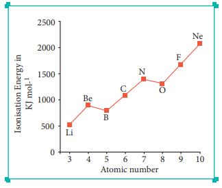

The electronic configuration of beryllium (Z=4) in its ground state is 1s2, 2s2 and that of boran is (Z = 5) 1s2 2s2 2p1

Similarly, nitrogen with 1s2, 2s2, 2p3 electronic configuration has higher ionisation energy (1402 kJ mol-1) than oxygen (1314 kJ mol-1). Since the half filled electronic configuration is more stable, it requires higher energy to remove an electron from 2p orbital of nitrogen. Whereas the removal one 2p electron from oxygen leads to a stable half filled  

configuration. This makes comparatively easier to remove 2p electron from oxygen.

**Periodic variation in group**

The ionisation energy decreases down a group. As we move down a group, the valence electron occupies new shells, the distance between the nucleus and the valence electron increases. So, the nuclear forces of attraction on valence electron decreases and hence ionisation energy also decreases down a group.

**Ionisation energy and shielding effect**

As we move down a group, the number of inner shell electron increases which in turn increases the repulsive force exerted by them on the valence electrons, i.e. the increased shielding effect caused by the inner electrons decreases the attractive force acting on the valence electron by the nucleus. Therefore the ionisation energy decreases.

Let us understand this trend by considering the ionisation energy of alkali metals.

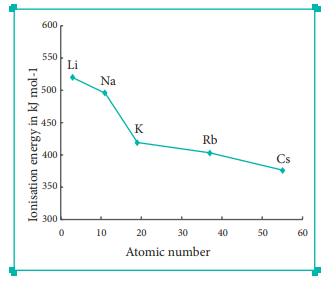

  

**Evaluate Yourself**

**6\.** The first ionisation energy (IE1) and second ionisation energy (IE2) of elements X, Y and Z are given below.

| Element |IE (kJ mol )-11 |IE (kJ mol )-12 |
|------|------|------|
| X |2370 |5250 |
| Y |522 |7298 |
| Z |1680 |3381 |

Which one of the above elements is the most reactive metal, the least reactive metal and a noble gas?

**3.5.4 Electron Affinity**

It is defined as the amount of energy released (required in the case noble gases) when an electron is added to the valence shell of an isolated neutral gaseous atom in its ground state to form its anion. It is expressed in kJ mol-1

A + e- → A- + EA

**Variation of Electron Affinity in a period:**

The variation of electron affinity is not as systematic as in the case of ionisation energy. As we move from alkali metals to halogens in a period, generally electron affinity increases, i.e. the amount of energy released will be more. This is due to an increase in the nuclear charge and decrease in size of the atoms. However, in case of elements such as beryllium (1s2, 2s2), nitrogen (1s2, 2s2, 2p3) the addition of extra electron will disturb their stable electronic configuration and they have almost zero electron affinity.  

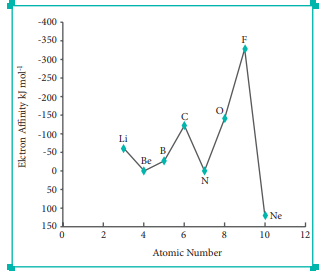

Noble gases have stable ns2, np6 configuration, and the addition of further electron is unfavourable and requires energy. Halogens having the general electronic configuration of ns2, np5 readily accept an electron to get the stable noble gas electronic configuration (ns2, np6), and therefore in each period the halogen has high electron affinity. (high negative values)

**Variation of Electron affinity in a group:**

As we move down a group, generally the electron affinity decreases. It is due to increase in atomic size and the shielding effect of inner shell electrons. However, oxygen and fluorine have lower affinity than sulphur and chlorine respectively. The sizes of oxygen and fluorine atoms are comparatively small and they have high electron density. Moreover, the extra electron added to oxygen and fluorine has to be accommodated in the 2p orbital which is relatively compact compared to the 3p orbital of sulphur and chlorine so, oxygen and fluorine have lower electron affinity than their respective group elements sulphur and chlorine.

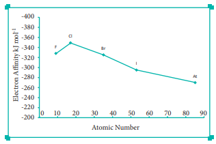

**Evaluate Yourself**

**7\.** The electron gain enthalpy of chlorine is 348 kJ mol-1. How much energy in kJ is released when 17.5 g of chlorine is completely converted into Cl- ions in the gaseous state?

**3.5.5 Electronegativity:**

It is defined as the relative tendency of an element present in a covalently bonded molecule, to attract the shared pair of electrons towards itself.

Electronegativity is not a measurable quantity. However, a number of scales are available to calculate its value. One such method was developed by Pauling, he assigned arbitrary value of electronegativities for hydrogen and fluorine as 2.1 and 4.0 respectively. Based on this the electronegativity values for other elements can be calculated using the following expression

(χA – χB ) = 0.182 √EAB – (EAAxEBB)½  

Where EAB, EAA and EBB are the bond dissociation energies _(K cal)_ of AB, A2 and B2 molecules respectively.

The electronegativity of any given element is not a constant and its value depends on the element to which it is covalently bound. The electronegativity values play an important role in predicting the nature of the bond.

**Variation of Electronegativity in a period:**

The electronegativity generally increases across a period from left to right. As discussed earlier, the atomic radius decreases in a period, as the attraction between the valence electron and the nucleus increases. Hence the tendency to attract shared pair of electrons increases. Therefore, electronegativity also increases in a period

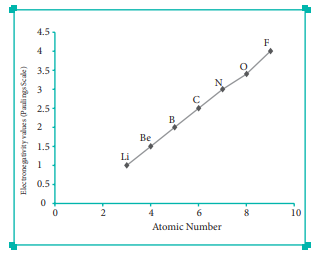

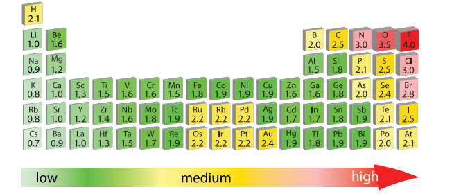

**Variation of Electronegativity in a group:**

The electronegativity generally decreases down a group. As we move down a group the atomic radius increases and the nuclear attractive force on the valence electron decreases. Hence, the electronegativity decreases. The electronegativity 
values of the elements of s-block show the expected decreasing order in a group. 
Except 13th and 14th group all other p-block elements follow the expected 
decreasing trend in electronegativity.

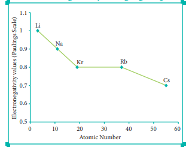