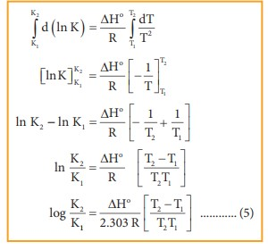
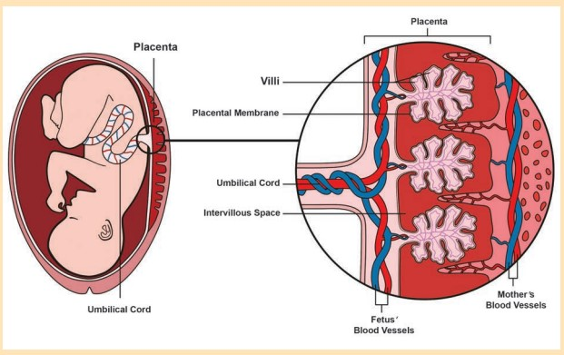
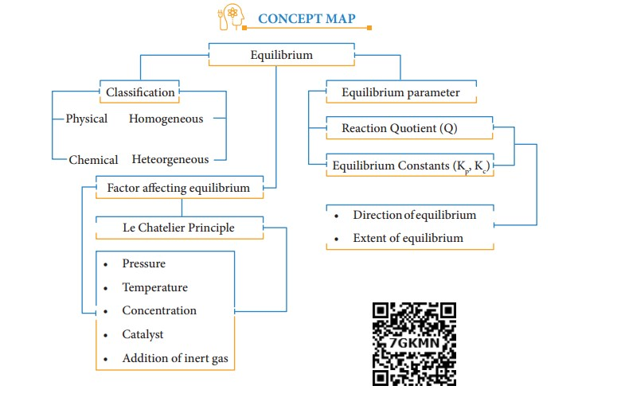
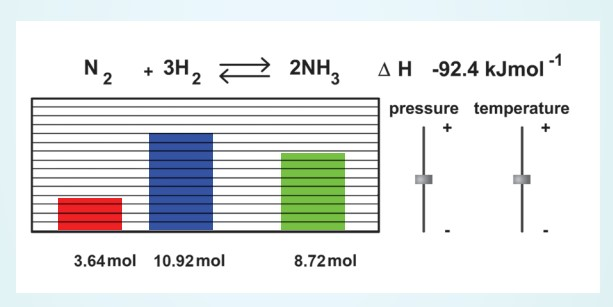

This equation gives the quantitative temperature dependence of equilibrium constant (K). The relation between standard free energy change (ΔG°) and equilibrium constant is

ΔG° = –RTln K (1)

We know that

ΔG° = ΔH° – TΔS° (2)

Substituting (1) in equation (2)

–RTln K = ΔH° – TΔS°

Rearranging

ln K = −∆H°/RT + −∆S°/R   (3)
|---|

Differentiating equation (3) with respect to temperature,

d(ln K)/dT = ∆H°/RT2   (4)
|---|

Equation 4 is known as differential form of van’t Hoff equation.

On integrating the equation 4, between T2 and T2 with their respective equilibrium constants K1 and K2.

Equation 5 is known as integrated form of van’t Hoff equation. 

**Problem:**

For an equilibrium reaction Kp = 0.0260 at 25° C ΔH= 32.4 kJmol-1, calculate Kp at 37° C 
**Solution :**

T1=25 + 273 = 298 K

T2 = 37 + 273 = 310 K

ΔH = 32.4 KJmol-1 = 32400 Jmol-1

R=8.314 JK-1 mol-1

Kp1 = 0.0260

Kp2 = ?

**Evaluate Yourself**   
5) The equilibrium constant for the following reaction is 0.15 at 298 K and 1 atm pressure.

N2O4(g) ⇌ 2NO2(g); 

ΔHºf = 57.32 KJmol-1

The reaction conditions are altered as follows. 

a) The reaction temperature is altered to 100o C keeping the pressure at 1 atm, Calculate the equilibrium constant.

**Do you Know?**
How does oxygen exchanges between maternal and fetal blood in pregnant women?  In a pregnant women, the oxygen supply for fetus is provided by the maternal blood in the placenta where the blood vessels of both mother and fetus are in close proximity. Both fetal and maternal hemoglobin binds to oxygen reversibly as follows. Hb(mother) + O2 ⇌ HbO2 (mother) Hb(fetus) + O2 ⇌ HbO2 (Fetus) In the above two equilibriums, the equilibrium constant value for the oxygenation of fetal hemoglobin is higher, which is due to its higher affinity for oxygen compared to the adult hemoglobin. Hence in placenta, the oxygen from the mother's blood is effectively transferred to the fetal hemoglobin
|---|

**SUMMARY**

In our daily life, we observe several chemical and physical changes.

• In some chemical reactions, at a particular stage, the rate of the reverse reaction is
equal to that of the forward reaction indicating a state of equilibrium.  

There are different types of equilibrium.

Physical equilibrium

Chemical Equilibrium

• Chemical reactions which are reversible do not cease, when equilibrium is attained. At equilibrium the forward and the backward reactions are proceeding at the same rate and no macroscopic change is observed. So chemical equilibrium is in a state of dynamic equilibrium.

• The rate law states that, “At any instant, the rate of a chemical reaction at a given temperature is directly proportional to the product of the active masses of the reactants at that instant”.

• The value of equilibrium constant, Kc tells us the extent of a reaction, i.e., it indicates how far the reaction has proceeded towards product formation at a given temperature.

• Under non-equilibrium conditions, reaction quotient ‘Q’ is defined as the ratio of the product of active masses of reaction products raised to the respective stoichiometric coefficients in the balanced chemical equation to that of the reactants.

• Le-Chatelier's Principle “If a system at equilibrium is disturbed, then the system shifts itself in a direction that nullifies the effect of that disturbance.”

• The effect of change in reaction conditions such as temperature, pressure and concentration etc… on a system at equilibrium can be predicted by Le Chatelier-Braun principle.

• vant Hoff equation This equation gives the quantitative temperature dependence of equilibrium constant (K).

**Evaluation**

**I. Choose the best answer.**

1\. If Kb and Kf for a reversible reaction are 0.8 ×10-5 and 1.6 × 10-4 respectively, the value of the equilibrium constant is,

a) 20 b) 0.2 × 10-1

c) 0.05 d) none of these

2\. At a given temperature and pressure, the equilibrium constant values for the equilibriam
The relation between K1 and K2 is

3\. The equilibrium constant for a reaction at room temperature is K1 and that at 700 K is K2. If K1 > K2, then

a) The forward reaction is exothermic

b) The forward reaction is endothermic

c) The reaction does not attain equilibrium

d) The reverse reaction is exothermic

4\. The formation of ammonia from N2(g) and H2(g) is a reversible reaction

N2(g) + 3H2(g) ⇌ 2NH3(g) + Heat

What is the effect of increase of temperature on this equilibrium reaction

a) equilibrium is unaltered

b) formation of ammonia is favoured

c) equilibrium is shifted to the left

d) reaction rate does not change

5\. Solubility of carbon dioxide gas in cold water can be increased by

a) increase in pressure

b) decrease in pressure

c) increase in volume

d) none of these

6 Which one of the following is incorrect statement ?

a) for a system at equilibrium, Q is always less than the equilibrium constant

b) equilibrium can be attained from either side of the reaction

c) presence of catalyst affects both the forward reaction and reverse reaction to the same extent

d) Equilibrium constant varied with temperature

7\. K1 and K2 are the equilibrium constants for the reactions respectively.

What is the equilibrium constant for the reaction NO2(g) ⇌ ½N2(g) + O2(g)

8\. In the equilibrium,

2A(g) ⇌ 2B(g) + C2(g)

the equilibrium concentrations of A, B and C2 at 400 K are 1 × 10–4 M, 2.0 × 10–3 M, 1.5 × 10–4 M respectively. The value of KC for the equilibrium at 400 K is

a) 0.06 b) 0.09

c) 0.62 d) 3 × 10–2

9\. An equilibrium constant of 3.2 × 10–6 for a reaction means, the equilibrium is

a) largely towards forward direction

b) largely towards reverse direction

c) never established

d) none of these

10\. K K C

P for the reaction,

N2(g) + 3H2(g) ⇌ 2NH3(g) is

a) 1 RT

b) RT

c) RT d) (RT)2

11\. For the reaction AB (g) ⇌ A(g) + B(g), at equilibrium, AB is 20% dissociated at a total pressure of P, The equilibrium constant KP is related to the total pressure by the expression

a) P = 24 KP b) P = 8 KP

c) 24 P = KP d) none of these

12\. In which of the following equilibrium, KP and KC are not equal?

a) 2 NO(g) ⇌ N2(g) + O2(g)

b) SO2 (g) + NO2 ⇌ SO3(g) + NO(g)

c) H2(g) + I2(g) ⇌ 2HI(g)

d) PC_l_5 (g) ⇌ PC_l_3(g) + C_l_2(g)

13\. If x is the fraction of PC_l_5 dissociated at equilibrium in the reaction

PC_l_5 ⇌ PC_l_3 + C_l_2

then starting with 0.5 mole of PC_l_5, the total number of moles of reactants and products at equilibrium is

a) 0.5 – x b) x + 0.5

c) 2x + 0.5 d) x + 1

14\. The values of K and KP P1 2 for the reactions

X ⇌ Y + Z

A ⇌ 2B are in the ratio 9 : 1 if degree of dissociation and initial concentration of X and A be equal then total pressure at equilibrium P1, and P2 are in the ratio

a) 36 : 1 b) 1 : 1

c) 3 : 1 d) 1 : 9

15\. In the reaction,

Fe (OH)3 (s) ⇌ Fe3+(aq) + 3OH–(aq),

if the concentration of OH– ions is decreased by ¼ times, then the  

equilibrium concentration of Fe3+ will

a) not changed

b) also decreased by ¼ times

c) increase by 4 times

d) increase by 64 times

16\. Consider the reaction where KP = 0.5 at a particular temperature

PC_l_5(g) ⇌ PC_l_3 (g) + C_l_2 (g)

if the three gases are mixed in a container so that the partial pressure of each gas is initially 1 atm, then which one of the following is true

a) more PC_l_3 will be produced

b) more C_l_2 will be produced

c) more PC_l_5 will be produced

d) none of these

17\. Equimolar concentrations of H2 and I2 are heated to equilibrium in a 1 litre flask. What percentage of initial concentration of H2 has reacted at equilibrium if rate constant for both forward and reverse reactions are equal

a) 33% b) 66%

c) (33)2 % d) 16.5 %

18\. In a chemical equilibrium, the rate constant for the forward reaction is 2.5 × 102 and the equilibrium constant is 50. The rate constant for the reverse reaction is,

a) 11.5 b) 5

c) 2 × 102 d) 2 × 10–3

19\. Which of the following is not a general characteristic of equilibrium involving physical process

a) Equilibrium is possible only in a closed system at a given temperature

b) The opposing processes occur at the same rate and there is a dynamic but stable condition

c) All the physical processes stop at equilibrium

d) All measurable properties of the system remains constant

20\. For the formation of Two moles of SO3(g) from SO2 and O2, the equilibrium constant is K1. The equilibrium constant for the dissociation of one mole of SO3 into SO2 and O2 

21\. Match the equilibria with the corresponding conditions,

i) Liquid ⇌ Vapour

ii) Solid ⇌ Liquid

iii) Solid ⇌ Vapour

iv) Solute (s) ⇌ Solute (Solution)

1) melting point

2) Saturated solution

3) Boiling point

4) Sublimation point

5) Unsaturated solution  

(i) (ii) (iii) (iv) (a) 1 2 3 4 (b) 3 1 4 2 (c) 2 1 3 4 (d) 3 2 4 5

22\. Consider the following reversible reaction at equilibrium, A + B ⇌ C, If the concentration of the reactants A and B are doubled, then the equilibrium constant will

a) be doubled b) become one fourth

c) be halved d) remain the same

23\. \[Co(H2O)6\] 2+ (aq) (pink) + 4Cl– (aq) ⇌

\[CoCl4\] 2– (aq) (blue)+ 6 H2O (_l_)

In the above reaction at equilibrium, the reaction mixture is blue in colour at room temperature. On cooling this mixture, it becomes pink in colour. On the basis of this information, which one of the following is true ?

a) ΔH > 0 for the forward reaction

b) ΔH = 0 for the reverse reaction

c) ΔH < 0 for the forward reaction

d) Sign of the ΔH cannot be predicted based on this information.

24\. The equilibrium constants of the following reactions are :

N2 + 3H2 ⇌ 2NH3 ; K1

N2 + O2 ⇌ 2NO ; K2

H2 + ½O2 ⇌ H2O ; K3

The equilibrium constant (K) for the reaction ;

| |(i) |(ii) |(iii) |(iv) |
|------|------|------|------|------|
| (a) |1 |2 |3 |4 |
| (b) |3 |1 |4 |2 |
| (c) |2 |1 |3 |4 |
| (d) |3 |2 |4 |5 |

25\. A 20 litre container at 400 K contains CO2 (g) at pressure 0.4 atm and an excess of SrO (neglect the volume of solid SrO). The volume of the container is now decreased by moving the movable piston fitted in the container. The maximum volume of the container, when pressure of CO2 attains its maximum value will be :

Given that : SrCO3 (S) ⇌ SrO (S) + CO2(g)

KP = 1.6 atm (NEET 2017)

a) 2 litre b) 5 litre c) 10 litre d) 4 litre

**II. Write brief answer to the following questions.**

26\. If there is no change in concentration, why is the equilibrium state considered dynamic ?

27\. For a given reaction at a particular temperature, the equilibrium constant has constant value. Is the value of Q also constant ? Explain.

28\. What is the relation between KP and KC. Give one example for which KP is equal to KC.

29\. For a gaseous homogeneous reaction at equilibrium, number of moles of products are greater than the number of moles of reactants. Is KC is larger or smaller than KP.

30\. When the numerical value of the reaction quotient (Q) is greater than  

d K K K) 2 3

1

the equilibrium constant (K), in which direction does the reaction proceed to reach equilibrium ?

31\. For the reaction,

A2(g) + B2(g) ⇌ 2AB(g) ; ΔH is –ve.

the following molecular scenes represent different reaction mixture (A – green, B – blue)

Closed ← System

At equilibrium

(x) (y)

i) Calculate the equilibrium constant KP and (KC).

ii) For the reaction mixture represented by scene (x), (y) the reaction proceed in which directions ?

iii) What is the effect of increase in pressure for the mixture at equilibrium.

32\. State Le-Chatelier principle.

33\. Consider the following reactions,

a) H2(g) + I2(g) ⇌ 2 HI(g)

b) CaCO3 (s) ⇌ CaO (s) + CO2(g)

c) S(s) + 3F2 (g) ⇌ SF6 (g)

In each of the above reaction find out whether you have to increase (or) decrease the volume to increase the yield of the product.

34\. State law of mass action.

35\. Explain how will you predict the direction of a equilibrium reaction.

36\. Derive a general expression for the equilibrium constant KP and KC for the reaction

3H2(g) + N2(g) ⇌ 2NH3(g)

37\. Write a balanced chemical equation for the equilibrium reaction for which the equilibrium constant is given by expression

38\. What is the effect of added inert gas on the reaction at equilibrium at constant volume.

39\. Derive the relation between KP and KC.

40\. One mole of PC_l_5 is heated in one litre closed container. If 0.6 mole of chlorine is found at equilibrium, calculate the value of equilibrium constant.

41\. For the reaction

SrCO3 (s) ⇌ SrO (s) + CO2(g),

the value of equilibrium constant KP = 2.2 × 10–4 at 1002 K. Calculate KC for the reaction.

42\. To study the decomposition of hydrogen iodide, a student fills an evacuated 3 litre flask with 0.3 mol of HI gas and allows the reaction to proceed at 500 0C. At equilibrium he found the concentration of HI which is equal to 0.05 M. Calculate KC and KP for this reaction.

43\. 1 mol of CH4, 1 mole of CS2 and 2 mol of H2S are 2 mol of H2 are mixed in a 500 ml flask. The equilibrium constant for the reaction KC = 4 × 10–2 mol2 lit–2.  

In which direction will the reaction proceed to reach equilibrium ?

44\. At particular temperature KC = 4 × 10–2 for the reaction

H2S(g) ⇌ H2(g) + ½ S2(g)

Calculate KC for each of the following reaction

i) 2H2S (g) ⇌ 2H2 (g) + S2 (g)

ii) 3H2S (g) ⇌ 3H2 (g) + 32 S2(g)

45\. 28 g of Nitrogen and 6 g of hydrogen were mixed in a 1 litre closed container. At equilibrium 17 g NH3 was produced. Calculate the weight of nitrogen, hydrogen at equilibrium.

46\. The equilibrium for the dissociation of XY2 is given as, 2XY2 (g) ⇌ 2XY (g) + Y2(g) if the degree of dissociation x is so small compared to one. Show that 2 KP = PX3 where P is the total pressure and KP is the dissociation equilibrium constant of XY2.

47\. A sealed container was filled with 1 mol of A2 (g), 1 mol B2 (g) at 800 K and total pressure 1.00 bar. Calculate the amounts of the components in the mixture at equilibrium given that K = 1 for the reaction

A2 (g) + B2 (g) ⇌ 2AB (g)

48\. Deduce the Vant Hoff equation.

49\. The equilibrium constant KP for the reaction N2(g) + 3H2(g) ⇌ 2NH3(g) is 8.19 × 102 at 2 the reaction.

50\. The partial pressure of carbon dioxide in th

CaCO3 (s) ⇌ CaO (s) + CO2(g) is 1.017 × the reaction. ΔH for the reaction is 181 KJ of temperature.

**Effect of temperature and pressure in an equilibrium process**

By using this tool, we can determine the effect of pressure and temperature in the equilibrium concentration of the components in ammonia synthesis (Haber process) 
|---|

Please go to the URL http://www.freezeray.com/flashFiles/ammoniaConditions.htm (or) Scan the QR code on theright side
|---|

**Steps**

• Open the Browser and type the URL given (or) Scan the QR Code.

• The website will show the equilibrium reaction involved in ammonia synthesis and the relative concentration of the components. The visual representation and the actual concentration values are given in the box 1.

• Now change the pressure or temperature using the corresponding slider indicated in the
box2.

• As you move the slider you will be able to see the change in the equilibrium concentration
of reactants and products.

• Now you can understand that if a stress is applied on the system at equilibrium, the system will adjust itself to nullify the effect of the stress.

