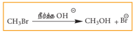
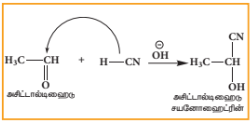
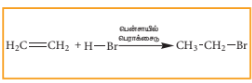
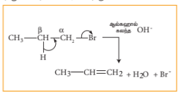
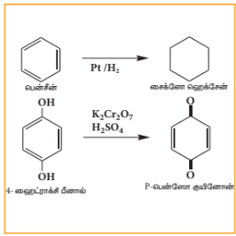

## 12.2 கரிம வேதிவினைகளின் வகைகள்

கரிமச் சேர்மங்கள் பல்வேறு வேதிவினைகளில் ஈடுபடுகின்றன எனினும் நடைமுறையில் இவ்வினைகளை நாம் பின்வரும் ஆறு வகை வினைகளுள் ஒன்றாக வகைப்படுத்த இயலும்.

1) பதிலீட்டு வினைகள்
2) சேர்க்கை வினைகள்
3) நீக்க வினைகள்
4) ஆக்சிஜனேற்றம் மற்றும் ஒடுக்க வினைகள்
5) மேற் கண்டுள்ள வினைகள்
இணைந்தவை

#### 12.2.1 பதிலீட்டு வினைகள் (இடப்பெயர்வு வினைகள்)

இவ்வகை வினைகளில் கார்பன் அணுவுடன் இணைக்கப்பட்டுள்ள ஒரு அணு அல்லது அணுத்தொகுதி மற்றுமொரு புதிய அணு அல்லது அணுத்தொகுதியால் பதிலீடு செய்யப்படுகின்றது. வினையில் ஈடுபடும் தாக்கும் வினைப்பொருளின் தன்மையினைப் பொறுத்து இவ்வினையினைப் பின்வருமாறு மேலும் வகைப்படுத்தலாம்.

1) கருக்கவர் பொருள் பதிலீட்டு வினை
2) எலக்ட்ரான் கவர் பொருள் பதிலீட்டு வினை
3) தனி உறுப்பு பதிலீட்டு வினை

**கருக்கவர் பொருள் பதிலீட்டு வினை:**

இவ்வினையினைப் பின்வருமாறு குறிப்பிடலாம்

இங்கு \( Y^- \) என்பது உள்வரும் கருக்கவர் பொருளைக் குறிப்பிடுகிறது மேலும் X என்பது வெளியேறும் தொகுதியினைக் குறிப்பிடுகின்றது. எடுத்துக்காட்டு: ஆல்க்கைல் ஹாலைடுகளின் நீராற்பகுப்பு வினை

அலிபாட்டிக் கருக்கவர் பொருள் பதிலீட்டு வினைகள் \( S_N1 \) அல்லது \( S_N2 \) வினைவழி முறையினைப் பின்பற்றி நிகழ்கின்றன. இவ்வினைகளின் வினைவழி முறைகளை அலகு 14ல் விரிவாகக் கற்கலாம்.

**எலக்ட்ரான் கவர் பொருள் பதிலீட்டு வினை**

இங்கு \( Y^+ \) என்பது எலக்ட்ரான் கவர் பொருள். எடுத்துக்காட்டு: பென்சீனின் நைட்ரோ ஏற்ற வினை

எலக்ட்ரான் கவர் பொருள் பதிலீட்டு வினைக்கான வினைவழி முறை அலகு 13ல் விளக்கப்பட்டுள்ளது.

**தனி உறுப்பு பதிலீட்டு வினை**

$$A-X + Y^\bullet \longrightarrow A-Y + X^\bullet$$
$$\text{CH}_4 + \text{Cl}^\bullet \longrightarrow {}^\bullet\text{CH}_3 + \text{HCl}$$

இங்கு \( Y^* \) என்பது தனி உறுப்பு வினைத் துவக்கி. எடுத்துக்காட்டு ஆல்க்கேன்களின் ஹாலஜனேற்ற வினை. இவ்வினையின் விரிவான வினைவழிமுறை பாடம் 13 இல் விளக்கப்பட்டுள்ளது.

**அலிபாட்டிக் எலக்ட்ரான் கவர் பொருள் பதிலீட்டு வினை**

ஒரு பொதுவான அலிபாட்டிக் எலக்ட்ரான் கவர் பொருள் பதிலீட்டு வினையைப் பின்வருமாறு குறிப்பிடலாம்.

$$\text{R-X} + \text{E}^+ \longrightarrow \text{R-E} + \text{X}^+$$

$$\text{R}_2\text{NH} + \text{NO}^+ \rightarrow \text{R}_2\text{N-NO} + \text{H}^+$$

#### 12.2.2 சேர்க்கை வினை

இவ்வினை உள்ளடங்கிய கார்பன் – கார்பன் இரட்டைப் பிணைப்பு அல்லது முப்பிணைப்பு காணப்படக்கூடிய நிறைவுறா சேர்மங்களுக்கான ஒரு தனித்துவமிக்க வினையாகும். இவ்வினைகளில் இரு மூலக்கூறுகள் இணைந்து ஒற்றை விளைபொருளைத் தருகின்றன. பதிலீட்டு வினைகளைப் போலவே இவ்வினைகளையும் கருக்கவர் பொருள், எலக்ட்ரான் கவர் பொருள் மற்றும் தனி உறுப்பு சேர்க்கை வினைகள் என வினையைத் துவக்கி வைக்கும் வினைப்பொருளின் அடிப்படையில் வகைப்படுத்தலாம். சேர்க்கை வினையின் போது ஒரு π இணைப்பு உடைக்கப்படுகிறது, இரு புதிய σ இணைப்புகள் உருவாவதால் வினைக்கு உட்படும் பொருளின் இனக்கலப்பு நிலை மாற்றமடைகிறது. (ஆல்கீன்களின் சேர்க்கை வினைகளில் \( sp^2 \rightarrow sp^3 \) ஆகவும், ஆல்க்கைன்களில் \( sp \rightarrow sp^2 \) ஆகவும் மாற்றமடைகிறது.)

**எலக்ட்ரான் கவர் பொருள் சேர்க்கை வினை**

ஒரு பொதுவான எலக்ட்ரான் கவர் பொருள் சேர்க்கை வினையினைப் பின்வருமாறு குறிப்பிடலாம்.

ஆல்கீன்கள் புரோமினேற்றம் அடைந்து புரோமோ ஆல்க்கேன்களைத் தரும் வினை இவ்வகை வினைக்கான ஒரு எடுத்துக்காட்டாகும்.

**கருக்கவர் பொருள் சேர்க்கை வினை**

ஒரு பொதுவான கருகவர் பொருள் சேர்க்கை வினை பின்வருமாறு.

எடுத்துக்காட்டு: அசிட்டால்டிஹைடுடன் HCN புரியும் சேர்க்கை வினை

**தனி உறுப்பு சேர்க்கை வினை:**

ஒரு பொதுவான தனி உறுப்பு சேர்க்கை வினையைப் பின்வருமாறு குறிப்பிடலாம்

மேற்கண்டுள்ள வினையில், தனி உறுப்பு வினை துவக்கியாக பென்சாயில் பெராக்சைடு பயன்படுகிறது. இவ்வினையின் வினைவழிமுறை தனி உறுப்பு உருவாதலை உள்ளடக்கியது.

**நீக்க வினை**

இவ்வகை வினைகளில் ஒரு மூலக்கூறிலிருந்து இரு பதிலிகள் நீக்கப்படுகின்றன. மேலும் நீக்கப்படும் தொகுதிகள் நீக்கப்படும் முன்னர் இணைக்கப்பட்டிருந்த கார்பன் அணுக்களுக்கிடையே C=C இரட்டைப் பிணைப்பு உருவாகிறது. இவ்வகை வினைகளில் எப்போதும் இனக்கலப்பாதலில் மாறுதல் நிகழ்கிறது. எடுத்துக்காட்டு:

n-பியூட்டைல் புரோமைடு ஆல்ககாலிக் KOH உடன் வினைப்பட்டு பியூட்டீனை உருவாக்குகிறது. இவ்வினையில் H மற்றும் Br நீக்கப்படுகிறது.

**ஆக்சிஜனேற்றம் மற்றும் ஒடுக்க வினைகள்**

பெரும்பாலான ஆக்சிஜனேற்ற ஒடுக்க வினைகள் மேற்கண்ட நான்கு வகை வினைகளில் ஒன்றாக அமையும். ஆனால் அனைத்து வினைகளும் அவ்வாறாக அமைவதில்லை. பெரும்பாலான கரிமச் சேர்மங்களின் ஆக்சிஜனேற்ற வினைகளில் ஆக்சிஜனை ஏற்றுக்கொள்ளுதல் அல்லது ஹைட்ரஜனை இழத்தல் நடைபெறுகிறது. ஒடுக்க வினைகளில் ஹைட்ரஜனை ஏற்றல் அல்லது ஆக்சிஜனை இழத்தல் நிகழ்கிறது.

**ஆக்சிஜனேற்ற வினை:**

**ஆக்ஸிஜனொொடுக்்க வினை:**

>**ஆப்பிளில் பழுப்பாகுதல்:**
>
>ஆப்பிளில் பாலிபினால் ஆக்சிடேஸ் என்றழைக்கப்படும் பாலி பினால் ஆக்சிடேஸ் உள்ளது. ஆப்பிளை நறுக்கி வைக்கும் போது அதன் செல்கள் வளி மண்டல ஆக்சிஜனின் தாக்கத்திற்கு உட்படுவதால் ஆப்பிளில் உள்ள பீனாலிக் சேர்மம் ஆக்சிஜனேற்றமடைகிறது. இது நொதியால் பழுப்பாகுதல் என அழைக்கப்படுகிறது. இதனால் நறுக்கிய ஆப்பிள் பழுப்பு நிறமாகிறது. இத்தகைய நொதியால் பழுப்பாகுதல் என்பது வாழைப்பழம், அவகேடோ, பேரிக்காய், உருளை போன்றவற்றிலும் நிகழ்கிறது.
