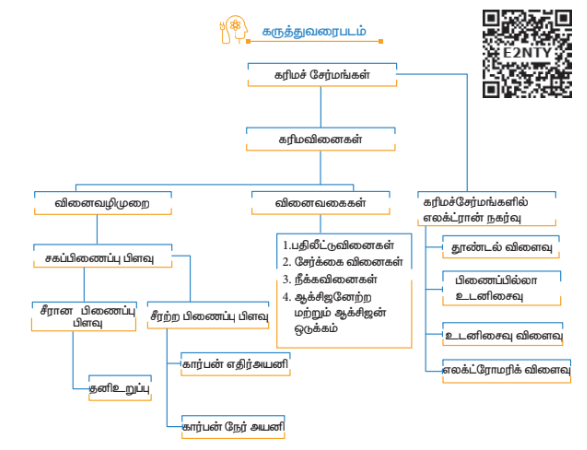

### மதிப்பீடு

#### I. சரியான விடையைத் தேர்ந்தெடுக்க

1. \[ (A) \ CH_3CH_2CH_2Br + KOH \rightarrow CH_3 - CH = CH_2 + KBr + H_2O \]

   \[ (B) \ CH_3CH_2Br + KOH \rightarrow CH_3CH_2OH + KBr \]

   

   மேற்கண்டுள்ள வினைகளுக்கு, பின்வரும் எந்தக் கூற்று சரியானது?
   (அ) (A) நீக்க வினை (B) மற்றும் (C) பதிலீட்டு வினைகள்

   (ஆ) (A) பதிலீட்டு வினை (B) மற்றும் (C) நீக்க வினைகள்

   (இ) (A) மற்றும் (B) நீக்க வினைகள் மற்றும் (C) சேர்க்கை வினை

   (ஈ) (A) நீக்க வினை (B) பதிலீட்டு வினை மற்றும் (C) சேர்க்கை வினை

2. பென்சைல் கார்பன் நேர் அயனியின் இனக்கலப்பாதல் என்ன?

   (அ) \( sp^2 \)

   (ஆ) \( sp^2 d \)

   (இ) \( sp^3 \)

   (ஈ) \( sp^2 d^2 \)

3. கருக்கவர் திறனின் இறங்கு வரிசை

   (அ) \( OH^- > NH_2^- > OCH_3^- > RNH_2 \)

   (ஆ) \( NH_2^- > OH^- > OCH_3^- > RNH_2 \)

   (இ) \( NH_2^- > CH_3O^- > OH^- > RNH_2 \)

   (ஈ) \( CH_3O^- > NH_2^- > OH^- > RNH_2 \)

4. பின்வருவனவற்றில் எது எலக்ட்ரான் கவர் பொருள் அல்ல?

   (அ) \( Cl^+ \)

   (ஆ) \( BH_3 \)

   (இ) \( H_2O \)

   (ஈ) \( ^+NO_2 \)

5. ஒரு சகப்பிணைப்பின் சீரான ஒரே மாதிரியான பிளவினால் உருவாவது

   (அ) எலக்ட்ரான் கவர் பொருள்

   (ஆ) கருக்கவர் பொருள்

   (இ) கார்பன் நேர் அயனி

   (ஈ) தனி உறுப்பு

6. Hyper Conjugation இவ்வாறும் அழைக்கப்படுகிறது

   (அ) பிணைப்பில்லா உடனிசைவு

   (ஆ) பேக்கர் – நாதன் விளைவு

   (இ) (அ) மற்றும் (ஆ)

   (ஈ) இவை எதுவுமில்லை

7. அதிக +I விளைவினைப் பெற்றுள்ள தொகுதி எது?

   (அ) \( CH_3^- \)

   (ஆ) \( CH_3-CH_2^- \)

   (இ) \( (CH_3)_2-CH^- \)

   (ஈ) \( (CH_3)_3-C^- \)

8. பின்வருவனவற்றுள் மீசோமெரிக் விளைவிற்கு உட்படாத சேர்மம் எது?

   (அ) \( C_6H_5OH \)

   (ஆ) \( C_6H_5Cl \)

   (இ) \( C_6H_5NH_2 \)

   (ஈ) \( C_6H_5NH_3^+ \)

9. –I விளைவினைக் காட்டுவது

   (அ) \( -Cl \)

   (ஆ) \( -Br \)

   (இ) (அ) மற்றும் (ஆ)

   (ஈ) \( -CH_3 \)

10. பின்வருவனவற்றுள் அதிக நிலைப்புத் தன்மையைப் பெற்றுள்ள கார்பன் நேரயனி எது?

    (அ) \( Ph_3C^+ \)

    (ஆ) \( CH_3\overset{+}{C}H_2 \)

    (இ) \( (CH_3)_2\overset{+}{C}H \)

    (ஈ) \( CH_2 = CH - \overset{+}{C}H_2 \)

11. **கூற்று:** பொதுவாக ஓரிணைய கார்பன் நேர் அயனியைக் காட்டிலும் மூவிணைய கார்பன் நேர் அயனிகள் எளிதில் உருவாகின்றன.

    **காரணம்:** கூடுதலாக உள்ள ஆல்க்கைல் தொகுதியின் பிணைப்பில்லா உடனிசைவு மற்றும் தூண்டல் விளைவானது மூவிணைய கார்பன் நேரயனியை நிலைப்புத் தன்மை பெறச் செய்கிறது.

    (அ) கூற்று மற்றும் காரணம் சரி, மேலும் காரணமானது கூற்றிற்குச் சரியான விளக்கமாகும்.

    (ஆ) கூற்று மற்றும் காரணம் சரி, ஆனால் காரணமானது கூற்றிற்குச் சரியான விளக்கமல்ல.

    (இ) கூற்று சரி ஆனால் காரணம் தவறு.

    (ஈ) கூற்று மற்றும் காரணம் இரண்டும் தவறு.

12. C-C பிணைப்பின் சீரற்ற பிளவினால் உருவாவது

    (அ) தனி உறுப்பு

    (ஆ) கார்பன் எதிரயனி

    (இ) கார்பன் நேர் அயனி

    (ஈ) கார்பன் நேர் அயனி மற்றும் கார்பன் எதிரயனி

13. பின்வருவனவற்றுள் கருக்கவர் பொருட்களின் தொகுப்பைக் குறிப்பிடுவது எது?

    (அ) \( BF_3, H_2O, NH_2^- \)

    (ஆ) \( AlCl_3, BF_3, NH_3 \)

    (இ) \( CN^-, RCH_2^-, ROH \)

    (ஈ) \( H^+, RNH_3^+, :CCl_2 \)

14. பின்வருவனவற்றுள் கருக்கவர் பொருளாகச் செயல்படாதது எது?

    (அ) \( ROH \)

    (ஆ) \( ROR \)

    (இ) \( PCl_3 \)

    (ஈ) \( BF_3 \)

15. கார்பன் நேர் அயனியின் வடிவமைப்பு

    (அ) நேர் கோடு

    (ஆ) நான்முகி

    (இ) தள அமைப்பு

    (ஈ) பிரமிடு

16. பின்வருவன பற்றி சிறு குறிப்பு வரைக
    (அ) உடனிசைவு
    (ஆ) பிணைப்பில்லா உடனிசைவு

17. கருக்கவர் பொருள் மற்றும் எலக்ட்ரான் கவர் பொருள் என்றால் என்ன? ஒவ்வொன்றிற்கும் தகுந்த உதாரணம் தருக.

18. வளைந்த அம்புக்குறியீட்டினைப் பயன்படுத்தி சகப்பிணைப்பின் சீரற்ற பிளத்தலைச் சுட்டிக் காட்டுவதுடன் பின்வரும் சமன்பாடுகளைப் பூர்த்தி செய்க. ஒவ்வொரு வினையிலும் கருக்கவர் பொருளைக் கண்டறிக.

    \[ \text{(i) } \text{CH}_3 - \text{Br} + \text{KOH} \rightarrow \]

    \[ \text{(ii) } \text{CH}_3 - \text{OCH}_3 + \text{HI} \rightarrow \]

19. தூண்டல் விளைவினைத் தகுந்த உதாரணங்களுடன் விளக்குக.

20. எலக்ட்ரோமெரிக் விளைவினை விளக்குக.

21. பின்வரும் வகை கரிமவினைகளுக்கு உதாரணம் தருக.
    (i) β - நீக்க வினை
    (ii) எலக்ட்ரான் கவர் பொருள் பதிலீட்டு வினை

