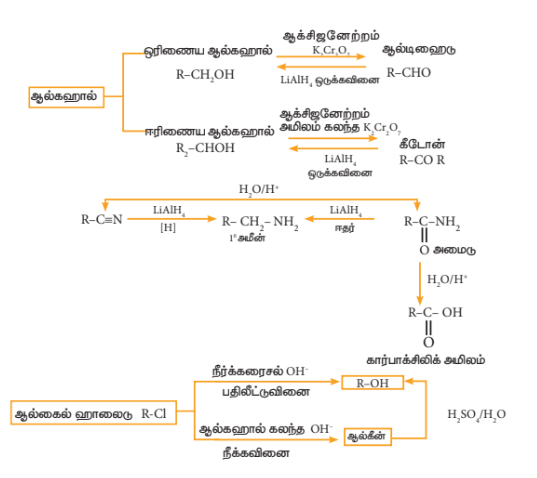

## 12.3 வினைச்செயல் தொகுதிகளை மாற்றியமைத்தல்

வினைச்செயல் தொகுதிகளை அவைகளுக்கிடையே மாற்றியமைத்தல் கரிம வேதித் தொகுப்பு வினைகளில் முக்கியமானதாகும். ஒரு குறிப்பிட்ட வினைச்செயல் தொகுதியைத் தகுந்த வேதிக்காரணியுடன் வினைப்படுத்துவதன் மூலம் அதனை வேறொரு வினைச்செயல் தொகுதியாக மாற்றலாம். எடுத்துக்காட்டாக, கரிம அமிலங்களில் காணப்படும் (-COOH) தொகுதியினை \( -CH_2OH, -CONH_2 \) மற்றும் \( -COCl \) ஆகிய வினைச்செயல் தொகுதிகளாக மாற்றி அமைக்க இயலும். இம்மாற்றங்களை மேற்கொள்ள கரிம அமிலத்தினை முறையே \( LiAlH_4, NH_3 \) மற்றும் \( SOCl_2 \) ஆகியவற்றுடன் வினைப்படுத்த வேண்டும்.

பின்வரும் எந்த வினைக்கு தொடர்புடைய வெவ்வேறு வினை வகைகள் கொடுக்கப்பட்டுள்ளன.

