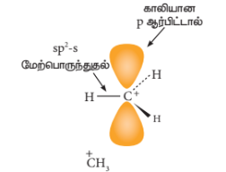
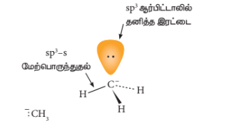
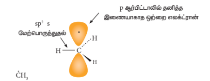
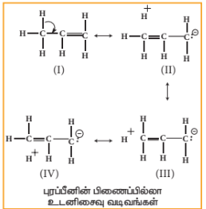

## 12.1 பாட அறிமுகம்

ஒரு வேதி வினையினை, வினைபடும் மூலக்கூறுகளில் உள்ள சில பிணைப்புகள் உடைதல் மற்றும் புதிய வேதி பிணைப்புகள் உருவாகும் செயல்முறை எனக் கருதலாம். அதாவது வேதி வினைகளில் வினைபடு பொருட்களில் பெரும்பாலானவை வினைவிளை பொருட்களாக மாற்றப்படுகின்றன. இந்த மாற்றம் ஒன்று அல்லது அதற்கு மேற்பட்ட படிகளை உள்ளடக்கியது. ஒரு பொதுவான கரிம வேதி வினையினை பின்வருமாறு குறிப்பிட இயலும்.

வினைக்குட்படும் பொருள் + வினைக்காரணி → வினை இடை நிலை மற்றும் / அல்லது பரிமாற்ற நிலை → வினை விளைபொருள்

வேதி மாற்றத்திற்கு உட்படும் கரிம வேதி மூலக்கூறே இங்கு வினைக்கு உட்படும் பொருள் எனப்படுகிறது. வினைக்காரணி என்பது கரிம அல்லது கனிமப் பொருளாகவோ அல்லது வெப்பம், ஒளி, ஃபோட்டான்கள் போன்ற வேதி மாற்றத்தினை ஏற்படுத்தும் காரணிகளாகவோ இருக்கலாம்.

பெரும்பாலான வேதிவினைகளை ஒன்று அல்லது அதற்கு மேற்பட்ட எளிய படிகளில் குறிப்பிட இயலும். ஒவ்வொரு படி நிலையிலும் வினை நிகழ்வானது, ஒரு ஆற்றல் தடை அரணின் வழிச் செல்வதால் குறைந்த ஆயுட்காலம் உடைய வினை இடைநிலை அல்லது பரிமாற்றநிலை உருவாகிறது.

வினைக்கு உட்படும் பொருளிலிருந்து, வினைவிளை பொருளாக மாற்றமடையும் வரை நிகழும் வேதி மாற்றங்களைக் குறிப்பிடும் தொடர்ச்சியான அனைத்து எளிய வினை நிகழ் படிகளின் ஒட்டு மொத்த தொகுப்பு வினைவழி முறை என அழைக்கப்படுகிறது. வினை வழி முறையில் மிக மெதுவாக நிகழும் படியானது வினையின் ஒட்டுமொத்த வினை வேகத்தினைத் தீர்மானிக்கிறது.

### 12.1.1 கரிம வினை வழிமுறையின் அடிப்படைக் கருத்துக்கள்

ஒரு வேதி மாற்றம் நிகழும்போது அதன் ஒவ்வொரு படிநிலையிலும் நிகழும் மாற்றங்களை விவரிக்கும் ஒரு கருத்தியல் வழிமுறையே வினைவழி முறை எனப்படுகிறது. ஒரு கரிம வேதிவினையில், எலக்ட்ரான்களின் நகர்வு, வினை நிகழும் போது உருவாகும் வினை இடை நிலைப் பொருளின் வகை ஆகியனவற்றின் அடிப்படையில் அவ்வேதிவினையினைப் புரிந்து கொள்ள முடியும். எலக்ட்ரான் இரட்டை நகரும் திசை ஒரு வளைந்த இருமுனை அம்புக் குறியீட்டால் குறிப்பிடப்படுகிறது. இந்த அம்புக்குறி எதிர்மின் பகுதியிலிருந்து துவங்கி எந்த அணுவோடு எலக்ட்ரான் இரட்டை இணைக்கப்படுகிறதோ அந்த அணுவில் முடிவடைகிறது.

### 12.1.2 சகப்பிணைப்பு பிளவுறுதல்

அணுக்களுக்கிடையே எலக்ட்ரான்கள் சமமாகப் பங்கிடப்படுவதால் உருவாகும் சகப்பிணைப்புகள் அனைத்து கரிம மூலக்கூறுகளிலும் காணப்படுகின்றன. இந்த சகப்பிணைப்புகள் பின்வரும் இரு வகைகளில் பிளவுறலாம். அவையாவன

• ஒரே மாதிரியான பிளவு (சீரான பிளவு)
• வெவ்வேறு விதமான பிளவு (சீரற்ற பிளவு)

வினைக்கு உட்படும் பொருளில் உள்ள பிணைப்பின் பிளவானது வினைக் காரணியின் தன்மையினைப் பொறுத்து அமையும். சீரற்ற பிளப்பிற்குத் தேவைப்படும் ஆற்றலைக் காட்டிலும், சீரான பிளப்பு நிகழ அதிக ஆற்றல் தேவைப்படும்.

**ஒரே மாதிரியான பிளவு (Homolytic Cleavage)**

இத்தகையச் செயல்முறையில், சகப்பிணைப்பால் பிணைக்கப்பட்டுள்ள இரு அணுக்கள் தலா ஒரு எலக்ட்ரானைப் பெறும் வகையில் சகப்பிணைப்பு சீராக பிளக்கப்படுகிறது. இப்பிளவுச் செயல்முறை ஒரு முனை அம்புக்குறியால் (மீன்முள் அம்புக்குறி) குறிப்பிடப்படுகிறது. அதிக வெப்ப நிலை அல்லது uv ஒளி போன்றவற்றின் முன்னிலையில், ஏறத்தாழ சமமான எலக்ட்ரான் கவர்தன்மை கொண்டுள்ள அணுக்களுக்கிடையேயான முனைவற்ற சகப்பிணைப்பைக் கொண்டுள்ள சேர்மங்களில் இவ்வகை பிளவு ஏற்படுகின்றது. இத்தகைய மூலக்கூறுகளில், பிணைப்பு பிளவானது தனி உறுப்புகளை (free radicals) உருவாக்குகிறது. இவற்றின் ஆயுட்காலம் மிகவும் குறைவு மேலும் இவைகள் அதிக வினைத்திறன் உடையவை. வினைக்கு உட்படும் பொருளில் ஒரே மாதிரியான சீரான பிணைப்பு பிளவினை ஊக்குவிக்கும் வினைப் பொருள்கள் தனி உறுப்பு துவக்கி (free radical initiator) என அழைக்கப்படுகின்றன. எடுத்துக்காட்டாக, பலபடியாக்கல் வினைகளில், அசோபிஸ் ஐசோபியூடைரோ நைட்ரைல் (AIBN) மற்றும் பென்சாயில் பெராக்சைடு போன்ற தனி உறுப்பு துவக்கிகள் பயன்படுத்தப்படுகின்றன.

தனித்த நடுநிலைத் தன்மை உடைய இணையாகாத ஒற்றை எலக்ட்ரானைக் கொண்டுள்ள தனி உறுப்பானது அதிக நிலைப்புத்தன்மை அற்றது. அது ஒரு எலக்ட்ரானை ஏற்றுக் கொண்டு நிலைப்புத் தன்மை பெறும் இயல்பினைக் கொண்டுள்ளது. கரிம வேதி வினைகளில் C-C பிணைப்பின் சீரான பிளவினால் ஆல்கைல் தனிஉறுப்புகள் உருவாகின்றன. ஆல்கைல் தனி உறுப்புகளின் நிலைப்புத் தன்மை வரிசை பின்வருமாறு அமையும்.

$$\cdot\text{C}(\text{CH}_3)_3 > \cdot\text{CH}(\text{CH}_3)_2 > \cdot\text{CH}_2\text{CH}_3 > \cdot\text{CH}_3$$

### வெவ்வேறு மாதிரியான பிளவு (Heterolytic Cleavage)

இச்செயல் முறையில், சகப்பிணைப்பானது சீரற்ற முறையில் பிளவடைகிறது. இதில் சகப்பிணைப்பில் பிணைக்கப்பட்டிருந்த அணுக்களில் ஒரு அணு பிணைப்பு இரட்டை எலக்ட்ரான்களைத் தன்னகத்தே இருத்தியிருக்கும். இதன் விளைவாக ஒரு நேர் அயனி மற்றும் ஒரு எதிர்அயனி உருவாகும். பிணைக்கப்பட்டிருந்த அணுக்களில் அதிக எலக்ட்ரான் கவர்தன்மை கொண்ட அணு எதிர் அயனியாகவும் மற்றொன்று நேர் அயனியாகவும் மாற்றமடைகிறது. இப்பிளவானது அதிக எலக்ட்ரான் கவர்தன்மையுடைய அணுவினை நோக்கிய ஒரு வளைவான அம்புற்குறியால் குறிப்பிடப்படுகிறது.

எடுத்துக்காட்டாக, மூவிணைய பியூடைல் புரோமைடில் உள்ள புரோமின் அதிக எலக்ட்ரான் கவர் தன்மை பெற்றிருப்பதால் $\text{C-Br}$ பிணைப்பானது ஒரு முனைவுள்ள பிணைப்பாகும். $\text{C-Br}$ பிணைப்பில் உள்ள பிணைப்பு எலக்ட்ரான்கள் கார்பனைக் காட்டிலும் புரோமினால் அதிக அளவு கவரப்படுகின்றன. எனவே, நீராற்பகுத்தலில், $\text{C-Br}$ பிணைப்பானது சீரற்ற பிளவிற்கு உட்பட்டு மூவிணைய பியூடைல் நேர் அயனியினைத் தருகிறது.

ஆல்டிஹைடு அல்லது கீட்டோன்களில் காணப்படும் $\text{C-H}$ பிணைப்பு பிளவுறுதலை நாம் கருதுவோம். ஹைட்ரஜனைக் காட்டிலும் கார்பன் அதிக எலக்ட்ரான் கவர்தன்மை உடையது என நாம் அறிவோம் எனவே $\text{C-H}$ பிணைப்பின் சீரற்ற பிளவால் கார்பன் எதிர் அயனி உருவாகிறது. எடுத்துக்காட்டாக ஆல்டால் குறுக்க வினையில் $\text{OH}^-$ அயனியானது ஆல்டிஹைடின் $\alpha$-ஹைட்ரஜனைக் கவர்வதால் பின்வரும் எதிர் அயனி உருவாகிறது.

**கார்பன் நேர்அயனியில் உள்ள கார்பனின் இனக்கலப்பு:**

கார்பன் நேர்அயனியில், நேர்மின்தன்மை கொண்ட கார்பன் $\text{sp}^2$ இனக்கலப்பாதலுக்கு உட்பட்டதாகும். எனவே இது சமதள வடிவமைப்புனைப் பெற்றுள்ளது. இத்தகைய கார்பன் நேர்அயனிகள் உருவாகும் வினைகளில், எதிர்மின்தன்மையுடைய கருக்கவர் பொருட்கள், கார்பன் நேர் அயனியை இருபுறமும் தாக்குவதற்கு வாய்ப்புள்ளது.

**படம் 12.1 கார்பன் நேர் அயனி வடிவம்.**

பொதுவாக, கார்பன் எதிர் அயனியானது பிரமிடு வடிவத்தினைப் பெற்றிருக்கும் மேலும் தனித்த இரட்டை எலக்ட்ரானானது கார்பனின் ஒரு \( sp^3 \) இனக்கலப்பு ஆர்பிட்டாலில் இடம் பெற்றிருக்கும்.

**படம் 12.1a** கார்பன் எதிர் அயனி வடிவம்

ஆல்கைல் தனி உறுப்பானது பிரமிடு வடிவத்தினையோ அல்லது தள வடிவத்தினையோ பெற்றிருக்கலாம்.

**படம் 12.1b** கார்பன் தனி உறுப்பு வடிவம்

கார்பன் நேர் அயனி மற்றும் கார்பன் எதிர் அயனிகளின் ஒப்பீட்டு நிலைப்புத்தன்மை வரிசை பின்வருமாறு அமையும்.

பல்வேறு கார்பன் நேர் அயனிகளின் ஒப்பீட்டு நிலைப்புத் தன்மை வரிசை பின்வருமாறு.

\[
+\mathrm{C(CH_3)_3} > +\mathrm{CH(CH_3)_2} > +\mathrm{CH_2CH_3} > +\mathrm{CH_3}
\]

பல்வேறு கார்பன் எதிர் அயனிகளின் ஒப்பீட்டு நிலைப்புத் தன்மை வரிசை பின்வருமாறு.

\[
-\mathrm{C(CH_3)_3} < -\mathrm{CH(CH_3)_2} < -\mathrm{CH_2CH_3} < -\mathrm{CH_3}
\]

### 12.1.3 கருக்கவர் பொருள்கள் மற்றும் எலக்ட்ரான் கவர் பொருள்கள்

நேர்மின் தன்மையுடைய மையத்தின் மீது அதிக நாட்டமுடைய வினைக் காரணிகள் கருக்கவர் பொருள்கள் (nucleophiles) எனப்படும். இக் கருக்கவர் பொருள்கள் பிணைப்பில் ஈடுபடா எலக்ட்ரான்களைக் கொண்டுள்ள அணுக்களைப் பெற்றிருப்பதால் நேர்மின் மையம் காணப்படும் அணுவின் மீது நாட்டத்தினைப் பெற்றிருப்பதுடன் அதனுடன் எலக்ட்ரானைப் பங்கீடு செய்து சகப்பிணைப்பினை உருவாக்கி நிலைப்புத்தன்மையைப் பெறுகின்றன. மேலும் இவைகள் வழக்கமாக எதிர் மின் சுமையுடைய அயனிகளாகவோ அல்லது ஒன்று அல்லது அதற்கு மேற்பட்ட தனித்த எலக்ட்ரான் இரட்டையினைக் கொண்டுள்ள நடுநிலை மூலக்கூறுகளாகவோ இருக்கும். அனைத்து லூயிஸ் காரங்களும் கருக்கவர் பொருளாக செயல்படும் தன்மையுடையவை.

| வகைகள் | உதாரணம் | எலக்ட்ரான் அடர்விற்குள்ள பகுதி |
|---|---|---|
| பங்கிடப்படாத எலக்ட்ரான் இரட்டையினைப் பெற்றுள்ள நடுநிலை மூலக்கூறுகள் | அம்மோனியா (\( NH_3 \)) மற்றும் அமீன்கள் (\( RNH_2 \)) | N: |
| | நீர் (\( H_2O \)), ஆல்கஹால் (\( ROH \)) மற்றும் ஈதர்கள் (\( R-O-R \)) | :O: |
| | ஹைட்ரஜன் சல்பைடு (\( H_2S \)) மற்றும் தயால்கள் (\( RSH \)) | :S: |
| எதிர்மின்சுமை பெற்றுள்ள கருக்கவர் பொருள்கள் | குளோரைடு (\( Cl^- \)), புரோமைடு (\( Br^- \)) மற்றும் அயோடைடு (\( I^- \)) | X: |
| | ஹைட்ராக்சைடு (\( HO^- \)), அல்காக்சைடு, (\( RO^- \)) மற்றும் கார்பாக்சிலேட் அயனி (\( RCOO^- \)) | O: |
| | சயனைடு (\( CN^- \)) | N: |

எலக்ட்ரான் அடர்வு மிகு மையத்தினை நோக்கியோ அல்லது எதிர் மின் சுமையை நோக்கியோ கவரப்படும் வினைப்பொருள்கள் எலக்ட்ரான் கவர் பொருள்கள் எனப்படும். இவைகள் நேர்மின் சுமையுடைய அயனிகளாகவோ அல்லது எலக்ட்ரான் பற்றாக்குறை உடைய நடுநிலை மூலக்கூறுகளாகவோ இருக்கலாம். அனைத்து லூயிஸ் அமிலங்களும் எலக்ட்ரான் கவர் பொருளாக செயல்படும் தன்மையுடையவை. \( SnCl_4 \) போன்ற மற்றவைகளிலிருந்து பெறும் எலக்ட்ரானை ஏற்கும் வகையில் காலியான d-ஆர்பிட்டால்களைக் கொண்டுள்ள நடுநிலை மூலக்கூறுகளும் எலக்ட்ரான் கவர் பொருளாக செயல்படும் தன்மையுடையவை.

| வகை | எடுத்துக்காட்டு | எலக்ட்ரான் பற்றாக்குறை பகுதி |
|---|---|---|
| நடுநிலை எலக்ட்ரான் கவர் பொருள் | கார்பன்டையாக்சைடு (\( CO_2 \)), டைகுளோரோ கார்பீன் (\( :CCl_2 \)) | C |
| | அலுமினியம் குளோரைடு (\( AlCl_3 \)), போரான் ட்ரை புளோரைடு (\( BF_3 \)) மற்றும் ஃபெரிக் குளோரைடு (\( FeCl_3 \)) | உலோகம் (M) |
| நேர்மின் சுமையுடைய எலக்ட்ரான் கவர் பொருள் | கார்பன் நேர் அயனி (\( R^+ \)) | \( C^+ \) |
| | புரோட்டான் (\( H^+ \)) | \( H^+ \) |
| | ஆல்க்கைல் ஹாலைடுகள் (\( R-X \)) | \( X^+ \) |
| | நைட்ரோசோனியம் அயனி (\( NO^+ \)) | \( O^+ \) |
| | நைட்ரோனியம் அயனி (\( ^+NO_2 \)) | \( N^+ \) |

>**உங்களுக்குத் தெரியுமா?**
>
>X-கதிர், சிகரெட் புகை, தொழிற்சாலை வேதிப் பொருள்கள் மற்றும் காற்று மாசுபாடு போன்றவற்றிற்கு உட்படும் போது மனித உடல் தனி உறுப்புகளை உருவாக்கும். இத்தகைய தனி உறுப்புகள் (free radicals) செல் சவ்வினைப் பாதிப்படையச் செய்வதுடன், புற்றுநோய் உருவாவதற்கான வாய்ப்பினையும் அதிகரிக்கின்றது. மேலும் இரத்தக் குழாய்களில் உட்படும் பூச்சினைப் பாதிப்படையச் செய்வதால் மாரடைப்பு, பக்கவாதம் போன்றவை ஏற்பட வாய்ப்பினை உருவாக்குகிறது. தனி உறுப்புகளின் இத்தகைய விளைவுகளுக்கு விட்டமின்களை மற்றும் தாது உப்புகளையும் பயன்படுத்தி உடலானது எதிர்வினையாற்றுகிறது. பழங்களில் எதிர் ஆக்சிஜனேற்றிகள் (antioxidants) காணப்படுகின்றன. இவைகள் தனி உறுப்புகளின் விளைவினைக் குறைக்கும் தன்மையுடையவை.

### 12.1.4 கரிம வினைகளில் எலக்ட்ரான்களின் இடம் பெயர்வு

வேதி வினையின் போது எலக்ட்ரான்கள் மறுபங்கீடு செய்யப்படுவதை அறிந்து கொள்வதன் மூலம் அனைத்து கரிம வேதிவினைகளையும் புரிந்து கொள்ள இயலும். எலக்ட்ரான் இடப் பெயர்வானது, வினைக்கு உட்படும் வினைப் பொருளின் தன்மை, வினைக் காரணிகள் மற்றும் வினை நிகழும் சூழல் ஆகியனவற்றைப் பொறுத்து அமையும். படத்தில் காட்டியுள்ளவாறு எலக்ட்ரான்கள் எவ்வாறு இடம்பெயர்கின்றன என்பது வளைவான அம்புக்குறியால் சுட்டிக் காட்டப்படுகிறது. இத்தகைய எலக்ட்ரான் இடப் பெயர்வுகளால் பிணைப்பு பிளத்தல் மற்றும் பிணைப்பு உருவாதல் நிகழ்கின்றன. ஒற்றை எலக்ட்ரான் இடப்பெயர்வானது ஒற்றை முனை கொண்ட வளைந்த அம்புக்குறியால் சுட்டிக் காட்டப்படுகிறது.

 எலக்ட்ரான் இடம் பெயர்வினை பின்வரும் மூன்று பிரிவுகளாக வகைப்படுத்தலாம்.

- தனித்த இரட்டையானது பிணைப்பு இரட்டையாதல்
- பிணைப்பு இரட்டையானது தனித்த இரட்டையாதல்
- ஒரு பிணைப்பு பிளவுற்று மேலும் ஒரு பிணைப்பு உருவாதல்

**வகை 1 – ஒரு தனித்த இரட்டடையிலிருந்து ஒரு பிணைப்பு இரட்டடை**

**வகை 2 – ஒரு பிணைப்பு இரட்டடையிலிருந்து ஒரு தனித்்த இரட்டடை**

**வகை 3 – ஒரு பிணைப்பு இரட்டடையிலிருந்து**

### 12.1.5 சகப்பிணைப்புகளில் எலக்ட்ரான் நகர்வு விளைவுகள்

சகப்பிணைப்பின் வழியே நிகழும் எலக்ட்ரான் நகர்வு விளைவினால் கரிம மூலக்கூறுகளின் நிலைப்புத்தன்மை, வினைபுரியும் திறன், காரத்தன்மை போன்ற சில பண்புகள் பாதிக்கப்படுகின்றன. பிணைப்பிற்கு அருகில் உள்ள அணுக்கள்/தொகுதிகள் அல்லது ஒரு வினைப்பொருள் மூலக்கூறினை அணுகும் நிலை ஆகியன எலக்ட்ரான் நகர்வுகளில் தாக்கத்தினை ஏற்படுத்துகின்றன. இத்தகைய எலக்ட்ரான் நகர்வுகள் நிலையானதாகவோ அல்லது தற்காலிகமாகவோ அமையும். சில நேர்வுகளில், ஒரு மூலக்கூறில் இடம் பெற்றுள்ள அணு அல்லது தொகுதியினால் ஏற்படும் எலக்ட்ரான் நகர்வு விளைவு பிணைப்பில் நிலையான முனைவுறுதலை ஏற்படுத்துகிறது மேலும் இதன் விளைவாகத் தகுந்த வினைச் சூழலில் பிணைப்புப் பிளவு ஏற்படுகிறது. எலக்ட்ரான் நகர்வு விளைவுகளைத் தூண்டல் விளைவு (I), உடனிசைவு விளைவு (R), எலக்ட்ரோமெரிக் விளைவு (E) மற்றும் அதி உள்ளடங்காத்தன்மை (hyper conjugation) என வகைப்படுத்தலாம்.

**தூண்டல் விளைவு (I)**

ஒரு மூலக்கூறில், அருகாமையில் உள்ள பிணைப்பு, அணு அல்லது தொகுதியினால் அம் மூலக்கூறில் உள்ள ஒரு சகப்பிணைப்பின் முனைவாதலில் ஏற்படும் மாற்றம் தூண்டல் விளைவு என வரையறுக்கப்படுகிறது. இது ஒரு நிலையான நிகழ்வாகும்.

ஈத்தேன் மற்றும் எத்தில் குளோரைடினை எடுத்துக்காட்டுகளாகக் கொண்டு தூண்டல் விளைவினை நாம் விளக்கலாம். ஈத்தேனில் காணப்படும் C–C பிணைப்பு முனைவற்றது ஆனால் எத்தில் குளோரைடில் காணப்படும் \( C_1 – Cl \) பிணைப்பு முனைவுத்தன்மை உடையது. கார்பனைக் காட்டிலும் குளோரினானது அதிக எலக்ட்ரான் கவர்தன்மை உடையது என நாம் அறிவோம். எனவே \( C_1 – Cl \) பிணைப்பில் உள்ள சகப்பிணைப்பு எலக்ட்ரான்களை குளோரின் தன்மை நோக்கி ஈர்க்கும் பண்பினைப் பெற்றுள்ளது. இதன் விளைவாக \( C_1 \) ன் மீது சிறிய எதிர்மின் தன்மையும் அதோடு இணைக்கப்பட்டுள்ள C-ன் மீது சிறிய நேர்மின் தன்மையும் ஏற்படும். இதனை ஈடு செய்யும் பொருட்டு, \( C_1 \) ஆனது அதற்கும் \( C_2 \) க்கும் இடைப்பட்ட எலக்ட்ரான் இணையினைத் தன்மை நோக்கிக் கவர்கிறது. இத்தகைய முனைவாதல் தூண்டல் விளைவு என அழைக்கப்படுகின்றது.

இவ்விளைவானது அருகாமை பிணைப்புகளில் அதிகளவு உணரப்படுகிறது எனினும் மின்சுமை நகர்வின் (charge separation) அளவானது \( C_1 \) விருந்து அப்பால் செல்லச் செல்ல குறைகிறது. மேலும் இவ்விளைவு அதிகபட்சமாக இரு கார்பன் அணுக்கள் வரை உணரப்படுகிறது.

தூண்டல் விளைவிற்கு காரணமான தொொகுதியிலிருந்து  நான்கு பிணைப்புகளுக்கு அப்பபால் இவ்விளைவு மிகவும் குறைவு என்பதால் முக்கியத்துவமற்றதாகிறது.

தூண்டல் விளைவில், ஒரு அணுவிலிருந்து மற்றொரு அணுவிற்கு எலக்ட்ரான் பரிமாற்றம் செய்யப்படுவதில்லை ஆனால் இவ்விளைவு நிலையான ஒரு விளைவு என்பதனை அறிந்து கொள்வது முக்கியமானதாகும். ஒரு குறிப்பிட்ட அணு அல்லது தொகுதியானது அது இணைக்கப்பட்டுள்ள கார்பன் அணுவிற்கு எலக்ட்ரான் அடர்த்தியினை வழங்குதல் அல்லது எலக்ட்ரான் அடர்த்தியைத் தன்மை நோக்கிக் கவருதல் திறனைத் தூண்டல் விளைவு குறிப்பிடுகின்றது. இந்த திறனைப் பொறுத்து பதிலீடுத் தொகுதிகள் (substituents) +I தொகுதிகள் மற்றும் –I தொகுதிகள் என வகைப்படுத்தப்படுகின்றன. சிக்மா (σ) சகப்பிணைப்பின் வழியே இத்தொகுதிகளின் எலக்ட்ரான் விரவித்தல் அல்லது கவருதல் திறன்கள் முறையே +I விளைவு மற்றும் –I விளைவு என அழைக்கப்படுகின்றன.

அதிக எலக்ட்ரான் கவர்தன்மை கொண்ட அணுக்கள் மற்றும் நேர மின்சுமை கொண்ட அணுக்களைக் கொண்டுள்ள தொகுதிகள் எலக்ட்ரான் கவரும் –I தொகுதிகள் எனப்படுகின்றன.

எடுத்துக்காட்டு: \( -F, -Cl, -COOH, -NO_2, -NH_3^+ \)

பதிலீடு தொகுதியின் எலக்ட்ரான் கவர் தன்மை அதிகமாக இருப்பின் அதன், –I விளைவும் அதிகமாக இருக்கும். சில தொகுதிகளின் –I விளைவின் வரிசை பின் வருமாறு.

\[ NH_3^+ > NO_2 > CN > SO_3H > CHO > CO > COOH > COCl > CONH_2 > F > Cl > Br > I > OH > OR > NH_2 > C_6H_5 > H \]

அதிக நேர்மின் தன்மை கொண்ட அணுக்கள் மற்றும் எதிர் மின்சுமையைக் கொண்டுள்ள தொகுதிகள் எலக்ட்ரான் வழங்கும் +I தொகுதிகள் எனப்படும்.

எடுத்துக்காட்டு: கார உலோகங்கள், மெத்தில், எத்தில் போன்ற ஆல்க்கைல் தொகுதிகள், \( CH_3O^-, C_2H_5O^-, COO^- \) போன்ற எதிர்மின்சுமையுடைய தொகுதிகள் போன்றவை. தனிமங்களின் எலக்ட்ரான் கவர் தன்மை குறைவாக இருப்பின் +I விளைவு அதிகமாக இருக்கும். சில ஆல்க்கைல் தொகுதிகளின் +I விளைவின் ஒப்பீட்டு வரிசை பின்வருமாறு

\[ -C(CH_3)_3 > -CH(CH_3)_2 > -CH_2CH_3 > -CH_3 \]

தூண்டல் விளைவின் காரணமாக கரிமச் சேர்மங்களின் சில பண்புகளில் ஏற்படும் மாற்றங்களை நாம் புரிந்து கொள்வோம்.

**வினைத்திறன்**

ஹாலஜன்களைப் போன்ற அதிக எலக்ட்ரான் கவர்தன்மை உடைய அணு ஒரு கார்பனுடன் இணைக்கப்பட்டிருக்கும் போது அது C–X பிணைப்பினை முனைவுள்ளதாக்குகிறது. இத்தகைய நேர்வுகளில் வினையின் போது உள்வரும் கருக்கவர் பொருளானது முனைவுற்ற கார்பனைத் தாக்குவதற்குச் சாதகமான சூழலை ஹாலஜனின் –I விளைவு ஏற்படுத்துகிறது. எனவே வினைத்திறன் அதிகரிக்கின்றது.

கார்பனைல் கார்பனுக்கு அருகில் –I தொகுதி இணைக்கப்பட்டிருப்பின், அத்தொகுதி, கார்பனைல் கார்பன் மீதான எலக்ட்ரான் அடர்த்தியினைக் குறைக்கிறது. எனவே கருக்கவர் சேர்க்கை வினையின் வேகம் அதிகரிக்கின்றது.

**கார்பாக்சிலிக் அமிலங்களின் அமிலத்தன்மை**

கார்பாக்சிலிக் தொகுதிக்கு அடுத்துள்ள கார்பனுடன் ஹாலஜன் இணைக்கப்படும் போது, ஹாலஜனின் –I விளைவின் காரணமாக அது பிணைப்பு எலக்ட்ரான்களைத் தன்மை நோக்கிக் கவர்வதால் \( H^+ \) ன் அயனியாகும் எளிதாகிறது. குளோரோ அசிட்டிக் அமிலங்களின் வலிமையின் வரிசை பின்வருமாறு அமைகிறது.

ட்ரை குளோரோ அசிட்டிக் அமிலம் > டை குளோரோ அசிட்டிக் அமிலம் > குளோரோ அசிடிக் அமிலம் > அசிடிக் அமிலம்

கார்பாக்சில் தொகுதியுடன் இணைக்கப்பட்டுள்ள தொகுதியின் –I விளைவு அதிகரிக்க, அதிகரிக்க அமிலத்தின் வலிமையும் அதிகரிக்கின்றது.

இதைப் போலவே, +I விளைவின் காரணமாக பின்வரும் அமிலங்களின் வலிமையின் வரிசை அமைகிறது.

**எலக்ட்ரோமெரிக் விளைவு (E)**

நிறைவுறா சேர்மங்களில் (\( >C=C<, >C=O \), போன்றவற்றைப் பெற்றுள்ள சேர்மங்களில்) தாக்கும் வினைப்பொருள் முன்னிலையில் நிகழும் ஒரு தற்காலிகமான விளைவு எலக்ட்ரோமெரிக் விளைவு எனப்படும்.

(i) கார்பனைல் (\( >C=O \)) தொகுதியைக் கொண்டுள்ள ஒரு சேர்மம் மற்றும் ஆல்கீன்களைப் போன்ற (\( >C=C< \)) நிறைவுறாத் தன்மையைப் பெற்றுள்ள ஒரு சேர்மம் ஆகிய இரண்டு எடுத்துக்காட்டுகளைக் கருதுவோம்.

கருக்கவர் பொருள், கார்பனைல் சேர்மத்தை அணுகும் போது, C மற்றும் O அணுக்களுக்கிடையே காணப்படும் π எலக்ட்ரான்கள் அக்கணத்தில் அதிக எலக்ட்ரான் கவர் தன்மையுடைய O அணுவிற்கு மாற்றப்படுகிறது. இதன் விளைவாக கார்பனானது எலக்ட்ரான் பற்றாக்குறையுடைய தன்மையினைப் பெறுகிறது. எனவே உள்வரும் கருக்கவர் பொருள் கார்பனைல் கார்பனுடன் புதிய பிணைப்பு ஏற்படுத்துவதற்குச் சாதகமான சூழல் உருவாகிறது.

மாறாக \( H^+ \) போன்ற எலக்ட்ரான் கவர் பொருள் ஒரு ஆல்கீன் மூலக்கூறை அணுகும் போது, அக்கணத்தில் π எலக்ட்ரான்கள், எலக்ட்ரான் கவர் பொருளுக்கு மாற்றப்பட்டு கார்பனுக்கும் ஹைட்ரஜனுக்கும் இடையே புதிய பிணைப்பு உருவாகிறது. இதன் விளைவாக மற்றொரு கார்பன் எலக்ட்ரான் பற்றாக்குறையுடையதாவதால் நேர் மின் சுமையைப் பெறுகிறது.

எலக்ட்ரோமெரிக் விளைவு E – விளைவு என குறிக்கப்படுகிறது. தூண்டல் விளைவைப் போன்றே இவ்விளைவும் தாக்கும் வினைக் காரணியுடன் புதிய பிணைப்பு உருவாகும் பொருட்டு எலக்ட்ரான் இடைப் பரிமாற்றம் செய்யப்படும் திசையின் அடிப்படையில் +E மற்றும் –E விளைவு என வகைப்படுத்தப்படுகிறது.

தாக்கும் வினைக் காரணியை நோக்கி π எலக்ட்ரான் மாற்றப்பட்டால் அவ்விளைவு +E விளைவு எனப்படும்.

மேற்கண்டுள்ள ஆல்கீனுடன் \( H^+ \) சேர்த்தல் +E விளைவுக்கு ஒரு உதாரணமாகும்.

தாக்கும் காரணியிலிருந்து அதற்கு அப்பால் எலக்ட்ரான்கள் மாற்றப்படின் அவ்விளைவு –E விளைவு எனப்படும்.

சயனைடு அயனி கார்பனைல் கார்பனைத் தாக்குதல் –E விளைவுக்கு எடுத்துக்காட்டாகும்.

**உடனிசைவு அல்லது மீசோமெரிக் விளைவு (R)**

சில கரிமச் சேர்மங்களில் இரட்டைப் பிணைப்பு தகுந்த இடங்களில் காணப்படும் நிலையில் இவ்விளைவு உணரப்படுகிறது. சில கரிமச் சேர்மங்களை, பிணைப்பு மற்றும் தனித்த இரட்டை எலக்ட்ரான்களின் இட அமைப்பில் மட்டுமே மாறுபடும் ஒன்றிற்கும் மேற்பட்ட வடிவமைப்புகளின் மூலம் குறிப்பிட இயலும். அத்தகைய அமைப்புகள் உடனிசைவு அமைப்புகள் எனவும் இந்நிகழ்வு உடனிசைவு எனவும் அழைக்கப்படுகிறது. மேலும் இந்நிகழ்வு மீசோமெரிக் விளைவு எனவும் அழைக்கப்படுகிறது.

எடுத்துக்காட்டாக, பென்சீன் மற்றும் ஒன்றுவிட்டு ஒன்று இரட்டைப் பிணைப்பைப் பெற்றுள்ள 1,3 – பியூட்டாடையீன் போன்றவற்றின் வடிவங்களை ஒரே ஒரு வடிவமைப்பினைக் கொண்டு குறிப்பிட இயலாது. அச் சேர்மங்களின் கண்டறியப்பட்ட பண்புகளை ஒரு உடனிசைவு கலப்பு (resonance hybrid) அமைப்பின் மூலம் விளக்க முடியும்.

1, 3 பியூட்டாடையீனில் \( C_2 – C_3 \) பிணைப்பிற்கு இடைப்பட்ட தொலைவினைக் காட்டிலும் \( C_1 – C_2 \) மற்றும் \( C_3 – C_4 \) ஆகிய பிணைப்புகளுக்கு இடைப்பட்ட தொலைவானது குறைவாக இருக்கும் என எதிர்பார்க்கின்றோம். ஆனால் மேற்கண்டுள்ள அனைத்து பிணைப்புகளின் பிணைப்பு நீளமும் சமமாக உள்ளது. \( C_1 – C_2 \) மற்றும் \( C_3 – C_4 \) ஆகியவற்றிற்கிடையே உள்ளடங்கியுள்ள π பிணைப்புகள் காணப்படும் ஒரு எளிய அமைப்பின் விளைவு மேற்கண்டுள்ள பண்பினை விளக்க இயலாது. உண்மையில் π எலக்ட்ரான்கள் கீழ்க்கண்டுள்ளவாறு உள்ளடங்காத்தன்மையினைப் பெற்றுள்ளன.

மேற்கண்டுள்ள வடிவங்கள் உடனிசைவு அமைப்புகள் என அழைக்கப்படுகின்றன. உண்மையான வடிவமைப்பு மேற்கண்டுள்ள மூன்று உடனிசைவு அமைப்புகளுக்கு இடைப்பட்டதாக அமையும். அது உடனிசைவு கலப்பு என அழைக்கப்படுகிறது. அதனைப் பின்வருமாறு குறிப்பிடுவோம்.

மற்ற எலக்ட்ரான் நகர்வு விளைவுகளைப் போன்றே, இரட்டைப் பிணைப்பிற்கு அருகில் இணைக்கப்பட்டுள்ள வினைச்செயல் தொகுதியினைப் பொறுத்து இவ்விளைவு +M விளைவு மற்றும் –M விளைவு என அழைக்கப்படுகின்றன.

**நேர் மீசோமெரிக் விளைவு (+M)**

ஒன்று விட்டு ஒன்றாக இரட்டைப் பிணைப்பினைக் கொண்டுள்ள அமைப்புடன் இணைக்கப்பட்டிருக்கும் பதிலீடுத் தொகுதியிலிருந்து, அப்பால் எலக்ட்ரான் நகரும் போது நேர் மீசோமெரிக் விளைவு (+M) ஏற்படுகிறது. ஒன்று விட்டு ஒன்றாக இரட்டைப் பிணைப்பினைக் கொண்டுள்ள அமைப்புடன் எலக்ட்ரானை வெளித்தள்ளும் இயல்புடைய பதிலிகள் இணைக்கப்படும் போது பதிலித் தொகுதியிலிருந்து எலக்ட்ரான்கள் வெளிப்படும் உடனிசைவில் ஈடுபடுகின்றன. இத்தொகுதிகள் (+R) அல்லது (+M) தொகுதிகள் எனப்படும். 

எடுத்துக்காட்டு : \( -OH, -SH, -OR, -SR, -NH_2, -O^- \) போன்றவை.

**எதிர் மீசோமெரிக் விளைவு (-M)**

ஒன்றுவிட்டு ஒன்றாக இரட்டைப் பிணைப்பினைக் கொண்டுள்ள அமைப்புடன் இணைக்கப்பட்டுள்ள பதிலீடுத் தொகுதிகளை நோக்கி எலக்ட்ரான்கள் நகரும் போது எதிர் மீசோமெரிக் விளைவு ஏற்படுகிறது. எலக்ட்ரானைக் கவரும் பதிலீடுத் தொகுதிகள் ஒன்றுவிட்டு ஒன்றாக இரட்டைப் பிணைப்பைக் கொண்டுள்ள அமைப்புடன் இணைக்கப்பட்டிருக்கும்போது இணைக்கப்பட்டுள்ள தொகுதியானது உடனிசைவின் மூலம் எலக்ட்ரானைக் கவரும் தன்மையினைப் பெற்றுள்ளது. இத்தொகுதிகள் (-R) அல்லது (-M) தொகுதிகள் என அழைக்கப்படுகின்றன.

 எடுத்துக்காட்டு : \( -NO_2, >C=O, -COOH, -C≡N \) போன்றவை.

பீனாலின் அமிலத்தன்மை போன்ற சில பண்புகளை உடனிசைவைப் பயன்படுத்தி விளக்க இயலும். +M விளைவின் காரணமாக, பீனாலைக் காட்டிலும், பீனாக்சைடு அயனி அதிக நிலைப்புத்தன்மையினைப் பெறுகிறது. எனவே உடனிசைவால் பீனால் அயனியுற்று \( H^+ \) ஐத் தருதல் சாதகமாகிறது. மேலும் பீனால் அமிலத்தன்மையைப் பெறுகிறது.

மேற்கண்டுள்ள அமைப்புகளில் பீனாலின் உடனிசைவு அமைப்பில் மின்சுமை பிரிப்பு காணப்படுகிறது. இத்தகைய அமைப்பிற்கு ஆற்றல் தேவை. ஆனால் பீனாக்சைடு அயனியில் இத்தகைய அமைப்புக் காணப்படுவதில்லை. இவ்வாறாக பீனாக்சைடு அயனி அதிக நிலைப்புத் தன்மையினைப் பெற்றிருப்பதால் பீனால் அமிலத்தன்மையினைப் பெற்றுள்ளது.

**பிணைப்பில்லா உடனிசைவு (Hyper Conjugation)**

σ – பிணைப்பு எலக்ட்ரான்களின் உள்ளடங்காத்தன்மை Hyper Conjugation என அழைக்கப்படுகின்றது. σ – பிணைப்பில் உள்ள எலக்ட்ரான்கள் (வழக்கமாக C–H (அல்லது) C–C பிணைப்பு எலக்ட்ரான்கள்) அதன் அருகாமையில் உள்ள π பிணைப்பில் ஈடுபடா p ஆர்பிட்டால் அல்லது σ*, π* போன்ற எதிர் பிணைப்பு ஆர்பிட்டால்களுடன் இடைவினை புரிவதால் ஏற்படும் ஒரு தனித்த நிலைப்புத்தன்மை பெறச் செய்யும் விளைவு Hyper Conjugation எனப்படும். எலக்ட்ரோமெரிக் விளைவைப் போன்று இவ்விளைவும் நிலையான ஒன்றாகும்.

இவ்விளைவு நிகழ ஒரு α C–H தொொகுதி அல்லது π பிணைப்பிற்கு அருகாமையில்(sp2 இனக்்கலப்பு கார்பனுக்கு) அணுக்களின் மீதுள்ள தனித்்த எலக்்ட்ரரான்்களைப் பெற்றுள்ள N, O போோன்்றவை அமைய வேண்டும்.

σ - பிணைப்பு ஆர்பிட்டடால் அல்்லது தனித்த எலக்்ட்ரரான் இரட்டடையைப் பெற்றுள்ள ஆர்பிட்டடால் ஆனது அருகாமையில் உள்ள ஆர்பிட்டடால் அல்லது- π ஆர்பிட்டடாலுடன் மேற்பொருந்துவதால் இவ்விளைவு நிகழ்கிறது.

**எடுத்துக்காட்டு 1:**

புரோப்பீனில், மெத்தில் தொகுதியின் C-H பிணைப்பின் σ எலக்ட்ரான்கள், இரட்டைப் பிணைப்பால் பிணைக்கப்பட்டுள்ள கார்பனின் π-ஆர்பிட்டாலுக்குக் கீழே குறிப்பிட்டுள்ளவாறு உடனிசைவுறுகிறது.

மேற்கண்டுள்ள அமைப்புகளில், σ பிணைப்பு எலக்ட்ரான்கள் உடனிசைவில் ஈடுபடுகின்றன. மேலும் இத்தகைய உடனிசைவு நிகழ பிணைப்பு பிளவுறுகிறது. இதன் விளைவாக மூன்று உடனிசைவு வடிவங்களில் புரோப்பீனைக் குறிப்பிட இயலும் (வடிவம் (II), (III) மற்றும் (IV)). இவ்வடிவங்களில், σ – கார்பன் மற்றும் ஒரு ஹைட்ரஜனுக்கிடையே எத்தகைய பிணைப்பும் காணப்படுவதில்லை. எனவே இவ்விளைவு பிணைப்பில்லா உடனிசைவு விளைவு (no bond resonance) அல்லது பேக்கர் – நாதன் விளைவு என அழைக்கப்படுகிறது. வடிவம் (II), (III) மற்றும் (IV) ஆகியன முனைவுத் தன்மை உடையவை.

**எடுத்துக்காட்டு 2:**

π-பிணைப்பால் பிணைக்கப்பட்டுள்ள கார்பன் அணுவுடன் தனித்த இரட்டை எலக்ட்ரான்களைக் கொண்டுள்ள அணு அல்லது தொகுதி ஒற்றைப் பிணைப்பால் இணைக்கப்பட்டிருக்கும் நேர்வுகளிலும் பிணைப்பில்லா உடனிசைவு விளைவு உணரப்படுகிறது.

தனித்த ஜோடி எலக்ட்ரான்கள் உடனிசைவில் ஈடுபட்டு π எலக்ட்ரான்களை இட்பெயர்ச்சி செய்வதால் ஒன்றிற்கும் மேற்பட்ட உடனிசைவு அமைப்புகள் உருவாகின்றன.

**எடுத்துக்காட்டு 3:**

எலக்ட்ரான் கவர்தன்மை அதிகமுடைய அணு அல்லது தொகுதி, π-பிணைப்புடன் உடனிசைவில் ஈடுபடும் போது அவைகள் பன்மைப்பிணைப்பிலிருந்து π-எலக்ட்ரான்களைக் கவர்கின்றன. இதனால் பின்வருமாறு உடனிசைவு அமைப்புகள் ஏற்படுகின்றன.

கார்பன் நேர் அயனிகளைப் பொருத்த வரையில், நேர்மின் சுமையுடைய கார்பனுடன் இணைக்கப்பட்டுள்ள ஆல்க்கைல் தொகுதிகளின் எண்ணிக்கை அதிகம் எனில், பிணைப்பில்லா உடனிசைவு வடிவமைப்புகளின் எண்ணிக்கையும் அதிகம். எனவே கார்பன் நேர் அயனிகளின் நிலைப்புத்தன்மையும் அதிகரிக்கின்றது. பல்வேறு கார்பன் நேர் அயனிகளின் நிலைப்புத்தன்மை வரிசை பின் வருமாறு

\[ 3^\circ \text{ கார்பன் நேர் அயனி} > 2^\circ \text{ கார்பன் நேர் அயனி} > 1^\circ \text{ கார்பன் நேர் அயனி} \]